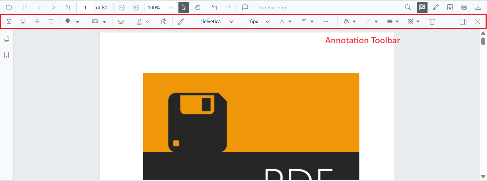
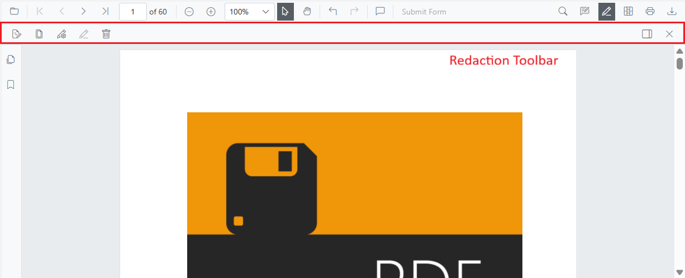

## Primary Toolbar in Blazor SfPdfViewer Component

The SfPdfViewer includes a built-in, responsive primary toolbar that provides quick access to common viewer actions and feature-specific toolbars. It adapts to the available width for desktop, tablet, and mobile layouts.

The primary toolbar includes the following options:

* Open PDF file
* Page navigation
* Magnification
* Pan tool
* Text selection
* Text search
* Print
* Submit form
* Comments panel
* Download
* Undo and redo
* Annotation tools
* Form designer tools
* Redaction tools
* Bookmark panel
* Thumbnail panel

## Annotation toolbar in Blazor SfPdfViewer Component

The Annotation toolbar appears below the primary toolbar when annotation features are enabled. It provides tools to create and edit annotations.

* Text markup: Highlight, Underline, Strikethrough, Squiggly
* Shapes: Line, Arrow, Rectangle, Circle, Polygon
* Measurement: Distance, Perimeter, Area, Radius, Volume
* Freehand: Ink, Signature
* Text: Free text
* Stamp: Predefined and custom stamps
* Properties: Color, opacity, thickness, font
* Edit helpers: Comments panel, Delete
* Close

## Form Designer toolbar in Blazor SfPdfViewer Component

Use the Form Designer toolbar to add and configure interactive form fields in the PDF. It appears below the primary toolbar when form designer is enabled.

* Field types: Button, Text box, Password, Checkbox, Radio button, Drop-down, List box, Signature, Initial
* Edit helpers: Delete
* Close

## Redaction toolbar in Blazor SfPdfViewer Component

The Redaction toolbar provides tools to mark and permanently remove sensitive content from the document. It appears below the primary toolbar when redaction is enabled.

* Redaction marks: Mark for redaction, Redact page
* Apply redactions: Permanently remove marked content
* Properties: Redaction properties
* Edit helpers: Delete
* Close

## See also

* [Primary toolbar customization](./toolbar/primary-toolbar-customization)
* [Annotation toolbar customization](./toolbar/annotation-toolbar-customization)
* [Form designer toolbar customization](./toolbar/form-designer-toolbar-customization)
* [Redaction toolbar customization](./toolbar/redaction-toolbar-customization)
* [Mobile toolbar](./toolbar/mobile-toolbar)
