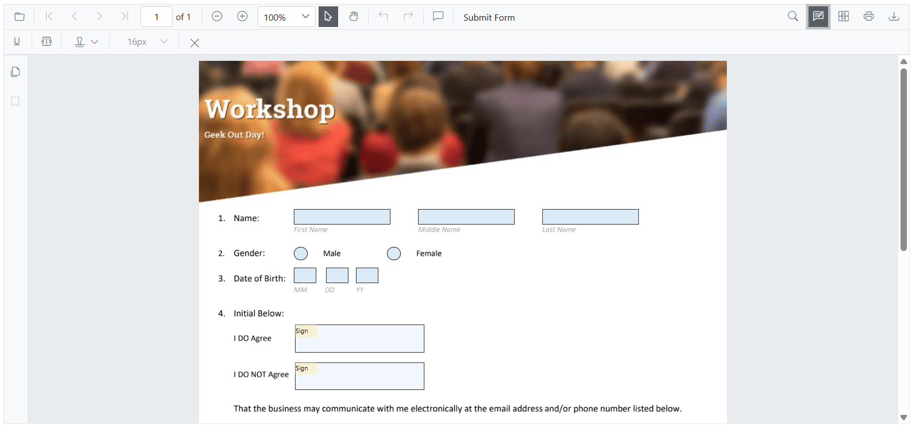
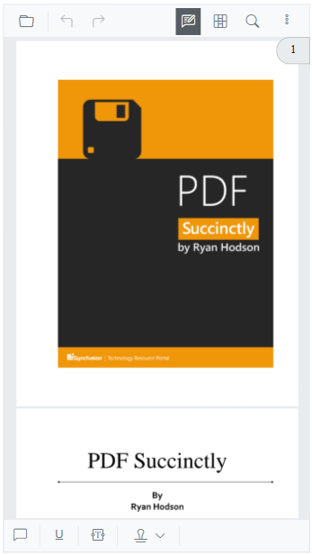

# Customize the Annotation Toolbar in Blazor PDF Viewer

## Overview

This guide shows how to show or hide the annotation toolbar and how to choose which tools appear and their order.

**Outcome:** A working Blazor example that toggles the annotation toolbar and uses [AnnotationToolbarItems](https://help.syncfusion.com/cr/blazor/Syncfusion.Blazor.SfPdfViewer.PdfViewerToolbarSettings.html#Syncfusion_Blazor_SfPdfViewer_PdfViewerToolbarSettings_AnnotationToolbarItems) to customize the toolbar.

## Prerequisites

- Syncfusion Blazor PDF Viewer component installed and configured. See [getting started guide](../getting-started)

## Show or hide the annotation toolbar

Use the [ShowAnnotationToolbar](https://help.syncfusion.com/cr/blazor/Syncfusion.Blazor.SfPdfViewer.PdfViewerBase.html#Syncfusion_Blazor_SfPdfViewer_PdfViewerBase_ShowAnnotationToolbar_System_Boolean_) method on the viewer to control visibility.



@using Syncfusion.Blazor.SfPdfViewer
@using Syncfusion.Blazor.Buttons

<SfButton @onclick="HideToolbar">Show/Hide Annotation Toolbar</SfButton>

<SfPdfViewer2 @ref="viewer" 
              DocumentPath="wwwroot/Data/PDF_Succinctly.pdf" 
              Height="100%" 
              Width="100%">
</SfPdfViewer2>

@code {
    SfPdfViewer2 viewer;
    private bool show = true;

    public void HideToolbar()
    {
        viewer.ShowAnnotationToolbar(show);
        show = !show;
    }
}



[View the sample on GitHub](https://github.com/SyncfusionExamples/blazor-pdf-viewer-examples/tree/master/Toolbar/Annotation%20Toolbar/Show%20or%20hide%20on%20loading).

## Customize annotation toolbar items

Use [PdfViewerToolbarSettings](https://help.syncfusion.com/cr/blazor/Syncfusion.Blazor.SfPdfViewer.PdfViewerToolbarSettings.html) to specify which annotation tools are shown and their order. The property accepts a list of [AnnotationToolbarItem](https://help.syncfusion.com/cr/blazor/Syncfusion.Blazor.SfPdfViewer.AnnotationToolbarItem.html) values; only listed items are rendered, and the displayed order follows the list sequence.

Include the `CloseTool` so users can exit the annotation toolbar when needed.



@using Syncfusion.Blazor.SfPdfViewer

<SfPdfViewer2 @ref="PdfViewerInstance" 
              DocumentPath="wwwroot/Data/PDF_Succinctly.pdf" 
              Height="100%" 
              Width="100%">
    <PdfViewerToolbarSettings AnnotationToolbarItems="AnnotationToolbarItems"></PdfViewerToolbarSettings>
</SfPdfViewer2>

@code {
    SfPdfViewer2 PdfViewerInstance;

    List<AnnotationToolbarItem> AnnotationToolbarItems = new List<AnnotationToolbarItem>()
    {
        AnnotationToolbarItem.HighlightTool,
        AnnotationToolbarItem.UnderlineTool,
        AnnotationToolbarItem.StrikethroughTool,
        AnnotationToolbarItem.ColorEditTool,
        AnnotationToolbarItem.OpacityEditTool,
        AnnotationToolbarItem.AnnotationDeleteTool,
        AnnotationToolbarItem.CommentPanelTool,
        AnnotationToolbarItem.CloseTool
    };
}



Refer to the image below for the desktop view (items shown in the order configured).

Refer to the image below for the mobile view (responsive layout adapts to width).

[View the sample on GitHub](https://github.com/SyncfusionExamples/blazor-pdf-viewer-examples/blob/master/Form%20Designer/Components/Pages/CustomAnnotationToolbar.razor)

N> Properties tools (color, opacity, thickness, font, etc.) now appear only after you select or add the related annotation. Until you select or add one, these tools are hidden.

N> This change reduces clutter and shows options only when they're relevant to the selected annotation.

## Complete example with annotation toolbar customization

The following is a complete, runnable example. It wires a toggle button and a viewer with a custom annotation toolbar list.



@using Syncfusion.Blazor.SfPdfViewer
@using Syncfusion.Blazor.Buttons

<SfButton @onclick="HideToolbar">Hide Annotation Toolbar</SfButton>

<SfPdfViewer2 @ref="viewer" 
              DocumentPath="wwwroot/Data/PDF_Succinctly.pdf" 
              Height="100%" 
              Width="100%">
    <PdfViewerToolbarSettings AnnotationToolbarItems="AnnotationToolbarItems"></PdfViewerToolbarSettings>
</SfPdfViewer2>

@code {
    SfPdfViewer2 viewer;
    private bool show = true;

    List<AnnotationToolbarItem> AnnotationToolbarItems = new List<AnnotationToolbarItem>()
    {
        AnnotationToolbarItem.HighlightTool,
        AnnotationToolbarItem.UnderlineTool,
        AnnotationToolbarItem.StrikethroughTool,
        AnnotationToolbarItem.ColorEditTool,
        AnnotationToolbarItem.OpacityEditTool,
        AnnotationToolbarItem.AnnotationDeleteTool,
        AnnotationToolbarItem.CommentPanelTool,
        AnnotationToolbarItem.CloseTool
    };

    public void HideToolbar()
    {
        viewer.ShowAnnotationToolbar(show);
        show = !show;
    }
}



## Troubleshooting

- **Annotation toolbar tools do not appear**: Verify that the items are valid [AnnotationToolbarItem](https://help.syncfusion.com/cr/blazor/Syncfusion.Blazor.SfPdfViewer.AnnotationToolbarItem.html) values and that the document has loaded successfully.
- **AnnotationToolbarItems not recognized**: Ensure [AnnotationToolbarItems](https://help.syncfusion.com/cr/blazor/Syncfusion.Blazor.SfPdfViewer.PdfViewerToolbarSettings.html#Syncfusion_Blazor_SfPdfViewer_PdfViewerToolbarSettings_AnnotationToolbarItems) is properly defined in the [PdfViewerToolbarSettings](https://help.syncfusion.com/cr/blazor/Syncfusion.Blazor.SfPdfViewer.PdfViewerToolbarSettings.html).
- **Toolbar methods not working**: Ensure you have a reference to the PDF Viewer component using `@ref`.

## Related topics

- [Customize primary toolbar](./primary-toolbar)
- [Customize form designer toolbar](./form-designer-toolbar)
- [Adding shape annotations](../annotation/shape/rectangle-annotation)
