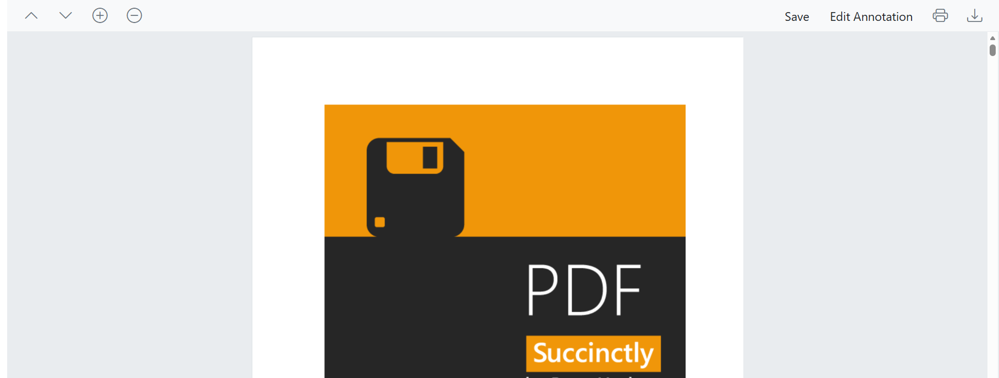

# Create a custom toolbar in Blazor PDF Viewer

## Overview

The Blazor PDF Viewer component provides extensive APIs for user interaction through its built-in toolbar. However, if you need a custom toolbar that matches your application's design and functionality requirements, you can hide the default toolbar and create your own using the Blazor Toolbar component.

A custom toolbar allows you to:
- Control which features are available to end users
- Match your application's design language
- Organize toolbar items according to your workflow
- Bind custom behavior to toolbar button clicks
- Show or hide buttons based on application state

## Key Concepts

### Disabling Default Toolbars

The PDF Viewer has two built-in toolbars that can be disabled:

| Property | Purpose |
|----------|---------|
| `EnableToolbar` | Controls the main PDF Viewer toolbar (pagination, zoom, annotations, etc.) |
| `EnableNavigationToolbar` | Controls the navigation toolbar (typically at the top) |

Set both to `false` to create a completely custom toolbar experience.

### Toolbar Component Architecture

The custom toolbar uses the `SfToolbar` component with individual `ToolbarItem` elements. Each toolbar item can:
- Display an icon, text, or both
- Be positioned on the left or right
- Execute custom methods when clicked
- Include tooltips for better UX

### Available PDF Viewer Actions

Common actions you can wire to custom toolbar buttons:

| Method | Purpose | Async |
|--------|---------|-------|
| `GoToNextPageAsync()` | Navigate to the next page | Yes |
| `GoToPreviousPageAsync()` | Navigate to the previous page | Yes |
| `ZoomInAsync()` | Increase zoom level | Yes |
| `ZoomOutAsync()` | Decrease zoom level | Yes |
| `PrintAsync()` | Print the PDF document | Yes |
| `DownloadAsync()` | Download the PDF document | Yes |
| `GetDocumentAsync()` | Retrieve the current PDF as a byte array, including annotations and form-field changes | Yes |
| `LoadAsync()` | Load a PDF document from a byte array, stream, or data URI | Yes |
| `ShowAnnotationToolbar(bool)` | Show or hide the annotation toolbar | Sync (`void`) |

## Create Your First Custom Toolbar

To create a custom toolbar for the PDF Viewer, disable the default toolbars and implement your own using the `SfToolbar` component. This allows you to customize toolbar items, their placement, and associated actions based on your application requirements.

Use the following code snippet to create a fully functional custom toolbar with navigation, zoom, and document management features:



@using Syncfusion.Blazor.Navigations
@using Syncfusion.Blazor.SfPdfViewer

<SfToolbar>
    <ToolbarItems>
        <ToolbarItem PrefixIcon="e-icons e-chevron-up" TooltipText="Previous Page" id="previousPage"
                     Align="@Syncfusion.Blazor.Navigations.ItemAlign.Left" OnClick="@previousClicked"></ToolbarItem>

        <ToolbarItem PrefixIcon="e-icons e-chevron-down" TooltipText="Next Page" id="nextPage"
                     Align="@Syncfusion.Blazor.Navigations.ItemAlign.Left" OnClick="@nextClicked"></ToolbarItem>

        <ToolbarItem PrefixIcon="e-icons e-circle-add" TooltipText="Zoom in" id="zoomIn" OnClick="@zoomInClicked"></ToolbarItem>

        <ToolbarItem PrefixIcon="e-icons e-circle-remove" TooltipText="Zoom out" id="zoomOut" OnClick="@zoomoutClicked"></ToolbarItem>

        <ToolbarItem Text="Save" TooltipText="Save Document" id="save"
                     Align="@Syncfusion.Blazor.Navigations.ItemAlign.Right" OnClick="@save"></ToolbarItem>

        <ToolbarItem Text="Edit Annotation" TooltipText="Annotation Toolbar" id="annotation"
                     Align="@Syncfusion.Blazor.Navigations.ItemAlign.Right" OnClick="@annotations"></ToolbarItem>

        <ToolbarItem PrefixIcon="e-icons e-print" TooltipText="Print" id="print"
                     Align="@Syncfusion.Blazor.Navigations.ItemAlign.Right" OnClick="@print"></ToolbarItem>

        <ToolbarItem PrefixIcon="e-icons e-download" TooltipText="Download" id="Download"
                     Align="@Syncfusion.Blazor.Navigations.ItemAlign.Right" OnClick="@download"></ToolbarItem>
    </ToolbarItems>
</SfToolbar>

<SfPdfViewer2 @ref="PDFViewer" DocumentPath="@DocumentPath" EnableNavigationToolbar="false" EnableToolbar="false" Height="100%" Width="100%"></SfPdfViewer2>

@code
{
    private SfPdfViewer2 PDFViewer;

    private string DocumentPath { get; set; } = "https://cdn.syncfusion.com/content/pdf/pdf-succinctly.pdf";

    private void nextClicked(ClickEventArgs args)
    {
        //Navigate to next page of the PDF document loaded in the SfPdfViewer.
        PDFViewer.GoToNextPageAsync();
    }

    private void previousClicked(ClickEventArgs args)
    {
        //Navigate to previous page of the PDF document.
        PDFViewer.GoToPreviousPageAsync();
    }

    MemoryStream stream;

    private async void save(ClickEventArgs args)
    {
        //Gets the loaded PDF document with the changes.
        byte[] data = await PDFViewer.GetDocumentAsync();
        //Save the PDF document to a MemoryStream.
        stream = new MemoryStream(data);
        //Load a PDF document from the MemoryStream.
        await PDFViewer.LoadAsync(stream);
    }

    private void annotations(ClickEventArgs args)
    {
        //Shows or hides the annotation toolbar in the SfPdfViewer.
        PDFViewer.ShowAnnotationToolbar(true);
    }

    private void print(ClickEventArgs args)
    {
        //Print the PDF document being loaded in the SfPdfViewer.
        PDFViewer.PrintAsync();
    }

    private void download(ClickEventArgs args)
    {
        //Downloads the PDF document being loaded in the SfPdfViewer.
        PDFViewer.DownloadAsync();
    }

    private void zoomInClicked(ClickEventArgs args)
    {
        //Scale the page to the next value in the zoom drop down list.
        PDFViewer.ZoomInAsync();
    }

    private void zoomoutClicked(ClickEventArgs args)
    {
        //Decreases the page to the previous value in the zoom drop down list.
        PDFViewer.ZoomOutAsync();
    }
}




Refer to the image below for the Custom Toolbar.

[View Sample in GitHub](https://github.com/SyncfusionExamples/blazor-pdf-viewer-examples/tree/master/Toolbar/Custom%20Toolbar)

## See also

* [PDF Viewer getting started](../getting-started/web-app)
* [Toolbar customization options](./primary-toolbar)
* [Annotation toolbar customization](./annotation-toolbar)