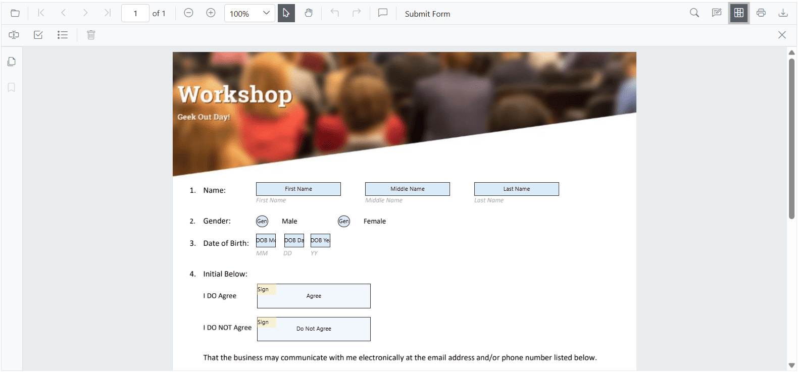
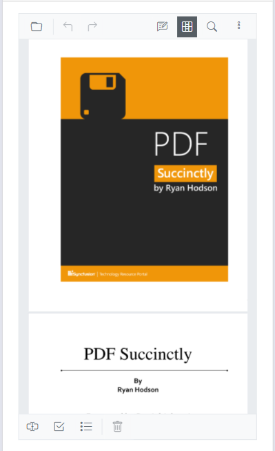

# Customize the Form Designer Toolbar in Blazor PDF Viewer

This guide shows how to show or hide the form designer toolbar, and how to configure which tools appear and their order.

## Show or hide form designer toolbar at initialization

Set the [`EnableFormDesigner`](https://help.syncfusion.com/cr/blazor/Syncfusion.Blazor.SfPdfViewer.PdfViewerBase.html#Syncfusion_Blazor_SfPdfViewer_PdfViewerBase_EnableFormDesigner) property to `true` to display the Form Designer toolbar initially, or `false` to hide it.



@using Syncfusion.Blazor.SfPdfViewer

<SfPdfViewer2 EnableFormDesigner="true" 
              Height="100%" 
              Width="100%" 
              DocumentPath="wwwroot/Data/Form_Designer.pdf">
</SfPdfViewer2>



## Show or hide form designer toolbar at runtime

Use the [`IsDesignerMode`](https://help.syncfusion.com/cr/blazor/Syncfusion.Blazor.SfPdfViewer.PdfViewerBase.html#Syncfusion_Blazor_SfPdfViewer_PdfViewerBase_IsDesignerMode) property to toggle visibility at runtime.



@using Syncfusion.Blazor.SfPdfViewer
@using Syncfusion.Blazor.Buttons

<SfButton @onclick="HideFormDesignerToolbar">Show/Hide Form Designer Toolbar</SfButton>

<SfPdfViewer2 @ref="viewer" 
              EnableFormDesigner="true"
              IsDesignerMode="@IsDesignerMode"
              Height="100%" 
              Width="100%" 
              DocumentPath="wwwroot/Data/Form_Designer.pdf">
</SfPdfViewer2>

@code {
    private SfPdfViewer2 viewer;
    private bool IsDesignerMode = false;

    private void HideFormDesignerToolbar()
    {
        IsDesignerMode = !IsDesignerMode;
    }
}



## Customize form designer toolbar items

Use [`PdfViewerToolbarSettings`](https://help.syncfusion.com/cr/blazor/Syncfusion.Blazor.SfPdfViewer.PdfViewerToolbarSettings.html) to specify which form designer tools are shown and their order. The property accepts a list of [`FormDesignerToolbarItem`](https://help.syncfusion.com/cr/blazor/Syncfusion.Blazor.SfPdfViewer.FormDesignerToolbarItem.html) values; only listed items are rendered, and the displayed order follows the list sequence.



@using Syncfusion.Blazor.SfPdfViewer

<SfPdfViewer2 @ref="PdfViewerInstance" 
              EnableFormDesigner="true"
              DocumentPath="wwwroot/Data/Form_Designer.pdf" 
              Height="100%" 
              Width="100%">
    <PdfViewerToolbarSettings FormDesignerToolbarItems="FormDesignerToolbarItems"></PdfViewerToolbarSettings>
</SfPdfViewer2>

@code {
    private SfPdfViewer2 PdfViewerInstance;

    List<FormDesignerToolbarItem> FormDesignerToolbarItems = new List<FormDesignerToolbarItem>()
    {
        FormDesignerToolbarItem.TextBox,
        FormDesignerToolbarItem.CheckBox,
        FormDesignerToolbarItem.RadioButton,
        FormDesignerToolbarItem.DropDown,
        FormDesignerToolbarItem.ListBox,
        FormDesignerToolbarItem.Signature,
        FormDesignerToolbarItem.Delete
    };
}



The desktop view is shown below.

The mobile view is shown below.

[View the sample on GitHub](https://github.com/SyncfusionExamples/blazor-pdf-viewer-examples/blob/master/Form%20Designer/Components/Pages/CustomFormDesignerToolbar.razor).

## Complete example with form designer toolbar customization

The following is a complete, runnable example. It wires a toggle button and a viewer with a custom form designer toolbar list.



@using Syncfusion.Blazor.SfPdfViewer
@using Syncfusion.Blazor.Buttons

<SfButton @onclick="HideFormDesignerToolbar">Show/Hide Form Designer Toolbar</SfButton>

<SfPdfViewer2 @ref="viewer"
              EnableFormDesigner="true"
              IsDesignerMode="@IsDesignerMode"
              DocumentPath="wwwroot/Data/Form_Designer.pdf"
              Height="100%"
              Width="100%">
    <PdfViewerToolbarSettings FormDesignerToolbarItems="FormDesignerToolbarItems"></PdfViewerToolbarSettings>
</SfPdfViewer2>

@code {
    private SfPdfViewer2 viewer;
    private bool IsDesignerMode = false;

    List<FormDesignerToolbarItem> FormDesignerToolbarItems = new List<FormDesignerToolbarItem>()
    {
        FormDesignerToolbarItem.TextBox,
        FormDesignerToolbarItem.RadioButton,
        FormDesignerToolbarItem.CheckBox,
        FormDesignerToolbarItem.DropDown,
        FormDesignerToolbarItem.ListBox,
        FormDesignerToolbarItem.Signature,
        FormDesignerToolbarItem.Delete
    };

    private void HideFormDesignerToolbar()
    {
        IsDesignerMode = !IsDesignerMode;
    }
}



## See also

- [Customize primary toolbar](./primary-toolbar)
- [Customize annotation toolbar](./annotation-toolbar)
- [Form designer in PDF viewer](../forms/form-designer)
