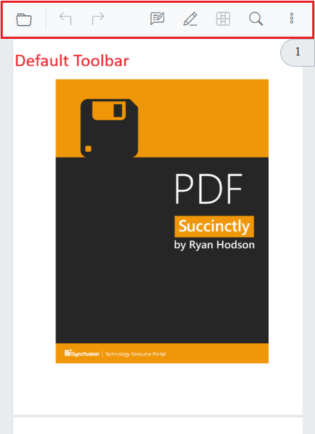
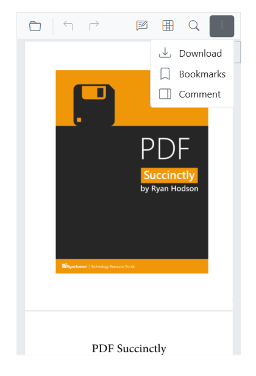
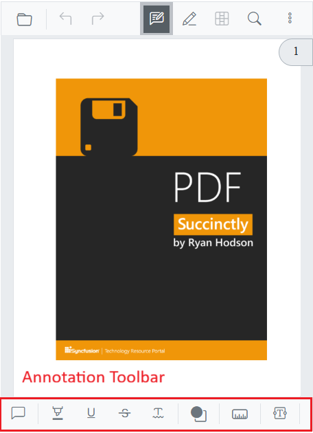
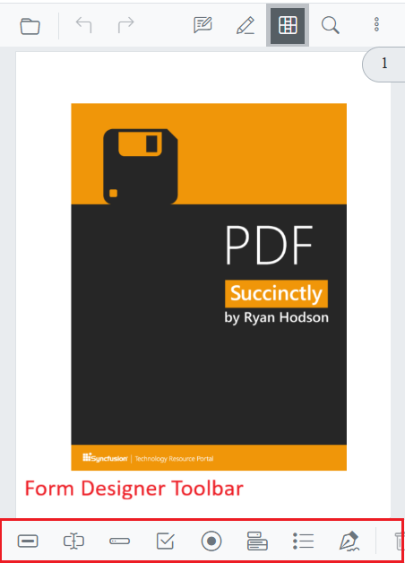
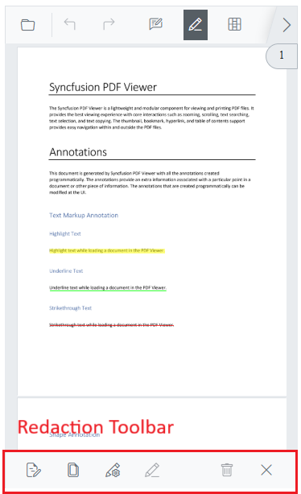
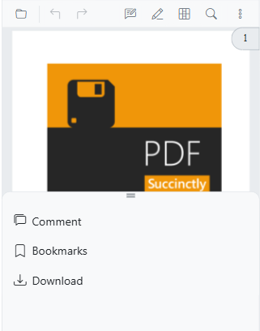

# Customize mobile toolbar in Blazor PDF Viewer

## Overview

This guide explains how to customize the mobile toolbar in the Blazor PDF Viewer, enable the desktop toolbar on mobile devices, and ensure smooth touch interactions.

## Primary toolbar in mobile mode

The Blazor PDF Viewer includes a built-in, responsive primary toolbar that adapts to mobile screens. In mobile mode, the toolbar provides quick access to common viewer actions.

The primary toolbar in mobile includes the following options:

- Open PDF File
- Undo and Redo
- Annotation tools
- Form designer tools
- Redaction tools
- Text search

### Reorder mobile toolbar items

Use [`MobileToolbarItems`](https://help.syncfusion.com/cr/blazor/Syncfusion.Blazor.SfPdfViewer.PdfViewerToolbarSettings.html#Syncfusion_Blazor_SfPdfViewer_PdfViewerToolbarSettings_MobileToolbarItems) to control the display order. The toolbar renders items in the order they appear in the collection.



@using Syncfusion.Blazor.SfPdfViewer

<SfPdfViewer2 Height="640px"
              Width="100%"
              DocumentPath="wwwroot/Data/PDF_Succinctly.pdf">
    <PdfViewerToolbarSettings MobileToolbarItems="MobileToolbarItems"></PdfViewerToolbarSettings>
</SfPdfViewer2>

@code {
    private List<MobileToolbarItem> MobileToolbarItems { get; set; }
    
    protected override void OnInitialized()
    {
        MobileToolbarItems = new List<MobileToolbarItem>()
        {
            MobileToolbarItem.Open,
            MobileToolbarItem.UndoRedo,
            MobileToolbarItem.EditAnnotation,
            MobileToolbarItem.Redaction,
            MobileToolbarItem.FormDesigner,
            MobileToolbarItem.Search
        };
    }
}



### More options menu

Open the overflow (three-dots) menu to access additional actions such as:

- Download: Download the currently opened PDF document.
- Bookmark: View and navigate bookmarks within the document.

## Annotation toolbar in mobile mode

The annotation toolbar appears when annotation features are enabled and provides tools to create and edit annotations. In mobile mode, it appears at the bottom of the viewer.

* Text markup: Highlight, Underline, Strikethrough, Squiggly
* Shapes: Line, Arrow, Rectangle, Circle, Polygon, Volume
* Measurement: Distance, Perimeter, Area, Radius
* Freehand: Ink, Signature
* Text: Free text
* Stamp: Predefined and custom stamps
* Properties: Color, Opacity, Thickness, Font
* Edit helpers: Delete
* Close

### Customize annotation toolbar items in mobile

Use [`AnnotationToolbarItems`](https://help.syncfusion.com/cr/blazor/Syncfusion.Blazor.SfPdfViewer.PdfViewerToolbarSettings.html#Syncfusion_Blazor_SfPdfViewer_PdfViewerToolbarSettings_AnnotationToolbarItems) to configure which annotation tools are shown on mobile devices.



@using Syncfusion.Blazor.SfPdfViewer

<SfPdfViewer2 Height="640px"
              Width="100%"
              DocumentPath="wwwroot/Data/PDF_Succinctly.pdf">
    <PdfViewerToolbarSettings AnnotationToolbarItems="AnnotationToolbarItems"></PdfViewerToolbarSettings>
</SfPdfViewer2>

@code {
    List<AnnotationToolbarItem> AnnotationToolbarItems = new List<AnnotationToolbarItem>()
    {
        AnnotationToolbarItem.HighlightTool,
        AnnotationToolbarItem.UnderlineTool,
        AnnotationToolbarItem.StrikethroughTool,
        AnnotationToolbarItem.FreeTextAnnotationTool,
        AnnotationToolbarItem.CloseTool
    };
}



## Form designer toolbar in mobile mode

Use the form designer toolbar to add and configure interactive form fields in the PDF. In mobile mode, it appears at the bottom of the viewer.

* Field types: Button, Text box, Password, Check box, Radio button, Drop-down, List box, Signature, Initial
* Edit helpers: Delete
* Close

### Customize form designer toolbar items in mobile

Use [`FormDesignerToolbarItems`](https://help.syncfusion.com/cr/blazor/Syncfusion.Blazor.SfPdfViewer.PdfViewerToolbarSettings.html#Syncfusion_Blazor_SfPdfViewer_PdfViewerToolbarSettings_FormDesignerToolbarItems) to configure which form design tools are shown on mobile devices.



@using Syncfusion.Blazor.SfPdfViewer

<SfPdfViewer2 EnableFormDesigner="true"
              Height="640px"
              Width="100%"
              DocumentPath="wwwroot/Data/Form_Designer.pdf">
    <PdfViewerToolbarSettings FormDesignerToolbarItems="FormDesignerToolbarItems"></PdfViewerToolbarSettings>
</SfPdfViewer2>

@code {
    List<FormDesignerToolbarItem> FormDesignerToolbarItems = new List<FormDesignerToolbarItem>()
    {
        FormDesignerToolbarItem.TextBox,
        FormDesignerToolbarItem.CheckBox,
        FormDesignerToolbarItem.ListBox,
        FormDesignerToolbarItem.Delete
    };
}



## Redaction toolbar in mobile mode

The redaction toolbar provides tools to mark and permanently remove sensitive content from the document. In mobile mode, it appears at the bottom of the viewer.

* Mark for redaction
* Redact page
* Apply redactions: Permanently remove marked content
* Properties: Redaction properties
* Edit helpers: Delete
* Close

### Enable redaction toolbar in mobile

Show the redaction toolbar on mobile by configuring the [`MobileToolbarItems`](https://help.syncfusion.com/cr/blazor/Syncfusion.Blazor.SfPdfViewer.PdfViewerToolbarSettings.html#Syncfusion_Blazor_SfPdfViewer_PdfViewerToolbarSettings_MobileToolbarItems) property.



@using Syncfusion.Blazor.SfPdfViewer

<SfPdfViewer2 Height="640px"
              Width="100%"
              DocumentPath="wwwroot/Data/PDF_Succinctly.pdf">
    <PdfViewerToolbarSettings MobileToolbarItems="MobileToolbarItems"></PdfViewerToolbarSettings>
</SfPdfViewer2>

@code {
    private List<MobileToolbarItem> MobileToolbarItems = new List<MobileToolbarItem>();
    
    protected override void OnInitialized()
    {
        MobileToolbarItems = new List<MobileToolbarItem>()
        {
            MobileToolbarItem.Open,
            MobileToolbarItem.UndoRedo,
            MobileToolbarItem.EditAnnotation,
            MobileToolbarItem.Redaction,
            MobileToolbarItem.FormDesigner,
            MobileToolbarItem.Search
        };
    }
}



## Enable desktop mode on mobile

Enable the desktop toolbar on mobile devices with the [`EnableDesktopMode`](https://help.syncfusion.com/cr/blazor/Syncfusion.Blazor.SfPdfViewer.PdfViewerBase.html#Syncfusion_Blazor_SfPdfViewer_PdfViewerBase_EnableDesktopMode) API. This replaces the mobile toolbar with the desktop layout and provides access to additional actions and controls.



@using Syncfusion.Blazor.SfPdfViewer

<SfPdfViewer2 DocumentPath="wwwroot/Data/PDF_Succinctly.pdf"
              Height="100%"
              Width="100%"
              EnableDesktopMode="true">
</SfPdfViewer2>



[View sample in GitHub](https://github.com/SyncfusionExamples/blazor-pdf-viewer-examples/tree/master/Toolbar)

## Modern navigation panel in mobile view

On mobile devices, the navigation toolbar collapses into a toggle menu to save space. Any custom items added appear at the beginning of this menu.

## Enable modern navigation panel in mobile view

Enable the modern navigation panel by setting [`EnableNavigationPanel`](https://help.syncfusion.com/cr/blazor/Syncfusion.Blazor.SfPdfViewer.PdfViewerBase.html#Syncfusion_Blazor_SfPdfViewer_PdfViewerBase_EnableNavigationPanel) to true.



@using Syncfusion.Blazor.SfPdfViewer

<SfPdfViewer2 DocumentPath="wwwroot/Data/PDF_Succinctly.pdf"
              Height="100%"
              Width="100%"
              EnableNavigationPanel="true">
</SfPdfViewer2>



[View sample in GitHub](https://github.com/SyncfusionExamples/blazor-pdf-viewer-examples/tree/master/Toolbar)

## Enable scrolling in desktop mode with touch gestures

To enable smooth scrolling of PDF documents on mobile while in desktop mode, disable text selection by setting [`EnableTextSelection`](https://help.syncfusion.com/cr/blazor/Syncfusion.Blazor.SfPdfViewer.PdfViewerBase.html#Syncfusion_Blazor_SfPdfViewer_PdfViewerBase_EnableTextSelection) to false to allow touch panning.



@using Syncfusion.Blazor.SfPdfViewer

<SfPdfViewer2 DocumentPath="wwwroot/Data/PDF_Succinctly.pdf"
              Height="100%"
              Width="100%"
              EnableDesktopMode="true"
              EnableTextSelection="false">
</SfPdfViewer2>



[View sample in GitHub](https://github.com/SyncfusionExamples/blazor-pdf-viewer-examples/tree/master/Toolbar)

## Print option availability in mobile

The Print option is not available in mobile mode by default. To use printing on mobile, enable the desktop toolbar with the [`EnableDesktopMode`](https://help.syncfusion.com/cr/blazor/Syncfusion.Blazor.SfPdfViewer.PdfViewerBase.html#Syncfusion_Blazor_SfPdfViewer_PdfViewerBase_EnableDesktopMode) API. Availability and behavior may vary by mobile browser.

## See also

- [Annotations in mobile view](../annotation/annotations-in-mobile-view)
- [Form designer in mobile view](../form-designer/form-designer-in-mobile-view)
- [Redaction in mobile view](../redaction/mobile-view)
