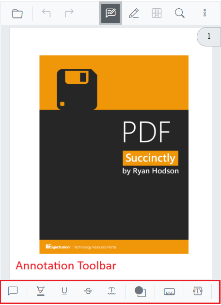
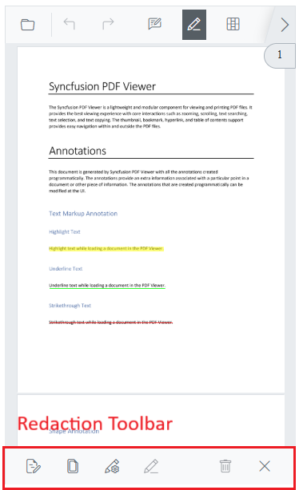

# Mobile toolbar in Blazor SfPdfViewer

Use the mobile toolbar to access core viewer actions and feature tools on small screens. The primary toolbar adapts to the available width, and feature toolbars (annotation, form designer, redaction) when the corresponding feature is enabled and activated.

## Primary toolbar in mobile mode

The SfPdfViewer includes a built-in, responsive primary toolbar that provides quick access to common viewer actions and feature-specific toolbars. In mobile mode, the toolbar adapts to available width.

The primary toolbar includes the following options:

* Open PDF File
* Text search
* Comments panel
* Download
* Undo and Redo
* Annotation tools
* Form designer tools
* Redaction tools
* Bookmark panel

## Annotation toolbar in mobile mode

The annotation toolbar appears when annotation features are enabled and provides tools to create and edit annotations. In mobile mode, it appears at the bottom of the viewer.

* Text markup: Highlight, Underline, Strikethrough, Squiggly
* Shapes: Line, Arrow, Rectangle, Circle, Polygon, Volume
* Measurement: Distance, Perimeter, Area, Radius
* Freehand: Ink, Signature
* Text: Free text
* Stamp: Predefined and custom stamps
* Properties: Color, Opacity, Thickness, Font
* Edit helpers: Delete
* Close

## Form designer toolbar in mobile mode

Use the form designer toolbar to add and configure interactive form fields in the PDF. In mobile mode, it appears at the bottom of the viewer.

* Field types: Button, Text box, Password, Check box, Radio button, Drop-down, List box, Signature, Initial
* Edit helpers: Delete
* Close

## Redaction toolbar in mobile mode

The redaction toolbar provides tools to mark and permanently remove sensitive content from the document. In mobile mode, it appears at the bottom of the viewer.

* Redaction marks: Mark for redaction, Redact page
* Apply redactions: Permanently remove marked content
* Properties: Redaction properties
* Edit helpers: Delete
* Close

