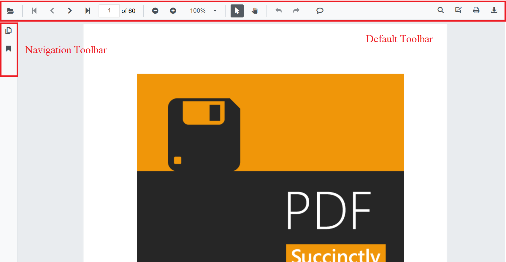
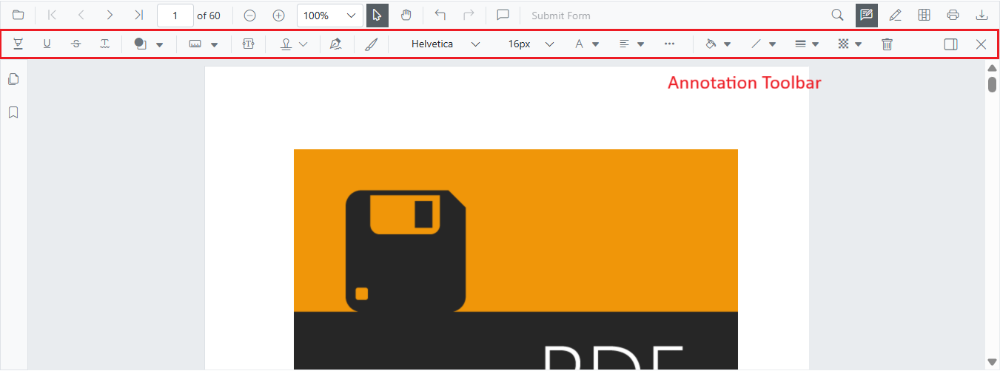
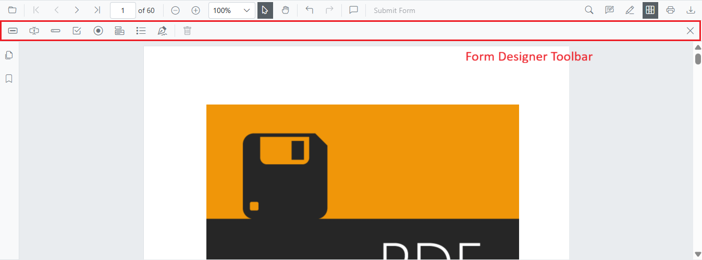

# Toolbar in Blazor PDF Viewer component

This page provides a concise reference describing the toolbars available in the Blazor PDF Viewer component. It also explains what each toolbar is for and when it appears.

## List of Available Toolbars

- [Primary toolbar](#primary-toolbar)
- [Annotation toolbar](#annotation-toolbar)
- [Form Designer toolbar](#form-designer-toolbar)
- [Mobile toolbar](#mobile-toolbar)
- [Redaction toolbar](#redaction-toolbar)
- [Custom toolbar](./custom-toolbar)

## Functional Overview of Each Toolbar

### Primary toolbar

The primary toolbar provides quick access to common viewer actions and entry points to feature-specific toolbars. It adapts to the available width and shows controls appropriate for the current device and layout.

Primary toolbar options include:

* Open file
* Page navigation
* Magnification
* Pan tool
* Text selection
* Text search
* Print
* Submit form
* Comments panel
* Download
* Undo and redo
* Annotation tools
* Form designer tools
* Redaction tools
* Bookmark panel
* Thumbnail panel

See [Primary toolbar customization](./primary-toolbar) for configuration options and examples.

### Annotation toolbar

The annotation toolbar appears below the primary toolbar when annotation features are enabled. It provides tools to create and edit annotations.

Annotation toolbar options include:

* Text markup: Highlight, Underline, Strikethrough, Squiggly
* Shapes: Line, Arrow, Rectangle, Circle, Polygon
* Measurement: Distance, Perimeter, Area, Radius, Volume
* Freehand: Ink, Signature
* Text: Free text
* Stamp: Built-in and custom stamps
* Properties: Color, opacity, thickness, font
* Edit helpers: Comments panel, Delete
* Close

See [Annotation toolbar customization](./annotation-toolbar) for configuration options and examples.

### Form Designer toolbar

The form designer toolbar appears when form designer mode is enabled and provides tools to add and configure interactive form fields.

Form designer toolbar options include:

* Field types: Button, Text box, Password, Checkbox, Radio button, Drop-down, List box, Signature, Initial
* Edit helpers: Delete
* Close

See [Form designer toolbar customization](./form-designer-toolbar) for configuration options and examples.

### Mobile toolbar

- A compact toolbar layout optimized for small screens and touch interactions. It appears automatically on mobile-sized view ports and contains the most frequently used actions in a space-efficient arrangement.

- Annotation toolbar in mobile mode appears at the bottom of the PDF Viewer component.

### Redaction toolbar

The redaction toolbar provides tools to mark and permanently remove sensitive content. It appears below the primary toolbar when redaction is enabled.

Redaction toolbar options include:

* Redaction marks: Mark for redaction, Redact page
* Apply redactions: Permanently remove marked content
* Properties: Redaction properties
* Edit helpers: Delete
* Close

See [Redaction toolbar customization](./redaction-toolbar) for configuration options and examples.

## Customize toolbars

The following quick links describe how to customize, show, or hide specific toolbar items. Each linked page defines custom toolbar configurations and examples.

- [Show or hide primary toolbar items](./primary-toolbar#customize-the-primary-toolbar-in-blazor-pdf-viewer)
- [Show or hide annotation toolbar items](./annotation-toolbar#customize-annotation-toolbar-items)
- [Show or hide form designer toolbar items](./form-designer-toolbar#customize-form-designer-toolbar-items)
- [Add a custom primary toolbar item](./primary-toolbar#customize-the-primary-toolbar-in-blazor-pdf-viewer)
- [Enable mobile toolbar](./mobile-toolbar)
- [Enable redaction toolbar](./redaction-toolbar)

## Further Reading

- [Customize primary toolbar](./primary-toolbar)
- [Customize annotation toolbar](./annotation-toolbar)
- [Customize form designer toolbar](./form-designer-toolbar)
- [Customize mobile toolbar](./mobile-toolbar)
- [Create a custom toolbar](./custom-toolbar)
