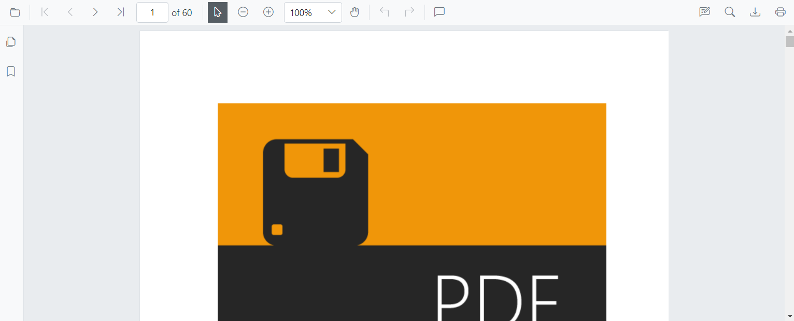
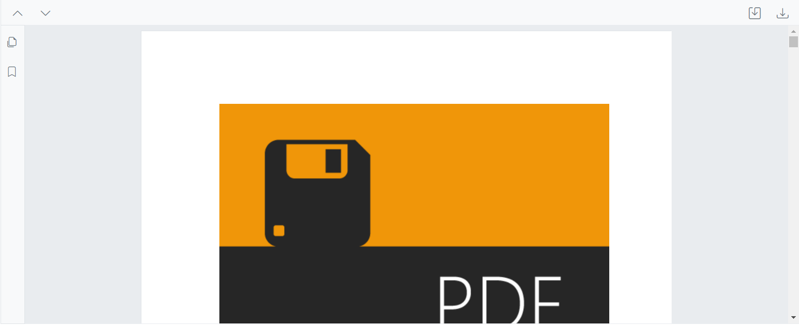

# Primary toolbar customization

The primary toolbar can be customized by rearranging existing items, disabling default items, and adding custom items. New items can be placed at specific index positions among the existing items.

## Show or hide the primary toolbar

Toggle the built-in primary toolbar to create custom toolbar experiences or simplify the UI.

In scenarios where a custom toolbar is required, the built-in toolbar can be hidden. Use the [EnableToolbar](https://help.syncfusion.com/cr/blazor/Syncfusion.Blazor.SfPdfViewer.PdfViewerBase.html#Syncfusion_Blazor_SfPdfViewer_PdfViewerBase_EnableToolbar) property or the [ShowToolbar](https://help.syncfusion.com/cr/blazor/Syncfusion.Blazor.SfPdfViewer.PdfViewerBase.html#Syncfusion_Blazor_SfPdfViewer_PdfViewerBase_ShowToolbarAsync_System_Boolean_) method to show or hide the primary toolbar.

The following code snippet explains how to show or hide the toolbar using the EnableToolbar property.

```cshtml

@using Syncfusion.Blazor.SfPdfViewer

<SfPdfViewer2 EnableToolbar="false" Height="100%" Width="100%" >
</SfPdfViewer2>
```

The following code snippet explains how to show or hide the toolbar using the ShowToolbar method.

```cshtml

@using Syncfusion.Blazor.Buttons
@using Syncfusion.Blazor.SfPdfViewer

<SfButton @onclick="OnClick">Hide Toolbar</SfButton>

<SfPdfViewer2 Height="100%"
              Width="100%"
              @ref="@pdfViewer"
              DocumentPath="@DocumentPath">
</SfPdfViewer2>

@code {

    SfPdfViewer2 pdfViewer;
    public string DocumentPath { get; set; } = "wwwroot/Data/PDF_Succinctly.pdf";

    public async void OnClick(MouseEventArgs args)
    {
        await pdfViewer.ShowToolbarAsync(false);
    }
}

```

[View the sample on GitHub](https://github.com/SyncfusionExamples/blazor-pdf-viewer-examples/tree/master/Toolbar/Custom%20Toolbar/Custom%20Toolbar).

## Show or hide the navigation toolbar

Control the sidebar that toggles bookmarks and thumbnails to match the app’s layout needs.

The navigation toolbar is the sidebar that provides options to expand or collapse the bookmark and page thumbnail panels. Toggle its visibility by using the [EnableNavigationToolbar](https://help.syncfusion.com/cr/blazor/Syncfusion.Blazor.SfPdfViewer.PdfViewerBase.html#Syncfusion_Blazor_SfPdfViewer_PdfViewerBase_EnableNavigationToolbar) property or the [ShowNavigationToolbar](https://help.syncfusion.com/cr/blazor/Syncfusion.Blazor.SfPdfViewer.PdfViewerBase.html#Syncfusion_Blazor_SfPdfViewer_PdfViewerBase_ShowNavigationToolbar_System_Boolean_) method.

The following code snippet explains how to show or hide the navigation toolbar using the EnableNavigationToolbar property.

```cshtml

@using Syncfusion.Blazor.SfPdfViewer

<SfPdfViewer2 EnableNavigationToolbar="false" Height="100%" Width="100%"></SfPdfViewer2>

```

The following code snippet explains how to show or hide the navigation toolbar using the ShowNavigationToolbar method.

```cshtml

@using Syncfusion.Blazor.Buttons
@using Syncfusion.Blazor.SfPdfViewer

<SfButton @onclick="OnClick">Hide Navigation Toolbar</SfButton>
<SfPdfViewer2 EnableNavigationToolbar="true"
              Height="100%"
              Width="100%"
              @ref="@pdfViewer"
              DocumentPath="@DocumentPath">
</SfPdfViewer2>

@code {

    SfPdfViewer2 pdfViewer;
    public string DocumentPath { get; set; } = "wwwroot/Data/PDF_Succinctly.pdf";

    public void OnClick(MouseEventArgs args)
    {
        pdfViewer.ShowNavigationToolbar(false);
    }
}

```

## Customize the default toolbar items

Display only the required default actions and control their order.

Customize toolbar items by configuring the `PdfViewerToolbarSettings` class. The following example shows how to display only the specified items. The toolbar renders only the items listed in the collection and in the same order.

```cshtml

@using Syncfusion.Blazor.SfPdfViewer

<SfPdfViewer2 Height="100%"
              Width="100%"
              DocumentPath="@DocumentPath">
    <PdfViewerToolbarSettings ToolbarItems="ToolbarItems"></PdfViewerToolbarSettings>
</SfPdfViewer2>

@code{

    public string DocumentPath { get; set; } = "wwwroot/data/PDF_Succinctly.pdf";

    List<ToolbarItem> ToolbarItems = new List<ToolbarItem>()
    {
        ToolbarItem.PageNavigationTool,
        ToolbarItem.MagnificationTool,
        ToolbarItem.CommentTool,
        ToolbarItem.SelectionTool,
        ToolbarItem.PanTool,
        ToolbarItem.UndoRedoTool,
        ToolbarItem.CommentTool,
        ToolbarItem.AnnotationEditTool,
        ToolbarItem.SearchOption,
        ToolbarItem.PrintOption,
        ToolbarItem.DownloadOption
    };
}

```

## Rearrange the default toolbar items

Change the visual order of default items by reordering the collection.

Reorder the [ToolbarItems](https://help.syncfusion.com/cr/blazor/Syncfusion.Blazor.SfPdfViewer.PdfViewerToolbarSettings.html#Syncfusion_Blazor_SfPdfViewer_PdfViewerToolbarSettings_ToolbarItems) list to control the display order. The toolbar renders items in the order they appear in the collection.

```cshtml

@using Syncfusion.Blazor.SfPdfViewer

<SfPdfViewer2 Height="100%" Width="100%" DocumentPath="@DocumentPath">
    <PdfViewerToolbarSettings ToolbarItems="ToolbarItems"></PdfViewerToolbarSettings>
</SfPdfViewer2>

@code {

    public string DocumentPath { get; set; } = "wwwroot/data/PDF_Succinctly.pdf";

    List<ToolbarItem> ToolbarItems = new List<ToolbarItem>()
    {
        ToolbarItem.OpenOption,
        ToolbarItem.PageNavigationTool,
        ToolbarItem.SelectionTool,
        ToolbarItem.MagnificationTool,
        ToolbarItem.PanTool,
        ToolbarItem.UndoRedoTool,
        ToolbarItem.CommentTool,
        ToolbarItem.AnnotationEditTool,
        ToolbarItem.SearchOption,
        ToolbarItem.DownloadOption,
        ToolbarItem.PrintOption,
    };
}

```



[View the sample on GitHub](https://github.com/SyncfusionExamples/blazor-pdf-viewer-examples/tree/master/Toolbar/Custom%20Toolbar/Primary%20Custom%20Toolbar/Rearrange-Default-Options).

## Disable default items and add custom items in the primary toolbar

Replace built-in items entirely with custom buttons rendered via templates at specific indexes.

To replace the default items with custom items, set the [ToolbarItems](https://help.syncfusion.com/cr/blazor/Syncfusion.Blazor.SfPdfViewer.PdfViewerToolbarSettings.html#Syncfusion_Blazor_SfPdfViewer_PdfViewerToolbarSettings_ToolbarItems) property to null and provide a list of [PdfToolbarItem](https://help.syncfusion.com/cr/blazor/Syncfusion.Blazor.SfPdfViewer.PdfToolbarItem.html#Syncfusion_Blazor_SfPdfViewer_PdfToolbarItem__ctor) objects. Each PdfToolbarItem defines a **RenderFragment** template and an **Index** to position the custom item. Assign the list to [CustomToolbarItems](https://help.syncfusion.com/cr/blazor/Syncfusion.Blazor.SfPdfViewer.PdfViewerToolbarSettings.html#Syncfusion_Blazor_SfPdfViewer_PdfViewerToolbarSettings_CustomToolbarItems) to render the custom items at the specified index positions.

```cshtml

@using Syncfusion.Blazor.SfPdfViewer; 
@using Syncfusion.Blazor.Navigations; 

<SfPdfViewer2 @ref="@Viewer" DocumentPath="@DocumentPath" Height="100%" Width="100%">  
    <PdfViewerToolbarSettings CustomToolbarItems="@CustomToolbarItems" ToolbarItems="null" />   
    <PdfViewerEvents ToolbarClicked="ClickAction"></PdfViewerEvents>              
</SfPdfViewer2>  

@code{ 
    private string DocumentPath { get; set; } = "wwwroot/Data/PDF_Succinctly.pdf"; 
    SfPdfViewer2 Viewer; 
    MemoryStream stream; 

    // List provide the position and element for the custom toolbar items
    public List<PdfToolbarItem> CustomToolbarItems = new List<PdfToolbarItem>() 
    {    
        new PdfToolbarItem (){ Index = 0, Template = @GetTemplate("PreviousPage")}, 
        new PdfToolbarItem (){ Index = 1, Template = @GetTemplate("NextPage")}, 
        new PdfToolbarItem (){ Index = 2, Template = @GetTemplate("Save")}, 
        new PdfToolbarItem (){ Index = 3, Template = @GetTemplate("Download")} 
    };  

    // Get the renderfragment element for the custom toolbaritems in the primary toolbar
    private static RenderFragment GetTemplate(string name)  
    {  
        return __builder => 
            {  
                if (name == "PreviousPage")
                { 
                    <ToolbarItem PrefixIcon="e-icons e-chevron-up" 
                                Text="Previous Page" 
                                TooltipText="Previous Page" 
                                Id="previousPage" 
                                Align="ItemAlign.Left"> 
                    </ToolbarItem> 
                }  
                else if(name == "NextPage")
                { 
                    <ToolbarItem PrefixIcon="e-icons e-chevron-down" 
                                Text="Next Page" 
                                TooltipText="Next Page" 
                                Id="nextPage" 
                                Align="ItemAlign.Left"> 
                    </ToolbarItem> 
                }  
                else if(name == "Save")
                { 
                    <ToolbarItem PrefixIcon="e-icons e-save" 
                                Text="Save" 
                                TooltipText="Save Document" 
                                Id="save" 
                                Align="ItemAlign.Right"> 
                    </ToolbarItem>
                }  
                else if(name == "Download")
                { 
                    <ToolbarItem PrefixIcon="e-icons e-download" 
                                Text="Download"
                                TooltipText="Download" 
                                Id="download" 
                                Align="ItemAlign.Right"> 
                    </ToolbarItem> 
                }  
            };            
    }  

    // Click for the custom toolbaritems in the primary toolbar
    public async void ClickAction(ClickEventArgs Item) 
    {  
        if (Item.Item.Id == "previousPage") 
        {
            //Navigate to previous page of the PDF document.
            await Viewer.GoToPreviousPageAsync(); 
        }  
        else if (Item.Item.Id == "nextPage") 
        {
            //Navigate to next page page of the PDF document.
            await Viewer.GoToNextPageAsync(); 
        }  
        else if(Item.Item.Id == "save")  
        {
            //Gets the loaded PDF document with the changes.
            byte[] data = await Viewer.GetDocumentAsync();
            //Save the PDF document to a MemoryStream. 
            stream = new MemoryStream(data);
            //Load a PDF document from the MemoryStream. 
            await Viewer.LoadAsync(stream); 
        } 
        else if (Item.Item.Id == "download") 
        {
            //Downloads the PDF document
            await Viewer.DownloadAsync(); 
        } 
    }  
} 

```



[View the sample on GitHub](https://github.com/SyncfusionExamples/blazor-pdf-viewer-examples/tree/master/Toolbar/Custom%20Toolbar/Primary%20Custom%20Toolbar/Without-Default-Options).

## Customize the primary toolbar with default options

Combine default and custom items; custom items are inserted at their Index among the default items.

Use both [ToolbarItems](https://help.syncfusion.com/cr/blazor/Syncfusion.Blazor.SfPdfViewer.PdfViewerToolbarSettings.html#Syncfusion_Blazor_SfPdfViewer_PdfViewerToolbarSettings_ToolbarItems) and [CustomToolbarItems](https://help.syncfusion.com/cr/blazor/Syncfusion.Blazor.SfPdfViewer.PdfViewerToolbarSettings.html#Syncfusion_Blazor_SfPdfViewer_PdfViewerToolbarSettings_CustomToolbarItems) together to combine default and custom items. Custom items are inserted at the specified index positions among the default ToolbarItems.

```cshtml

@using Syncfusion.Blazor.SfPdfViewer; 
@using Syncfusion.Blazor.Navigations;

<SfPdfViewer2 @ref="@Viewer" DocumentPath="@DocumentPath" Height="100%" Width="100%">  
         <PdfViewerToolbarSettings CustomToolbarItems="@CustomToolbarItems" ToolbarItems="@ToolbarItems" />   
         <PdfViewerEvents ToolbarClicked="ClickAction"></PdfViewerEvents>              
</SfPdfViewer2>  

@code { 
    private string DocumentPath { get; set; } = "wwwroot/Data/PDF_Succinctly.pdf"; 
    SfPdfViewer2 Viewer; 
    MemoryStream stream; 

    // List provide the position and element for the custom toolbar items
    public List<PdfToolbarItem> CustomToolbarItems = new List<PdfToolbarItem>() 
    {  
        new PdfToolbarItem (){ Index = 1, Template = @GetTemplate("PreviousPage")}, 
        new PdfToolbarItem (){ Index = 2, Template = @GetTemplate("NextPage")}, 
        new PdfToolbarItem (){ Index = 4, Template = @GetTemplate("Save")}, 
        new PdfToolbarItem (){ Index = 7, Template = @GetTemplate("Download")} 
    }; 

    // GetTemaplate and ClickAction function as same as the previous example

    // Default toolbar items list provided for the toolbaritems
    public List<Syncfusion.Blazor.SfPdfViewer.ToolbarItem> ToolbarItems = new List<Syncfusion.Blazor.SfPdfViewer.ToolbarItem>() 
    { 
        Syncfusion.Blazor.SfPdfViewer.ToolbarItem.OpenOption, 
        Syncfusion.Blazor.SfPdfViewer.ToolbarItem.SelectionTool, 
        Syncfusion.Blazor.SfPdfViewer.ToolbarItem.SearchOption,
        Syncfusion.Blazor.SfPdfViewer.ToolbarItem.PrintOption 
    }; 
} 

```


[View the sample on GitHub](https://github.com/SyncfusionExamples/blazor-pdf-viewer-examples/tree/master/Toolbar/Custom%20Toolbar/Primary%20Custom%20Toolbar/With-Default-Options).

## Modify the toolbar icons in the primary toolbar

Adjust icon glyphs and styles for custom toolbar items using CSS.

Customize the appearance of toolbar icons for custom toolbar items. The following example demonstrates a custom toolbar with custom icon styles.

```cshtml

@using Syncfusion.Blazor.SfPdfViewer; 
@using Syncfusion.Blazor.Navigations; 

<SfPdfViewer2 @ref="@Viewer" DocumentPath="@DocumentPath" Height="100%" Width="100%">  
    <PdfViewerToolbarSettings CustomToolbarItems="@CustomToolbarItems" ToolbarItems="@ToolbarItems" />   
    <PdfViewerEvents ToolbarClicked="ClickAction"></PdfViewerEvents>              
</SfPdfViewer2>  

@code { 
    private string DocumentPath { get; set; } = "wwwroot/Data/PDF_Succinctly.pdf"; 
    SfPdfViewer2 Viewer; 
    MemoryStream stream; 

    // List provide the position and element for the custom toolbar items
    public List<PdfToolbarItem> CustomToolbarItems = new List<PdfToolbarItem>() 
    {  
        new PdfToolbarItem (){ Index = 1, Template = @GetTemplate("PreviousPage")}, 
        new PdfToolbarItem (){ Index = 2, Template = @GetTemplate("NextPage")}, 
        new PdfToolbarItem (){ Index = 4, Template = @GetTemplate("Save")}, 
        new PdfToolbarItem (){ Index = 7, Template = @GetTemplate("Download")} 
    }; 

    // GetTemaplate and ClickAction function as same as the previous example

    // Default toolbar items list provided for the toolbaritems
    public List<Syncfusion.Blazor.SfPdfViewer.ToolbarItem> ToolbarItems = new List<Syncfusion.Blazor.SfPdfViewer.ToolbarItem>() 
    { 
        Syncfusion.Blazor.SfPdfViewer.ToolbarItem.OpenOption, 
        Syncfusion.Blazor.SfPdfViewer.ToolbarItem.SelectionTool, 
        Syncfusion.Blazor.SfPdfViewer.ToolbarItem.SearchOption,
        Syncfusion.Blazor.SfPdfViewer.ToolbarItem.PrintOption 
    };
} 

<style> 
    .e-icons.e-chevron-up::before {
        content: '\e87a';
    }

    .e-icons.e-chevron-down::before {
        content: '\e70d';
    }

    .e-icons.e-download::before {
        content: '\e7a0';
    }

    .e-icons.e-save::before {
        content: '\e7a8'
    }
</style> 

```


[View the sample on GitHub](https://github.com/SyncfusionExamples/blazor-pdf-viewer-examples/tree/master/Toolbar/Custom%20Toolbar/Primary%20Custom%20Toolbar/Icon-Style-Change).

N> This applies only to a custom toolbar.

## See also

* [Mobile toolbar](./toolbar/mobile-toolbar)