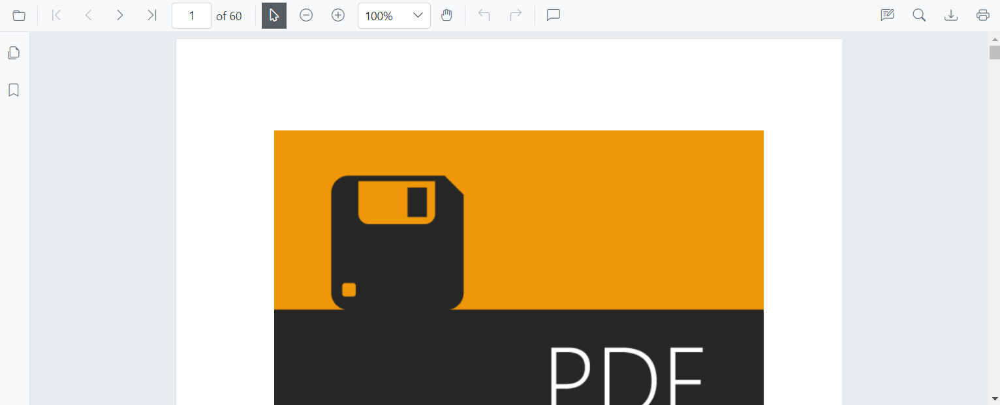
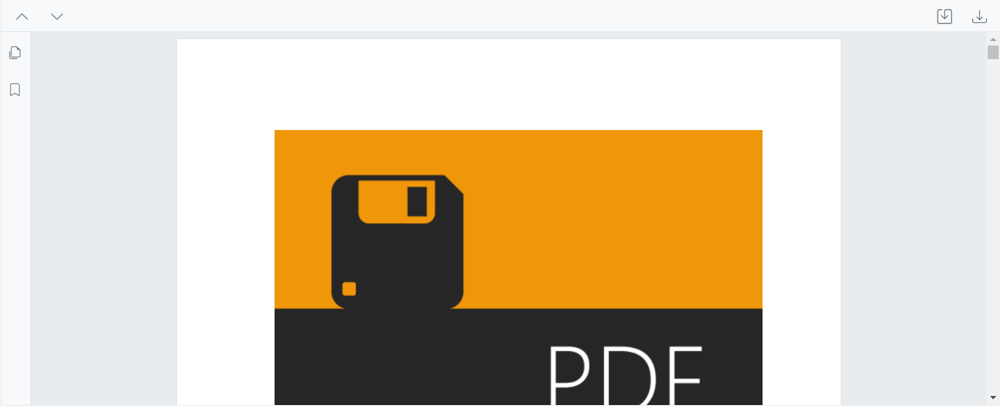
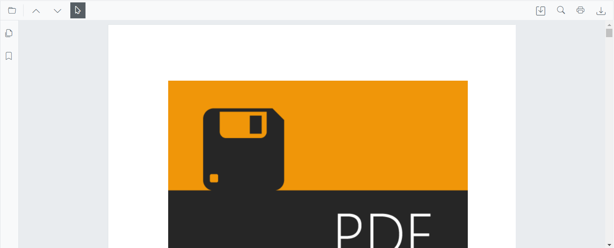
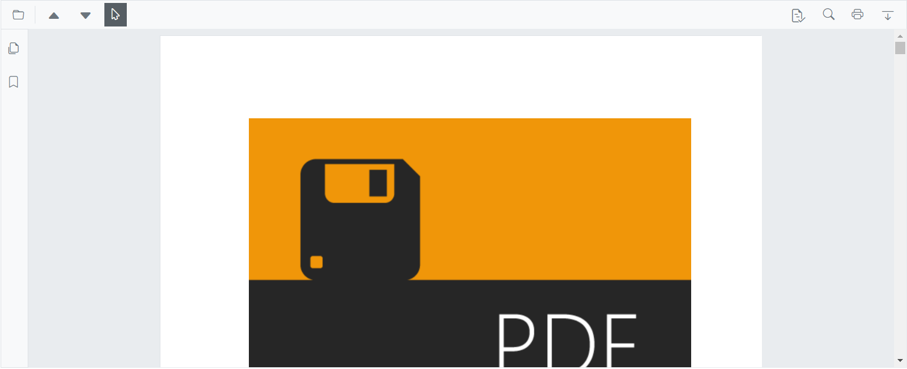

# Customize the Primary Toolbar in Blazor PDF Viewer

This guide explains how to show or hide the primary toolbar, remove default items, reorder toolbar items, and add custom toolbar items.

## Show or hide primary toolbar at initialization

Set [`EnableToolbar`](https://help.syncfusion.com/cr/blazor/Syncfusion.Blazor.SfPdfViewer.PdfViewerBase.html#Syncfusion_Blazor_SfPdfViewer_PdfViewerBase_EnableToolbar) to `false` to hide the built-in toolbar.



@using Syncfusion.Blazor.SfPdfViewer

<SfPdfViewer2 EnableToolbar="false" 
              Height="100%" 
              Width="100%" 
              DocumentPath="wwwroot/Data/PDF_Succinctly.pdf">
</SfPdfViewer2>



## Show or hide primary toolbar at runtime

Use the [`ShowToolbarAsync`](https://help.syncfusion.com/cr/blazor/Syncfusion.Blazor.SfPdfViewer.PdfViewerBase.html#Syncfusion_Blazor_SfPdfViewer_PdfViewerBase_ShowToolbarAsync_System_Boolean_) method to show or hide the toolbar dynamically.



@using Syncfusion.Blazor.SfPdfViewer
@using Syncfusion.Blazor.Buttons

<SfButton @onclick="OnClick">Hide Toolbar</SfButton>

<SfPdfViewer2 @ref="PdfViewer" 
              Height="100%" 
              Width="100%" 
              DocumentPath="wwwroot/Data/PDF_Succinctly.pdf">
</SfPdfViewer2>

@code {
    private SfPdfViewer2 PdfViewer;
    
    private async Task OnClick()
    {
        await PdfViewer.ShowToolbarAsync(false);
    }
}



[View the sample on GitHub](https://github.com/SyncfusionExamples/blazor-pdf-viewer-examples/tree/master/Toolbar/Custom%20Toolbar/Custom%20Toolbar).

## Customize the default toolbar items in the primary toolbar

Show only the required default actions and control their order in the primary toolbar.

Use [`PdfViewerToolbarSettings`](https://help.syncfusion.com/cr/blazor/Syncfusion.Blazor.SfPdfViewer.PdfViewerToolbarSettings.html) to specify which toolbar items are shown and their order. The toolbar renders only the items listed in the [`ToolbarItems`](https://help.syncfusion.com/cr/blazor/Syncfusion.Blazor.SfPdfViewer.PdfViewerToolbarSettings.html#Syncfusion_Blazor_SfPdfViewer_PdfViewerToolbarSettings_ToolbarItems) collection. For a full list of available values, see the [`ToolbarItem`](https://help.syncfusion.com/cr/blazor/Syncfusion.Blazor.SfPdfViewer.ToolbarItem.html) enum.



@using Syncfusion.Blazor.SfPdfViewer

<SfPdfViewer2 Height="100%" 
              Width="100%" 
              DocumentPath="wwwroot/Data/PDF_Succinctly.pdf">
    <PdfViewerToolbarSettings ToolbarItems="ToolbarItems"></PdfViewerToolbarSettings>
</SfPdfViewer2>

@code {
    List<ToolbarItem> ToolbarItems = new List<ToolbarItem>()
    {
        ToolbarItem.OpenOption,
        ToolbarItem.PageNavigationTool,
        ToolbarItem.MagnificationTool,
        ToolbarItem.PrintOption,
        ToolbarItem.DownloadOption
    };
}



## Rearrange the default toolbar items in the primary toolbar

Change the visual order of default items in the primary toolbar by reordering the [`ToolbarItems`](https://help.syncfusion.com/cr/blazor/Syncfusion.Blazor.SfPdfViewer.PdfViewerToolbarSettings.html#Syncfusion_Blazor_SfPdfViewer_PdfViewerToolbarSettings_ToolbarItems) collection.



@using Syncfusion.Blazor.SfPdfViewer

<SfPdfViewer2 Height="100%" 
              Width="100%" 
              DocumentPath="wwwroot/Data/PDF_Succinctly.pdf">
    <PdfViewerToolbarSettings ToolbarItems="ToolbarItems"></PdfViewerToolbarSettings>
</SfPdfViewer2>

@code {
    List<ToolbarItem> ToolbarItems = new List<ToolbarItem>()
    {
        ToolbarItem.OpenOption,
        ToolbarItem.PrintOption,
        ToolbarItem.DownloadOption,
        ToolbarItem.PageNavigationTool,
        ToolbarItem.MagnificationTool,
        ToolbarItem.SelectionTool,
        ToolbarItem.PanTool,
        ToolbarItem.AnnotationEditTool,
        ToolbarItem.SearchOption
    };
}



[View the sample on GitHub](https://github.com/SyncfusionExamples/blazor-pdf-viewer-examples/tree/master/Toolbar/Custom%20Toolbar/Primary%20Custom%20Toolbar/Rearrange-Default-Options).

## Remove default items and add custom items to the primary toolbar

Render custom buttons in place of the default items by using templates positioned at specific indexes.

Set [`ToolbarItems`](https://help.syncfusion.com/cr/blazor/Syncfusion.Blazor.SfPdfViewer.PdfViewerToolbarSettings.html#Syncfusion_Blazor_SfPdfViewer_PdfViewerToolbarSettings_ToolbarItems) to `null` and provide a list of [`PdfToolbarItem`](https://help.syncfusion.com/cr/blazor/Syncfusion.Blazor.SfPdfViewer.PdfToolbarItem.html) objects with custom templates. Each item defines a [`Template`](https://help.syncfusion.com/cr/blazor/Syncfusion.Blazor.SfPdfViewer.PdfToolbarItem.html#Syncfusion_Blazor_SfPdfViewer_PdfToolbarItem_Template) and [`Index`](https://help.syncfusion.com/cr/blazor/Syncfusion.Blazor.SfPdfViewer.PdfToolbarItem.html#Syncfusion_Blazor_SfPdfViewer_PdfToolbarItem_Index) for positioning.



@using Syncfusion.Blazor.SfPdfViewer
@using Syncfusion.Blazor.Navigations

<SfPdfViewer2 @ref="Viewer" 
              DocumentPath="wwwroot/Data/PDF_Succinctly.pdf" 
              Height="100%" 
              Width="100%">
    <PdfViewerToolbarSettings CustomToolbarItems="CustomToolbarItems" ToolbarItems="null"></PdfViewerToolbarSettings>
    <PdfViewerEvents ToolbarClicked="ClickAction"></PdfViewerEvents>
</SfPdfViewer2>

@code {
    private SfPdfViewer2 Viewer;
    
    private List<PdfToolbarItem> CustomToolbarItems = new List<PdfToolbarItem>()
    {
        new PdfToolbarItem() { Index = 0, Template = GetTemplate("PreviousPage") },
        new PdfToolbarItem() { Index = 1, Template = GetTemplate("NextPage") },
        new PdfToolbarItem() { Index = 2, Template = GetTemplate("Print") },
        new PdfToolbarItem() { Index = 3, Template = GetTemplate("Download") }
    };

    private static RenderFragment GetTemplate(string name)
    {
        return __builder =>
        {
            if (name == "PreviousPage")
            {
                <ToolbarItem PrefixIcon="e-icons e-chevron-left"
                            Text="Previous Page"
                            TooltipText="Previous Page"
                            Id="previousPage"
                            Align="ItemAlign.Left">
                </ToolbarItem>
            }
            else if (name == "NextPage")
            {
                <ToolbarItem PrefixIcon="e-icons e-chevron-right"
                            Text="Next Page"
                            TooltipText="Next Page"
                            Id="nextPage"
                            Align="ItemAlign.Left">
                </ToolbarItem>
            }
            else if (name == "Print")
            {
                <ToolbarItem PrefixIcon="e-icons e-print"
                            Text="Print"
                            TooltipText="Print"
                            Id="print"
                            Align="ItemAlign.Right">
                </ToolbarItem>
            }
            else if (name == "Download")
            {
                <ToolbarItem PrefixIcon="e-icons e-download" 
                            Text="Download" 
                            TooltipText="Download" 
                            Id="download" 
                            Align="ItemAlign.Right">
                </ToolbarItem>
            }
        };
    }

    private async void ClickAction(ClickEventArgs Item)
    {
        if (Item.Item.Id == "previousPage")
        {
            await Viewer.GoToPreviousPageAsync();
        }
        else if (Item.Item.Id == "nextPage")
        {
            await Viewer.GoToNextPageAsync();
        }
        else if (Item.Item.Id == "print")
        {
            await Viewer.PrintAsync();
        }
        else if (Item.Item.Id == "download")
        {
            await Viewer.DownloadAsync();
        }
    }
}



[View the sample on GitHub](https://github.com/SyncfusionExamples/blazor-pdf-viewer-examples/tree/master/Toolbar/Custom%20Toolbar/Primary%20Custom%20Toolbar/Without-Default-Options).

## Customize the primary toolbar with default options

Combine default and custom items by using both [`ToolbarItems`](https://help.syncfusion.com/cr/blazor/Syncfusion.Blazor.SfPdfViewer.PdfViewerToolbarSettings.html#Syncfusion_Blazor_SfPdfViewer_PdfViewerToolbarSettings_ToolbarItems) and [`CustomToolbarItems`](https://help.syncfusion.com/cr/blazor/Syncfusion.Blazor.SfPdfViewer.PdfViewerToolbarSettings.html#Syncfusion_Blazor_SfPdfViewer_PdfViewerToolbarSettings_CustomToolbarItems). Custom items are inserted at specified index positions among the default items.



@using Syncfusion.Blazor.SfPdfViewer
@using Syncfusion.Blazor.Navigations

<SfPdfViewer2 @ref="Viewer" 
              DocumentPath="wwwroot/Data/PDF_Succinctly.pdf" 
              Height="100%" 
              Width="100%">
    <PdfViewerToolbarSettings ToolbarItems="ToolbarItems" CustomToolbarItems="CustomToolbarItems"></PdfViewerToolbarSettings>
    <PdfViewerEvents ToolbarClicked="ClickAction"></PdfViewerEvents>
</SfPdfViewer2>

@code {
    private SfPdfViewer2 Viewer;
    MemoryStream stream;

    private List<ToolbarItem> ToolbarItems = new List<ToolbarItem>()
    {
        ToolbarItem.OpenOption,
        ToolbarItem.SelectionTool,
        ToolbarItem.SearchOption,
        ToolbarItem.PrintOption
    };

    private List<PdfToolbarItem> CustomToolbarItems = new List<PdfToolbarItem>()
    {
        new PdfToolbarItem() { Index = 1, Template = GetTemplate("Save") },
        new PdfToolbarItem() { Index = 3, Template = GetTemplate("Download") }
    };

    private static RenderFragment GetTemplate(string name)
    {
        return __builder =>
        {
            if (name == "Save")
            {
                <ToolbarItem PrefixIcon="e-icons e-save" 
                            Text="Save" 
                            TooltipText="Save Document" 
                            Id="save" 
                            Align="ItemAlign.Right">
                </ToolbarItem>
            }
            else if (name == "Download")
            {
                <ToolbarItem PrefixIcon="e-icons e-download" 
                            Text="Download" 
                            TooltipText="Download" 
                            Id="download" 
                            Align="ItemAlign.Right">
                </ToolbarItem>
            }
        };
    }

    private async void ClickAction(ClickEventArgs Item)
    {
        if (Item.Item.Id == "save")
        {
            byte[] data = await Viewer.GetDocumentAsync();
            stream = new MemoryStream(data);
            await Viewer.LoadAsync(stream);
        }
        else if (Item.Item.Id == "download")
        {
            await Viewer.DownloadAsync();
        }
    }
}



[View the sample on GitHub](https://github.com/SyncfusionExamples/blazor-pdf-viewer-examples/tree/master/Toolbar/Custom%20Toolbar/Primary%20Custom%20Toolbar/With-Default-Options).

## Modify the toolbar icons in the primary toolbar

Adjust icon glyphs and styles for custom toolbar items using CSS.

Customize the appearance of toolbar icons for custom toolbar items. The following example demonstrates a custom toolbar with custom icon styles.



@using Syncfusion.Blazor.SfPdfViewer
@using Syncfusion.Blazor.Navigations

<SfPdfViewer2 @ref="Viewer" 
              DocumentPath="wwwroot/Data/PDF_Succinctly.pdf" 
              Height="100%" 
              Width="100%">
    <PdfViewerToolbarSettings ToolbarItems="ToolbarItems" CustomToolbarItems="CustomToolbarItems"></PdfViewerToolbarSettings>
    <PdfViewerEvents ToolbarClicked="ClickAction"></PdfViewerEvents>
</SfPdfViewer2>

@code {
    private SfPdfViewer2 Viewer;
    MemoryStream stream;

    private List<PdfToolbarItem> CustomToolbarItems = new List<PdfToolbarItem>()
    {
        new PdfToolbarItem() { Index = 1, Template = GetTemplate("PreviousPage") },
        new PdfToolbarItem() { Index = 2, Template = GetTemplate("NextPage") },
        new PdfToolbarItem() { Index = 4, Template = GetTemplate("Save") },
        new PdfToolbarItem() { Index = 7, Template = GetTemplate("Download") }
    };

    private static RenderFragment GetTemplate(string name)
    {
        return __builder =>
        {
            if (name == "PreviousPage")
            {
                <ToolbarItem PrefixIcon="e-icons e-chevron-left"
                            Text="Previous Page"
                            TooltipText="Previous Page"
                            Id="previousPage"
                            Align="ItemAlign.Left">
                </ToolbarItem>
            }
            else if (name == "NextPage")
            {
                <ToolbarItem PrefixIcon="e-icons e-chevron-right"
                            Text="Next Page"
                            TooltipText="Next Page"
                            Id="nextPage"
                            Align="ItemAlign.Left">
                </ToolbarItem>
            }
            else if (name == "Save")
            {
                <ToolbarItem PrefixIcon="e-icons e-save"
                            Text="Save"
                            TooltipText="Save Document"
                            Id="save"
                            Align="ItemAlign.Right">
                </ToolbarItem>
            }
            else if (name == "Download")
            {
                <ToolbarItem PrefixIcon="e-icons e-download"
                            Text="Download"
                            TooltipText="Download"
                            Id="download"
                            Align="ItemAlign.Right">
                </ToolbarItem>
            }
        };
    }

    private async void ClickAction(ClickEventArgs Item)
    {
        if (Item.Item.Id == "previousPage")
        {
            await Viewer.GoToPreviousPageAsync();
        }
        else if (Item.Item.Id == "nextPage")
        {
            await Viewer.GoToNextPageAsync();
        }
        else if (Item.Item.Id == "save")
        {
            byte[] data = await Viewer.GetDocumentAsync();
            stream = new MemoryStream(data);
            await Viewer.LoadAsync(stream);
        }
        else if (Item.Item.Id == "download")
        {
            await Viewer.DownloadAsync();
        }
    }
}



[View the sample on GitHub](https://github.com/SyncfusionExamples/blazor-pdf-viewer-examples/tree/master/Toolbar/Custom%20Toolbar/Primary%20Custom%20Toolbar/Icon-Style-Change).

N> This applies only to custom toolbar items.

## Add the redaction tool to the primary toolbar on desktop

Show the redaction tool in the primary toolbar on desktop by including [`ToolbarItem.Redaction`](https://help.syncfusion.com/cr/blazor/Syncfusion.Blazor.SfPdfViewer.ToolbarItem.html#Syncfusion_Blazor_SfPdfViewer_ToolbarItem_Redaction) in the [`ToolbarItems`](https://help.syncfusion.com/cr/blazor/Syncfusion.Blazor.SfPdfViewer.PdfViewerToolbarSettings.html#Syncfusion_Blazor_SfPdfViewer_PdfViewerToolbarSettings_ToolbarItems) collection.



@using Syncfusion.Blazor.SfPdfViewer

<SfPdfViewer2 Height="100%" 
              Width="100%" 
              DocumentPath="wwwroot/Data/PDF_Succinctly.pdf">
    <PdfViewerToolbarSettings ToolbarItems="ToolbarItems"></PdfViewerToolbarSettings>
</SfPdfViewer2>

@code {
    private List<ToolbarItem> ToolbarItems = new List<ToolbarItem>();
    
    protected override void OnInitialized()
    {
        ToolbarItems = new List<ToolbarItem>()
        {
            ToolbarItem.OpenOption,
            ToolbarItem.PageNavigationTool,
            ToolbarItem.MagnificationTool,
            ToolbarItem.SelectionTool,
            ToolbarItem.PanTool,
            ToolbarItem.UndoRedoTool,
            ToolbarItem.CommentTool,
            ToolbarItem.AnnotationEditTool,
            ToolbarItem.Redaction,
            ToolbarItem.FormDesigner,
            ToolbarItem.SearchOption,
            ToolbarItem.PrintOption,
            ToolbarItem.DownloadOption
        };
    }
}



## Show or hide the navigation toolbar

Control the sidebar that displays thumbnails using the [`EnableNavigationToolbar`](https://help.syncfusion.com/cr/blazor/Syncfusion.Blazor.SfPdfViewer.PdfViewerBase.html#Syncfusion_Blazor_SfPdfViewer_PdfViewerBase_EnableNavigationToolbar) property.



@using Syncfusion.Blazor.SfPdfViewer

<SfPdfViewer2 EnableNavigationToolbar="false" 
              Height="100%" 
              Width="100%" 
              DocumentPath="wwwroot/Data/PDF_Succinctly.pdf">
</SfPdfViewer2>



## See also

- [Annotation toolbar customization](./annotation-toolbar)
- [Form designer toolbar customization](./form-designer-toolbar)
- [Mobile toolbar customization](./mobile-toolbar)
