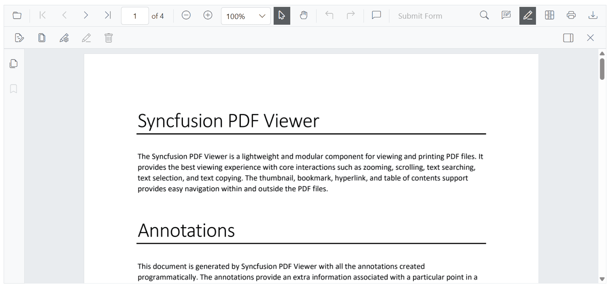
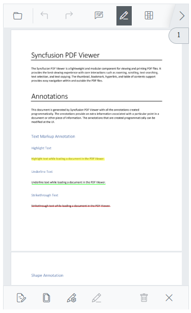
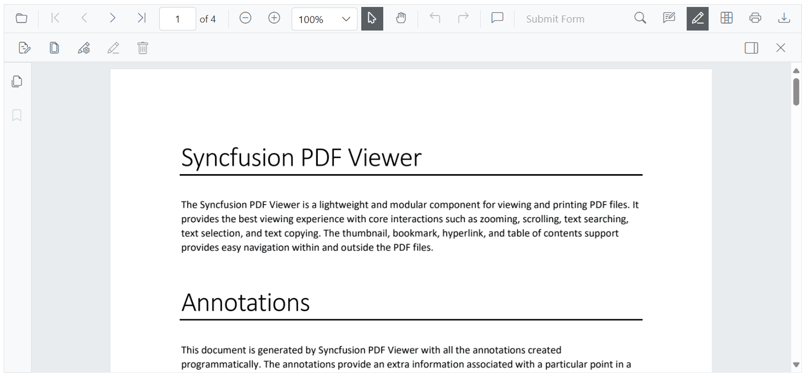
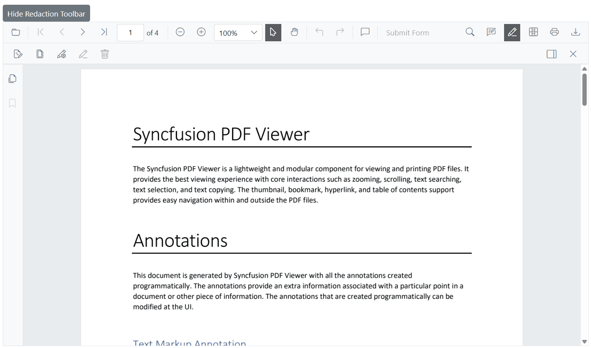

# Customize the Redaction Toolbar in Blazor PDF Viewer

This guide shows how to display or hide the redaction toolbar and how to enable it on desktop and mobile devices.

## Enable the redaction toolbar on desktop

Show the redaction toolbar on desktop by including the required [ToolbarItem.Redaction](https://help.syncfusion.com/cr/blazor/Syncfusion.Blazor.SfPdfViewer.ToolbarItem.html#Syncfusion_Blazor_SfPdfViewer_ToolbarItem_Redaction) in the [PdfViewerToolbarSettings](https://help.syncfusion.com/cr/blazor/Syncfusion.Blazor.SfPdfViewer.PdfViewerToolbarSettings.html).



@using Syncfusion.Blazor.SfPdfViewer

<SfPdfViewer2 Height="100%" Width="100%" DocumentPath="wwwroot/Data/Annotations.pdf">
    <PdfViewerToolbarSettings ToolbarItems="ToolbarItems"></PdfViewerToolbarSettings>
</SfPdfViewer2>

@code {
    private List<ToolbarItem> ToolbarItems = new List<ToolbarItem>();
    protected override void OnInitialized()
    {
        ToolbarItems = new List<ToolbarItem>()
        {
            ToolbarItem.OpenOption,
            ToolbarItem.PageNavigationTool,
            ToolbarItem.MagnificationTool,
            ToolbarItem.SelectionTool,
            ToolbarItem.PanTool,
            ToolbarItem.UndoRedoTool,
            ToolbarItem.CommentTool,
            ToolbarItem.SubmitForm,
            ToolbarItem.SearchOption,
            ToolbarItem.AnnotationEditTool,
            ToolbarItem.Redaction,
            ToolbarItem.FormDesigner,
            ToolbarItem.PrintOption,
            ToolbarItem.DownloadOption
        };
    }
}



The redaction toolbar appears in the desktop view when the page is loaded.

## Enable the redaction toolbar on mobile

Show the redaction toolbar on mobile by configuring the [`MobileToolbarItem.Redaction`](https://help.syncfusion.com/cr/blazor/Syncfusion.Blazor.SfPdfViewer.MobileToolbarItem.html#Syncfusion_Blazor_SfPdfViewer_MobileToolbarItem_Redaction) in the [`PdfViewerToolbarSettings`](https://help.syncfusion.com/cr/blazor/Syncfusion.Blazor.SfPdfViewer.PdfViewerToolbarSettings.html).



@using Syncfusion.Blazor.SfPdfViewer

<SfPdfViewer2 Height="100%" Width="100%" DocumentPath="wwwroot/Data/Annotations.pdf">
    <PdfViewerToolbarSettings MobileToolbarItems="MobileToolbarItems"></PdfViewerToolbarSettings>
</SfPdfViewer2>

@code {
    private List<MobileToolbarItem> MobileToolbarItems = new List<MobileToolbarItem>();
    protected override void OnInitialized()
    {
        MobileToolbarItems = new List<MobileToolbarItem>()
        {
            MobileToolbarItem.Open,
            MobileToolbarItem.UndoRedo,
            MobileToolbarItem.EditAnnotation,
            MobileToolbarItem.Redaction,
            MobileToolbarItem.FormDesigner,
            MobileToolbarItem.Search
        };
    }
}



The redaction toolbar appears in the mobile view when the page is loaded.

## Show or hide the redaction toolbar

Use the [`ShowRedactionToolbar`](https://help.syncfusion.com/cr/blazor/Syncfusion.Blazor.SfPdfViewer.PdfViewerBase.html#Syncfusion_Blazor_SfPdfViewer_PdfViewerBase_ShowRedactionToolbar) method on the viewer to control visibility. The method accepts a `bool` parameter: `true` shows the redaction toolbar and `false` hides it.

### Display the redaction toolbar using the toolbar icon

When [`ToolbarItem.Redaction`](https://help.syncfusion.com/cr/blazor/Syncfusion.Blazor.SfPdfViewer.ToolbarItem.html#Syncfusion_Blazor_SfPdfViewer_ToolbarItem_Redaction) or [`MobileToolbarItem.Redaction`](https://help.syncfusion.com/cr/blazor/Syncfusion.Blazor.SfPdfViewer.MobileToolbarItem.html#Syncfusion_Blazor_SfPdfViewer_MobileToolbarItem_Redaction) is enabled, selecting the redaction icon in the primary toolbar opens the redaction toolbar. Selecting the icon again hides it.

Selecting the redaction icon in the primary toolbar opens the redaction toolbar.

### Display the redaction toolbar programmatically

Control visibility through application logic by invoking the `ShowRedactionToolbar` method on the viewer instance. The `isRedactionToolbarVisible` flag tracks the current state so the toggle button switches between show and hide.



@using Syncfusion.Blazor.SfPdfViewer
@using Syncfusion.Blazor.Buttons

<SfButton @onclick="ToggleRedactionToolbar">Toggle Redaction Toolbar</SfButton>

<SfPdfViewer2 @ref="viewer" 
              DocumentPath="wwwroot/Data/Annotations.pdf" 
              Height="100%" 
              Width="100%">
    <PdfViewerToolbarSettings ToolbarItems="ToolbarItems"></PdfViewerToolbarSettings>
</SfPdfViewer2>

@code {
    private SfPdfViewer2 viewer;
    private bool isRedactionToolbarVisible = true;

    private List<ToolbarItem> ToolbarItems = new List<ToolbarItem>();

    protected override void OnInitialized()
    {
        ToolbarItems = new List<ToolbarItem>()
        {
            ToolbarItem.OpenOption,
            ToolbarItem.UndoRedoTool,
            ToolbarItem.Redaction,
            ToolbarItem.PrintOption,
            ToolbarItem.DownloadOption
        };
    }

    private void ToggleRedactionToolbar()
    {
        isRedactionToolbarVisible = !isRedactionToolbarVisible;
        viewer.ShowRedactionToolbar(isRedactionToolbarVisible);
    }
}



Invoking the `ShowRedactionToolbar` method opens the redaction toolbar.

## Complete example with redaction toolbar customization

The following is a complete, runnable example. It wires a toggle button and a viewer with the redaction toolbar enabled on both desktop and mobile.



@using Syncfusion.Blazor.SfPdfViewer
@using Syncfusion.Blazor.Buttons

<SfButton @onclick="ToggleRedactionToolbar">Toggle Redaction Toolbar</SfButton>

<SfPdfViewer2 @ref="viewer"
              DocumentPath="wwwroot/Data/Annotations.pdf"
              Height="100%"
              Width="100%">
    <PdfViewerToolbarSettings ToolbarItems="ToolbarItems"
                              MobileToolbarItems="MobileToolbarItems">
    </PdfViewerToolbarSettings>
</SfPdfViewer2>

@code {
    private SfPdfViewer2 viewer;
    private bool isRedactionToolbarVisible = true;

    private List<ToolbarItem> ToolbarItems = new List<ToolbarItem>();
    private List<MobileToolbarItem> MobileToolbarItems = new List<MobileToolbarItem>();

    protected override void OnInitialized()
    {
        ToolbarItems = new List<ToolbarItem>()
        {
            ToolbarItem.OpenOption,
            ToolbarItem.PageNavigationTool,
            ToolbarItem.MagnificationTool,
            ToolbarItem.SelectionTool,
            ToolbarItem.PanTool,
            ToolbarItem.UndoRedoTool,
            ToolbarItem.CommentTool,
            ToolbarItem.SubmitForm,
            ToolbarItem.SearchOption,
            ToolbarItem.AnnotationEditTool,
            ToolbarItem.Redaction,
            ToolbarItem.FormDesigner,
            ToolbarItem.PrintOption,
            ToolbarItem.DownloadOption
        };

        MobileToolbarItems = new List<MobileToolbarItem>()
        {
            MobileToolbarItem.Open,
            MobileToolbarItem.UndoRedo,
            MobileToolbarItem.EditAnnotation,
            MobileToolbarItem.Redaction,
            MobileToolbarItem.FormDesigner,
            MobileToolbarItem.Search
        };
    }

    private void ToggleRedactionToolbar()
    {
        isRedactionToolbarVisible = !isRedactionToolbarVisible;
        viewer.ShowRedactionToolbar(isRedactionToolbarVisible);
    }
}



## See also

- [Customize primary toolbar](./primary-toolbar)
- [Customize annotation toolbar](./annotation-toolbar)
- [Redaction overview](../redaction/overview)