# How to Add Syncfusion&reg; PDF Viewer in FlutterFlow?

## Overview

[FlutterFlow](https://app.flutterflow.io/dashboard) enables you to create native applications using its graphical interface, reducing the need to write extensive amounts of code. Additionally, it offers the capability to include custom widgets that are not included in the default [FlutterFlow](https://app.flutterflow.io/dashboard) widget collection. This article explains how to incorporate the SfPdfViewer widget as a custom widget in [FlutterFlow](https://app.flutterflow.io/dashboard).

### Create a New Project

Navigate to the [FlutterFlow dashboard](https://app.flutterflow.io/dashboard) and click the `+ Create New` button to create a new project.

### Creating the Custom Widget

1. Navigate to the `Custom Code` section in the left-side navigation menu.
2. Click on the `+ Add` button to open a dropdown menu, then select `Widget`.
3. Update the widget name as desired.
4. Click the `View Boilerplate Code` button on the right side, represented by this icon `[</>]`.
5. A popup will appear with startup code; locate the button labeled `</> Copy to Editor` and click on it.
6. Save the widget.

### Add PDF Viewer Widget as a Dependency

1. Click on `+ Add Dependency`, a text editor will appear.
2. Navigate to [Syncfusion&reg; Flutter PDF Viewer](https://pub.dev/packages/syncfusion_flutter_PdfViewer) on [pub.dev](https://pub.dev/) and copy the dependency name and version using the `Copy to Clipboard` option.
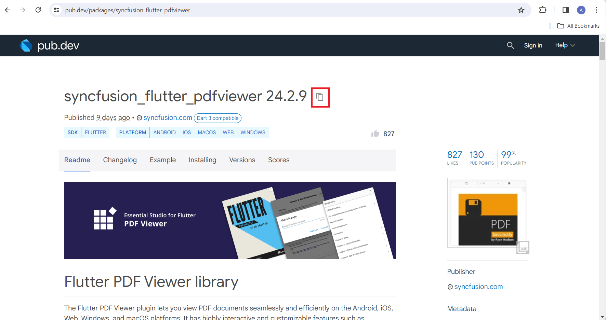
3. Paste the copied dependency into the text editor, then click `Refresh` and `Save`.

>**Note**: The live version of [Syncfusion&reg; Flutter PDF Viewer](https://pub.dev/packages/syncfusion_flutter_PdfViewer) has been migrated to the latest version of the Flutter SDK. To ensure compatibility, check [FlutterFlow](https://app.flutterflow.io/dashboard)'s current Flutter version and obtain the corresponding version of [Syncfusion&reg; Flutter PDF Viewer](https://pub.dev/packages/syncfusion_flutter_PdfViewer) by referring to the [SDK compatibility](https://help.syncfusion.com/flutter/system-requirements#sdk-version-compatibility).

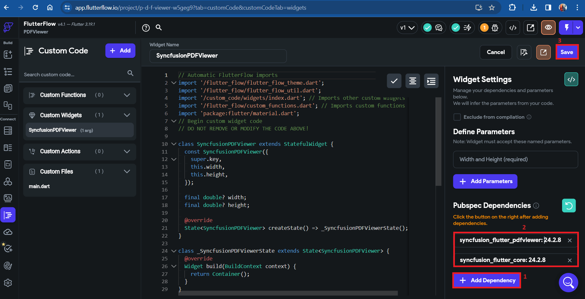

>**Note**: If you are using an older version of a dependency instead of the latest one, remove the caret symbol (^) prefix in the version number after pasting the dependency. For example, change `^21.3.0` to `21.3.0`.

>**Note**: Since [Syncfusion&reg; Flutter PDF Viewer](https://pub.dev/packages/syncfusion_flutter_PdfViewer) depends on the [Syncfusion&reg; Flutter Core](https://pub.dev/packages/syncfusion_flutter_core) package, make sure to add it as a dependency following the same steps mentioned above.

### Import the Package

1. Navigate to the `Installing` tab on the [Syncfusion&reg; Flutter PDF Viewer](https://pub.dev/packages/syncfusion_flutter_PdfViewer) page. Under the `Import it` section, copy the package import statement.
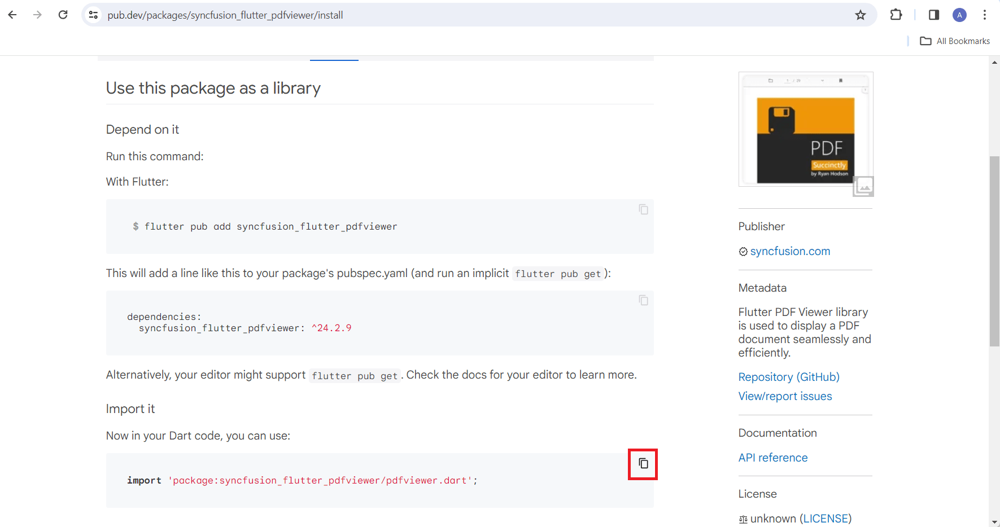
2. Paste the copied import statement into the code editor and then `Save`.
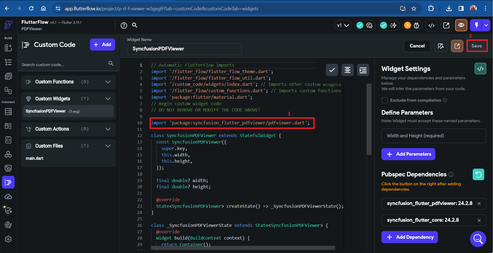

### Add Widget Code Snippet in Code Editor

1. Navigate to the [Example](https://pub.dev/packages/syncfusion_flutter_PdfViewer/example) tab in [Syncfusion&reg; Flutter PDF Viewer](https://pub.dev/packages/syncfusion_flutter_PdfViewer) and copy the widget-specific codes.
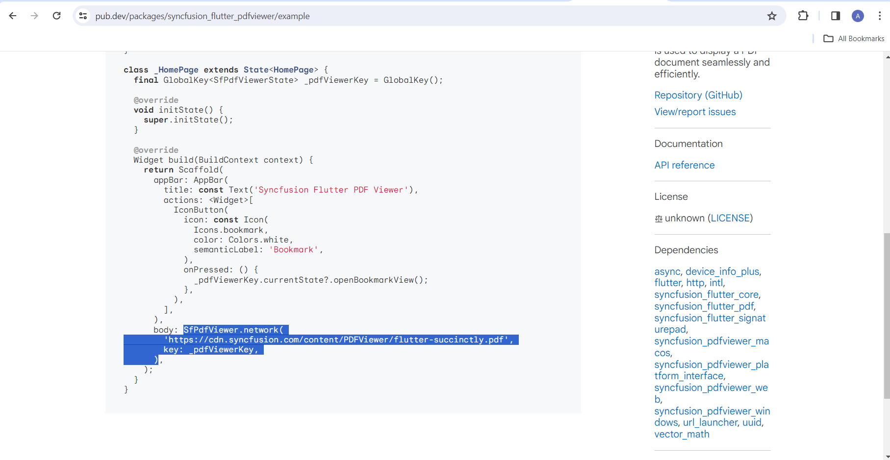
2. Paste the copied code sample into the code editor, click `Format Code`, and `Save`.
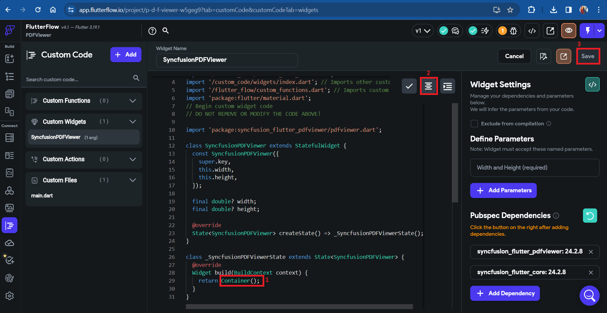

### Compiling the Codes

1. Click the 'Compile Code' button located in the top right corner.
2. If there are no errors, save the process. If errors are present, fix them and compile the code again. Once the code has been successfully compiled, save the process.

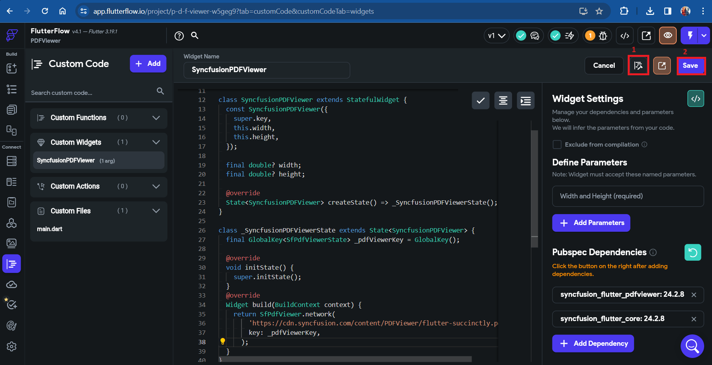

>**Note**: The compilation progress takes 2 to 3 minutes to complete.

### Create Custom Action to Import pdf.js Script

1. Click the `+ Add` button to open a dropdown menu, then select `Action`.
2. Update the action name as desired, say `importPdfjsScript`.
3. Add the below action code to import the pdf.js script.




import 'package:flutter/foundation.dart';
import 'package:web/web.dart' as web;

Future importPdfjsScript() async {
  // Check if the platform is web
  if (!kIsWeb) return;
  // Create a script element to import pdf.js library
  final script = web.document.createElement('script') as web.HTMLScriptElement
    ..type = 'text/javascript'
    ..charset = 'utf-8'
    ..async = true
    ..src = 'https://cdnjs.cloudflare.com/ajax/libs/pdf.js/2.11.338/pdf.min.js';
  // Add the script to the head tag
  web.document.querySelector('head')!.appendChild(script);
  await script.onLoad.first.timeout(const Duration(seconds: 10));
}




4. Save the action.
5. Compile the code.

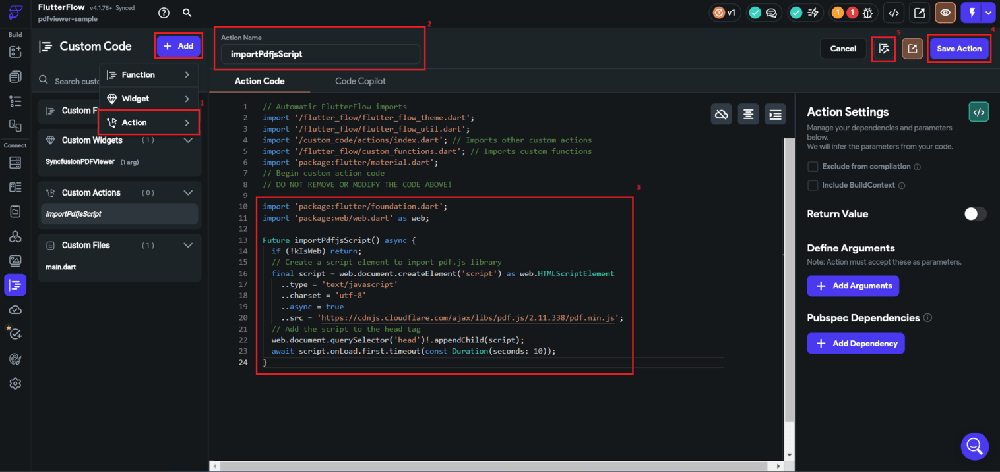

### Utilizing the Custom Action

1. Click on the main.dart file under the Custom Files section.
2. Add the `importPdfjsScript` action as Initial Action.
3. Save the file.

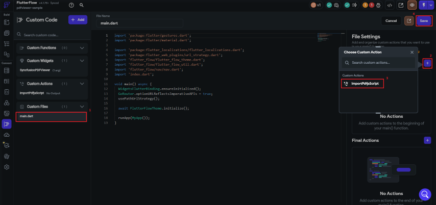

### Pass PDF Document to the Custom Widget

You can pass the PDF document to the custom widget as a parameter. The following steps explain how to pass the PDF document URL to the custom widget.

1. In the `Custom Widget Settings` panel on the right, click the `+ Add Parameters` button to add a new parameter.

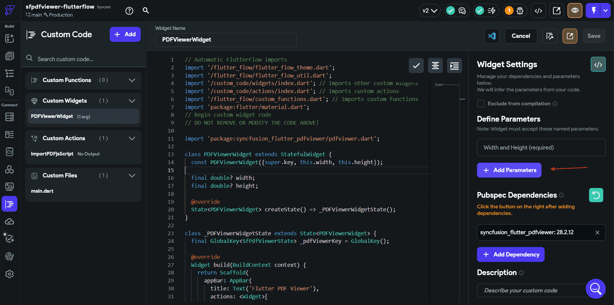

2. Set the parameter `Name` as `url`, choose the `Type` as `String`, and enable the `Nullable` option.

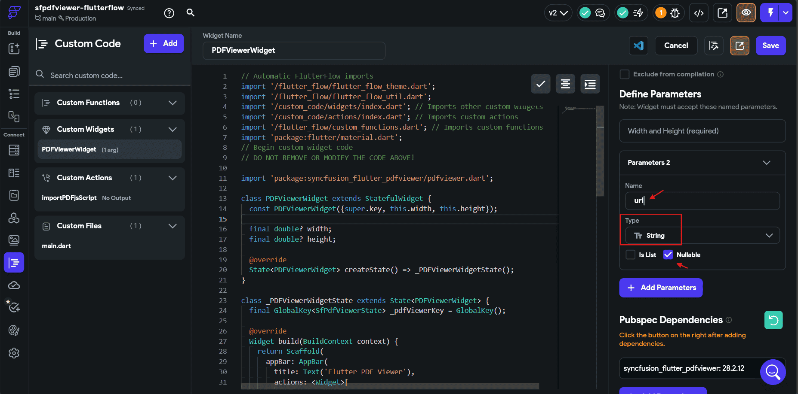

3. Modify the `PDFViewerWidget` class constructor to include the newly added `url` parameter, and declare the `url` field as shown below.




class PDFViewerWidget extends StatefulWidget {
  const PDFViewerWidget(
      {super.key, this.width, this.height, required this.url});

  final double? width;
  final double? height;
  final String url;

  @override
  State<PDFViewerWidget> createState() => _PDFViewerWidgetState();
}




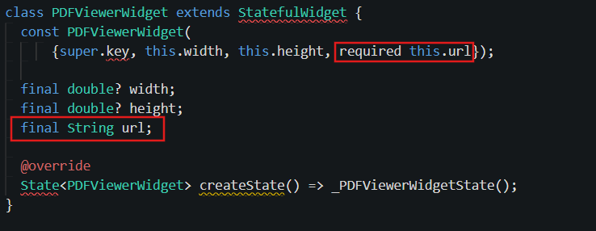

4. Replace the constant URL in the `SfPdfViewer.network` constructor with the `url` parameter that is passed to the widget.




@override
Widget build(BuildContext context) {
  return Scaffold(
    appBar: AppBar(
      title: const Text('Flutter PDF Viewer'),
      actions: <Widget>[
        IconButton(
          icon: const Icon(
            Icons.bookmark,
            color: Colors.white,
          ),
          onPressed: () {
            _pdfViewerKey.currentState?.openBookmarkView();
          },
        ),
      ],
    ),
    body: SfPdfViewer.network(
      widget.url,
      key: _pdfViewerKey,
    ),
  );
}




5. Save the changes and click the `Compile Code` button to compile the custom code.

6. On the canvas, select the `PDFViewerWidget` and enter the PDF document URL in the `url` field of the `Custom Widget Properties` section.

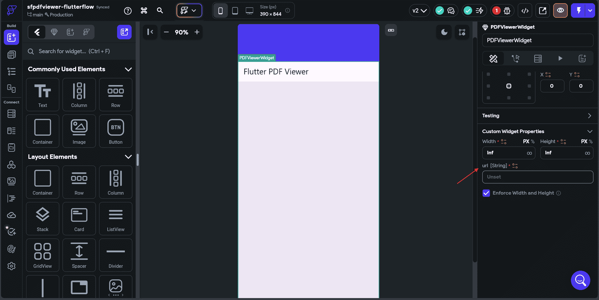

In this example, we pass `url` as a parameter and use the `SfPdfViewer.network` constructor to display the PDF document. Similarly, you can use the `SfPdfViewer.file` or `SfPdfViewer.memory` constructor to display a PDF document of your choice.

>**Note**: To display a PDF document from an **Uploaded File (Bytes)** in FlutterFlow, add a parameter of type `FFUploadedFile` (you can find this exact type by clicking the `View Boilerplate Code` button) and then use the `SfPdfViewer.memory` constructor with the uploaded file bytes. See the code snippet below.




class PDFViewerWidget extends StatefulWidget {
  const PDFViewerWidget({
    super.key,
    this.width,
    this.height,
    this.file,
  });

  final double? width;
  final double? height;
  final FFUploadedFile? file;

  @override
  State<PDFViewerWidget> createState() => _PDFViewerWidgetState();
}

class _PDFViewerWidgetState extends State<PDFViewerWidget> {
  final GlobalKey<SfPdfViewerState> _pdfViewerKey = GlobalKey();

  @override
  Widget build(BuildContext context) {
    return widget.file != null && widget.file!.bytes != null
        ? Scaffold(
            appBar: AppBar(
              title: Text('Flutter PDF Viewer'),
              actions: <Widget>[
                IconButton(
                  icon: Icon(
                    Icons.bookmark,
                    color: Colors.white,
                  ),
                  onPressed: () {
                    _pdfViewerKey.currentState?.openBookmarkView();
                  },
                ),
              ],
            ),
            body: SfPdfViewer.memory(
              widget.file!.bytes!,
              key: _pdfViewerKey,
            ),
          )
        : Container();
  }
}




### Utilizing the Custom Widget

1. Navigate to the `Widget Palette` located in the left-side navigation menu.
2. Click on the `Components` tab.
3. Your custom widget will be under `Custom Code Widgets`. Drag and drop the custom widget onto your page.

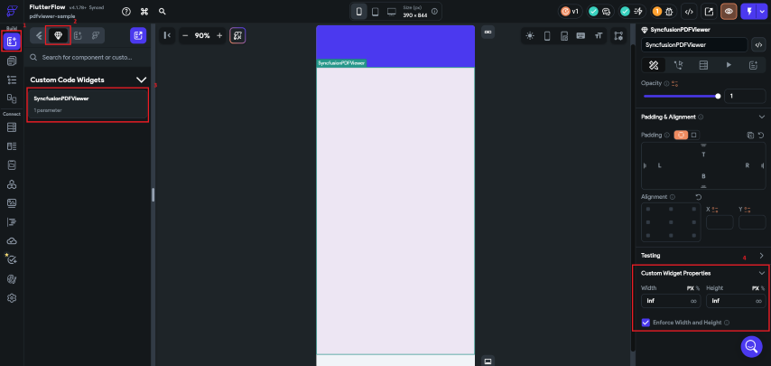

>**Note**: Since the SfPdfViewer depends on the pdf.js library on the web platform, the preview of the widget will not be displayed in the FlutterFlow editor. To view the widget, run the application on a web platform.