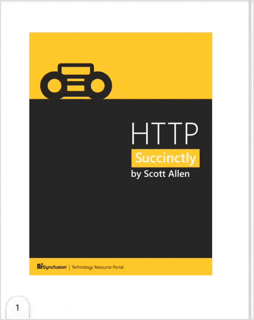
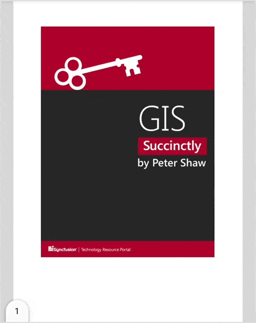

# Page Layout and Scrolling Options in Flutter PDF Viewer (SfPdfViewer)

Page layout modes describe how the PDF page is displayed, and scrolling options describe the direction in which the PDF pages can be scrolled in [SfPdfViewer](https://pub.dev/documentation/syncfusion_flutter_pdfviewer/latest/pdfviewer/SfPdfViewer-class.html).

## Page Layout Modes

The [SfPdfViewer](https://pub.dev/documentation/syncfusion_flutter_pdfviewer/latest/pdfviewer/SfPdfViewer-class.html) supports the following page layout modes:

* Continuous page layout mode
* Single page layout mode

### Continuous Page Layout Mode

By default, the `continuous` page layout mode is enabled, which displays all the PDF pages in a continuous flow. The scroll direction can be configured using the `scrollDirection` property. To set the page layout mode to `continuous` in `SfPdfViewer`, use the following code sample.




@override
Widget build(BuildContext context) {
  return Scaffold(
      body: SfPdfViewer.network(
              'https://cdn.syncfusion.com/content/PDFViewer/flutter-succinctly.pdf',
              pageLayoutMode: PdfPageLayoutMode.continuous));
}




### Single Page Layout Mode

In `Single` page layout mode, the PDF pages are displayed one at a time, with horizontal scrolling by default. To set the page layout mode to `Single` in `SfPdfViewer`, use the following code sample.




@override
Widget build(BuildContext context) {
  return Scaffold(
      body: SfPdfViewer.network(
              'https://cdn.syncfusion.com/content/PDFViewer/flutter-succinctly.pdf',
              pageLayoutMode: PdfPageLayoutMode.single));
}




## Scrolling Options

The [SfPdfViewer](https://pub.dev/documentation/syncfusion_flutter_pdfviewer/latest/pdfviewer/SfPdfViewer-class.html) supports the following scrolling options:

* Vertical scrolling
* Horizontal scrolling

If the scroll direction is not specified, continuous page layout mode defaults to vertical scrolling, and single page layout mode defaults to horizontal scrolling.

### Vertical Scrolling

By default, `Vertical` scrolling is enabled, which scrolls the PDF pages from top to bottom. To set the scroll direction to `Vertical` in `SfPdfViewer`, use the following code sample.




@override
Widget build(BuildContext context) {
  return Scaffold(
      body: SfPdfViewer.network(
              'https://cdn.syncfusion.com/content/PDFViewer/flutter-succinctly.pdf',
              scrollDirection: PdfScrollDirection.vertical));
}




### Horizontal Scrolling

In `Horizontal` scrolling, PDF pages are scrolled from left to right. To set the scroll direction to `Horizontal` in `SfPdfViewer`, use the following code sample.




@override
Widget build(BuildContext context) {
  return Scaffold(
      body: SfPdfViewer.network(
              'https://cdn.syncfusion.com/content/PDFViewer/flutter-succinctly.pdf',
              scrollDirection: PdfScrollDirection.horizontal));
}




