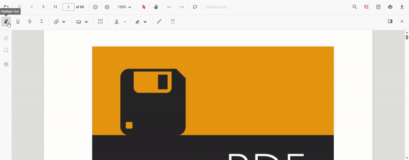

# Localization in the JavaScript PDF Viewer

The PDF Viewer supports localization of UI text, tooltips, and messages using culture-specific string collections so the interface matches users' language and regional settings.

N> Change the viewer locale by setting the `locale` property in the viewer options during initialization or by assigning `pdfviewer.locale` before rendering.

## Default language (en-US)

By default, the PDF Viewer uses the en-US culture and requires no additional configuration.



ej.pdfviewer.PdfViewer.Inject(
      ej.pdfviewer.TextSelection,
      ej.pdfviewer.TextSearch,
      ej.pdfviewer.Print,
      ej.pdfviewer.Navigation,
      ej.pdfviewer.Toolbar,
      ej.pdfviewer.Magnification,
      ej.pdfviewer.Annotation,
      ej.pdfviewer.FormDesigner,
      ej.pdfviewer.FormFields,
      ej.pdfviewer.PageOrganizer
    );

    var pdfviewer = new ej.pdfviewer.PdfViewer({
      documentPath: 'https://cdn.syncfusion.com/content/pdf/pdf-succinctly.pdf',
      resourceUrl: 'https://cdn.syncfusion.com/ej2/31.1.23/dist/ej2-pdfviewer-lib',
     locale: 'ar-AE' //Using locale update culture (en-US by default)
    });
    pdfviewer.appendTo('#pdfViewer');



ej.pdfviewer.PdfViewer.Inject(
      ej.pdfviewer.TextSelection,
      ej.pdfviewer.TextSearch,
      ej.pdfviewer.Print,
      ej.pdfviewer.Navigation,
      ej.pdfviewer.Toolbar,
      ej.pdfviewer.Magnification,
      ej.pdfviewer.Annotation,
      ej.pdfviewer.FormDesigner,
      ej.pdfviewer.FormFields,
      ej.pdfviewer.PageOrganizer
    );

    var pdfviewer = new ej.pdfviewer.PdfViewer({
      documentPath: 'https://cdn.syncfusion.com/content/pdf/pdf-succinctly.pdf',
      serviceUrl: 'https://document.syncfusion.com/web-services/pdf-viewer/api/pdfviewer/',
     locale: 'ar-AE' //Using locale update culture (en-US by default)
    });
    pdfviewer.appendTo('#pdfViewer');



[View Sample on GitHub](https://github.com/SyncfusionExamples/javascript-pdf-viewer-examples)

## Localization keys reference

The PDF Viewer supports localization using culture-specific string collections. By default, the component uses the "en-US" culture.

The following table lists the default text values used by the PDF Viewer in the "en-US" culture:

|Keywords|Values|
|---|---|
|PdfViewer|PDF Viewer|
|Cancel|Cancel|
|Download file|Download file|
|Download|Download|
|Enter Password|This document is password protected. Please enter a password.|
|File Corrupted|File corrupted|
|File Corrupted Content|The file is corrupted and cannot be opened.|
|Fit Page|Fit page|
|Fit Width|Fit width|
|Automatic|Automatic|
|Go To First Page|Show first page|
|Invalid Password|Incorrect password. Please try again.|
|Next Page|Show next page|
|OK|OK|
|Open|Open file|
|Page Number|Current page number|
|Previous Page|Show previous page|
|Go To Last Page|Show last page|
|Zoom|Zoom|
|Zoom In|Zoom in|
|Zoom Out|Zoom out|
|Page Thumbnails|Page thumbnails|
|Bookmarks|Bookmarks|
|Print|Print file|
|Password Protected|Password required|
|Copy|Copy|
|Text Selection|Text selection tool|
|Panning|Pan mode|
|Text Search|Find text|
|Find in document|Find in document|
|Match case|Match case|
|Apply|Apply|
|GoToPage|Go to page|
|No Matches|Viewer has finished searching the document. No more matches were found|
|No Text Found|No Text Found|
|Undo|Undo|
|Redo|Redo|
|Annotation|Add or Edit annotations|
|Highlight|Highlight Text|
|Underline|Underline Text|
|Strikethrough|Strikethrough Text|
|Delete|Delete annotation|
|Opacity|Opacity|
|Color edit|Change Color|
|Opacity edit|Change Opacity|
|Highlight context|Highlight|
|Underline context|Underline|
|Strikethrough context|Strike through|
|Server error|Web-service is not listening. PDF Viewer depends on web-service for all it's features. Please start the web service to continue.|
|Open text|Open|
|First text|First Page|
|Previous text|Previous Page|
|Next text|Next Page|
|Last text|Last Page|
|Zoom in text|Zoom In|
|Zoom out text|Zoom Out|
|Selection text|Selection|
|Pan text|Pan|
|Print text|Print|
|Search text|Search|
|Annotation Edit text|Edit Annotation|
|Line Thickness|Line Thickness|
|Line Properties|Line Properties|
|Start Arrow|Start Arrow |
|End Arrow|End Arrow|
|Line Style|Line Style|
|Fill Color|Fill Color|
|Line Color|Line Color|
|None|None|
|Open Arrow|Open Arrow|
|Closed Arrow|Closed Arrow|
|Round Arrow|Round Arrow|
|Square Arrow|Square Arrow|
|Diamond Arrow|Diamond Arrow|
|Cut|Cut|
|Paste|Paste|
|Delete Context|Delete Context|
|Properties|Properties|
|Add Stamp|Add Stamp|
|Add Shapes|Add Shapes|
|Stroke edit|Stroke Edit|
|Change thickness|Change Thickness|
|Add line|Add Line|
|Add arrow|Add Arrow|
|Add rectangle|Add Rectangle|
|Add circle|Add Circle|
|Add polygon|Add Polygon|
|Add Comments|Add Comments|
|Comments| Comments|
|No Comments Yet|No Comments Yet|
|Accepted| Accepted|
|Completed| Completed|
|Cancelled| Cancelled|
|Rejected| Rejected|
|Leader Length|Leader Length|
|Scale Ratio|Scale Ratio|
|Calibrate| Calibrate|
|Calibrate Distance|Calibrate Distance|
|Calibrate Perimeter|Calibrate Perimeter|
|Calibrate Area|Calibrate Area|
|Calibrate Radius|Calibrate Radius|
|Calibrate Volume|Calibrate Volume|
|Depth|Depth|
|Closed|Closed|
|Round|Round|
|Square|Square|
|Diamond|Diamond|
|Edit|Edit|
|Comment|Comment|
|Comment Panel|Comment Panel|
|Set Status|Set Status|
|Post|Post|
|Page|Page|
|Add a comment|Add a comment|
|Add a reply|Add a reply|
|Import Annotations|Import Annotations|
|Export Annotations|Export Annotations|
|Add|Add|
|Clear|Clear|
|Bold|Bold|
|Italic|Italic|
|Strikethroughs|Strikethroughs|
|Underlines|Underlines|
|Superscript|Superscript|
|Subscript|Subscript|
|Align left|Align Left|
|Align right|Align Right|
|Center|Center|
|Justify|Justify|
|Font color|Font Color|
|Text Align|Text Align|
|Text Properties|Text Properties|
|Draw Signature|Draw Signature|
|Create| Create|
|Font family|Font Family|
|Font size|Font Size|
|Free Text|Free Text|
|Import Failed|Import Failed|
|File not found|File Not Found|
|Export Failed|Export Failed|
|Dynamic|Dynamic|
|Standard Business|Standard Business|
|Sign Here|Sign Here|
|Custom Stamp|Custom Stamp|
|InitialFieldDialogHeaderText|Initial Field Dialog Header Text|
|HandwrittenInitialDialogHeaderText|Handwritten Initial Dialog Header Text|
|SignatureFieldDialogHeaderText|Signature Field Dialog Header Text|
|HandwrittenSignatureDialogHeaderText|Handwritten Signature Dialog Header Text|
|Draw-hand Signature|Draw-hand Signature|
|Type Signature|Type Signature|
|Upload Signature|Upload Signature|
|Browse Signature Image|Browse Signature Image|
|Save Signature|Save Signature|
|Save Initial|Save Initial|
|highlight|highlight|
|underline|underline|
|strikethrough|strikethrough|
|FormDesigner|Form Designer|
|SubmitForm|Submit Form|
|Search text|Search Text|
|Draw Ink|Draw Ink|
|Revised|Revised|
|Reviewed|Reviewed|
|Received|Received|
|Confidential|Confidential|
|Approved|Approved|
|Not Approved|Not Approved|
|Witness|Witness|
|Initial Here|Initial Here|
|Draft|Draft|
|Final|Final|
|For Public Release|For Public Release|
|Not For Public Release|Not For Public Release|
|For Comment|For Comment|
|Void|Void|
|Preliminary Results|Preliminary Results|
|Information Only|Information Only|
|Enter Signature as Name|Enter Signature as Name|
|Textbox|Textbox|
|Password|Password|
|Check Box|Check Box|
|Radio Button|Radio Button|
|Dropdown|Dropdown|
|List Box|List Box|
|Signature|Signature|
|Delete FormField|Delete FormField|
|FormDesigner Edit text|Form Designer Edit Text|
|in|in|
|m|m|
|ft_in|ft_in|
|ft|ft|
|p|p|
|cm|cm|
|mm|mm|
|pt|pt|
|cu|cu|
|sq|sq|
|General|General|
|Appearance|Appearance|
|Options|Options|
|Textbox Properties|Textbox Properties|
|Name|Name|
|Tooltip|Tooltip|
|Value|Value|
|Form Field Visibility|Form Field Visibility|
|Read Only|Read Only|
|Required|Required|
|Checked|Checked|
|Show Printing|Show Printing|
|Formatting|Formatting|
|Fill|Fill|
|Border|Border|
|Border Color|Border Color|
|Thickness|Thickness|
|Max Length|Max Length|
|List Item|List Item|
|Export Value|Export Value|
|Dropdown Item List|Dropdown Item List|
|List Box Item List|List Box Item List|
|Delete Item|Delete Item|
|Up|Up|
|Down|Down|
|Multiline|Multiline|
|Initial|Initial|
|Export XFDF|Export XFDF|
|Import XFDF|Import XFDF|
|Organize Pages|Organize Pages|
|Insert Right|Insert Right|
|Insert Left|Insert Left|
|Total|Total|
|Pages|Pages|
|Rotate Right|Rotate Right|
|Rotate Left|Rotate Left|
|Delete Page|Delete Page|
|Delete Pages|Delete Pages|
|Copy Page|Copy Page|
|Copy Pages|Copy Pages|
|Save|Save|
|Save As|Save As|
|Select All|Select All|
|Import Document|Import Document|
|Match any word|Match any word|
|Client error|Client-side error is found. Please check the custom headers provided in the AjaxRequestSettings property and web action methods in the ServerActionSettings property|
|Cors policy error|Unable to retrieve the document due to an invalid URL or access restrictions. Please check the document URL and try again|
|No More Matches|Viewer has finished searching the document. No more matches were found|
|No Search Matches|No matches found|
|No More Search Matches|No more matches found|
|Exact Matches|EXACT MATCHES|
|Total Matches|TOTAL MATCHES|

## See Also

- [New Language](./new-language)
- [RTL Language Support](./rtl-language-support)