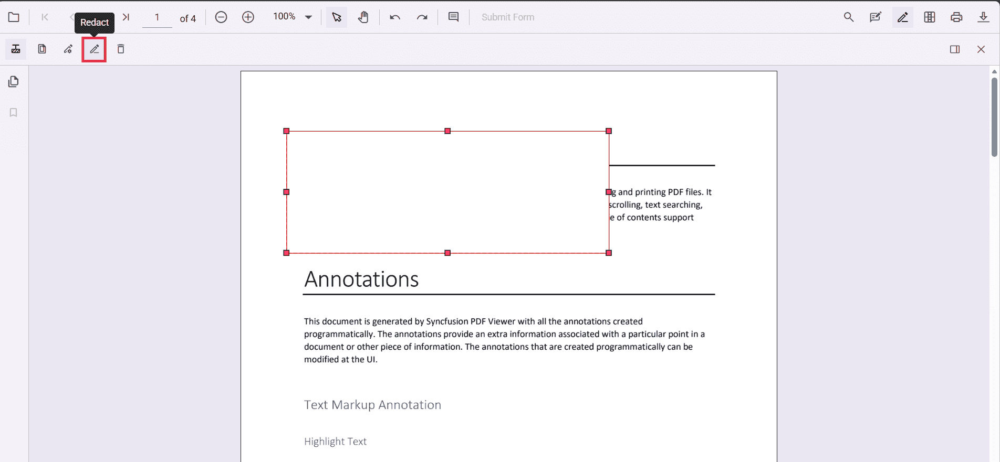
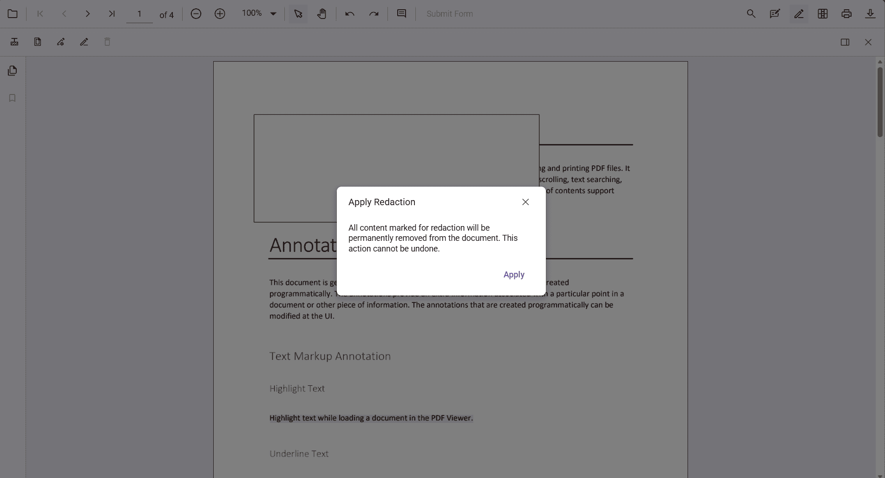

# Redaction in JavaScript (ES5) PdfViewer

Redaction annotations are used to hide confidential or sensitive information in a PDF. The Syncfusion JavaScript PDF Viewer (EJ2) lets you mark areas or entire pages for redaction, customize their appearance, and permanently apply them with a single action.

## Enable the redaction toolbar

To enable the redaction toolbar, configure the `toolbarSettings.toolbarItems` property of the PdfViewer instance to include the **RedactionEditTool**.

The following example shows how to enable the redaction toolbar:

```js
var pdfviewer = new ej.pdfviewer.PdfViewer({
  documentPath: 'https://cdn.syncfusion.com/content/pdf/pdf-succinctly.pdf',
  resourceUrl: "https://cdn.syncfusion.com/ej2/31.2.2/dist/ej2-pdfviewer-lib",
  toolbarSettings: {
    toolbarItems: [
      'OpenOption',
      'UndoRedoTool',
      'PageNavigationTool',
      'MagnificationTool',
      'PanTool',
      'SelectionTool',
      'CommentTool',
      'SubmitForm',
      'AnnotationEditTool',
      'RedactionEditTool',   // Enables Redaction toolbar
      'FormDesignerEditTool',
      'SearchOption',
      'PrintOption',
      'DownloadOption'
    ]
  }
});
ej.pdfviewer.PdfViewer.Inject(ej.pdfviewer.TextSelection, ej.pdfviewer.TextSearch, ej.pdfviewer.Print, ej.pdfviewer.Navigation, ej.pdfviewer.Toolbar, ej.pdfviewer.Magnification, ej.pdfviewer.Annotation, ej.pdfviewer.FormDesigner, ej.pdfviewer.FormFields, ej.pdfviewer.PageOrganizer);
pdfviewer.appendTo('#PdfViewer');
```

N> Prerequisites: Add the PdfViewer control to your JavaScript application and ensure the redaction feature is available in the version you are using. Once applied, redaction permanently removes the selected content.


## Add Redaction Annotations

You can mark specific content for redaction using the toolbar or through code.  

Select the **Redaction tool** and draw over the text or graphics you want to hide. You can also add overlay text (such as “Confidential”) and adjust the style — fill color, border color, and opacity.


## Delete Redaction Annotations

Redaction annotations can be removed easily:

- Click the **Delete** button on the toolbar, or  
- Select the annotation and press the **Delete** key.


## Redact Entire Pages

The viewer allows you to redact whole pages that contain sensitive information. You can choose specific pages, page ranges, or redact all pages using the built‑in dialog, or perform the same action programmatically.


## Apply Redaction

Once annotations are added, you can permanently apply them to the document. This action cannot be undone.  

Use the **Apply Redaction** button on the toolbar or call the API method:

- The button is disabled until at least one redaction annotation exists.  
- It becomes active when redaction annotations are present.



A confirmation dialog appears before applying redaction to ensure you acknowledge the irreversible nature of the process.



N> After redaction is applied, the original content cannot be recovered.

## Comment Support

Redaction annotations can include comments using the built‑in comment panel. This helps you add notes, track reviews, or record the reason for redaction.  

Comments can be added through the UI or API. For more details, see the [Comments documentation](../annotations/comments).

## Import and Export Redaction Annotations

You can save and reload redaction annotations by exporting and importing them in JSON format. This makes it easy to persist annotations or share them across sessions.

For more details, see the [Export and import annotations documentation](../how-to/import-export-annotation-js).

## See also

* [Redaction UI interactions](./ui-interaction)
* [Redaction Programmatic support](./programmatic-support)
* [Redaction Toolbar](./toolbar)
* [Redaction Mobile view](./mobile-view)
* [Search Text and Redact](./search-redact)
