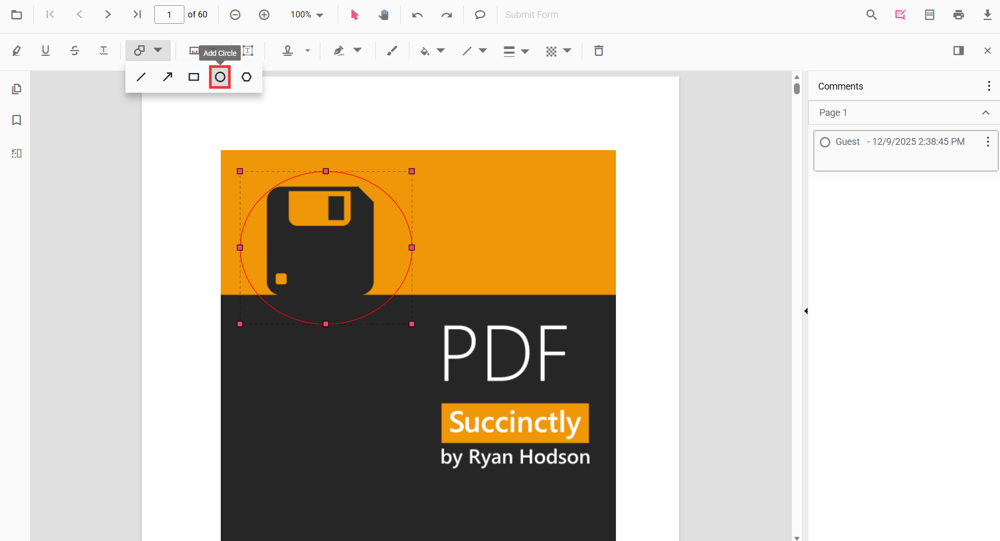
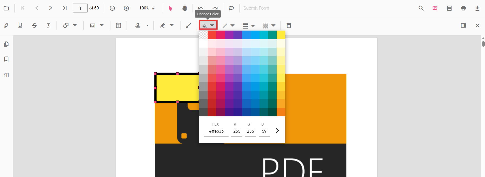
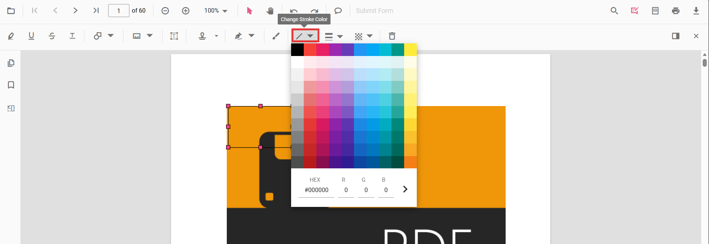
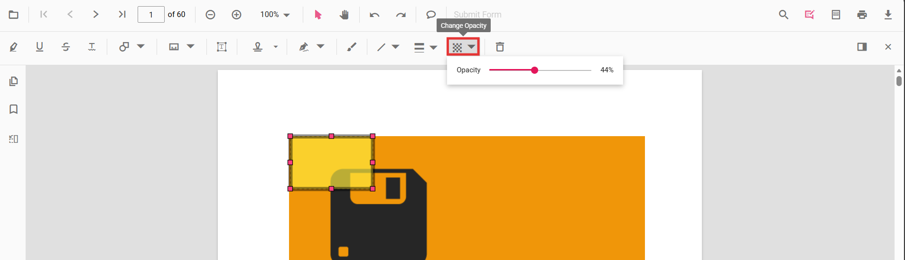

# Circle annotation in JavaScript PDF Viewer

Circle is a shape annotation used to highlight circular regions or draw emphasis bubbles.



## Add Circle Annotation

### Add circle annotation via UI

Use the annotation toolbar to:
- Click the **Edit Annotation** button in the PDF Viewer toolbar.
- Open the **Shape Annotation** dropdown.
- Choose **Circle**, then draw on the page.

N> When in pan mode, selecting a shape annotation switches the viewer to text select mode.


### Enable circle mode

The PDF Viewer library allows drawing circle annotations programmatically after enabling circle mode via button clicks.

```html
<button id="circleMode">Circle</button>
```



ej.pdfviewer.PdfViewer.Inject(
    ej.pdfviewer.Toolbar,
    ej.pdfviewer.Magnification,
    ej.pdfviewer.Navigation,
    ej.pdfviewer.Annotation,
    ej.pdfviewer.LinkAnnotation,
    ej.pdfviewer.ThumbnailView,
    ej.pdfviewer.BookmarkView,
    ej.pdfviewer.TextSelection,
    ej.pdfviewer.TextSearch,
    ej.pdfviewer.FormFields,
    ej.pdfviewer.FormDesigner,
    ej.pdfviewer.PageOrganizer
);

var pdfviewer = new ej.pdfviewer.PdfViewer();
pdfviewer.documentPath = "https://cdn.syncfusion.com/content/pdf/pdf-succinctly.pdf";
pdfviewer.resourceUrl = "https://cdn.syncfusion.com/ej2/31.1.23/dist/ej2-pdfviewer-lib";
pdfviewer.appendTo('#PdfViewer');

document.getElementById('circleMode').addEventListener('click', function () {
    pdfviewer.annotationModule.setAnnotationMode('Circle');
});


ej.pdfviewer.PdfViewer.Inject(
    ej.pdfviewer.Toolbar,
    ej.pdfviewer.Magnification,
    ej.pdfviewer.Navigation,
    ej.pdfviewer.Annotation,
    ej.pdfviewer.LinkAnnotation,
    ej.pdfviewer.ThumbnailView,
    ej.pdfviewer.BookmarkView,
    ej.pdfviewer.TextSelection,
    ej.pdfviewer.TextSearch,
    ej.pdfviewer.FormFields,
    ej.pdfviewer.FormDesigner,
    ej.pdfviewer.PageOrganizer
);

var pdfviewer = new ej.pdfviewer.PdfViewer();
pdfviewer.serviceUrl = 'https://document.syncfusion.com/web-services/pdf-viewer/api/pdfviewer/';
pdfviewer.documentPath = "https://cdn.syncfusion.com/content/pdf/pdf-succinctly.pdf";
pdfviewer.appendTo('#PdfViewer');

document.getElementById('circleMode').addEventListener('click', function () {
    pdfviewer.annotationModule.setAnnotationMode('Circle');
});



#### Exit circle mode

```html
<button id="setNone">Normal Mode</button>
```



var setNone = document.getElementById('setNone');
if (setNone) {
    setNone.addEventListener('click', function () {
        pdfviewer.annotationModule.setAnnotationMode('None');
    });
}


 
### Add a circle annotation programmatically

Add shape annotations programmatically using the [addAnnotation()](https://ej2.syncfusion.com/documentation/api/pdfviewer/annotation#annotation) method.

```html
<button id="addCircleAnnotation">Add Circle annotation programmatically</button>
```



ej.pdfviewer.PdfViewer.Inject(
    ej.pdfviewer.Toolbar,
    ej.pdfviewer.Magnification,
    ej.pdfviewer.Navigation,
    ej.pdfviewer.Annotation,
    ej.pdfviewer.LinkAnnotation,
    ej.pdfviewer.ThumbnailView,
    ej.pdfviewer.BookmarkView,
    ej.pdfviewer.TextSelection,
    ej.pdfviewer.TextSearch,
    ej.pdfviewer.FormFields,
    ej.pdfviewer.FormDesigner,
    ej.pdfviewer.PageOrganizer
);

var pdfviewer = new ej.pdfviewer.PdfViewer();
pdfviewer.documentPath = "https://cdn.syncfusion.com/content/pdf/pdf-succinctly.pdf";
pdfviewer.resourceUrl = "https://cdn.syncfusion.com/ej2/31.1.23/dist/ej2-pdfviewer-lib";
pdfviewer.appendTo('#PdfViewer');

document.getElementById('addCircleAnnotation').addEventListener('click', function () {
    pdfviewer.annotation.addAnnotation('Circle', {
        offset: { x: 200, y: 620 },
        pageNumber: 1,
        width: 90,
        height: 90
    });
});


ej.pdfviewer.PdfViewer.Inject(
    ej.pdfviewer.Toolbar,
    ej.pdfviewer.Magnification,
    ej.pdfviewer.Navigation,
    ej.pdfviewer.Annotation,
    ej.pdfviewer.LinkAnnotation,
    ej.pdfviewer.ThumbnailView,
    ej.pdfviewer.BookmarkView,
    ej.pdfviewer.TextSelection,
    ej.pdfviewer.TextSearch,
    ej.pdfviewer.FormFields,
    ej.pdfviewer.FormDesigner,
    ej.pdfviewer.PageOrganizer
);

var pdfviewer = new ej.pdfviewer.PdfViewer();
pdfviewer.serviceUrl = 'https://document.syncfusion.com/web-services/pdf-viewer/api/pdfviewer/';
pdfviewer.documentPath = "https://cdn.syncfusion.com/content/pdf/pdf-succinctly.pdf";
pdfviewer.appendTo('#PdfViewer');

document.getElementById('addCircleAnnotation').addEventListener('click', function () {
    pdfviewer.annotation.addAnnotation('Circle', {
        offset: { x: 200, y: 620 },
        pageNumber: 1,
        width: 90,
        height: 90
    });
});



## Edit Circle Annotation

### Edit circle annotation in UI

You can select, move, and resize Circle annotations directly in the viewer:
- Select a Circle to show its handles.
- Move: drag inside the shape to reposition it on the page.
- Resize: drag the corner handles to adjust its diameter.
- Delete or access more options from the context menu.

#### Editing the properties of the circle annotation

The fill color, stroke color, thickness, and opacity of circle shape annotations can be edited using the Edit Color, Edit Stroke Color, Edit Thickness, and Edit Opacity tools in the annotation toolbar.

##### Editing fill color

The fill color of the annotation can be edited using the color palette provided in the Edit Color tool.



##### Editing stroke color

The stroke color of the annotation can be edited using the color palette provided in the Edit Stroke Color tool.



##### Editing thickness

The thickness of the border of the annotation can be edited using the range slider provided in the Edit Thickness tool.


##### Editing opacity

The opacity of the annotation can be edited using the range slider provided in the Edit Opacity tool.



### Edit an existing circle annotation programmatically

Use editAnnotation on items from annotationCollection.

```html
<button id="editCircleAnnotation">Edit Circle annotation programmatically</button>
```



ej.pdfviewer.PdfViewer.Inject(
    ej.pdfviewer.Toolbar,
    ej.pdfviewer.Magnification,
    ej.pdfviewer.Navigation,
    ej.pdfviewer.Annotation,
    ej.pdfviewer.LinkAnnotation,
    ej.pdfviewer.ThumbnailView,
    ej.pdfviewer.BookmarkView,
    ej.pdfviewer.TextSelection,
    ej.pdfviewer.TextSearch,
    ej.pdfviewer.FormFields,
    ej.pdfviewer.FormDesigner,
    ej.pdfviewer.PageOrganizer
);

var pdfviewer = new ej.pdfviewer.PdfViewer();
pdfviewer.documentPath = "https://cdn.syncfusion.com/content/pdf/pdf-succinctly.pdf";
pdfviewer.resourceUrl = "https://cdn.syncfusion.com/ej2/31.1.23/dist/ej2-pdfviewer-lib";
pdfviewer.appendTo('#PdfViewer');

var editCircleAnnotation = document.getElementById('editCircleAnnotation');
if (editCircleAnnotation) {
    editCircleAnnotation.addEventListener('click', function () {
        for (var i = 0; i < pdfviewer.annotationCollection.length; i++) {
            if (pdfviewer.annotationCollection[i].subject === 'Circle') {
                pdfviewer.annotationCollection[i].strokeColor = '#0000FF';
                pdfviewer.annotationCollection[i].thickness = 2;
                pdfviewer.annotationCollection[i].fillColor = '#FFFF00';
                pdfviewer.annotationCollection[i].annotationSelectorSettings.resizerShape = 'Circle';
                pdfviewer.annotation.editAnnotation(pdfviewer.annotationCollection[i]);
            }
        }
    });
}


ej.pdfviewer.PdfViewer.Inject(
    ej.pdfviewer.Toolbar,
    ej.pdfviewer.Magnification,
    ej.pdfviewer.Navigation,
    ej.pdfviewer.Annotation,
    ej.pdfviewer.LinkAnnotation,
    ej.pdfviewer.ThumbnailView,
    ej.pdfviewer.BookmarkView,
    ej.pdfviewer.TextSelection,
    ej.pdfviewer.TextSearch,
    ej.pdfviewer.FormFields,
    ej.pdfviewer.FormDesigner,
    ej.pdfviewer.PageOrganizer
);

var pdfviewer = new ej.pdfviewer.PdfViewer();
pdfviewer.serviceUrl = 'https://document.syncfusion.com/web-services/pdf-viewer/api/pdfviewer/';
pdfviewer.documentPath = "https://cdn.syncfusion.com/content/pdf/pdf-succinctly.pdf";
pdfviewer.appendTo('#PdfViewer');

var editCircleAnnotation = document.getElementById('editCircleAnnotation');
if (editCircleAnnotation) {
    editCircleAnnotation.addEventListener('click', function () {
        for (var i = 0; i < pdfviewer.annotationCollection.length; i++) {
            if (pdfviewer.annotationCollection[i].subject === 'Circle') {
                pdfviewer.annotationCollection[i].strokeColor = '#0000FF';
                pdfviewer.annotationCollection[i].thickness = 2;
                pdfviewer.annotationCollection[i].fillColor = '#FFFF00';
                pdfviewer.annotationCollection[i].annotationSelectorSettings.resizerShape = 'Circle';
                pdfviewer.annotation.editAnnotation(pdfviewer.annotationCollection[i]);
            }
        }
    });
}



## Default circle settings during initialization

Set default [circleSettings](https://ej2.syncfusion.com/documentation/api/pdfviewer/index-default#circlesettings) before creating the control.



ej.pdfviewer.PdfViewer.Inject(
    ej.pdfviewer.Toolbar,
    ej.pdfviewer.Magnification,
    ej.pdfviewer.Navigation,
    ej.pdfviewer.Annotation,
    ej.pdfviewer.LinkAnnotation,
    ej.pdfviewer.ThumbnailView,
    ej.pdfviewer.BookmarkView,
    ej.pdfviewer.TextSelection,
    ej.pdfviewer.TextSearch,
    ej.pdfviewer.FormFields,
    ej.pdfviewer.FormDesigner,
    ej.pdfviewer.PageOrganizer
);

var pdfviewer = new ej.pdfviewer.PdfViewer();
pdfviewer.documentPath = "https://cdn.syncfusion.com/content/pdf/pdf-succinctly.pdf";
pdfviewer.resourceUrl = "https://cdn.syncfusion.com/ej2/31.1.23/dist/ej2-pdfviewer-lib";
pdfviewer.circleSettings = { fillColor: 'orange', opacity: 0.6, strokeColor: 'pink' };
pdfviewer.appendTo('#PdfViewer');


ej.pdfviewer.PdfViewer.Inject(
    ej.pdfviewer.Toolbar,
    ej.pdfviewer.Magnification,
    ej.pdfviewer.Navigation,
    ej.pdfviewer.Annotation,
    ej.pdfviewer.LinkAnnotation,
    ej.pdfviewer.ThumbnailView,
    ej.pdfviewer.BookmarkView,
    ej.pdfviewer.TextSelection,
    ej.pdfviewer.TextSearch,
    ej.pdfviewer.FormFields,
    ej.pdfviewer.FormDesigner,
    ej.pdfviewer.PageOrganizer
);

var pdfviewer = new ej.pdfviewer.PdfViewer();
pdfviewer.serviceUrl = 'https://document.syncfusion.com/web-services/pdf-viewer/api/pdfviewer/';
pdfviewer.documentPath = "https://cdn.syncfusion.com/content/pdf/pdf-succinctly.pdf";
pdfviewer.circleSettings = { fillColor: 'orange', opacity: 0.6, strokeColor: 'pink' };
pdfviewer.appendTo('#PdfViewer');



## Set properties while adding Individual Annotation

Set properties for individual annotations before creating the control using `CircleSettings`.

N> After editing default color and opacity using the Edit Color and Edit Opacity tools, the values update to the selected settings.

Refer to the following code snippet to set the default Circle settings.

```html
<button id="Circle">Add Circle</button>
```


ej.pdfviewer.PdfViewer.Inject(
    ej.pdfviewer.Toolbar,
    ej.pdfviewer.Magnification,
    ej.pdfviewer.Navigation,
    ej.pdfviewer.Annotation,
    ej.pdfviewer.LinkAnnotation,
    ej.pdfviewer.ThumbnailView,
    ej.pdfviewer.BookmarkView,
    ej.pdfviewer.TextSelection,
    ej.pdfviewer.TextSearch,
    ej.pdfviewer.FormFields,
    ej.pdfviewer.FormDesigner,
    ej.pdfviewer.PageOrganizer
);

var pdfviewer = new ej.pdfviewer.PdfViewer();
pdfviewer.documentPath = 'https://cdn.syncfusion.com/content/pdf/form-designer.pdf';
pdfviewer.resourceUrl = 'https://cdn.syncfusion.com/ej2/31.1.23/dist/ej2-pdfviewer-lib';
pdfviewer.appendTo('#PdfViewer');
//Apply Circle Settings while adding individual Annotation
document.getElementById('Circle')?.addEventListener('click', function () {
    pdfviewer.annotation.addAnnotation('Circle', {
        offset: { x: 200, y: 480 },
        pageNumber: 1,
        width: 150,
        height: 75,
        opacity: 0.5,
        strokeColor: '#FF0000',
        fillColor: '#000fff#',
        author: 'User1'
    });
});


ej.pdfviewer.PdfViewer.Inject(
    ej.pdfviewer.Toolbar,
    ej.pdfviewer.Magnification,
    ej.pdfviewer.Navigation,
    ej.pdfviewer.Annotation,
    ej.pdfviewer.LinkAnnotation,
    ej.pdfviewer.ThumbnailView,
    ej.pdfviewer.BookmarkView,
    ej.pdfviewer.TextSelection,
    ej.pdfviewer.TextSearch,
    ej.pdfviewer.FormFields,
    ej.pdfviewer.FormDesigner,
    ej.pdfviewer.PageOrganizer
);

var pdfviewer = new ej.pdfviewer.PdfViewer();
pdfviewer.documentPath = 'https://cdn.syncfusion.com/content/pdf/form-designer.pdf';
pdfviewer.serviceUrl = 'https://document.syncfusion.com/web-services/pdf-viewer/api/pdfviewer/';
pdfviewer.appendTo('#PdfViewer');
//Apply Circle Settings while adding individual Annotation
document.getElementById('Circle')?.addEventListener('click', function () {
    pdfviewer.annotation.addAnnotation('Circle', {
        offset: { x: 200, y: 480 },
        pageNumber: 1,
        width: 150,
        height: 75,
        opacity: 0.5,
        strokeColor: '#FF0000',
        fillColor: '#000fff#',
        author: 'User1'
    });
});



[View Sample on GitHub](https://github.com/SyncfusionExamples/javascript-pdf-viewer-examples/tree/master)

## See also

- [Annotation Overview](../overview)
- [Annotation Toolbar](../../toolbar-customization/annotation-toolbar)
- [Create and Modify Annotation](../../annotations/create-modify-annotation)
- [Customize Annotation](../../annotations/customize-annotation)
- [Remove Annotation](../../annotations/delete-annotation)
- [Handwritten Signature](../../annotations/signature-annotation)
- [Export and Import Annotation](../../annotations/export-import/export-annotation)
- [Annotation in Mobile View](../../annotations/annotations-in-mobile-view)
- [Annotation Events](../../annotations/annotation-event)
- [Annotation API](../../annotations/annotations-api)