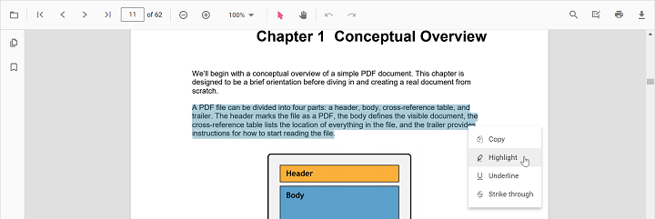

# Highlight annotation in JavaScript PDF Viewer

The PDF Viewer provides options to add, edit, and delete Highlight annotations on text. You can add highlights via the UI (context menu or annotation toolbar) and programmatically. You can also customize color, opacity, author/subject, and default settings, and use undo/redo, save, print, or disable highlights as needed.



## Add Highlight Annotation

### Add highlight annotation via UI

You can add highlights in two ways:

1. Using the context menu
- Select text in the PDF document and right-click it.
- Choose **Highlight** in the context menu.


2. Using the annotation toolbar
- Click the **Edit Annotation** button in the PDF Viewer toolbar to open the annotation toolbar.
- Select **Highlight** to enable highlight mode.
- Select text to add the highlight annotation. Alternatively, select text first and then click **Highlight**.


N> When pan mode is active and a text markup mode is entered, the PDF Viewer switches to text selection mode to enable selection.

### Switch to Highlight Mode

The PDF Viewer component allows add highlight annotations programmatically after enabling Highlight mode in button clicks.

```html
    <!--Element to set text markup annotation mode-->
    <button id="set">Highlight</button>
```


ej.pdfviewer.PdfViewer.Inject(
    ej.pdfviewer.Toolbar,
    ej.pdfviewer.Magnification,
    ej.pdfviewer.Navigation,
    ej.pdfviewer.LinkAnnotation,
    ej.pdfviewer.ThumbnailView,
    ej.pdfviewer.BookmarkView,
    ej.pdfviewer.TextSelection,
    ej.pdfviewer.Annotation,
    ej.pdfviewer.FormDesigner,
    ej.pdfviewer.FormFields
);

var pdfviewer = new ej.pdfviewer.PdfViewer();
pdfviewer.documentPath = 'https://cdn.syncfusion.com/content/pdf/pdf-succinctly.pdf';
pdfviewer.resourceUrl = 'https://cdn.syncfusion.com/ej2/31.1.23/dist/ej2-pdfviewer-lib';
pdfviewer.appendTo('#PdfViewer');

document.getElementById('set').addEventListener('click', function () {
    pdfviewer.annotationModule.setAnnotationMode('Highlight');
});



N> To set up the **server-backed PDF Viewer**, add the below `serviceUrl` in the `index.ts` file: `pdfviewer.serviceUrl = 'https://document.syncfusion.com/web-services/pdf-viewer/api/pdfviewer/';`



To switch back to normal mode from highlight mode:

```html
<!--Element to set text markup annotation mode-->
<button id="set">Highlight</button>
<!--Element to set normal mode-->
<button id="setNone">Normal Mode</button>
```


ej.pdfviewer.PdfViewer.Inject(
    ej.pdfviewer.Toolbar,
    ej.pdfviewer.Magnification,
    ej.pdfviewer.Navigation,
    ej.pdfviewer.LinkAnnotation,
    ej.pdfviewer.ThumbnailView,
    ej.pdfviewer.BookmarkView,
    ej.pdfviewer.TextSelection,
    ej.pdfviewer.Annotation,
    ej.pdfviewer.FormDesigner,
    ej.pdfviewer.FormFields
);

var pdfviewer = new ej.pdfviewer.PdfViewer();
pdfviewer.documentPath = 'https://cdn.syncfusion.com/content/pdf/pdf-succinctly.pdf';
pdfviewer.resourceUrl = 'https://cdn.syncfusion.com/ej2/31.1.23/dist/ej2-pdfviewer-lib';
pdfviewer.appendTo('#PdfViewer');

document.getElementById('set').addEventListener('click', function () {
    pdfviewer.annotationModule.setAnnotationMode('Highlight');
});

document.getElementById('setNone').addEventListener('click', function () {
    pdfviewer.annotationModule.setAnnotationMode('None');
});



N> To set up the **server-backed PDF Viewer**, add the below `serviceUrl` in the `index.ts` file:
`pdfviewer.serviceUrl = 'https://document.syncfusion.com/web-services/pdf-viewer/api/pdfviewer/';`



### Add highlight annotation programmatically

Programmatically add highlights using the [addAnnotation](https://ej2.syncfusion.com/documentation/api/pdfviewer/annotation#addannotation) method.

```html
<button id="highlight">Add TextMarkup annotation programmatically</button>
```



ej.pdfviewer.PdfViewer.Inject(
    ej.pdfviewer.Toolbar,
    ej.pdfviewer.Magnification,
    ej.pdfviewer.Navigation,
    ej.pdfviewer.Annotation,
    ej.pdfviewer.LinkAnnotation,
    ej.pdfviewer.ThumbnailView,
    ej.pdfviewer.BookmarkView,
    ej.pdfviewer.TextSelection,
    ej.pdfviewer.TextSearch,
    ej.pdfviewer.FormFields,
    ej.pdfviewer.FormDesigner,
    ej.pdfviewer.PageOrganizer
);

var pdfviewer = new ej.pdfviewer.PdfViewer();
pdfviewer.documentPath = 'https://cdn.syncfusion.com/content/pdf/pdf-succinctly.pdf';
pdfviewer.resourceUrl = 'https://cdn.syncfusion.com/ej2/31.1.23/dist/ej2-pdfviewer-lib';
pdfviewer.appendTo('#PdfViewer');

document.getElementById('highlight').addEventListener('click', function () {
    pdfviewer.annotation.addAnnotation('Highlight', {
        bounds: [{ x: 97, y: 110, width: 350, height: 14 }],
        pageNumber: 1
    });
});


ej.pdfviewer.PdfViewer.Inject(
    ej.pdfviewer.Toolbar,
    ej.pdfviewer.Magnification,
    ej.pdfviewer.Navigation,
    ej.pdfviewer.Annotation,
    ej.pdfviewer.LinkAnnotation,
    ej.pdfviewer.ThumbnailView,
    ej.pdfviewer.BookmarkView,
    ej.pdfviewer.TextSelection,
    ej.pdfviewer.TextSearch,
    ej.pdfviewer.FormFields,
    ej.pdfviewer.FormDesigner,
    ej.pdfviewer.PageOrganizer
);

var pdfviewer = new ej.pdfviewer.PdfViewer();
pdfviewer.serviceUrl = 'https://document.syncfusion.com/web-services/pdf-viewer/api/pdfviewer/';
pdfviewer.documentPath = 'https://cdn.syncfusion.com/content/pdf/pdf-succinctly.pdf';
pdfviewer.appendTo('#PdfViewer');

document.getElementById('highlight').addEventListener('click', function () {
    pdfviewer.annotation.addAnnotation('Highlight', {
        bounds: [{ x: 97, y: 110, width: 350, height: 14 }],
        pageNumber: 1
    });
});



## Edit Highlight Annotation

### Edit highlight annotation in UI

You can select a highlight to change its appearance or remove it:
- Change appearance using the annotation toolbar: Edit Color and Edit Opacity.
- Delete using Delete/Backspace keys or the Delete Annotation button in the annotation toolbar.

#### Edit color
Use the color palette in the Edit Color tool to change the annotation color.


#### Edit opacity
Use the range slider in the Edit Opacity tool to change annotation opacity.


#### Delete highlight annotation
- Select the annotation and press Delete (or Backspace), or
- Click **Delete Annotation** in the annotation toolbar.


### Edit highlight annotation programmatically

Modify an existing highlight programmatically using `editAnnotation()`.

```html
<button id="editHighlight">Edit Highlight annotation Programmatically</button>
```



ej.pdfviewer.PdfViewer.Inject(
    ej.pdfviewer.Toolbar,
    ej.pdfviewer.Magnification,
    ej.pdfviewer.Navigation,
    ej.pdfviewer.Annotation,
    ej.pdfviewer.LinkAnnotation,
    ej.pdfviewer.ThumbnailView,
    ej.pdfviewer.BookmarkView,
    ej.pdfviewer.TextSelection,
    ej.pdfviewer.TextSearch,
    ej.pdfviewer.FormFields,
    ej.pdfviewer.FormDesigner,
    ej.pdfviewer.PageOrganizer
);

var pdfviewer = new ej.pdfviewer.PdfViewer();
pdfviewer.documentPath = 'https://cdn.syncfusion.com/content/pdf/pdf-succinctly.pdf';
pdfviewer.resourceUrl = 'https://cdn.syncfusion.com/ej2/31.1.23/dist/ej2-pdfviewer-lib';
pdfviewer.appendTo('#PdfViewer');

document.getElementById('editHighlight').addEventListener('click', function () {
    for (var i = 0; i < pdfviewer.annotationCollection.length; i++) {
        var annot = pdfviewer.annotationCollection[i];
        if (annot.textMarkupAnnotationType === 'Highlight') {
            annot.color = '#000fff';
            annot.opacity = 0.8;
            pdfviewer.annotation.editAnnotation(annot);
            break;
        }
    }
});


ej.pdfviewer.PdfViewer.Inject(
    ej.pdfviewer.Toolbar,
    ej.pdfviewer.Magnification,
    ej.pdfviewer.Navigation,
    ej.pdfviewer.Annotation,
    ej.pdfviewer.LinkAnnotation,
    ej.pdfviewer.ThumbnailView,
    ej.pdfviewer.BookmarkView,
    ej.pdfviewer.TextSelection,
    ej.pdfviewer.TextSearch,
    ej.pdfviewer.FormFields,
    ej.pdfviewer.FormDesigner,
    ej.pdfviewer.PageOrganizer
);

var pdfviewer = new ej.pdfviewer.PdfViewer();
pdfviewer.serviceUrl = 'https://document.syncfusion.com/web-services/pdf-viewer/api/pdfviewer/';
pdfviewer.documentPath = 'https://cdn.syncfusion.com/content/pdf/pdf-succinctly.pdf';
pdfviewer.appendTo('#PdfViewer');

document.getElementById('editHighlight').addEventListener('click', function () {
    for (var i = 0; i < pdfviewer.annotationCollection.length; i++) {
        var annot = pdfviewer.annotationCollection[i];
        if (annot.textMarkupAnnotationType === 'Highlight') {
            annot.color = '#000fff';
            annot.opacity = 0.8;
            pdfviewer.annotation.editAnnotation(annot);
            break;
        }
    }
});



## Set default properties during control initialization

Set default properties before creating the control using `highlightSettings`.

> After editing default color and opacity using the Edit Color and Edit Opacity tools, the values update to the selected settings.

Refer to the following code snippet to set the default highlight settings.



ej.pdfviewer.PdfViewer.Inject(
    ej.pdfviewer.Toolbar,
    ej.pdfviewer.Magnification,
    ej.pdfviewer.Navigation,
    ej.pdfviewer.LinkAnnotation,
    ej.pdfviewer.ThumbnailView,
    ej.pdfviewer.BookmarkView,
    ej.pdfviewer.TextSelection,
    ej.pdfviewer.Annotation
);

var pdfviewer = new ej.pdfviewer.PdfViewer();
pdfviewer.documentPath = 'https://cdn.syncfusion.com/content/pdf/pdf-succinctly.pdf';
pdfviewer.resourceUrl = 'https://cdn.syncfusion.com/ej2/31.1.23/dist/ej2-pdfviewer-lib';
pdfviewer.highlightSettings = { author: 'Guest User', subject: 'Important', color: '#ffff00', opacity: 0.9 };
pdfviewer.appendTo('#PdfViewer');



ej.pdfviewer.PdfViewer.Inject(
    ej.pdfviewer.Toolbar,
    ej.pdfviewer.Magnification,
    ej.pdfviewer.Navigation,
    ej.pdfviewer.LinkAnnotation,
    ej.pdfviewer.ThumbnailView,
    ej.pdfviewer.BookmarkView,
    ej.pdfviewer.TextSelection,
    ej.pdfviewer.Annotation
);

var pdfviewer = new ej.pdfviewer.PdfViewer();
pdfviewer.serviceUrl = 'https://document.syncfusion.com/web-services/pdf-viewer/api/pdfviewer/';
pdfviewer.documentPath = 'https://cdn.syncfusion.com/content/pdf/pdf-succinctly.pdf';
pdfviewer.highlightSettings = { author: 'Guest User', subject: 'Important', color: '#ffff00', opacity: 0.9 };
pdfviewer.appendTo('#PdfViewer');




## Set properties while adding Individual Annotation

Set properties for individual annotation before creating the control using `highlightSettings`.

> After editing default color and opacity using the Edit Color and Edit Opacity tools, the values update to the selected settings.

Refer to the following code snippet to set the default highlight settings.

```html
<button id="highlight">Add Highlight</button>
```


ej.pdfviewer.PdfViewer.Inject(
    ej.pdfviewer.Toolbar,
    ej.pdfviewer.Magnification,
    ej.pdfviewer.Navigation,
    ej.pdfviewer.Annotation,
    ej.pdfviewer.LinkAnnotation,
    ej.pdfviewer.ThumbnailView,
    ej.pdfviewer.BookmarkView,
    ej.pdfviewer.TextSelection,
    ej.pdfviewer.TextSearch,
    ej.pdfviewer.FormFields,
    ej.pdfviewer.FormDesigner,
    ej.pdfviewer.PageOrganizer
);

var pdfviewer = new ej.pdfviewer.PdfViewer();
pdfviewer.documentPath = 'https://cdn.syncfusion.com/content/pdf/form-designer.pdf';
pdfviewer.resourceUrl = 'https://cdn.syncfusion.com/ej2/31.1.23/dist/ej2-pdfviewer-lib';
pdfviewer.appendTo('#PdfViewer');
//Apply Highlight Settings while adding individual Annotation
document.getElementById('highlight')?.addEventListener('click', function () {
    pdfviewer.annotation.addAnnotation('Highlight', {
        bounds: [{ x: 97, y: 110, width: 350, height: 14 }],
        pageNumber: 1,
        author: 'User 1',
        color: '#ffff00',
        opacity: 0.9
    });

    pdfviewer.annotation.addAnnotation('Highlight', {
        bounds: [{ x: 107, y: 220, width: 350, height: 14 }],
        pageNumber: 1,
        author: 'User 2',
        color: '#ff1010ff',
        opacity: 0.9
    });
});


ej.pdfviewer.PdfViewer.Inject(
    ej.pdfviewer.Toolbar,
    ej.pdfviewer.Magnification,
    ej.pdfviewer.Navigation,
    ej.pdfviewer.Annotation,
    ej.pdfviewer.LinkAnnotation,
    ej.pdfviewer.ThumbnailView,
    ej.pdfviewer.BookmarkView,
    ej.pdfviewer.TextSelection,
    ej.pdfviewer.TextSearch,
    ej.pdfviewer.FormFields,
    ej.pdfviewer.FormDesigner,
    ej.pdfviewer.PageOrganizer
);

var pdfviewer = new ej.pdfviewer.PdfViewer();
pdfviewer.documentPath = 'https://cdn.syncfusion.com/content/pdf/form-designer.pdf';
pdfviewer.serviceUrl = 'https://document.syncfusion.com/web-services/pdf-viewer/api/pdfviewer/';
pdfviewer.appendTo('#PdfViewer');
//Apply Highlight Settings while adding individual Annotation
document.getElementById('highlight')?.addEventListener('click', function () {
    pdfviewer.annotation.addAnnotation('Highlight', {
        bounds: [{ x: 97, y: 110, width: 350, height: 14 }],
        pageNumber: 1,
        author: 'User 1',
        color: '#ffff00',
        opacity: 0.9
    });

    pdfviewer.annotation.addAnnotation('Highlight', {
        bounds: [{ x: 107, y: 220, width: 350, height: 14 }],
        pageNumber: 1,
        author: 'User 2',
        color: '#ff1010ff',
        opacity: 0.9
    });
});



## Disable highlight annotation

Disable text markup annotations (including highlight) using the `enableTextMarkupAnnotation` property.



ej.pdfviewer.PdfViewer.Inject(
    ej.pdfviewer.Toolbar,
    ej.pdfviewer.Magnification,
    ej.pdfviewer.Navigation,
    ej.pdfviewer.LinkAnnotation,
    ej.pdfviewer.ThumbnailView,
    ej.pdfviewer.BookmarkView,
    ej.pdfviewer.TextSelection,
    ej.pdfviewer.Annotation
);

var pdfviewer = new ej.pdfviewer.PdfViewer();
pdfviewer.documentPath = 'https://cdn.syncfusion.com/content/pdf/pdf-succinctly.pdf';
pdfviewer.resourceUrl = 'https://cdn.syncfusion.com/ej2/31.1.23/dist/ej2-pdfviewer-lib';
pdfviewer.enableTextMarkupAnnotation = false;
pdfviewer.appendTo('#PdfViewer');



ej.pdfviewer.PdfViewer.Inject(
    ej.pdfviewer.Toolbar,
    ej.pdfviewer.Magnification,
    ej.pdfviewer.Navigation,
    ej.pdfviewer.LinkAnnotation,
    ej.pdfviewer.ThumbnailView,
    ej.pdfviewer.BookmarkView,
    ej.pdfviewer.TextSelection,
    ej.pdfviewer.Annotation
);

var pdfviewer = new ej.pdfviewer.PdfViewer();
pdfviewer.serviceUrl = 'https://document.syncfusion.com/web-services/pdf-viewer/api/pdfviewer/';
pdfviewer.documentPath = 'https://cdn.syncfusion.com/content/pdf/pdf-succinctly.pdf';
pdfviewer.enableTextMarkupAnnotation = false;
pdfviewer.appendTo('#PdfViewer');




[View Sample on GitHub](https://github.com/SyncfusionExamples/javascript-pdf-viewer-examples/tree/master)

## See also

- [Annotation Overview](../overview)
- [Annotation Toolbar](../../toolbar-customization/annotation-toolbar)
- [Create and Modify Annotation](../../annotations/create-modify-annotation)
- [Customize Annotation](../../annotations/customize-annotation)
- [Remove Annotation](../../annotations/delete-annotation)
- [Handwritten Signature](../../annotations/signature-annotation)
- [Export and Import Annotation](../../annotations/export-import/export-annotation)
- [Annotation in Mobile View](../../annotations/annotations-in-mobile-view)
- [Annotation Events](../../annotations/annotation-event)
- [Annotation API](../../annotations/annotations-api)