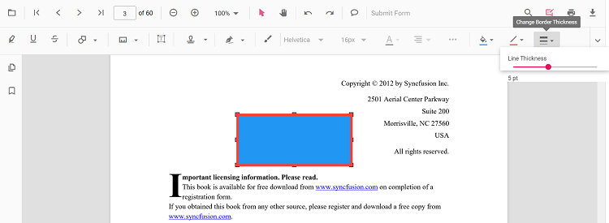

# Line annotation in JavaScript PDF Viewer

Line is a shape annotation used to mark straight connections or callouts. Common use cases include underline-like rulers, connectors, and measurement guides.


## Add Line Annotation

### Add line annotation via UI

Use the annotation toolbar:
- Click the **Edit Annotation** button in the PDF Viewer toolbar.
- Open the **Shape Annotation** dropdown.
- Choose **Line**, then draw on the page.

N> When in pan mode, selecting a shape annotation switches the viewer to text select mode.


### Add a line annotation programmatically

#### Enable line mode

The PDF Viewer component allows to add line annotations programmatically after enabling line mode in button clicks.

```html
<button id="lineMode">Line</button>
```



ej.pdfviewer.PdfViewer.Inject(
    ej.pdfviewer.Toolbar,
    ej.pdfviewer.Magnification,
    ej.pdfviewer.Navigation,
    ej.pdfviewer.Annotation,
    ej.pdfviewer.LinkAnnotation,
    ej.pdfviewer.ThumbnailView,
    ej.pdfviewer.BookmarkView,
    ej.pdfviewer.TextSelection,
    ej.pdfviewer.TextSearch,
    ej.pdfviewer.FormFields,
    ej.pdfviewer.FormDesigner,
    ej.pdfviewer.PageOrganizer
);

var pdfviewer = new ej.pdfviewer.PdfViewer();
pdfviewer.documentPath = "https://cdn.syncfusion.com/content/pdf/pdf-succinctly.pdf";
pdfviewer.resourceUrl = "https://cdn.syncfusion.com/ej2/31.1.23/dist/ej2-pdfviewer-lib";
pdfviewer.appendTo('#PdfViewer');

document.getElementById('lineMode').addEventListener('click', function() {
    pdfviewer.annotationModule.setAnnotationMode('Line');
});


ej.pdfviewer.PdfViewer.Inject(
    ej.pdfviewer.Toolbar,
    ej.pdfviewer.Magnification,
    ej.pdfviewer.Navigation,
    ej.pdfviewer.Annotation,
    ej.pdfviewer.LinkAnnotation,
    ej.pdfviewer.ThumbnailView,
    ej.pdfviewer.BookmarkView,
    ej.pdfviewer.TextSelection,
    ej.pdfviewer.TextSearch,
    ej.pdfviewer.FormFields,
    ej.pdfviewer.FormDesigner,
    ej.pdfviewer.PageOrganizer
);

var pdfviewer = new ej.pdfviewer.PdfViewer();
pdfviewer.serviceUrl = 'https://document.syncfusion.com/web-services/pdf-viewer/api/pdfviewer/';
pdfviewer.documentPath = "https://cdn.syncfusion.com/content/pdf/pdf-succinctly.pdf";
pdfviewer.appendTo('#PdfViewer');

document.getElementById('lineMode').addEventListener('click', function() {
    pdfviewer.annotationModule.setAnnotationMode('Line');
});



#### Exit line mode

```html
<button id="setNone">Normal Mode</button>
```



document.getElementById('setNone').addEventListener('click', function() {
    pdfviewer.annotationModule.setAnnotationMode('None');
});



#### Add Line Annotation

Use the addAnnotation method with Line settings.

```html
<button id="addLineAnnotation">Add Line annotation programmatically</button>
```



ej.pdfviewer.PdfViewer.Inject(
    ej.pdfviewer.Toolbar,
    ej.pdfviewer.Magnification,
    ej.pdfviewer.Navigation,
    ej.pdfviewer.Annotation,
    ej.pdfviewer.LinkAnnotation,
    ej.pdfviewer.ThumbnailView,
    ej.pdfviewer.BookmarkView,
    ej.pdfviewer.TextSelection,
    ej.pdfviewer.TextSearch,
    ej.pdfviewer.FormFields,
    ej.pdfviewer.FormDesigner,
    ej.pdfviewer.PageOrganizer
);

var pdfviewer = new ej.pdfviewer.PdfViewer();
pdfviewer.documentPath = "https://cdn.syncfusion.com/content/pdf/pdf-succinctly.pdf";
pdfviewer.resourceUrl = "https://cdn.syncfusion.com/ej2/31.1.23/dist/ej2-pdfviewer-lib";
pdfviewer.appendTo('#PdfViewer');

document.getElementById('addLineAnnotation').addEventListener('click', function() {
    pdfviewer.annotation.addAnnotation('Line', {
        offset: { x: 200, y: 230 },
        pageNumber: 1,
        vertexPoints: [{ x: 200, y: 230 }, { x: 350, y: 230 }]
    });
});


ej.pdfviewer.PdfViewer.Inject(
    ej.pdfviewer.Toolbar,
    ej.pdfviewer.Magnification,
    ej.pdfviewer.Navigation,
    ej.pdfviewer.Annotation,
    ej.pdfviewer.LinkAnnotation,
    ej.pdfviewer.ThumbnailView,
    ej.pdfviewer.BookmarkView,
    ej.pdfviewer.TextSelection,
    ej.pdfviewer.TextSearch,
    ej.pdfviewer.FormFields,
    ej.pdfviewer.FormDesigner,
    ej.pdfviewer.PageOrganizer
);

var pdfviewer = new ej.pdfviewer.PdfViewer();
pdfviewer.serviceUrl = 'https://document.syncfusion.com/web-services/pdf-viewer/api/pdfviewer/';
pdfviewer.documentPath = "https://cdn.syncfusion.com/content/pdf/pdf-succinctly.pdf";
pdfviewer.appendTo('#PdfViewer');

document.getElementById('addLineAnnotation').addEventListener('click', function() {
    pdfviewer.annotation.addAnnotation('Line', {
        offset: { x: 200, y: 230 },
        pageNumber: 1,
        vertexPoints: [{ x: 200, y: 230 }, { x: 350, y: 230 }]
    });
});



## Edit Line Annotation

### Edit Line Annotation in UI

You can select, move, and resize Line annotations directly in the viewer:
- Select a Line to show its end-point handles.
- Move: drag the line to reposition it on the page.
- Resize/reshape: drag either end-point to adjust the line.
- Delete or access more options from the context menu.

Use the toolbar to change appearance:
- Edit Color, Edit Stroke Color, Edit Thickness, and Edit Opacity tools.


### Editing the properties of the shape annotation

The fill color, stroke color, thickness, and opacity of shape annotations can be edited using the Edit Color, Edit Stroke Color, Edit Thickness, and Edit Opacity tools in the annotation toolbar.

#### Editing fill color

The fill color of the annotation can be edited using the color palette provided in the Edit Color tool.


#### Editing stroke color

The stroke color of the annotation can be edited using the color palette provided in the Edit Stroke Color tool.


#### Editing thickness

The thickness of the border of the annotation can be edited using the range slider provided in the Edit Thickness tool.



#### Editing opacity

The opacity of the annotation can be edited using the range slider provided in the Edit Opacity tool.


#### Editing the line properties

Line annotations have additional options in the Line Properties window. Open it by right-clicking a line or arrow annotation and selecting Properties from the context menu.


### Edit an existing line annotation programmatically

To modify an existing line annotation programmatically, use the editAnnotation() method.

Here is an example of using editAnnotation():

```html
<button id="editLineAnnotation">Edit Line annotation programmatically</button>
```



ej.pdfviewer.PdfViewer.Inject(
    ej.pdfviewer.Toolbar,
    ej.pdfviewer.Magnification,
    ej.pdfviewer.Navigation,
    ej.pdfviewer.Annotation,
    ej.pdfviewer.LinkAnnotation,
    ej.pdfviewer.ThumbnailView,
    ej.pdfviewer.BookmarkView,
    ej.pdfviewer.TextSelection,
    ej.pdfviewer.TextSearch,
    ej.pdfviewer.FormFields,
    ej.pdfviewer.FormDesigner,
    ej.pdfviewer.PageOrganizer
);

var pdfviewer = new ej.pdfviewer.PdfViewer();
pdfviewer.documentPath = "https://cdn.syncfusion.com/content/pdf/pdf-succinctly.pdf";
pdfviewer.resourceUrl = "https://cdn.syncfusion.com/ej2/31.1.23/dist/ej2-pdfviewer-lib";
pdfviewer.appendTo('#PdfViewer');

document.getElementById('editLineAnnotation').addEventListener('click', function() {
    for (var i = 0; i < pdfviewer.annotationCollection.length; i++) {
        if (pdfviewer.annotationCollection[i].subject === 'Line') {
            pdfviewer.annotationCollection[i].strokeColor = '#0000FF';
            pdfviewer.annotationCollection[i].thickness = 2;
            pdfviewer.annotationCollection[i].annotationSelectorSettings.resizerShape = 'Circle';
            pdfviewer.annotation.editAnnotation(pdfviewer.annotationCollection[i]);
        }
    }
});


ej.pdfviewer.PdfViewer.Inject(
    ej.pdfviewer.Toolbar,
    ej.pdfviewer.Magnification,
    ej.pdfviewer.Navigation,
    ej.pdfviewer.Annotation,
    ej.pdfviewer.LinkAnnotation,
    ej.pdfviewer.ThumbnailView,
    ej.pdfviewer.BookmarkView,
    ej.pdfviewer.TextSelection,
    ej.pdfviewer.TextSearch,
    ej.pdfviewer.FormFields,
    ej.pdfviewer.FormDesigner,
    ej.pdfviewer.PageOrganizer
);

var pdfviewer = new ej.pdfviewer.PdfViewer();
pdfviewer.serviceUrl = 'https://document.syncfusion.com/web-services/pdf-viewer/api/pdfviewer/';
pdfviewer.documentPath = "https://cdn.syncfusion.com/content/pdf/pdf-succinctly.pdf";
pdfviewer.appendTo('#PdfViewer');

document.getElementById('editLineAnnotation').addEventListener('click', function() {
    for (var i = 0; i < pdfviewer.annotationCollection.length; i++) {
        if (pdfviewer.annotationCollection[i].subject === 'Line') {
            pdfviewer.annotationCollection[i].strokeColor = '#0000FF';
            pdfviewer.annotationCollection[i].thickness = 2;
            pdfviewer.annotationCollection[i].annotationSelectorSettings.resizerShape = 'Circle';
            pdfviewer.annotation.editAnnotation(pdfviewer.annotationCollection[i]);
        }
    }
});



## Default line settings during initialization

Set default properties before creating the control using lineSettings.



ej.pdfviewer.PdfViewer.Inject(
    ej.pdfviewer.Toolbar,
    ej.pdfviewer.Magnification,
    ej.pdfviewer.Navigation,
    ej.pdfviewer.Annotation,
    ej.pdfviewer.LinkAnnotation,
    ej.pdfviewer.ThumbnailView,
    ej.pdfviewer.BookmarkView,
    ej.pdfviewer.TextSelection,
    ej.pdfviewer.TextSearch,
    ej.pdfviewer.FormFields,
    ej.pdfviewer.FormDesigner,
    ej.pdfviewer.PageOrganizer
);

var pdfviewer = new ej.pdfviewer.PdfViewer();
pdfviewer.documentPath = "https://cdn.syncfusion.com/content/pdf/pdf-succinctly.pdf";
pdfviewer.resourceUrl = "https://cdn.syncfusion.com/ej2/31.1.23/dist/ej2-pdfviewer-lib";
pdfviewer.lineSettings = { fillColor: 'blue', opacity: 0.6, strokeColor: 'green' };
pdfviewer.appendTo('#PdfViewer');


ej.pdfviewer.PdfViewer.Inject(
    ej.pdfviewer.Toolbar,
    ej.pdfviewer.Magnification,
    ej.pdfviewer.Navigation,
    ej.pdfviewer.Annotation,
    ej.pdfviewer.LinkAnnotation,
    ej.pdfviewer.ThumbnailView,
    ej.pdfviewer.BookmarkView,
    ej.pdfviewer.TextSelection,
    ej.pdfviewer.TextSearch,
    ej.pdfviewer.FormFields,
    ej.pdfviewer.FormDesigner,
    ej.pdfviewer.PageOrganizer
);

var pdfviewer = new ej.pdfviewer.PdfViewer();
pdfviewer.serviceUrl = 'https://document.syncfusion.com/web-services/pdf-viewer/api/pdfviewer/';
pdfviewer.documentPath = "https://cdn.syncfusion.com/content/pdf/pdf-succinctly.pdf";
pdfviewer.lineSettings = { fillColor: 'blue', opacity: 0.6, strokeColor: 'green' };
pdfviewer.appendTo('#PdfViewer');



N> In both [Arrow](https://ej2.syncfusion.com/documentation/api/pdfviewer/index-default#arrowsettings) and [Line](https://ej2.syncfusion.com/documentation/api/pdfviewer/index-default#linesettings) annotations Settings, the Fill Color option is available only when an arrowhead style is applied at the Start or End. If both Start and End arrowhead styles are set to None, lines do not support fill rendering and the Fill Color option remains disabled.

[View Sample on GitHub](https://github.com/SyncfusionExamples/javascript-pdf-viewer-examples/tree/master)

## See also

- [Annotation Overview](../overview)
- [Annotation Toolbar](../../toolbar-customization/annotation-toolbar)
- [Create and Modify Annotation](../../annotations/create-modify-annotation)
- [Customize Annotation](../../annotations/customize-annotation)
- [Remove Annotation](../../annotations/delete-annotation)
- [Handwritten Signature](../../annotations/signature-annotation)
- [Export and Import Annotation](../../annotations/export-import/export-annotation)
- [Annotation in Mobile View](../../annotations/annotations-in-mobile-view)
- [Annotation Events](../../annotations/annotation-event)
- [Annotation API](../../annotations/annotations-api)