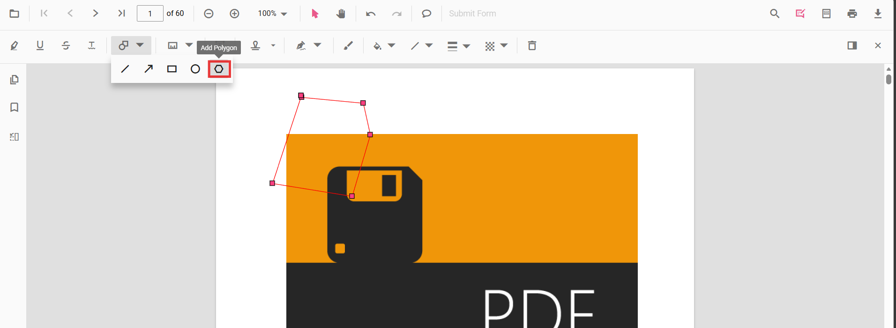
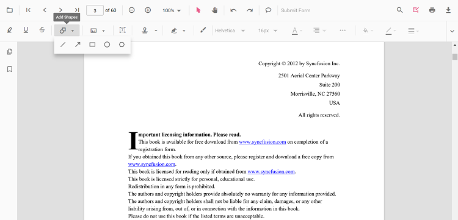
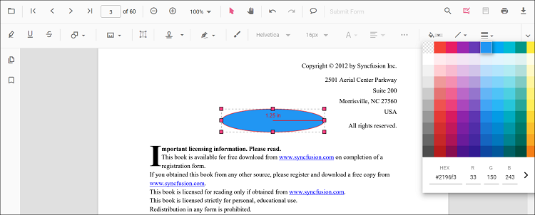
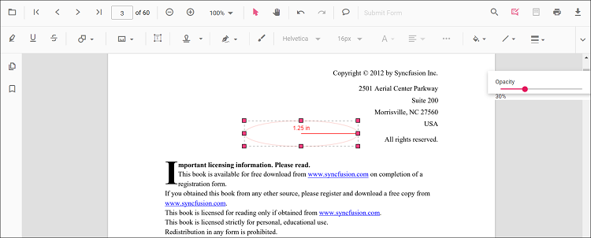

# Polygon annotation in JavaScript PDF Viewer

Polygon is a shape annotation used to outline irregular regions, highlight areas, or create custom callouts.



## Add Polygon Annotation

### Add polygon annotation via UI

Use the annotation toolbar to:
- Click the **Edit Annotation** button in the PDF Viewer toolbar.
- Open the **Shape Annotation** dropdown.
- Choose **Polygon**, then draw on the page.

N> When in pan mode, selecting shape annotations switches the viewer to text select mode.



### Enable polygon mode

The PDF Viewer library allows drawing polygon annotations programmatically after enabling polygon mode via button clicks.

```html
<button id="polygonMode">Polygon</button>
```



ej.pdfviewer.PdfViewer.Inject(
    ej.pdfviewer.Toolbar,
    ej.pdfviewer.Magnification,
    ej.pdfviewer.Navigation,
    ej.pdfviewer.Annotation,
    ej.pdfviewer.LinkAnnotation,
    ej.pdfviewer.ThumbnailView,
    ej.pdfviewer.BookmarkView,
    ej.pdfviewer.TextSelection,
    ej.pdfviewer.TextSearch,
    ej.pdfviewer.FormFields,
    ej.pdfviewer.FormDesigner,
    ej.pdfviewer.PageOrganizer
);

var pdfviewer = new ej.pdfviewer.PdfViewer();
pdfviewer.documentPath = "https://cdn.syncfusion.com/content/pdf/pdf-succinctly.pdf";
pdfviewer.resourceUrl = "https://cdn.syncfusion.com/ej2/31.1.23/dist/ej2-pdfviewer-lib";
pdfviewer.appendTo('#PdfViewer');

document.getElementById('polygonMode') && document.getElementById('polygonMode').addEventListener('click', function () {
    pdfviewer.annotationModule.setAnnotationMode('Polygon');
});


ej.pdfviewer.PdfViewer.Inject(
    ej.pdfviewer.Toolbar,
    ej.pdfviewer.Magnification,
    ej.pdfviewer.Navigation,
    ej.pdfviewer.Annotation,
    ej.pdfviewer.LinkAnnotation,
    ej.pdfviewer.ThumbnailView,
    ej.pdfviewer.BookmarkView,
    ej.pdfviewer.TextSelection,
    ej.pdfviewer.TextSearch,
    ej.pdfviewer.FormFields,
    ej.pdfviewer.FormDesigner,
    ej.pdfviewer.PageOrganizer
);

var pdfviewer = new ej.pdfviewer.PdfViewer();
pdfviewer.serviceUrl = 'https://document.syncfusion.com/web-services/pdf-viewer/api/pdfviewer/';
pdfviewer.documentPath = "https://cdn.syncfusion.com/content/pdf/pdf-succinctly.pdf";
pdfviewer.appendTo('#PdfViewer');

document.getElementById('polygonMode') && document.getElementById('polygonMode').addEventListener('click', function () {
    pdfviewer.annotationModule.setAnnotationMode('Polygon');
});



#### Exit polygon mode

```html
<button id="setNone">Normal Mode</button>
```



document.getElementById('setNone') && document.getElementById('setNone').addEventListener('click', function () {
    pdfviewer.annotationModule.setAnnotationMode('None');
});



### Add a polygon annotation programmatically

The PDF Viewer library allows adding polygon annotations programmatically using the [addAnnotation()](https://ej2.syncfusion.com/documentation/api/pdfviewer/annotation#annotation) method.

```html
<button id="addPolygonAnnotation">Add Polygon annotation programmatically</button>
```



ej.pdfviewer.PdfViewer.Inject(
    ej.pdfviewer.Toolbar,
    ej.pdfviewer.Magnification,
    ej.pdfviewer.Navigation,
    ej.pdfviewer.Annotation,
    ej.pdfviewer.LinkAnnotation,
    ej.pdfviewer.ThumbnailView,
    ej.pdfviewer.BookmarkView,
    ej.pdfviewer.TextSelection,
    ej.pdfviewer.TextSearch,
    ej.pdfviewer.FormFields,
    ej.pdfviewer.FormDesigner,
    ej.pdfviewer.PageOrganizer
);

var pdfviewer = new ej.pdfviewer.PdfViewer();
pdfviewer.documentPath = "https://cdn.syncfusion.com/content/pdf/pdf-succinctly.pdf";
pdfviewer.resourceUrl = "https://cdn.syncfusion.com/ej2/31.1.23/dist/ej2-pdfviewer-lib";
pdfviewer.appendTo('#PdfViewer');

document.getElementById('addPolygonAnnotation') && document.getElementById('addPolygonAnnotation').addEventListener('click', function () {
    pdfviewer.annotation.addAnnotation('Polygon', {
        offset: { x: 200, y: 800 },
        pageNumber: 1,
        vertexPoints: [
            { x: 200, y: 800 }, { x: 242, y: 771 }, { x: 289, y: 799 }, { x: 278, y: 842 }, { x: 211, y: 842 }, { x: 200, y: 800 }
        ]
    });
});


ej.pdfviewer.PdfViewer.Inject(
    ej.pdfviewer.Toolbar,
    ej.pdfviewer.Magnification,
    ej.pdfviewer.Navigation,
    ej.pdfviewer.Annotation,
    ej.pdfviewer.LinkAnnotation,
    ej.pdfviewer.ThumbnailView,
    ej.pdfviewer.BookmarkView,
    ej.pdfviewer.TextSelection,
    ej.pdfviewer.TextSearch,
    ej.pdfviewer.FormFields,
    ej.pdfviewer.FormDesigner,
    ej.pdfviewer.PageOrganizer
);

var pdfviewer = new ej.pdfviewer.PdfViewer();
pdfviewer.serviceUrl = 'https://document.syncfusion.com/web-services/pdf-viewer/api/pdfviewer/';
pdfviewer.documentPath = "https://cdn.syncfusion.com/content/pdf/pdf-succinctly.pdf";
pdfviewer.appendTo('#PdfViewer');

document.getElementById('addPolygonAnnotation') && document.getElementById('addPolygonAnnotation').addEventListener('click', function () {
    pdfviewer.annotation.addAnnotation('Polygon', {
        offset: { x: 200, y: 800 },
        pageNumber: 1,
        vertexPoints: [
            { x: 200, y: 800 }, { x: 242, y: 771 }, { x: 289, y: 799 }, { x: 278, y: 842 }, { x: 211, y: 842 }, { x: 200, y: 800 }
        ]
    });
});



## Edit Polygon Annotation

### Edit Polygon Annotation in UI

Use the viewer to select, move, and resize Polygon annotations:
- Select a Polygon to show its vertex handles.
- Move: drag inside the shape to reposition it on the page.
- Resize/reshape: drag any vertex handle to adjust the polygon points and size.
- Delete or access more options from the context menu.

Use the toolbar to change appearance:
- Use the Edit Color, Edit Stroke Color, Edit Thickness, and Edit Opacity tools.

See the sections below for details.

#### Edit the properties of polygon annotations

The fill color, stroke color, thickness, and opacity can be edited using the Edit Color, Edit Stroke Color, Edit Thickness, and Edit Opacity tools in the annotation toolbar.

#### Edit fill color

The fill color of the annotation can be edited using the color palette provided in the Edit Color tool.



#### Edit stroke color

The stroke color of the annotation can be edited using the color palette provided in the Edit Stroke Color tool.


#### Edit thickness

Edit border thickness using the range slider provided in the Edit Thickness tool.


#### Edit opacity

The opacity of the annotation can be edited using the range slider provided in the Edit Opacity tool.



### Edit an existing polygon annotation programmatically

Use editAnnotation on items from annotationCollection.

```html
<button id="editPolygonAnnotation">Edit Polygon annotation programmatically</button>
```



ej.pdfviewer.PdfViewer.Inject(
    ej.pdfviewer.Toolbar,
    ej.pdfviewer.Magnification,
    ej.pdfviewer.Navigation,
    ej.pdfviewer.Annotation,
    ej.pdfviewer.LinkAnnotation,
    ej.pdfviewer.ThumbnailView,
    ej.pdfviewer.BookmarkView,
    ej.pdfviewer.TextSelection,
    ej.pdfviewer.TextSearch,
    ej.pdfviewer.FormFields,
    ej.pdfviewer.FormDesigner,
    ej.pdfviewer.PageOrganizer
);

var pdfviewer = new ej.pdfviewer.PdfViewer();
pdfviewer.documentPath = "https://cdn.syncfusion.com/content/pdf/pdf-succinctly.pdf";
pdfviewer.resourceUrl = "https://cdn.syncfusion.com/ej2/31.1.23/dist/ej2-pdfviewer-lib";
pdfviewer.appendTo('#PdfViewer');

document.getElementById('editPolygonAnnotation') && document.getElementById('editPolygonAnnotation').addEventListener('click', function () {
    for (var i = 0; i < pdfviewer.annotationCollection.length; i++) {
        if (pdfviewer.annotationCollection[i].subject === 'Polygon') {
            pdfviewer.annotationCollection[i].strokeColor = '#0000FF';
            pdfviewer.annotationCollection[i].thickness = 2;
            pdfviewer.annotationCollection[i].fillColor = '#FFFF00';
            pdfviewer.annotationCollection[i].annotationSelectorSettings.resizerShape = 'Circle';
            pdfviewer.annotation.editAnnotation(pdfviewer.annotationCollection[i]);
        }
    }
});


ej.pdfviewer.PdfViewer.Inject(
    ej.pdfviewer.Toolbar,
    ej.pdfviewer.Magnification,
    ej.pdfviewer.Navigation,
    ej.pdfviewer.Annotation,
    ej.pdfviewer.LinkAnnotation,
    ej.pdfviewer.ThumbnailView,
    ej.pdfviewer.BookmarkView,
    ej.pdfviewer.TextSelection,
    ej.pdfviewer.TextSearch,
    ej.pdfviewer.FormFields,
    ej.pdfviewer.FormDesigner,
    ej.pdfviewer.PageOrganizer
);

var pdfviewer = new ej.pdfviewer.PdfViewer();
pdfviewer.serviceUrl = 'https://document.syncfusion.com/web-services/pdf-viewer/api/pdfviewer/';
pdfviewer.documentPath = "https://cdn.syncfusion.com/content/pdf/pdf-succinctly.pdf";
pdfviewer.appendTo('#PdfViewer');

document.getElementById('editPolygonAnnotation') && document.getElementById('editPolygonAnnotation').addEventListener('click', function () {
    for (var i = 0; i < pdfviewer.annotationCollection.length; i++) {
        if (pdfviewer.annotationCollection[i].subject === 'Polygon') {
            pdfviewer.annotationCollection[i].strokeColor = '#0000FF';
            pdfviewer.annotationCollection[i].thickness = 2;
            pdfviewer.annotationCollection[i].fillColor = '#FFFF00';
            pdfviewer.annotationCollection[i].annotationSelectorSettings.resizerShape = 'Circle';
            pdfviewer.annotation.editAnnotation(pdfviewer.annotationCollection[i]);
        }
    }
});



## Default polygon settings during initialization

Set default properties before creating the control using polygonSettings.



ej.pdfviewer.PdfViewer.Inject(
    ej.pdfviewer.Toolbar,
    ej.pdfviewer.Magnification,
    ej.pdfviewer.Navigation,
    ej.pdfviewer.Annotation,
    ej.pdfviewer.LinkAnnotation,
    ej.pdfviewer.ThumbnailView,
    ej.pdfviewer.BookmarkView,
    ej.pdfviewer.TextSelection,
    ej.pdfviewer.TextSearch,
    ej.pdfviewer.FormFields,
    ej.pdfviewer.FormDesigner,
    ej.pdfviewer.PageOrganizer
);

var pdfviewer = new ej.pdfviewer.PdfViewer();
pdfviewer.documentPath = "https://cdn.syncfusion.com/content/pdf/pdf-succinctly.pdf";
pdfviewer.resourceUrl = "https://cdn.syncfusion.com/ej2/31.1.23/dist/ej2-pdfviewer-lib";
pdfviewer.polygonSettings = { fillColor: 'pink', opacity: 0.6, strokeColor: 'yellow' };
pdfviewer.appendTo('#PdfViewer');


ej.pdfviewer.PdfViewer.Inject(
    ej.pdfviewer.Toolbar,
    ej.pdfviewer.Magnification,
    ej.pdfviewer.Navigation,
    ej.pdfviewer.Annotation,
    ej.pdfviewer.LinkAnnotation,
    ej.pdfviewer.ThumbnailView,
    ej.pdfviewer.BookmarkView,
    ej.pdfviewer.TextSelection,
    ej.pdfviewer.TextSearch,
    ej.pdfviewer.FormFields,
    ej.pdfviewer.FormDesigner,
    ej.pdfviewer.PageOrganizer
);

var pdfviewer = new ej.pdfviewer.PdfViewer();
pdfviewer.serviceUrl = 'https://document.syncfusion.com/web-services/pdf-viewer/api/pdfviewer/';
pdfviewer.documentPath = "https://cdn.syncfusion.com/content/pdf/pdf-succinctly.pdf";
pdfviewer.polygonSettings = { fillColor: 'pink', opacity: 0.6, strokeColor: 'yellow' };
pdfviewer.appendTo('#PdfViewer');



## Set properties while adding Individual Annotation

Set properties for individual annotations before creating the control using `PolygonSettings`.

N> After editing default color and opacity using the Edit Color and Edit Opacity tools, the values update to the selected settings.

Refer to the following code snippet to set the default Polygon settings.

```html
<button id="Polygon">Add Polygon</button>
```


ej.pdfviewer.PdfViewer.Inject(
    ej.pdfviewer.Toolbar,
    ej.pdfviewer.Magnification,
    ej.pdfviewer.Navigation,
    ej.pdfviewer.Annotation,
    ej.pdfviewer.LinkAnnotation,
    ej.pdfviewer.ThumbnailView,
    ej.pdfviewer.BookmarkView,
    ej.pdfviewer.TextSelection,
    ej.pdfviewer.TextSearch,
    ej.pdfviewer.FormFields,
    ej.pdfviewer.FormDesigner,
    ej.pdfviewer.PageOrganizer
);

var pdfviewer = new ej.pdfviewer.PdfViewer();
pdfviewer.documentPath = 'https://cdn.syncfusion.com/content/pdf/form-designer.pdf';
pdfviewer.resourceUrl = 'https://cdn.syncfusion.com/ej2/31.1.23/dist/ej2-pdfviewer-lib';
pdfviewer.appendTo('#PdfViewer');

//Apply Polygon Settings while adding individual Annotation
document.getElementById('Polygon')?.addEventListener('click', function () {
    pdfviewer.annotation.addAnnotation('Polygon', {
        offset: { x: 200, y: 800 },
        pageNumber: 1,
        vertexPoints: [
            { x: 200, y: 800 }, { x: 242, y: 771 }, { x: 289, y: 799 }, { x: 278, y: 842 }, { x: 211, y: 842 }, { x: 200, y: 800 }
        ],
        fillColor:'#ff000',
        opacity: 0.9,
        strokeColor:'##ff000'
    });
});


ej.pdfviewer.PdfViewer.Inject(
    ej.pdfviewer.Toolbar,
    ej.pdfviewer.Magnification,
    ej.pdfviewer.Navigation,
    ej.pdfviewer.Annotation,
    ej.pdfviewer.LinkAnnotation,
    ej.pdfviewer.ThumbnailView,
    ej.pdfviewer.BookmarkView,
    ej.pdfviewer.TextSelection,
    ej.pdfviewer.TextSearch,
    ej.pdfviewer.FormFields,
    ej.pdfviewer.FormDesigner,
    ej.pdfviewer.PageOrganizer
);

var pdfviewer = new ej.pdfviewer.PdfViewer();
pdfviewer.documentPath = 'https://cdn.syncfusion.com/content/pdf/form-designer.pdf';
pdfviewer.serviceUrl = 'https://document.syncfusion.com/web-services/pdf-viewer/api/pdfviewer/';
pdfviewer.appendTo('#PdfViewer');

//Apply Polygon Settings while adding individual Annotation
document.getElementById('Polygon')?.addEventListener('click', function () {
    pdfviewer.annotation.addAnnotation('Polygon', {
        offset: { x: 200, y: 800 },
        pageNumber: 1,
        vertexPoints: [
            { x: 200, y: 800 }, { x: 242, y: 771 }, { x: 289, y: 799 }, { x: 278, y: 842 }, { x: 211, y: 842 }, { x: 200, y: 800 }
        ],
        fillColor:'#ff000',
        opacity: 0.9,
        strokeColor:'##ff000'
    });
});



[View Sample on GitHub](https://github.com/SyncfusionExamples/javascript-pdf-viewer-examples/tree/master)

## See also

- [Annotation Overview](../overview)
- [Annotation Toolbar](../../toolbar-customization/annotation-toolbar)
- [Create and Modify Annotation](../../annotations/create-modify-annotation)
- [Customize Annotation](../../annotations/customize-annotation)
- [Remove Annotation](../../annotations/delete-annotation)
- [Handwritten Signature](../../annotations/signature-annotation)
- [Export and Import Annotation](../../annotations/export-import/export-annotation)
- [Annotation in Mobile View](../../annotations/annotations-in-mobile-view)
- [Annotation Events](../../annotations/annotation-event)
- [Annotation API](../../annotations/annotations-api)