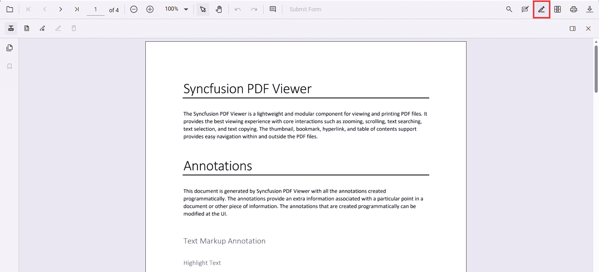
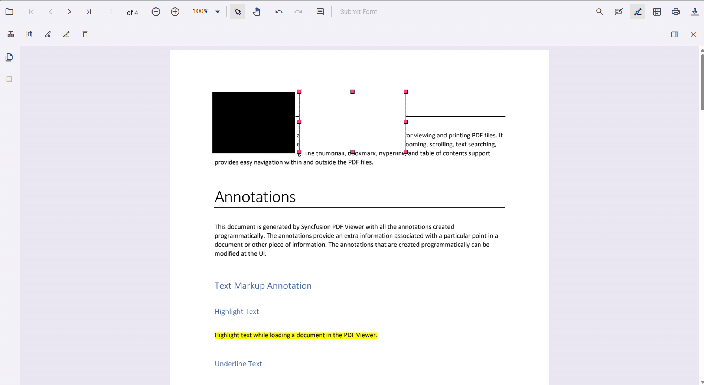
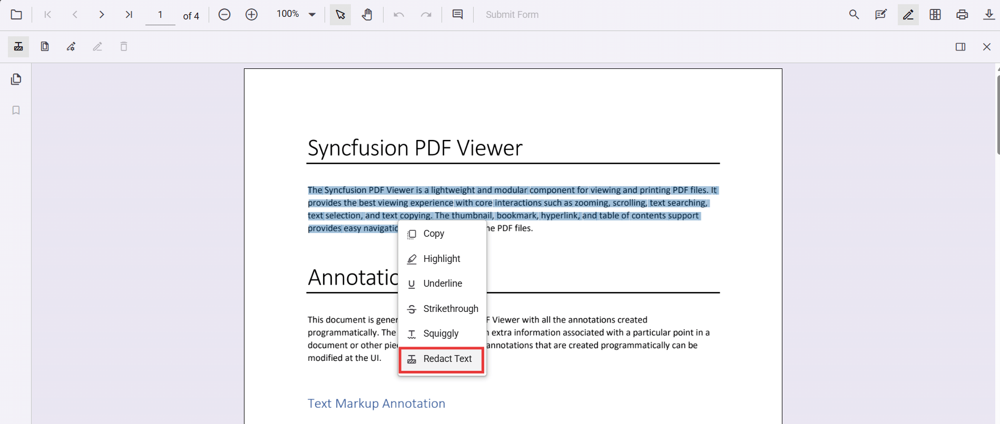
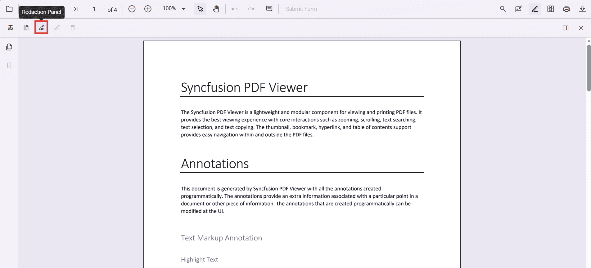
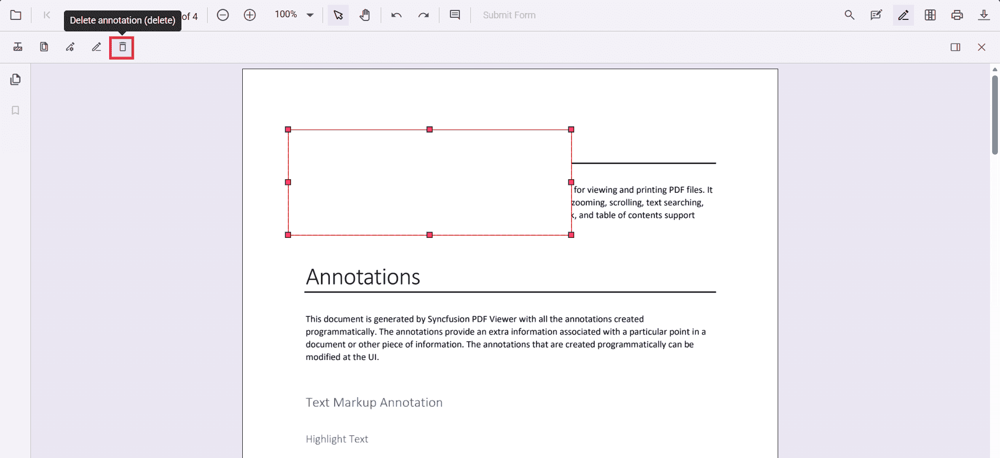
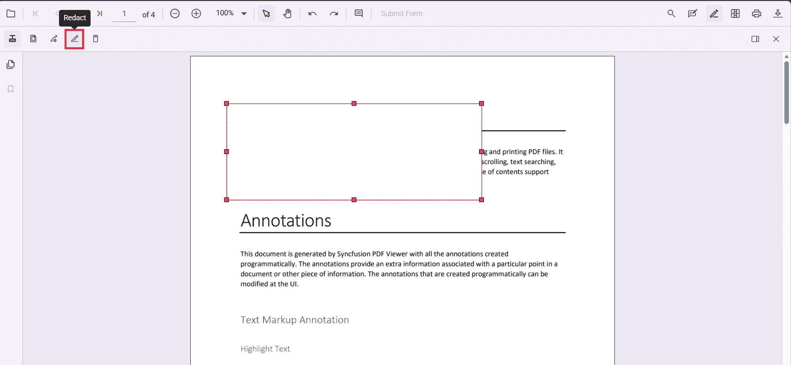

# Redaction annotation in JavaScript PDF Viewer

Redaction annotations permanently remove sensitive content from a PDF. You can draw redaction marks over text or graphics, redact entire pages, customize overlay text and styling, and apply redaction to finalize.



## Add Redaction Annotation

### Add redaction annotations in UI

- Use the Redaction tool from the toolbar to draw over content to hide it.
- Redaction marks can show overlay text (for example, "Confidential") and can be styled.


Redaction annotations are interactive:
- Movable

- Resizable


You can also add redaction annotations from the context menu by selecting content and choosing Redact Annotation.



N> Ensure the Redaction tool is included in the toolbar. See [RedactionToolbar](../../Redaction/toolbar) for configuration.

### Add redaction annotations programmatically

Use the `addAnnotation` method with the Redaction type to add redaction annotations programmatically.

```html
<button id="addRedactAnnot">Add Redaction Annotation</button>
```
```js
ej.pdfviewer.PdfViewer.Inject(
    ej.pdfviewer.Toolbar,
    ej.pdfviewer.Magnification,
    ej.pdfviewer.Navigation,
    ej.pdfviewer.Annotation,
    ej.pdfviewer.LinkAnnotation,
    ej.pdfviewer.ThumbnailView,
    ej.pdfviewer.BookmarkView,
    ej.pdfviewer.TextSelection,
    ej.pdfviewer.TextSearch,
    ej.pdfviewer.FormFields,
    ej.pdfviewer.FormDesigner,
    ej.pdfviewer.PageOrganizer
);

var pdfviewer = new ej.pdfviewer.PdfViewer();
pdfviewer.documentPath = 'https://cdn.syncfusion.com/content/pdf/pdf-succinctly.pdf';
pdfviewer.resourceUrl = 'https://cdn.syncfusion.com/ej2/34.1.33/dist/ej2-pdfviewer-lib';
pdfviewer.appendTo('#PdfViewer');

var addRedactAnnot = document.getElementById('addRedactAnnot');
if (addRedactAnnot) {
    addRedactAnnot.addEventListener('click', function () {
        pdfviewer.annotation.addAnnotation('Redaction', {
            bound: { x: 200, y: 480, width: 150, height: 75 },
            pageNumber: 1,
            markerFillColor: '#0000FF',
            markerBorderColor: 'white',
            fillColor: 'red',
            overlayText: 'Confidential',
            fontColor: 'yellow',
            fontFamily: 'Times New Roman',
            fontSize: 8,
            beforeRedactionsApplied: false
        });
    });
}
```

Track additions using the annotationAdd event.

```js
pdfviewer.annotationAdd = function (args) {
    console.log('Annotation added:', args);
};
```

## Edit Redaction Annotations

### Edit redaction annotations in UI

Use the viewer to select, move, and resize Redaction annotations. Use the context menu for additional actions.

#### Edit the properties of redaction annotations in UI

Use the property panel or context menu Properties to change overlay text, font, fill color, and more.




### Edit redaction annotations programmatically

Use editAnnotation to modify overlay text, colors, fonts, etc.

```html
<button id="editRedactAnnotation">Edit Redact Annotation</button>
```
```js
ej.pdfviewer.PdfViewer.Inject(
    ej.pdfviewer.Toolbar,
    ej.pdfviewer.Magnification,
    ej.pdfviewer.Navigation,
    ej.pdfviewer.Annotation,
    ej.pdfviewer.LinkAnnotation,
    ej.pdfviewer.ThumbnailView,
    ej.pdfviewer.BookmarkView,
    ej.pdfviewer.TextSelection,
    ej.pdfviewer.TextSearch,
    ej.pdfviewer.FormFields,
    ej.pdfviewer.FormDesigner,
    ej.pdfviewer.PageOrganizer
);

var pdfviewer = new ej.pdfviewer.PdfViewer();
pdfviewer.documentPath = 'https://cdn.syncfusion.com/content/pdf/pdf-succinctly.pdf';
pdfviewer.resourceUrl = 'https://cdn.syncfusion.com/ej2/34.1.33/dist/ej2-pdfviewer-lib';
pdfviewer.appendTo('#PdfViewer');

var editRedactAnnotation = document.getElementById('editRedactAnnotation');
if (editRedactAnnotation) {
    editRedactAnnotation.addEventListener('click', function () {
        for (var i = 0; i < pdfviewer.annotationCollection.length; i++) {
            if (pdfviewer.annotationCollection[i].subject === 'Redaction') {
                pdfviewer.annotationCollection[i].overlayText = 'EditedAnnotation';
                pdfviewer.annotationCollection[i].markerFillColor = '#22FF00';
                pdfviewer.annotationCollection[i].markerBorderColor = '#000000';
                pdfviewer.annotationCollection[i].isRepeat = true;
                pdfviewer.annotationCollection[i].fillColor = '#F8F8F8';
                pdfviewer.annotationCollection[i].fontColor = '#333333';
                pdfviewer.annotationCollection[i].fontSize = 14;
                pdfviewer.annotationCollection[i].fontFamily = 'Symbol';
                pdfviewer.annotationCollection[i].textAlign = 'Right';
                pdfviewer.annotationCollection[i].beforeRedactionsApplied = false;
                pdfviewer.annotation.editAnnotation(pdfviewer.annotationCollection[i]);
            }
        }
    });
}
```

## Delete redaction annotations

### Delete in UI

- Right-click and select Delete

- Use the Delete button in the toolbar

- Press Delete key

### Delete programmatically

Delete by id using deleteAnnotationById:

```html
<button id="deleteAnnotationbyId">Delete Annotation By Id</button>
```
```js
ej.pdfviewer.PdfViewer.Inject(
    ej.pdfviewer.Toolbar,
    ej.pdfviewer.Magnification,
    ej.pdfviewer.Navigation,
    ej.pdfviewer.Annotation,
    ej.pdfviewer.LinkAnnotation,
    ej.pdfviewer.ThumbnailView,
    ej.pdfviewer.BookmarkView,
    ej.pdfviewer.TextSelection,
    ej.pdfviewer.TextSearch,
    ej.pdfviewer.FormFields,
    ej.pdfviewer.FormDesigner,
    ej.pdfviewer.PageOrganizer
);

var pdfviewer = new ej.pdfviewer.PdfViewer();
pdfviewer.documentPath = 'https://cdn.syncfusion.com/content/pdf/pdf-succinctly.pdf';
pdfviewer.resourceUrl = 'https://cdn.syncfusion.com/ej2/34.1.33/dist/ej2-pdfviewer-lib';
pdfviewer.appendTo('#PdfViewer');

var deleteAnnotationbyId = document.getElementById('deleteAnnotationbyId');
if (deleteAnnotationbyId) {
    deleteAnnotationbyId.addEventListener('click', function () {
        pdfviewer.annotationModule.deleteAnnotationById(pdfviewer.annotationCollection[0].annotationId);
    });
}
```

## Redact pages

### Redact pages in UI

Use the Redact Pages dialog to mark entire pages:


Options include Current Page, Odd Pages Only, Even Pages Only, and Specific Pages.

### Add page redactions programmatically

```html
<button id="addPageRedactions">Add Page Redaction</button>
```
```js
ej.pdfviewer.PdfViewer.Inject(
    ej.pdfviewer.Toolbar,
    ej.pdfviewer.Magnification,
    ej.pdfviewer.Navigation,
    ej.pdfviewer.Annotation,
    ej.pdfviewer.LinkAnnotation,
    ej.pdfviewer.ThumbnailView,
    ej.pdfviewer.BookmarkView,
    ej.pdfviewer.TextSelection,
    ej.pdfviewer.TextSearch,
    ej.pdfviewer.FormFields,
    ej.pdfviewer.FormDesigner,
    ej.pdfviewer.PageOrganizer
);

var pdfviewer = new ej.pdfviewer.PdfViewer();
pdfviewer.documentPath = 'https://cdn.syncfusion.com/content/pdf/pdf-succinctly.pdf';
pdfviewer.resourceUrl = 'https://cdn.syncfusion.com/ej2/34.1.33/dist/ej2-pdfviewer-lib';
pdfviewer.appendTo('#PdfViewer');

var addPageRedactions = document.getElementById('addPageRedactions');
if (addPageRedactions) {
    addPageRedactions.addEventListener('click', function () {
        pdfviewer.annotation.addPageRedactions([1, 3, 5, 7]);
    });
}
```

## Apply redaction

### Apply redaction in UI

Click Apply Redaction to permanently remove marked content.




N> Redaction is permanent and cannot be undone.

### Apply redaction programmatically

```html
<button id="redact">Apply Redaction</button>
```
```js
ej.pdfviewer.PdfViewer.Inject(
    ej.pdfviewer.Toolbar,
    ej.pdfviewer.Magnification,
    ej.pdfviewer.Navigation,
    ej.pdfviewer.Annotation,
    ej.pdfviewer.LinkAnnotation,
    ej.pdfviewer.ThumbnailView,
    ej.pdfviewer.BookmarkView,
    ej.pdfviewer.TextSelection,
    ej.pdfviewer.TextSearch,
    ej.pdfviewer.FormFields,
    ej.pdfviewer.FormDesigner,
    ej.pdfviewer.PageOrganizer
);

var pdfviewer = new ej.pdfviewer.PdfViewer();
pdfviewer.documentPath = 'https://cdn.syncfusion.com/content/pdf/pdf-succinctly.pdf';
pdfviewer.resourceUrl = 'https://cdn.syncfusion.com/ej2/34.1.33/dist/ej2-pdfviewer-lib';
pdfviewer.appendTo('#PdfViewer');

var redact = document.getElementById('redact');
if (redact) {
    redact.addEventListener('click', function () {
        pdfviewer.annotation.redact();
    });
}
```

N> Applying redaction is irreversible.

## Default redaction settings during initialization

Configure defaults with redactionSettings:

```js
ej.pdfviewer.PdfViewer.Inject(
    ej.pdfviewer.Toolbar,
    ej.pdfviewer.Magnification,
    ej.pdfviewer.Navigation,
    ej.pdfviewer.Annotation,
    ej.pdfviewer.LinkAnnotation,
    ej.pdfviewer.ThumbnailView,
    ej.pdfviewer.BookmarkView,
    ej.pdfviewer.TextSelection,
    ej.pdfviewer.TextSearch,
    ej.pdfviewer.FormFields,
    ej.pdfviewer.FormDesigner,
    ej.pdfviewer.PageOrganizer
);

var pdfviewer = new ej.pdfviewer.PdfViewer();
pdfviewer.documentPath = 'https://cdn.syncfusion.com/content/pdf/pdf-succinctly.pdf';
pdfviewer.resourceUrl = 'https://cdn.syncfusion.com/ej2/34.1.33/dist/ej2-pdfviewer-lib';
pdfviewer.appendTo('#PdfViewer');

pdfviewer.redactionSettings = {
  overlayText: 'Confidential',
  markerFillColor: '#FF0000',
  markerBorderColor: '#000000',
  isRepeat: false,
  fillColor: '#F8F8F8',
  fontColor: '#333333',
  fontSize: 14,
  fontFamily: 'Symbol',
  textAlign: 'Right'
};
```

[View Sample on GitHub](https://github.com/SyncfusionExamples/javascript-pdf-viewer-examples/tree/master)

## See also

- [Annotation Overview](../overview)
- [Redaction Overview](../../Redaction/overview)
- [Annotation Toolbar](../../toolbar-customization/annotation-toolbar)
- [Create and Modify Annotation](../../annotations/create-modify-annotation)
- [Customize Annotation](../../annotations/customize-annotation)
- [Remove Annotation](../../annotations/delete-annotation)
- [Handwritten Signature](../../annotations/signature-annotation)
- [Export and Import Annotation](../../annotations/export-import/export-annotation)
- [Annotation in Mobile View](../../annotations/annotations-in-mobile-view)
- [Annotation Events](../../annotations/annotation-event)
- [Annotation API](../../annotations/annotations-api)
