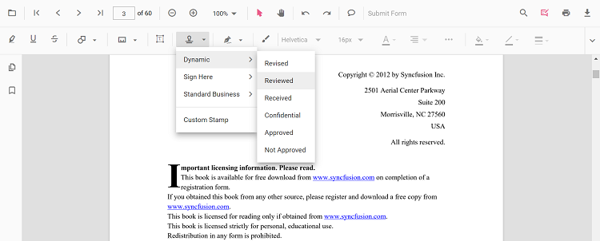

# Stamp annotation in JavaScript PDF Viewer

The PDF Viewer control provides options to add, edit, delete, and rotate the following stamp annotations in PDF documents:

* Dynamic
* Sign Here
* Standard Business
* Custom Stamp


## Add Stamp Annotation

### Add Stamp Annotation in UI

Use the annotation toolbar:
- Click the Edit Annotation button.
- Open the Stamp Annotation dropdown.

- Choose a stamp type and place it on the page.


N> When in pan mode and a stamp tool is selected, the viewer switches to text select mode automatically.

### Switch to specific stamp modes

```html
<button id="dynamicStamp">Dynamic Stamp</button>
<button id="signStamp">Sign Stamp</button>
<button id="standardBusinessStamp">Standard Business Stamp</button>
<button id="customStamp">Custom Stamp</button>
```



ej.pdfviewer.PdfViewer.Inject(ej.pdfviewer.Toolbar, ej.pdfviewer.Magnification, ej.pdfviewer.Navigation, ej.pdfviewer.Annotation, ej.pdfviewer.LinkAnnotation, ej.pdfviewer.ThumbnailView, ej.pdfviewer.BookmarkView, ej.pdfviewer.TextSelection, ej.pdfviewer.TextSearch, ej.pdfviewer.FormFields, ej.pdfviewer.FormDesigner, ej.pdfviewer.PageOrganizer);

var pdfviewer = new ej.pdfviewer.PdfViewer();
pdfviewer.documentPath = 'https://cdn.syncfusion.com/content/pdf/pdf-succinctly.pdf';
pdfviewer.resourceUrl = 'https://cdn.syncfusion.com/ej2/31.1.23/dist/ej2-pdfviewer-lib';
pdfviewer.appendTo('#PdfViewer');

document.getElementById('dynamicStamp') && document.getElementById('dynamicStamp').addEventListener('click', function () {
  pdfviewer.annotationModule.setAnnotationMode('Stamp', ej.pdfviewer.DynamicStampItem.NotApproved);
});

document.getElementById('signStamp') && document.getElementById('signStamp').addEventListener('click', function () {
  pdfviewer.annotationModule.setAnnotationMode('Stamp', undefined, ej.pdfviewer.SignStampItem.Witness);
});

document.getElementById('standardBusinessStamp') && document.getElementById('standardBusinessStamp').addEventListener('click', function () {
  pdfviewer.annotationModule.setAnnotationMode('Stamp', undefined, undefined, ej.pdfviewer.StandardBusinessStampItem.Approved);
});

document.getElementById('customStamp') && document.getElementById('customStamp').addEventListener('click', function () {
  pdfviewer.annotation.addAnnotation('Stamp', {
    offset: { x: 100, y: 440 },
    width: 46,
    height: 100,
    pageNumber: 1,
    isLock: true,
    author: 'Guest',
    customStamps: [{
      customStampName: 'Image',
      customStampImageSource: 'data:image/jpeg;base64,/9j/4AAQSkZJRgABAQAAAQABAAD...'
    }]
  });
});


ej.pdfviewer.PdfViewer.Inject(ej.pdfviewer.Toolbar, ej.pdfviewer.Magnification, ej.pdfviewer.Navigation, ej.pdfviewer.Annotation, ej.pdfviewer.LinkAnnotation, ej.pdfviewer.ThumbnailView, ej.pdfviewer.BookmarkView, ej.pdfviewer.TextSelection, ej.pdfviewer.TextSearch, ej.pdfviewer.FormFields, ej.pdfviewer.FormDesigner, ej.pdfviewer.PageOrganizer);

var pdfviewer = new ej.pdfviewer.PdfViewer();
pdfviewer.serviceUrl = 'https://document.syncfusion.com/web-services/pdf-viewer/api/pdfviewer/';
pdfviewer.documentPath = 'https://cdn.syncfusion.com/content/pdf/pdf-succinctly.pdf';
pdfviewer.appendTo('#PdfViewer');

document.getElementById('dynamicStamp') && document.getElementById('dynamicStamp').addEventListener('click', function () {
  pdfviewer.annotationModule.setAnnotationMode('Stamp', ej.pdfviewer.DynamicStampItem.NotApproved);
});

document.getElementById('signStamp') && document.getElementById('signStamp').addEventListener('click', function () {
  pdfviewer.annotationModule.setAnnotationMode('Stamp', undefined, ej.pdfviewer.SignStampItem.Witness);
});

document.getElementById('standardBusinessStamp') && document.getElementById('standardBusinessStamp').addEventListener('click', function () {
  pdfviewer.annotationModule.setAnnotationMode('Stamp', undefined, undefined, ej.pdfviewer.StandardBusinessStampItem.Approved);
});



### Add Stamp Annotation programmatically

Create stamps via addAnnotation.

```html
<button id="addDynamic">Add Dynamic Stamp</button>
<button id="addSign">Add Sign Stamp</button>
<button id="addStandard">Add Standard Business Stamp</button>
<button id="addCustom">Add Custom Stamp</button>
```



ej.pdfviewer.PdfViewer.Inject(ej.pdfviewer.Toolbar, ej.pdfviewer.Magnification, ej.pdfviewer.Navigation, ej.pdfviewer.Annotation, ej.pdfviewer.LinkAnnotation, ej.pdfviewer.ThumbnailView, ej.pdfviewer.BookmarkView, ej.pdfviewer.TextSelection, ej.pdfviewer.TextSearch, ej.pdfviewer.FormFields, ej.pdfviewer.FormDesigner, ej.pdfviewer.PageOrganizer);

var pdfviewer = new ej.pdfviewer.PdfViewer();
pdfviewer.documentPath = 'https://cdn.syncfusion.com/content/pdf/pdf-succinctly.pdf';
pdfviewer.resourceUrl = 'https://cdn.syncfusion.com/ej2/31.1.23/dist/ej2-pdfviewer-lib';
pdfviewer.appendTo('#PdfViewer');

document.getElementById('addDynamic') && document.getElementById('addDynamic').addEventListener('click', function () {
  pdfviewer.annotation.addAnnotation('Stamp', {
    offset: { x: 200, y: 140 }, pageNumber: 1
  }, ej.pdfviewer.DynamicStampItem.Approved);
});

document.getElementById('addSign') && document.getElementById('addSign').addEventListener('click', function () {
  pdfviewer.annotation.addAnnotation('Stamp', {
    offset: { x: 200, y: 240 }, pageNumber: 1
  }, undefined, ej.pdfviewer.SignStampItem.Witness);
});

document.getElementById('addStandard') && document.getElementById('addStandard').addEventListener('click', function () {
  pdfviewer.annotation.addAnnotation('Stamp', {
    offset: { x: 200, y: 340 }, pageNumber: 1
  }, undefined, undefined, ej.pdfviewer.StandardBusinessStampItem.Approved);
});

document.getElementById('addCustom') && document.getElementById('addCustom').addEventListener('click', function () {
  pdfviewer.annotation.addAnnotation('Stamp', {
    offset: { x: 100, y: 440 }, width: 46, height: 100, pageNumber: 1, isLock: true,
    author: 'Guest',
    customStamps: [{ customStampName: 'Image', customStampImageSource: 'data:image/jpeg;base64,/9j/4AAQSkZJRgABAQAAAQABAAD...' }]
  });
});


ej.pdfviewer.PdfViewer.Inject(ej.pdfviewer.Toolbar, ej.pdfviewer.Magnification, ej.pdfviewer.Navigation, ej.pdfviewer.Annotation, ej.pdfviewer.LinkAnnotation, ej.pdfviewer.ThumbnailView, ej.pdfviewer.BookmarkView, ej.pdfviewer.TextSelection, ej.pdfviewer.TextSearch, ej.pdfviewer.FormFields, ej.pdfviewer.FormDesigner, ej.pdfviewer.PageOrganizer);

var pdfviewer = new ej.pdfviewer.PdfViewer();
pdfviewer.serviceUrl = 'https://document.syncfusion.com/web-services/pdf-viewer/api/pdfviewer/';
pdfviewer.documentPath = 'https://cdn.syncfusion.com/content/pdf/pdf-succinctly.pdf';
pdfviewer.appendTo('#PdfViewer');

document.getElementById('addDynamic') && document.getElementById('addDynamic').addEventListener('click', function () {
  pdfviewer.annotation.addAnnotation('Stamp', {
    offset: { x: 200, y: 140 }, pageNumber: 1
  }, ej.pdfviewer.DynamicStampItem.Approved);
});

document.getElementById('addSign') && document.getElementById('addSign').addEventListener('click', function () {
  pdfviewer.annotation.addAnnotation('Stamp', {
    offset: { x: 200, y: 240 }, pageNumber: 1
  }, undefined, ej.pdfviewer.SignStampItem.Witness);
});

document.getElementById('addStandard') && document.getElementById('addStandard').addEventListener('click', function () {
  pdfviewer.annotation.addAnnotation('Stamp', {
    offset: { x: 200, y: 340 }, pageNumber: 1
  }, undefined, undefined, ej.pdfviewer.StandardBusinessStampItem.Approved);
});

document.getElementById('addCustom') && document.getElementById('addCustom').addEventListener('click', function () {
  pdfviewer.annotation.addAnnotation('Stamp', {
    offset: { x: 100, y: 440 }, width: 46, height: 100, pageNumber: 1, isLock: true,
    author: 'Guest',
    customStamps: [{ customStampName: 'Image', customStampImageSource: 'data:image/jpeg;base64,/9j/4AAQSkZJRgABAQAAAQABAAD...' }]
  });
});



## Edit Stamp Annotation

### Edit Stamp Annotation in UI

You can select, move, resize, rotate, and delete Stamp annotations directly in the viewer:
- Select a Stamp to show its resize and rotation handles.
- Move: drag inside the stamp to reposition it on the page.
- Resize: drag any corner or side handle to adjust the size.
- Rotate: drag the rotation handle to rotate the stamp.
- Delete or access more options from the context menu.

Use the toolbar to change appearance:
- Adjust Opacity using the Edit Opacity tool.

### Edit Stamp Annotation programmatically

Use editAnnotation to change bounds or lock state.

```html
<button id="editStamp">Edit Stamp annotation</button>
```



ej.pdfviewer.PdfViewer.Inject(ej.pdfviewer.Toolbar, ej.pdfviewer.Magnification, ej.pdfviewer.Navigation, ej.pdfviewer.Annotation, ej.pdfviewer.LinkAnnotation, ej.pdfviewer.ThumbnailView, ej.pdfviewer.BookmarkView, ej.pdfviewer.TextSelection, ej.pdfviewer.TextSearch, ej.pdfviewer.FormFields, ej.pdfviewer.FormDesigner, ej.pdfviewer.PageOrganizer);

var pdfviewer = new ej.pdfviewer.PdfViewer();
pdfviewer.documentPath = 'https://cdn.syncfusion.com/content/pdf/pdf-succinctly.pdf';
pdfviewer.resourceUrl = 'https://cdn.syncfusion.com/ej2/31.1.23/dist/ej2-pdfviewer-lib';

pdfviewer.appendTo('#PdfViewer');

document.getElementById('editStamp') && document.getElementById('editStamp').addEventListener('click', function () {
  for (var i = 0; i < pdfviewer.annotationCollection.length; i++) {
    if (pdfviewer.annotationCollection[i].shapeAnnotationType === 'stamp') {
      var width = pdfviewer.annotationCollection[i].bounds.width;
      var height = pdfviewer.annotationCollection[i].bounds.height;
      pdfviewer.annotationCollection[i].bounds = { x: 100, y: 100, width: width, height: height };
      pdfviewer.annotationCollection[i].annotationSettings.isLock = true;
      pdfviewer.annotation.editAnnotation(pdfviewer.annotationCollection[i]);
    }
  }
});


ej.pdfviewer.PdfViewer.Inject(ej.pdfviewer.Toolbar, ej.pdfviewer.Magnification, ej.pdfviewer.Navigation, ej.pdfviewer.Annotation, ej.pdfviewer.LinkAnnotation, ej.pdfviewer.ThumbnailView, ej.pdfviewer.BookmarkView, ej.pdfviewer.TextSelection, ej.pdfviewer.TextSearch, ej.pdfviewer.FormFields, ej.pdfviewer.FormDesigner, ej.pdfviewer.PageOrganizer);

var pdfviewer = new ej.pdfviewer.PdfViewer();
pdfviewer.serviceUrl = 'https://document.syncfusion.com/web-services/pdf-viewer/api/pdfviewer/';
pdfviewer.documentPath = 'https://cdn.syncfusion.com/content/pdf/pdf-succinctly.pdf';

pdfviewer.appendTo('#PdfViewer');

document.getElementById('editStamp') && document.getElementById('editStamp').addEventListener('click', function () {
  for (var i = 0; i < pdfviewer.annotationCollection.length; i++) {
    if (pdfviewer.annotationCollection[i].shapeAnnotationType === 'stamp') {
      var width = pdfviewer.annotationCollection[i].bounds.width;
      var height = pdfviewer.annotationCollection[i].bounds.height;
      pdfviewer.annotationCollection[i].bounds = { x: 100, y: 100, width: width, height: height };
      pdfviewer.annotationCollection[i].annotationSettings.isLock = true;
      pdfviewer.annotation.editAnnotation(pdfviewer.annotationCollection[i]);
    }
  }
});



## Default stamp settings during initialization

Set defaults using stampSettings.



ej.pdfviewer.PdfViewer.Inject(ej.pdfviewer.Toolbar, ej.pdfviewer.Magnification, ej.pdfviewer.Navigation, ej.pdfviewer.Annotation, ej.pdfviewer.LinkAnnotation, ej.pdfviewer.ThumbnailView, ej.pdfviewer.BookmarkView, ej.pdfviewer.TextSelection, ej.pdfviewer.TextSearch, ej.pdfviewer.FormFields, ej.pdfviewer.FormDesigner, ej.pdfviewer.PageOrganizer);

var pdfviewer = new ej.pdfviewer.PdfViewer();
pdfviewer.documentPath = 'https://cdn.syncfusion.com/content/pdf/pdf-succinctly.pdf';
pdfviewer.resourceUrl = 'https://cdn.syncfusion.com/ej2/31.1.23/dist/ej2-pdfviewer-lib';
pdfviewer.stampSettings = { opacity: 0.3, author: 'Guest User' };
pdfviewer.appendTo('#PdfViewer');


ej.pdfviewer.PdfViewer.Inject(ej.pdfviewer.Toolbar, ej.pdfviewer.Magnification, ej.pdfviewer.Navigation, ej.pdfviewer.Annotation, ej.pdfviewer.LinkAnnotation, ej.pdfviewer.ThumbnailView, ej.pdfviewer.BookmarkView, ej.pdfviewer.TextSelection, ej.pdfviewer.TextSearch, ej.pdfviewer.FormFields, ej.pdfviewer.FormDesigner, ej.pdfviewer.PageOrganizer);

var pdfviewer = new ej.pdfviewer.PdfViewer();
pdfviewer.serviceUrl = 'https://document.syncfusion.com/web-services/pdf-viewer/api/pdfviewer/';
pdfviewer.documentPath = 'https://cdn.syncfusion.com/content/pdf/pdf-succinctly.pdf';
pdfviewer.stampSettings = { opacity: 0.3, author: 'Guest User' };
pdfviewer.appendTo('#PdfViewer');



[View Sample on GitHub](https://github.com/SyncfusionExamples/javascript-pdf-viewer-examples/tree/master)

## Set properties while adding Individual Annotation

Set properties for individual annotation before creating the control using `StampSettings`.

> After editing default color and opacity using the Edit Color and Edit Opacity tools, the values update to the selected settings.

Refer to the following code snippet to set the default Stamp settings.

```html
<button id="Stamp">Add Stamp</button>
```


ej.pdfviewer.PdfViewer.Inject(
    ej.pdfviewer.Toolbar,
    ej.pdfviewer.Magnification,
    ej.pdfviewer.Navigation,
    ej.pdfviewer.Annotation,
    ej.pdfviewer.LinkAnnotation,
    ej.pdfviewer.ThumbnailView,
    ej.pdfviewer.BookmarkView,
    ej.pdfviewer.TextSelection,
    ej.pdfviewer.TextSearch,
    ej.pdfviewer.FormFields,
    ej.pdfviewer.FormDesigner,
    ej.pdfviewer.PageOrganizer,
);

var pdfviewer = new ej.pdfviewer.PdfViewer();
pdfviewer.documentPath = 'https://cdn.syncfusion.com/content/pdf/form-designer.pdf';
pdfviewer.resourceUrl = 'https://cdn.syncfusion.com/ej2/31.1.23/dist/ej2-pdfviewer-lib';
pdfviewer.appendTo('#PdfViewer');

//Apply Stamp Settings while adding individual Annotation
document.getElementById('Stamp')?.addEventListener('click', function () {
     pdfviewer.annotation.addAnnotation('Stamp', {
    offset: { x: 200, y: 140 }, pageNumber: 1,
     opacity: 0.3, author: 'Guest User'
  } ,'Approved');
});


ej.pdfviewer.PdfViewer.Inject(
    ej.pdfviewer.Toolbar,
    ej.pdfviewer.Magnification,
    ej.pdfviewer.Navigation,
    ej.pdfviewer.Annotation,
    ej.pdfviewer.LinkAnnotation,
    ej.pdfviewer.ThumbnailView,
    ej.pdfviewer.BookmarkView,
    ej.pdfviewer.TextSelection,
    ej.pdfviewer.TextSearch,
    ej.pdfviewer.FormFields,
    ej.pdfviewer.FormDesigner,
    ej.pdfviewer.PageOrganizer,
);

var pdfviewer = new ej.pdfviewer.PdfViewer();
pdfviewer.documentPath = 'https://cdn.syncfusion.com/content/pdf/form-designer.pdf';
pdfviewer.serviceUrl = 'https://document.syncfusion.com/web-services/pdf-viewer/api/pdfviewer/';
pdfviewer.appendTo('#PdfViewer');

//Apply Stamp Settings while adding individual Annotation
document.getElementById('Stamp')?.addEventListener('click', function () {
     pdfviewer.annotation.addAnnotation('Stamp', {
    offset: { x: 200, y: 140 }, pageNumber: 1,
     opacity: 0.3, author: 'Guest User'
  } ,'Approved');
});



## See also

- [Annotation Overview](../overview)
- [Annotation Toolbar](../../toolbar-customization/annotation-toolbar)
- [Create and Modify Annotation](../../annotations/create-modify-annotation)
- [Customize Annotation](../../annotations/customize-annotation)
- [Remove Annotation](../../annotations/delete-annotation)
- [Handwritten Signature](../../annotations/signature-annotation)
- [Export and Import Annotation](../../annotations/export-import/export-annotation)
- [Annotation in Mobile View](../../annotations/annotations-in-mobile-view)
- [Annotation Events](../../annotations/annotation-event)
- [Annotation API](../../annotations/annotations-api)