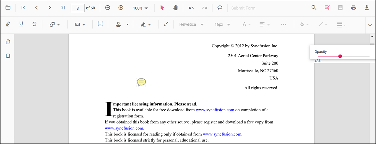
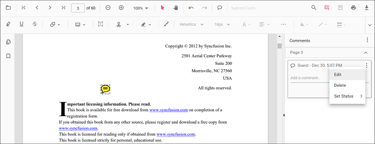

# Sticky notes annotation in JavaScript PDF Viewer

Sticky Notes are comment annotations used to leave notes, replies, and review statuses anywhere on a page.


## Add Annotation

### Add Annotation in UI

Use the Comments tool:
- Click the Comments button in the PDF Viewer toolbar.
- Click on the page where the sticky note should be added.
- The sticky note icon is placed at the clicked position.


Add and manage comments using the comment panel:
- Select a sticky note, right‑click, and choose Comment.
- Add comments, replies, and statuses in the panel.


### Add Annotation programmatically

Use addAnnotation to programmatically create a sticky note.

```html
<button id="stickyNote">Add sticky note annotation programmatically</button>
```



var PdfViewer = ej.pdfviewer.PdfViewer;
PdfViewer.Inject(
    ej.pdfviewer.Toolbar,
    ej.pdfviewer.Magnification,
    ej.pdfviewer.Navigation,
    ej.pdfviewer.Annotation,
    ej.pdfviewer.LinkAnnotation,
    ej.pdfviewer.ThumbnailView,
    ej.pdfviewer.BookmarkView,
    ej.pdfviewer.TextSelection,
    ej.pdfviewer.TextSearch,
    ej.pdfviewer.FormFields,
    ej.pdfviewer.FormDesigner,
    ej.pdfviewer.PageOrganizer
);

var pdfviewer = new PdfViewer();
pdfviewer.documentPath = 'https://cdn.syncfusion.com/content/pdf/pdf-succinctly.pdf';
pdfviewer.resourceUrl = 'https://cdn.syncfusion.com/ej2/31.1.23/dist/ej2-pdfviewer-lib';
pdfviewer.appendTo('#PdfViewer');

document.getElementById('stickyNote').addEventListener('click', function () {
  pdfviewer.annotation.addAnnotation('StickyNotes', {
    offset: { x: 100, y: 200 },
    pageNumber: 1,
    isLock: false
  });
});


var PdfViewer = ej.pdfviewer.PdfViewer;
PdfViewer.Inject(
    ej.pdfviewer.Toolbar,
    ej.pdfviewer.Magnification,
    ej.pdfviewer.Navigation,
    ej.pdfviewer.Annotation,
    ej.pdfviewer.LinkAnnotation,
    ej.pdfviewer.ThumbnailView,
    ej.pdfviewer.BookmarkView,
    ej.pdfviewer.TextSelection,
    ej.pdfviewer.TextSearch,
    ej.pdfviewer.FormFields,
    ej.pdfviewer.FormDesigner,
    ej.pdfviewer.PageOrganizer
);

var pdfviewer = new PdfViewer();
pdfviewer.serviceUrl = 'https://document.syncfusion.com/web-services/pdf-viewer/api/pdfviewer/';
pdfviewer.documentPath = 'https://cdn.syncfusion.com/content/pdf/pdf-succinctly.pdf';
pdfviewer.appendTo('#PdfViewer');

document.getElementById('stickyNote').addEventListener('click', function () {
  pdfviewer.annotation.addAnnotation('StickyNotes', {
    offset: { x: 100, y: 200 },
    pageNumber: 1,
    isLock: false
  });
});



## Edit Annotation

### Edit Annotation in UI

You can select and manage sticky notes directly in the viewer:
- Select: click the sticky note icon to focus it and show context actions.
- Move: drag the icon to reposition on the page.
- Delete or more options: use the context menu on the selected note.
- Open comments: right-click the note and choose Comment, or use the Comment Panel button.

### Edit the properties of sticky note annotations

#### Editing opacity

Edit opacity using the range slider in the Edit Opacity tool.



#### Editing comments

Comment text, replies, and status can be edited using the comment panel.

* Open the comment panel using the Comment Panel button in the annotation toolbar.

  

Modify or delete comments or replies, and change status using the menu options in the comment panel.

  

#### Edit Annotation programmatically

Use editAnnotation to update an existing note's bounds.

```html
<button id="editSticky">Edit sticky note annotation programmatically</button>
```



var PdfViewer = ej.pdfviewer.PdfViewer;
PdfViewer.Inject(
    ej.pdfviewer.Toolbar,
    ej.pdfviewer.Magnification,
    ej.pdfviewer.Navigation,
    ej.pdfviewer.Annotation,
    ej.pdfviewer.LinkAnnotation,
    ej.pdfviewer.ThumbnailView,
    ej.pdfviewer.BookmarkView,
    ej.pdfviewer.TextSelection,
    ej.pdfviewer.TextSearch,
    ej.pdfviewer.FormFields,
    ej.pdfviewer.FormDesigner,
    ej.pdfviewer.PageOrganizer
);

var pdfviewer = new PdfViewer();
pdfviewer.documentPath = 'https://cdn.syncfusion.com/content/pdf/pdf-succinctly.pdf';
pdfviewer.resourceUrl = 'https://cdn.syncfusion.com/ej2/31.1.23/dist/ej2-pdfviewer-lib';
pdfviewer.appendTo('#PdfViewer');

document.getElementById('editSticky').addEventListener('click', function () {
  for (var i = 0; i < pdfviewer.annotationCollection.length; i++) {
    if (pdfviewer.annotationCollection[i].shapeAnnotationType === 'sticky') {
      var width = pdfviewer.annotationCollection[i].bounds.width;
      var height = pdfviewer.annotationCollection[i].bounds.height;
      pdfviewer.annotationCollection[i].bounds = { x: 100, y: 100, width: width, height: height };
      pdfviewer.annotation.editAnnotation(pdfviewer.annotationCollection[i]);
    }
  }
});


var PdfViewer = ej.pdfviewer.PdfViewer;
PdfViewer.Inject(
    ej.pdfviewer.Toolbar,
    ej.pdfviewer.Magnification,
    ej.pdfviewer.Navigation,
    ej.pdfviewer.Annotation,
    ej.pdfviewer.LinkAnnotation,
    ej.pdfviewer.ThumbnailView,
    ej.pdfviewer.BookmarkView,
    ej.pdfviewer.TextSelection,
    ej.pdfviewer.TextSearch,
    ej.pdfviewer.FormFields,
    ej.pdfviewer.FormDesigner,
    ej.pdfviewer.PageOrganizer
);

var pdfviewer = new PdfViewer();
pdfviewer.serviceUrl = 'https://document.syncfusion.com/web-services/pdf-viewer/api/pdfviewer/';
pdfviewer.documentPath = 'https://cdn.syncfusion.com/content/pdf/pdf-succinctly.pdf';
pdfviewer.appendTo('#PdfViewer');

document.getElementById('editSticky').addEventListener('click', function () {
  for (var i = 0; i < pdfviewer.annotationCollection.length; i++) {
    if (pdfviewer.annotationCollection[i].shapeAnnotationType === 'sticky') {
      var width = pdfviewer.annotationCollection[i].bounds.width;
      var height = pdfviewer.annotationCollection[i].bounds.height;
      pdfviewer.annotationCollection[i].bounds = { x: 100, y: 100, width: width, height: height };
      pdfviewer.annotation.editAnnotation(pdfviewer.annotationCollection[i]);
    }
  }
});



## Default Sticky Notes settings during initialization

Set defaults using stickyNotesSettings.



var PdfViewer = ej.pdfviewer.PdfViewer;
PdfViewer.Inject(
    ej.pdfviewer.Toolbar,
    ej.pdfviewer.Magnification,
    ej.pdfviewer.Navigation,
    ej.pdfviewer.Annotation,
    ej.pdfviewer.LinkAnnotation,
    ej.pdfviewer.ThumbnailView,
    ej.pdfviewer.BookmarkView,
    ej.pdfviewer.TextSelection,
    ej.pdfviewer.TextSearch,
    ej.pdfviewer.FormFields,
    ej.pdfviewer.FormDesigner,
    ej.pdfviewer.PageOrganizer
);

var pdfviewer = new PdfViewer();
pdfviewer.documentPath = 'https://cdn.syncfusion.com/content/pdf/pdf-succinctly.pdf';
pdfviewer.resourceUrl = 'https://cdn.syncfusion.com/ej2/31.1.23/dist/ej2-pdfviewer-lib';
pdfviewer.stickyNotesSettings = { author: 'Syncfusion' };
pdfviewer.appendTo('#PdfViewer');


var PdfViewer = ej.pdfviewer.PdfViewer;
PdfViewer.Inject(
    ej.pdfviewer.Toolbar,
    ej.pdfviewer.Magnification,
    ej.pdfviewer.Navigation,
    ej.pdfviewer.Annotation,
    ej.pdfviewer.LinkAnnotation,
    ej.pdfviewer.ThumbnailView,
    ej.pdfviewer.BookmarkView,
    ej.pdfviewer.TextSelection,
    ej.pdfviewer.TextSearch,
    ej.pdfviewer.FormFields,
    ej.pdfviewer.FormDesigner,
    ej.pdfviewer.PageOrganizer
);

var pdfviewer = new PdfViewer();
pdfviewer.serviceUrl = 'https://document.syncfusion.com/web-services/pdf-viewer/api/pdfviewer/';
pdfviewer.documentPath = 'https://cdn.syncfusion.com/content/pdf/pdf-succinctly.pdf';
pdfviewer.stickyNotesSettings = { author: 'Syncfusion' };
pdfviewer.appendTo('#PdfViewer');



## Disable Sticky Notes

Disable the feature by setting enableStickyNotesAnnotation to false.



var PdfViewer = ej.pdfviewer.PdfViewer;
PdfViewer.Inject(
    ej.pdfviewer.Toolbar,
    ej.pdfviewer.Magnification,
    ej.pdfviewer.Navigation,
    ej.pdfviewer.Annotation,
    ej.pdfviewer.LinkAnnotation,
    ej.pdfviewer.ThumbnailView,
    ej.pdfviewer.BookmarkView,
    ej.pdfviewer.TextSelection,
    ej.pdfviewer.TextSearch,
    ej.pdfviewer.FormFields,
    ej.pdfviewer.FormDesigner,
    ej.pdfviewer.PageOrganizer
);

var pdfviewer = new PdfViewer();
pdfviewer.documentPath = 'https://cdn.syncfusion.com/content/pdf/pdf-succinctly.pdf';
pdfviewer.resourceUrl = 'https://cdn.syncfusion.com/ej2/31.1.23/dist/ej2-pdfviewer-lib';
pdfviewer.enableStickyNotesAnnotation = false;
pdfviewer.appendTo('#PdfViewer');


var PdfViewer = ej.pdfviewer.PdfViewer;
PdfViewer.Inject(
    ej.pdfviewer.Toolbar,
    ej.pdfviewer.Magnification,
    ej.pdfviewer.Navigation,
    ej.pdfviewer.Annotation,
    ej.pdfviewer.LinkAnnotation,
    ej.pdfviewer.ThumbnailView,
    ej.pdfviewer.BookmarkView,
    ej.pdfviewer.TextSelection,
    ej.pdfviewer.TextSearch,
    ej.pdfviewer.FormFields,
    ej.pdfviewer.FormDesigner,
    ej.pdfviewer.PageOrganizer
);

var pdfviewer = new PdfViewer();
pdfviewer.serviceUrl = 'https://document.syncfusion.com/web-services/pdf-viewer/api/pdfviewer/';
pdfviewer.documentPath = 'https://cdn.syncfusion.com/content/pdf/pdf-succinctly.pdf';
pdfviewer.enableStickyNotesAnnotation = false;
pdfviewer.appendTo('#PdfViewer');



[View Sample on GitHub](https://github.com/SyncfusionExamples/javascript-pdf-viewer-examples/tree/master)

## See also

- [Annotation Overview](../overview)
- [Annotation Toolbar](../../toolbar-customization/annotation-toolbar)
- [Create and Modify Annotation](../../annotations/create-modify-annotation)
- [Customize Annotation](../../annotations/customize-annotation)
- [Remove Annotation](../../annotations/delete-annotation)
- [Handwritten Signature](../../annotations/signature-annotation)
- [Export and Import Annotation](../../annotations/export-import/export-annotation)
- [Annotation in Mobile View](../../annotations/annotations-in-mobile-view)
- [Annotation Events](../../annotations/annotation-event)
- [Annotation API](../../annotations/annotations-api)