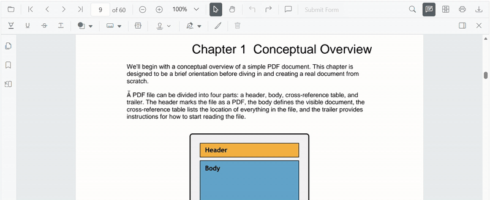
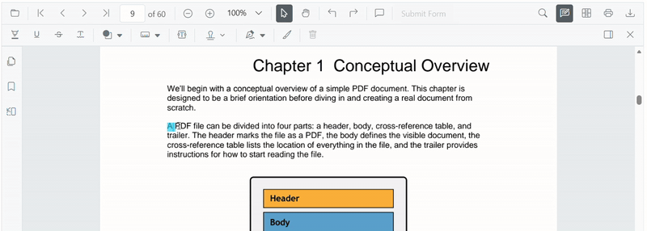
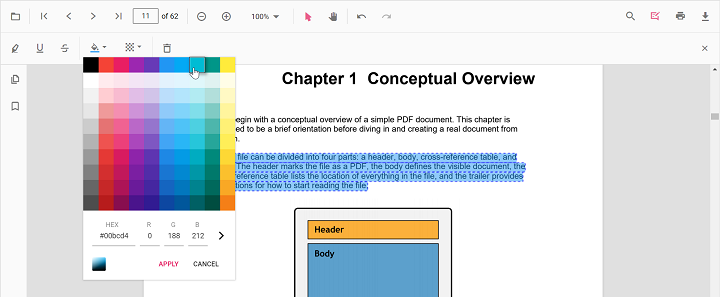
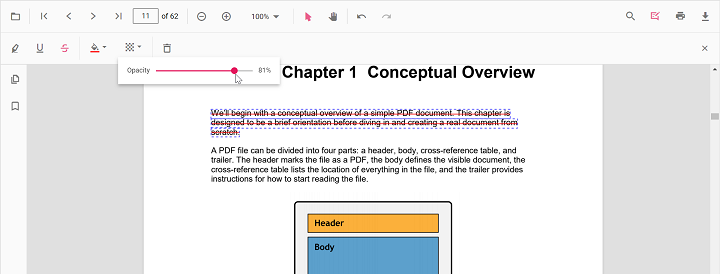
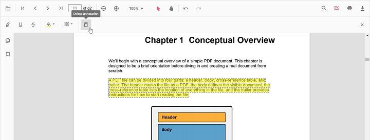

# Underline annotation in JavaScript PDF Viewer

The PDF Viewer provides options to add, edit, and delete Underline annotations on text. You can add underlines via the UI (context menu or annotation toolbar) and programmatically. You can also customize color, opacity, author/subject, and default settings, and use undo/redo, save, print, or disable them as needed.


## Add underline annotations

### Add underline annotations via UI

You can add underlines in two ways:

1. Using the context menu
* Select text in the PDF document and right-click it.
* Choose **Underline** in the context menu.



<!-- markdownlint-disable MD029 -->
2. Using the annotation toolbar
- Click the **Edit Annotation** button in the PDF Viewer toolbar to open the annotation toolbar.
- Select **Underline** to enable underline mode.
- Select text to add an underline annotation.
- Alternatively, select text first and then click **Underline**.



When pan mode is active and a text markup mode is entered, the PDF Viewer switches to text selection mode to enable selection.

### Enable underline mode

Use the following code to switch the viewer into underline mode.



var PdfViewer = ej.pdfviewer.PdfViewer;
PdfViewer.Inject(
    ej.pdfviewer.Toolbar,
    ej.pdfviewer.Magnification,
    ej.pdfviewer.Navigation,
    ej.pdfviewer.LinkAnnotation,
    ej.pdfviewer.ThumbnailView,
    ej.pdfviewer.BookmarkView,
    ej.pdfviewer.TextSelection,
    ej.pdfviewer.Annotation,
    ej.pdfviewer.FormDesigner,
    ej.pdfviewer.FormFields
);

var pdfviewer = new PdfViewer({
    documentPath: 'https://cdn.syncfusion.com/content/pdf/pdf-succinctly.pdf',
    resourceUrl: 'https://cdn.syncfusion.com/ej2/31.1.23/dist/ej2-pdfviewer-lib'
});
pdfviewer.appendTo('#PdfViewer');

document.getElementById('set').addEventListener('click', function () {
    pdfviewer.annotation.setAnnotationMode('Underline');
});


<!DOCTYPE html>
<html lang="en">
<head>
    <title>EJ2 PDF Viewer</title>
    <meta charset="utf-8" />
    <meta name="viewport" content="width=device-width, initial-scale=1.0" />
    <meta name="description" content="JavaScript PDF Viewer Control" />
    <meta name="author" content="Syncfusion" />
    <link href="index.css" rel="stylesheet" />
    <link href="https://cdn.syncfusion.com/ej2/31.1.23/material.css" rel="stylesheet" />
    <script src="https://cdnjs.cloudflare.com/ajax/libs/systemjs/0.19.38/system.js"></script>
    <script src="systemjs.config.js"></script>
</head>
<body>
    <div id="loader">Loading....</div>
    <!--Element to set text markup annotation mode-->
    <button id="set">Underline</button>
    <div id="container">
        <div id="PdfViewer" style="height:500px;width:100%"></div>
    </div>
    <script src="index.js" type="text/javascript"></script>
</body>
</html>



N> To set up the **server-backed PDF Viewer**,
Add the below `serviceUrl` in the `index.js` file
`pdfviewer.serviceUrl = 'https://document.syncfusion.com/web-services/pdf-viewer/api/pdfviewer/';`



#### Exit underline mode

Use the following code to switch back to normal mode.



var PdfViewer = ej.pdfviewer.PdfViewer;
PdfViewer.Inject(
    ej.pdfviewer.Toolbar,
    ej.pdfviewer.Magnification,
    ej.pdfviewer.Navigation,
    ej.pdfviewer.LinkAnnotation,
    ej.pdfviewer.ThumbnailView,
    ej.pdfviewer.BookmarkView,
    ej.pdfviewer.TextSelection,
    ej.pdfviewer.Annotation,
    ej.pdfviewer.FormDesigner,
    ej.pdfviewer.FormFields
);

var pdfviewer = new PdfViewer({
    documentPath: 'https://cdn.syncfusion.com/content/pdf/pdf-succinctly.pdf',
    resourceUrl: 'https://cdn.syncfusion.com/ej2/31.1.23/dist/ej2-pdfviewer-lib'
});
pdfviewer.appendTo('#PdfViewer');

document.getElementById('set').addEventListener('click', function () {
    pdfviewer.annotation.setAnnotationMode('Underline');
});

document.getElementById('setNone').addEventListener('click', function () {
    pdfviewer.annotation.setAnnotationMode('None');
});


<!DOCTYPE html>
<html lang="en">
<head>
    <title>EJ2 PDF Viewer</title>
    <meta charset="utf-8" />
    <meta name="viewport" content="width=device-width, initial-scale=1.0" />
    <meta name="description" content="JavaScript PDF Viewer Control" />
    <meta name="author" content="Syncfusion" />
    <link href="index.css" rel="stylesheet" />
    <link href="https://cdn.syncfusion.com/ej2/31.1.23/material.css" rel="stylesheet" />
    <script src="https://cdnjs.cloudflare.com/ajax/libs/systemjs/0.19.38/system.js"></script>
    <script src="systemjs.config.js"></script>
</head>
<body>
    <div id="loader">Loading....</div>
    <!--Element to set text markup annotation mode-->
    <button id="set">Underline</button>
    <!--Element to set normal mode-->
    <button id="setNone">Normal Mode</button>
    <div id="container">
        <div id="PdfViewer" style="height:500px;width:100%"></div>
    </div>
    <script src="index.js" type="text/javascript"></script>
</body>
</html>



N> To set up the **server-backed PDF Viewer**,
Add the below `serviceUrl` in the `index.js` file
`pdfviewer.serviceUrl = 'https://document.syncfusion.com/web-services/pdf-viewer/api/pdfviewer/';`



### Add underline annotations programmatically

Programmatically add underline annotations using the [addAnnotation](https://ej2.syncfusion.com/documentation/api/pdfviewer/annotation#addannotation) method.

Example:

```html
<button id="underline">Add TextMarkup annotation programmatically</button>
```



var PdfViewer = ej.pdfviewer.PdfViewer;
PdfViewer.Inject(
    ej.pdfviewer.Toolbar,
    ej.pdfviewer.Magnification,
    ej.pdfviewer.Navigation,
    ej.pdfviewer.Annotation,
    ej.pdfviewer.LinkAnnotation,
    ej.pdfviewer.ThumbnailView,
    ej.pdfviewer.BookmarkView,
    ej.pdfviewer.TextSelection,
    ej.pdfviewer.TextSearch,
    ej.pdfviewer.FormFields,
    ej.pdfviewer.FormDesigner,
    ej.pdfviewer.PageOrganizer
);

var pdfviewer = new PdfViewer();
pdfviewer.documentPath = 'https://cdn.syncfusion.com/content/pdf/pdf-succinctly.pdf';
pdfviewer.resourceUrl = 'https://cdn.syncfusion.com/ej2/31.1.23/dist/ej2-pdfviewer-lib';
pdfviewer.appendTo('#PdfViewer');

var underline = document.getElementById('underline');
if (underline) {
    underline.addEventListener('click', function () {
        pdfviewer.annotation.addAnnotation('Underline', {
            bounds: [{ x: 97, y: 110, width: 350, height: 14 }],
            pageNumber: 1
        });
    });
}


var PdfViewer = ej.pdfviewer.PdfViewer;
PdfViewer.Inject(
    ej.pdfviewer.Toolbar,
    ej.pdfviewer.Magnification,
    ej.pdfviewer.Navigation,
    ej.pdfviewer.Annotation,
    ej.pdfviewer.LinkAnnotation,
    ej.pdfviewer.ThumbnailView,
    ej.pdfviewer.BookmarkView,
    ej.pdfviewer.TextSelection,
    ej.pdfviewer.TextSearch,
    ej.pdfviewer.FormFields,
    ej.pdfviewer.FormDesigner,
    ej.pdfviewer.PageOrganizer
);

var pdfviewer = new PdfViewer();
pdfviewer.serviceUrl = 'https://document.syncfusion.com/web-services/pdf-viewer/api/pdfviewer/';
pdfviewer.documentPath = 'https://cdn.syncfusion.com/content/pdf/pdf-succinctly.pdf';
pdfviewer.appendTo('#PdfViewer');

var underline = document.getElementById('underline');
if (underline) {
    underline.addEventListener('click', function () {
        pdfviewer.annotation.addAnnotation('Underline', {
            bounds: [{ x: 97, y: 110, width: 350, height: 14 }],
            pageNumber: 1
        });
    });
}



## Edit underline annotation

## Edit underline annotations

### Edit underline annotations in UI

The color and opacity of underline annotations can be edited using the Edit Color and Edit Opacity tools in the annotation toolbar.

#### Edit color
Use the color palette in the Edit Color tool to change the annotation color.



#### Edit opacity
Use the range slider in the Edit Opacity tool to change annotation opacity.



#### Delete underline annotation

- Select the annotation and press Delete, or
- Click **Delete Annotation** in the annotation toolbar.



### Edit existing underline annotations programmatically

To modify existing underline annotations programmatically, use the `editAnnotation()` method. Example:

To modify an existing underline annotation programmatically, use the editAnnotation() method. Example:

```html
<button id="editUnderlineAnnotation">Edit Underline annotation Programmatically</button>
```



var PdfViewer = ej.pdfviewer.PdfViewer;
PdfViewer.Inject(
    ej.pdfviewer.Toolbar,
    ej.pdfviewer.Magnification,
    ej.pdfviewer.Navigation,
    ej.pdfviewer.Annotation,
    ej.pdfviewer.LinkAnnotation,
    ej.pdfviewer.ThumbnailView,
    ej.pdfviewer.BookmarkView,
    ej.pdfviewer.TextSelection,
    ej.pdfviewer.TextSearch,
    ej.pdfviewer.FormFields,
    ej.pdfviewer.FormDesigner,
    ej.pdfviewer.PageOrganizer
);

var pdfviewer = new PdfViewer();
pdfviewer.documentPath = 'https://cdn.syncfusion.com/content/pdf/pdf-succinctly.pdf';
pdfviewer.resourceUrl = 'https://cdn.syncfusion.com/ej2/31.1.23/dist/ej2-pdfviewer-lib';
pdfviewer.appendTo('#PdfViewer');

var editUnderlineAnnotation = document.getElementById('editUnderlineAnnotation');
if (editUnderlineAnnotation) {
    editUnderlineAnnotation.addEventListener('click', function () {
        for (var i = 0; i < pdfviewer.annotationCollection.length; i++) {
            // Update the first available Underline annotation
            if (pdfviewer.annotationCollection[i].textMarkupAnnotationType === 'Underline') {
                pdfviewer.annotationCollection[i].color = '#00aa00';
                pdfviewer.annotationCollection[i].opacity = 0.8;
                pdfviewer.annotation.editAnnotation(pdfviewer.annotationCollection[i]);
                break;
            }
        }
    });
}


var PdfViewer = ej.pdfviewer.PdfViewer;
PdfViewer.Inject(
    ej.pdfviewer.Toolbar,
    ej.pdfviewer.Magnification,
    ej.pdfviewer.Navigation,
    ej.pdfviewer.Annotation,
    ej.pdfviewer.LinkAnnotation,
    ej.pdfviewer.ThumbnailView,
    ej.pdfviewer.BookmarkView,
    ej.pdfviewer.TextSelection,
    ej.pdfviewer.TextSearch,
    ej.pdfviewer.FormFields,
    ej.pdfviewer.FormDesigner,
    ej.pdfviewer.PageOrganizer
);

var pdfviewer = new PdfViewer();
pdfviewer.serviceUrl = 'https://document.syncfusion.com/web-services/pdf-viewer/api/pdfviewer/';
pdfviewer.documentPath = 'https://cdn.syncfusion.com/content/pdf/pdf-succinctly.pdf';
pdfviewer.appendTo('#PdfViewer');

var editUnderlineAnnotation = document.getElementById('editUnderlineAnnotation');
if (editUnderlineAnnotation) {
    editUnderlineAnnotation.addEventListener('click', function () {
        for (var i = 0; i < pdfviewer.annotationCollection.length; i++) {
            if (pdfviewer.annotationCollection[i].textMarkupAnnotationType === 'Underline') {
                pdfviewer.annotationCollection[i].color = '#00aa00';
                pdfviewer.annotationCollection[i].opacity = 0.8;
                pdfviewer.annotation.editAnnotation(pdfviewer.annotationCollection[i]);
                break;
            }
        }
    });
}



## Default underline settings during initialization

Set default properties before creating the control using `underlineSettings`.

N> After editing default color and opacity using the Edit Color and Edit Opacity tools, the values update to the selected settings.

Refer to the following code snippet to set the default underline settings.



var PdfViewer = ej.pdfviewer.PdfViewer;
PdfViewer.Inject(
    ej.pdfviewer.Toolbar,
    ej.pdfviewer.Magnification,
    ej.pdfviewer.Navigation,
    ej.pdfviewer.LinkAnnotation,
    ej.pdfviewer.ThumbnailView,
    ej.pdfviewer.BookmarkView,
    ej.pdfviewer.TextSelection,
    ej.pdfviewer.Annotation
);

var pdfviewer = new PdfViewer();
pdfviewer.documentPath = 'https://cdn.syncfusion.com/content/pdf/pdf-succinctly.pdf';
pdfviewer.resourceUrl = 'https://cdn.syncfusion.com/ej2/31.1.23/dist/ej2-pdfviewer-lib';
pdfviewer.underlineSettings = { author: 'Guest User', subject: 'Points to be remembered', color: '#00ffff', opacity: 0.9 };
pdfviewer.appendTo('#PdfViewer');


var PdfViewer = ej.pdfviewer.PdfViewer;
PdfViewer.Inject(
    ej.pdfviewer.Toolbar,
    ej.pdfviewer.Magnification,
    ej.pdfviewer.Navigation,
    ej.pdfviewer.LinkAnnotation,
    ej.pdfviewer.ThumbnailView,
    ej.pdfviewer.BookmarkView,
    ej.pdfviewer.TextSelection,
    ej.pdfviewer.Annotation
);

var pdfviewer = new PdfViewer();
pdfviewer.serviceUrl = 'https://document.syncfusion.com/web-services/pdf-viewer/api/pdfviewer/';
pdfviewer.documentPath = 'https://cdn.syncfusion.com/content/pdf/pdf-succinctly.pdf';
pdfviewer.underlineSettings = { author: 'Guest User', subject: 'Points to be remembered', color: '#00ffff', opacity: 0.9 };
pdfviewer.appendTo('#PdfViewer');



## Set properties while adding Individual Annotation

Set properties for individual annotations before creating the control using `underlineSettings`.

N> After editing default color and opacity using the Edit Color and Edit Opacity tools, the values update to the selected settings.

Refer to the following code snippet to set the default highlight settings.

```html
<button id="underline">Add underline</button>
```


ej.pdfviewer.PdfViewer.Inject(ej.pdfviewer.Toolbar, ej.pdfviewer.Magnification, ej.pdfviewer.Navigation, ej.pdfviewer.Annotation, ej.pdfviewer.LinkAnnotation, ej.pdfviewer.ThumbnailView, ej.pdfviewer.BookmarkView, ej.pdfviewer.TextSelection, ej.pdfviewer.TextSearch, ej.pdfviewer.FormFields, ej.pdfviewer.FormDesigner, ej.pdfviewer.PageOrganizer);

var pdfviewer = new ej.pdfviewer.PdfViewer();
pdfviewer.documentPath = 'https://cdn.syncfusion.com/content/pdf/pdf-succinctly.pdf';
pdfviewer.resourceUrl = 'https://cdn.syncfusion.com/ej2/31.1.23/dist/ej2-pdfviewer-lib';
pdfviewer.appendTo('#PdfViewer');

//Apply Underline Settings while adding individual Annotation
document.getElementById('underline')?.addEventListener('click', function () {
    pdfviewer.annotation.addAnnotation('Underline', {
        bounds: [{ x: 97, y: 110, width: 350, height: 14 }],
        pageNumber: 1,
        author: 'User 1',
        color: '#ffff00',
        opacity: 0.9
    });

    pdfviewer.annotation.addAnnotation('Underline', {
        bounds: [{ x: 107, y: 220, width: 350, height: 14 }],
        pageNumber: 1,
        author: 'User 2',
        color: '#ff1010ff',
        opacity: 0.9
    });
});


ej.pdfviewer.PdfViewer.Inject(ej.pdfviewer.Toolbar, ej.pdfviewer.Magnification, ej.pdfviewer.Navigation, ej.pdfviewer.Annotation, ej.pdfviewer.LinkAnnotation, ej.pdfviewer.ThumbnailView, ej.pdfviewer.BookmarkView, ej.pdfviewer.TextSelection, ej.pdfviewer.TextSearch, ej.pdfviewer.FormFields, ej.pdfviewer.FormDesigner, ej.pdfviewer.PageOrganizer);

var pdfviewer = new ej.pdfviewer.PdfViewer();
pdfviewer.documentPath = 'https://cdn.syncfusion.com/content/pdf/pdf-succinctly.pdf';
pdfviewer.resourceUrl = 'https://cdn.syncfusion.com/ej2/31.1.23/dist/ej2-pdfviewer-lib';
pdfviewer.appendTo('#PdfViewer');

//Apply Underline Settings while adding individual Annotation
document.getElementById('underline')?.addEventListener('click', function () {
    pdfviewer.annotation.addAnnotation('Underline', {
        bounds: [{ x: 97, y: 110, width: 350, height: 14 }],
        pageNumber: 1,
        author: 'User 1',
        color: '#ffff00',
        opacity: 0.9
    });

    pdfviewer.annotation.addAnnotation('Underline', {
        bounds: [{ x: 107, y: 220, width: 350, height: 14 }],
        pageNumber: 1,
        author: 'User 2',
        color: '#ff1010ff',
        opacity: 0.9
    });
});



## Disable underline annotation

Disable text markup annotations (including underline) using the `enableTextMarkupAnnotation` property.



var PdfViewer = ej.pdfviewer.PdfViewer;
PdfViewer.Inject(
    ej.pdfviewer.Toolbar,
    ej.pdfviewer.Magnification,
    ej.pdfviewer.Navigation,
    ej.pdfviewer.LinkAnnotation,
    ej.pdfviewer.ThumbnailView,
    ej.pdfviewer.BookmarkView,
    ej.pdfviewer.TextSelection,
    ej.pdfviewer.Annotation
);

var pdfviewer = new PdfViewer();
pdfviewer.documentPath = 'https://cdn.syncfusion.com/content/pdf/pdf-succinctly.pdf';
pdfviewer.resourceUrl = 'https://cdn.syncfusion.com/ej2/31.1.23/dist/ej2-pdfviewer-lib';
pdfviewer.enableTextMarkupAnnotation = false;
pdfviewer.appendTo('#PdfViewer');



var PdfViewer = ej.pdfviewer.PdfViewer;
PdfViewer.Inject(
    ej.pdfviewer.Toolbar,
    ej.pdfviewer.Magnification,
    ej.pdfviewer.Navigation,
    ej.pdfviewer.LinkAnnotation,
    ej.pdfviewer.ThumbnailView,
    ej.pdfviewer.BookmarkView,
    ej.pdfviewer.TextSelection,
    ej.pdfviewer.Annotation
);

var pdfviewer = new PdfViewer();
pdfviewer.serviceUrl = 'https://document.syncfusion.com/web-services/pdf-viewer/api/pdfviewer/';
pdfviewer.documentPath = 'https://cdn.syncfusion.com/content/pdf/pdf-succinctly.pdf';
pdfviewer.enableTextMarkupAnnotation = false;
pdfviewer.appendTo('#PdfViewer');




[View Sample on GitHub](https://github.com/SyncfusionExamples/javascript-pdf-viewer-examples/tree/master)

## See also

- [Annotation Overview](../overview)
- [Annotation Toolbar](../../toolbar-customization/annotation-toolbar)
- [Create and Modify Annotation](../../annotations/create-modify-annotation)
- [Customize Annotation](../../annotations/customize-annotation)
- [Remove Annotation](../../annotations/delete-annotation)
- [Handwritten Signature](../../annotations/signature-annotation)
- [Export and Import Annotation](../../annotations/export-import/export-annotation)
- [Annotation in Mobile View](../../annotations/annotations-in-mobile-view)
- [Annotation Events](../../annotations/annotation-event)
- [Annotation API](../../annotations/annotations-api)