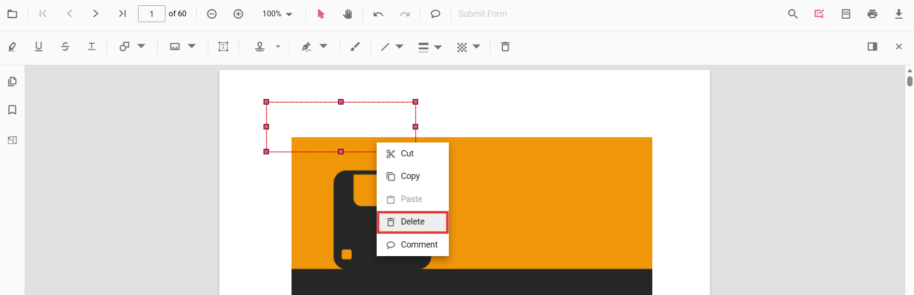
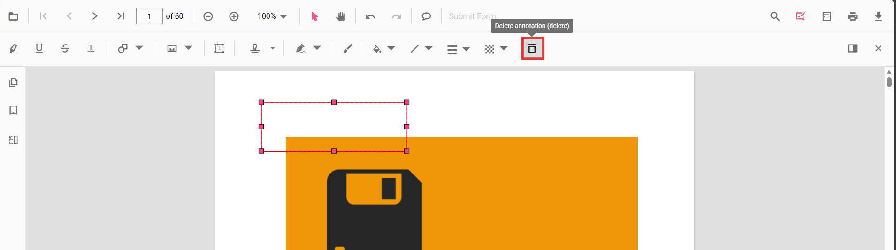

# Remove annotations

Annotations can be removed using the built-in UI or programmatically. This page shows common methods to delete annotations in the viewer.

## Delete via UI

A selected annotation can be deleted in three ways:

- Context menu: right-click the annotation and choose Delete.

- Annotation toolbar: select the annotation and click the Delete button on the annotation toolbar.

- Keyboard: select the annotation and press the `Delete` key.

## Delete programmatically

Annotations can be deleted programmatically either by removing the currently selected annotation or by specifying an annotation id.

```html
<div class="toolbar">
  <button id="del">Delete Annotation</button>
  <button id="delbyId">Delete Annotation By ID</button>
</div>
<div id="PdfViewer" style="height: 700px; border: 1px solid #ccc;"></div>
```
```javascript
// Inject required modules
ej.pdfviewer.PdfViewer.Inject(
  ej.pdfviewer.Toolbar,
  ej.pdfviewer.Magnification,
  ej.pdfviewer.Navigation,
  ej.pdfviewer.LinkAnnotation,
  ej.pdfviewer.ThumbnailView,
  ej.pdfviewer.BookmarkView,
  ej.pdfviewer.TextSelection,
  ej.pdfviewer.TextSearch,
  ej.pdfviewer.Print,
  ej.pdfviewer.Annotation,
  ej.pdfviewer.FormFields,
  ej.pdfviewer.FormDesigner
);

// Create viewer
var viewer = new ej.pdfviewer.PdfViewer({
  documentPath: 'https://cdn.syncfusion.com/content/pdf/pdf-succinctly.pdf',
  // Standalone resources
  resourceUrl: 'https://cdn.syncfusion.com/ej2/31.1.23/dist/ej2-pdfviewer-lib'
});
viewer.appendTo('#PdfViewer');

var delBtn = document.getElementById('del');
if (delBtn) {
  delBtn.addEventListener('click', function () {
    // Delete the selected annotation
    viewer.annotation.deleteAnnotation();
  });
}

var delByIdBtn = document.getElementById('delbyId');
if (delByIdBtn) {
  delByIdBtn.addEventListener('click', function () {
    // Delete the first annotation using its id from the annotation collection
    if (viewer.annotationCollection && viewer.annotationCollection.length > 0) {
      viewer.annotation.deleteAnnotationById(viewer.annotationCollection[0].id);
    }
  });
}
```

N> Deleting via the API requires the annotation to exist in the current document. Ensure an annotation is selected when using `deleteAnnotation()`, or pass a valid id to `deleteAnnotationById()`.

[View Sample on GitHub](https://github.com/SyncfusionExamples/javascript-pdf-viewer-examples/tree/master)

## See also

- [Annotation Overview](../overview)
- [Annotation Types](../annotations/annotation-types/area-annotation)
- [Annotation Toolbar](../toolbar-customization/annotation-toolbar)
- [Create and Modify Annotation](../annotations/create-modify-annotation)
- [Customize Annotation](../annotations/customize-annotation)
- [Handwritten Signature](../annotations/signature-annotation)
- [Export and Import Annotation](../annotations/export-import/export-annotation)
- [Annotation Permission](../annotations/annotation-permission)
- [Annotation in Mobile View](../annotations/annotations-in-mobile-view)
- [Annotation Events](../annotations/annotation-event)
- [Annotation API](../annotations/annotations-api)
