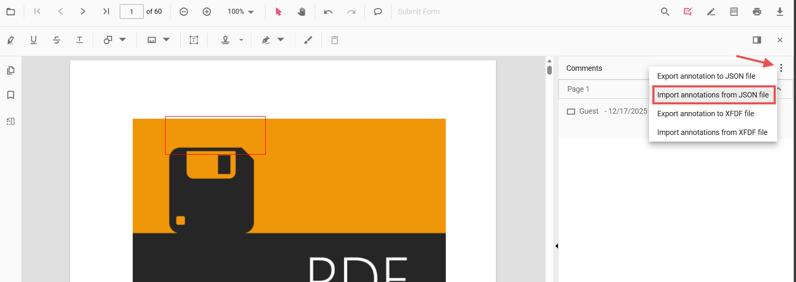

# Import annotations in JavaScript PDF Viewer

Annotations can be imported into the PDF Viewer using the built-in UI or programmatically. The UI accepts JSON and XFDF files from the Comments panel; programmatic import accepts an annotation object previously exported by the viewer.

## Import using the UI (Comments panel)

The Comments panel provides import options in its overflow menu:

- Import annotations from JSON file
- Import annotations from XFDF file

Steps:
1. Open the Comments panel in the PDF Viewer.
2. Click the overflow menu (three dots) at the top of the panel.
3. Choose the appropriate import option and select the file.

All annotations in the selected file are applied to the current document.



## Import programmatically (from object)

Import annotations from an object previously exported using `exportAnnotationsAsObject()`. Only objects produced by the viewer can be re-imported with the `importAnnotation` method (`importAnnotation` documentation: https://ej2.syncfusion.com/javascript/documentation/api/pdfviewer/index-default#importannotation).

Example: HTML markup for export/import buttons and the viewer container.

```html
<button id="ExportAsObject">Export as Object</button>
<button id="ImportFromObject">Import from Object</button>
<div id="pdfViewer" style="height:650px;"></div>
```

Example: initialize the viewer and wire export/import handlers.

```js
// Inject required modules (ES5/vanilla JS using global ej namespace)
ej.pdfviewer.PdfViewer.Inject(
  ej.pdfviewer.Toolbar,
  ej.pdfviewer.Magnification,
  ej.pdfviewer.Navigation,
  ej.pdfviewer.LinkAnnotation,
  ej.pdfviewer.ThumbnailView,
  ej.pdfviewer.BookmarkView,
  ej.pdfviewer.TextSelection,
  ej.pdfviewer.TextSearch,
  ej.pdfviewer.Print,
  ej.pdfviewer.Annotation,
  ej.pdfviewer.FormFields,
  ej.pdfviewer.FormDesigner
);

// Initialize the viewer
var viewer = new ej.pdfviewer.PdfViewer();
viewer.resourceUrl = 'https://cdn.syncfusion.com/ej2/31.1.23/dist/ej2-pdfviewer-lib';
viewer.documentPath = 'https://cdn.syncfusion.com/content/pdf/pdf-succinctly.pdf';
viewer.appendTo('#pdfViewer');

// Exported annotation as object
var exportedObject = null;
var btnObject = document.getElementById('ExportAsObject');
if (btnObject) {
  btnObject.addEventListener('click', function () {
    viewer.exportAnnotationsAsObject().then(function (value) {
      // Persist or transmit the object as needed (DB/API). Keep for future import.
      console.log('Exported annotation object:', value);
      exportedObject = value; // keep as object
    });
  });
}

// Import from the previously exported object
var btnImport = document.getElementById('ImportFromObject');
if (btnImport) {
  btnImport.addEventListener('click', function () {
    if (exportedObject) {
      viewer.importAnnotation(exportedObject);
    }
  });
}
```

N> Only objects produced by the viewer (for example, by `exportAnnotationsAsObject()`) are compatible with `importAnnotation`. Persist exported objects in a safe storage location (database or API) and validate them before import.

## Common use cases

- Restore annotations saved earlier (for example, from a database or API)
- Apply reviewer annotations shared as JSON/XFDF files via the Comments panel
- Migrate or merge annotations between documents or sessions
- Support collaborative workflows by reloading team annotations

[View sample on GitHub](https://github.com/SyncfusionExamples/javascript-pdf-viewer-examples/tree/master)

## See also

- [Annotation Overview](../../overview)
- [Annotation Types](../../annotations/annotation-types/area-annotation)
- [Annotation Toolbar](../../toolbar-customization/annotation-toolbar)
- [Create and Modify Annotation](../../annotations/create-modify-annotation)
- [Customize Annotation](../../annotations/customize-annotation)
- [Remove Annotation](../../annotations/delete-annotation)
- [Handwritten Signature](../../annotations/signature-annotation)
- [Export Annotation](../export-import/export-annotation)
- [Import Export Events](../export-import/export-import-events)
- [Annotation Permission](../../annotations/annotation-permission)
- [Annotation in Mobile View](../../annotations/annotations-in-mobile-view)
- [Annotation Events](../../annotations/annotation-event)
- [Annotation API](../../annotations/annotations-api)