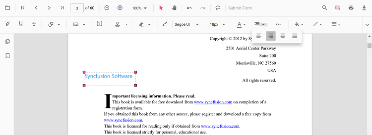
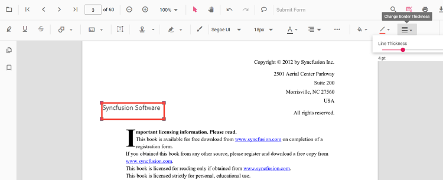

# Free text annotation in JavaScript PDF Viewer control

The PDF Viewer control provides options to add, edit, and delete free text annotations.

## Enable or Disable Free Text annotation

Enables or disables the free text annotation feature in the PDF Viewer. For more details, see [enableFreeText API Documentation](https://ej2.syncfusion.com/javascript/documentation/api/pdfviewer/index-default#enablefreetext).




// Render the PDF viewer control
var viewer = new ej.pdfviewer.PdfViewer({
  documentPath: 'https://cdn.syncfusion.com/content/pdf/pdf-succinctly.pdf',
  resourceUrl: 'https://cdn.syncfusion.com/ej2/31.2.2/dist/ej2-pdfviewer-lib',
  enableFreeText: false
});
ej.pdfviewer.PdfViewer.Inject(
  ej.pdfviewer.Toolbar,
  ej.pdfviewer.Magnification,
  ej.pdfviewer.BookmarkView,
  ej.pdfviewer.ThumbnailView,
  ej.pdfviewer.TextSelection,
  ej.pdfviewer.TextSearch,
  ej.pdfviewer.Print,
  ej.pdfviewer.Navigation,
  ej.pdfviewer.LinkAnnotation,
  ej.pdfviewer.Annotation,
  ej.pdfviewer.FormFields,
  ej.pdfviewer.FormDesigner,
  ej.pdfviewer.PageOrganizer
);

viewer.appendTo('#pdfViewer');




## Add a free text annotation to the PDF document

Free text annotations can be added to the PDF document using the annotation toolbar.

* Click the **Edit Annotation** button in the PDF Viewer toolbar. The annotation toolbar appears below it.
* Select the **Free Text Annotation** button to enable free text annotation mode.
* Add text anywhere on the pages of the PDF document.

When in pan mode, selecting free text annotation switches the PDF Viewer to text select mode.


The following example switches to free text annotation mode using a button click.


```html
<button id="addFreeTextAnnotation">FreeText</button>
```



var pdfviewer = new ej.pdfviewer.PdfViewer({
                    documentPath: "https://cdn.syncfusion.com/content/pdf/pdf-succinctly.pdf",
                    resourceUrl : "https://cdn.syncfusion.com/ej2/31.2.2/dist/ej2-pdfviewer-lib"
                });
ej.pdfviewer.PdfViewer.Inject(ej.pdfviewer.TextSelection, ej.pdfviewer.TextSearch, ej.pdfviewer.Print, ej.pdfviewer.Navigation, ej.pdfviewer.Toolbar,
                              ej.pdfviewer.Magnification, ej.pdfviewer.Annotation, ej.pdfviewer.FormDesigner, ej.pdfviewer.FormFields, ej.pdfviewer.PageOrganizer);
pdfviewer.appendTo('#PdfViewer');

let addFreeTextAnnotationButton = document.getElementById('addFreeTextAnnotation');
if (addFreeTextAnnotationButton) {
    addFreeTextAnnotationButton.addEventListener('click', function () {
        if (pdfviewer) {
            pdfviewer.annotationModule.setAnnotationMode("FreeText");
        }
    });
}




var pdfviewer = new ej.pdfviewer.PdfViewer({
                    documentPath: "https://cdn.syncfusion.com/content/pdf/pdf-succinctly.pdf",
                    serviceUrl: 'https://document.syncfusion.com/web-services/pdf-viewer/api/pdfviewer'
                });
ej.pdfviewer.PdfViewer.Inject(ej.pdfviewer.TextSelection, ej.pdfviewer.TextSearch, ej.pdfviewer.Print, ej.pdfviewer.Navigation, ej.pdfviewer.Toolbar,
                              ej.pdfviewer.Magnification, ej.pdfviewer.Annotation, ej.pdfviewer.FormDesigner, ej.pdfviewer.FormFields, ej.pdfviewer.PageOrganizer);
pdfviewer.appendTo('#PdfViewer');
let addFreeTextAnnotationButton = document.getElementById('addFreeTextAnnotation');
if (addFreeTextAnnotationButton) {
    addFreeTextAnnotationButton.addEventListener('click', function () {
        if (pdfviewer) {
            pdfviewer.annotationModule.setAnnotationMode("FreeText");
        }
    });
}




## Add a free text annotation programmatically to the PDF document

The PDF Viewer library allows adding a free text annotation programmatically using the [addAnnotation()](https://ej2.syncfusion.com/javascript/documentation/api/pdfviewer/annotation/#annotation) method.

Here is an example of adding a free text annotation programmatically using addAnnotation():

```html
<button id="addFreeTextAnnotation"> Add FreeText Programmatically</button>

```



var pdfviewer = new ej.pdfviewer.PdfViewer({
                    documentPath: "https://cdn.syncfusion.com/content/pdf/pdf-succinctly.pdf",
                    resourceUrl : "https://cdn.syncfusion.com/ej2/31.2.2/dist/ej2-pdfviewer-lib"
                });
ej.pdfviewer.PdfViewer.Inject(ej.pdfviewer.TextSelection, ej.pdfviewer.TextSearch, ej.pdfviewer.Print, ej.pdfviewer.Navigation, ej.pdfviewer.Toolbar,
                              ej.pdfviewer.Magnification, ej.pdfviewer.Annotation, ej.pdfviewer.FormDesigner, ej.pdfviewer.FormFields, ej.pdfviewer.PageOrganizer);
pdfviewer.appendTo('#PdfViewer');

let addFreeTextAnnotation = document.getElementById('addFreeTextAnnotation');
if (addFreeTextAnnotation) {
    addFreeTextAnnotation.addEventListener('click', function () {
        if (pdfviewer) {
            pdfviewer.annotation.addAnnotation("FreeText", {
                offset: { x: 120, y: 80 },
                fontSize: 16,
                fontFamily: "Helvetica",
                pageNumber: 1,
                width: 200,
                height: 40,
                isLock: false,
                defaultText: "Syncfusion"
            } );
        }
    });
}




var pdfviewer = new ej.pdfviewer.PdfViewer({
                    documentPath: "https://cdn.syncfusion.com/content/pdf/pdf-succinctly.pdf",
                    serviceUrl: 'https://document.syncfusion.com/web-services/pdf-viewer/api/pdfviewer'
                });
ej.pdfviewer.PdfViewer.Inject(ej.pdfviewer.TextSelection, ej.pdfviewer.TextSearch, ej.pdfviewer.Print, ej.pdfviewer.Navigation, ej.pdfviewer.Toolbar,
                              ej.pdfviewer.Magnification, ej.pdfviewer.Annotation, ej.pdfviewer.FormDesigner, ej.pdfviewer.FormFields, ej.pdfviewer.PageOrganizer);
pdfviewer.appendTo('#PdfViewer');
let addFreeTextAnnotation = document.getElementById('addFreeTextAnnotation');
if (addFreeTextAnnotation) {
    addFreeTextAnnotation.addEventListener('click', function () {
        if (pdfviewer) {
            pdfviewer.annotation.addAnnotation("FreeText", {
                offset: { x: 120, y: 80 },
                fontSize: 16,
                fontFamily: "Helvetica",
                pageNumber: 1,
                width: 200,
                height: 40,
                isLock: false,
                defaultText: "Syncfusion"
            } );
        }
    });
}




## Change the content of an existing free text annotation programmatically

To change the content of an existing free text annotation programmatically, use the editAnnotation() method.

Here is an example of changing the content of a free text annotation using editAnnotation():

```html
<button id="changeContent">Change Contect</button>
```



var pdfviewer = new ej.pdfviewer.PdfViewer({
                    documentPath: "https://cdn.syncfusion.com/content/pdf/pdf-succinctly.pdf",
                    resourceUrl : "https://cdn.syncfusion.com/ej2/31.2.2/dist/ej2-pdfviewer-lib"
                });
ej.pdfviewer.PdfViewer.Inject(ej.pdfviewer.TextSelection, ej.pdfviewer.TextSearch, ej.pdfviewer.Print, ej.pdfviewer.Navigation, ej.pdfviewer.Toolbar,
                              ej.pdfviewer.Magnification, ej.pdfviewer.Annotation, ej.pdfviewer.FormDesigner, ej.pdfviewer.FormFields, ej.pdfviewer.PageOrganizer);
pdfviewer.appendTo('#PdfViewer');

let changeContent = document.getElementById('changeContent');
if (changeContent) {
    changeContent.addEventListener('click', function () {
        if (pdfviewer) {
            for (let i = 0; i < pdfviewer.annotationCollection.length; i++) {
                if (pdfviewer.annotationCollection[i].subject === 'Text Box') {
                  pdfviewer.annotationCollection[i].dynamicText = 'syncfusion';
                  pdfviewer.annotation.editAnnotation(pdfviewer.annotationCollection[i]);
                }
            }
        }
    });
}




var pdfviewer = new ej.pdfviewer.PdfViewer({
                    documentPath: "https://cdn.syncfusion.com/content/pdf/pdf-succinctly.pdf",
                    serviceUrl: 'https://document.syncfusion.com/web-services/pdf-viewer/api/pdfviewer'
                });
ej.pdfviewer.PdfViewer.Inject(ej.pdfviewer.TextSelection, ej.pdfviewer.TextSearch, ej.pdfviewer.Print, ej.pdfviewer.Navigation, ej.pdfviewer.Toolbar,
                              ej.pdfviewer.Magnification, ej.pdfviewer.Annotation, ej.pdfviewer.FormDesigner, ej.pdfviewer.FormFields, ej.pdfviewer.PageOrganizer);
pdfviewer.appendTo('#PdfViewer');

let changeContent = document.getElementById('changeContent');
if (changeContent) {
    changeContent.addEventListener('click', function () {
        if (pdfviewer) {
            for (let i = 0; i < pdfviewer.annotationCollection.length; i++) {
                if (pdfviewer.annotationCollection[i].subject === 'Text Box') {
                  pdfviewer.annotationCollection[i].dynamicText = 'syncfusion';
                  pdfviewer.annotation.editAnnotation(pdfviewer.annotationCollection[i]);
                }
            }
        }
    });
}




N> The current version of the PDF Viewer does not edit existing document text. New free text annotations can be added and modified within the document.

## Edit the properties of free text annotations

Font family, font size, styles, font color, text alignment, fill color, stroke color, border thickness, and opacity can be edited using the Font Family, Font Size, Font Color, Text Align, Font Style, Edit Color, Edit Stroke Color, Edit Thickness, and Edit Opacity tools in the annotation toolbar.

### Edit font family

Edit the font family by selecting a font in the Font Family tool.


### Edit font size

Edit the font size by selecting a size in the Font Size tool.


### Edit font color

Edit the font color using the color palette in the Font Color tool.


### Edit text alignment

Align text by selecting an option from the Text Align tool.



### Edit text styles

Edit text styles by selecting options in the Font Style tool.


### Edit fill color

Edit the fill color using the color palette in the Edit Color tool.


### Edit stroke color

Edit the stroke color using the color palette in the Edit Stroke Color tool.


### Edit thickness

Edit border thickness using the range slider in the Edit Thickness tool.



### Edit opacity

Edit opacity using the range slider in the Edit Opacity tool.


## Set default properties during control initialization

Default properties for free text annotations can be set before creating the control using FreeTextSettings.

After changing default values, the selected values are applied. The following example sets default free text annotation settings.




var pdfviewer = new ej.pdfviewer.PdfViewer({
                    documentPath: "https://cdn.syncfusion.com/content/pdf/pdf-succinctly.pdf",
                    resourceUrl : "https://cdn.syncfusion.com/ej2/31.2.2/dist/ej2-pdfviewer-lib",
                    freeTextSettings : { fillColor: 'green', borderColor: 'blue', fontColor: 'yellow' }
                });
ej.pdfviewer.PdfViewer.Inject(ej.pdfviewer.TextSelection, ej.pdfviewer.TextSearch, ej.pdfviewer.Print, ej.pdfviewer.Navigation, ej.pdfviewer.Toolbar,
                              ej.pdfviewer.Magnification, ej.pdfviewer.Annotation, ej.pdfviewer.FormDesigner, ej.pdfviewer.FormFields, ej.pdfviewer.PageOrganizer);
pdfviewer.appendTo('#PdfViewer');




var pdfviewer = new ej.pdfviewer.PdfViewer({
                    documentPath: "https://cdn.syncfusion.com/content/pdf/pdf-succinctly.pdf",
                    serviceUrl: 'https://document.syncfusion.com/web-services/pdf-viewer/api/pdfviewer',
                    freeTextSettings : { fillColor: 'green', borderColor: 'blue', fontColor: 'yellow' }
                });
ej.pdfviewer.PdfViewer.Inject(ej.pdfviewer.TextSelection, ej.pdfviewer.TextSearch, ej.pdfviewer.Print, ej.pdfviewer.Navigation, ej.pdfviewer.Toolbar,
                              ej.pdfviewer.Magnification, ej.pdfviewer.Annotation, ej.pdfviewer.FormDesigner, ej.pdfviewer.FormFields, ej.pdfviewer.PageOrganizer);
pdfviewer.appendTo('#PdfViewer');




N> To know more about FreeTextSettings, you can refer [FreeTextSettings API documentation](https://ej2.syncfusion.com/javascript/documentation/api/pdfviewer/index-default#freetextsettings)

## Set default free text placeholder

The `isValidFreeText` property specifies whether newly added free text annotations display a placeholder. By default, `isValidFreeText` is `true`.  
- `true`: Displays **Type here** as placeholder text.  
- `false`: Leaves the annotation blank so that user-entered text remains visible.

For more information, see [isValidFreeText API documentation](https://ej2.syncfusion.com/documentation/api/pdfviewer/index-default#isvalidfreetext).




// Initialize the PDF Viewer
var viewer = new ej.pdfviewer.PdfViewer({
  resourceUrl: 'https://cdn.syncfusion.com/ej2/31.1.17/dist/ej2-pdfviewer-lib',
  documentPath: 'https://cdn.syncfusion.com/content/pdf/pdf-succinctly.pdf',
  isValidFreeText: true, // Enables "Type here" as default text
});

// Inject required modules
ej.pdfviewer.PdfViewer.Inject(
  ej.pdfviewer.Toolbar,
  ej.pdfviewer.Magnification,
  ej.pdfviewer.Navigation,
  ej.pdfviewer.LinkAnnotation,
  ej.pdfviewer.ThumbnailView,
  ej.pdfviewer.BookmarkView,
  ej.pdfviewer.TextSelection,
  ej.pdfviewer.TextSearch,
  ej.pdfviewer.Print,
  ej.pdfviewer.Annotation,
  ej.pdfviewer.FormFields,
  ej.pdfviewer.FormDesigner
);

// Render the viewer
viewer.appendTo('#pdfViewer');



