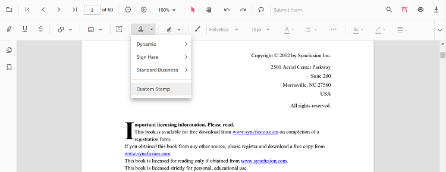

# Stamp annotation in JavaScript PDF Viewer control

The PDF Viewer control provides options to add, edit, delete, and rotate the following stamp annotations in PDF documents:

* Dynamic
* Sign Here
* Standard Business
* Custom Stamp


## Add stamp annotations to the PDF document

The stamp annotations can be added to the PDF document using the annotation toolbar.

* Click the **Edit Annotation** button in the PDF Viewer toolbar. A toolbar appears below it.
* Click the **Stamp Annotation** drop-down button. The pop-up lists available stamp annotation types.


* Select a stamp type to enable its annotation mode.


* Place the stamp on the pages of the PDF document.

N> When in pan mode and a stamp annotation tool is selected, the PDF Viewer switches to text select mode automatically for a smooth interaction experience.

The following examples switch to stamp annotation modes.

```html
<button id="dynamicStamp">Sign Stamp</button>
<button id="signStamp">Sign Stamp</button>
<button id="standardBusinessStamp">StandardBusiness Stamp</button>
```



var pdfviewer = new ej.pdfviewer.PdfViewer({
                    documentPath: "https://cdn.syncfusion.com/content/pdf/pdf-succinctly.pdf",
                    resourceUrl : "https://cdn.syncfusion.com/ej2/31.2.2/dist/ej2-pdfviewer-lib"
                });
ej.pdfviewer.PdfViewer.Inject(ej.pdfviewer.TextSelection, ej.pdfviewer.TextSearch, ej.pdfviewer.Print, ej.pdfviewer.Navigation, ej.pdfviewer.Toolbar,
                              ej.pdfviewer.Magnification, ej.pdfviewer.Annotation, ej.pdfviewer.FormDesigner, ej.pdfviewer.FormFields, ej.pdfviewer.PageOrganizer);
pdfviewer.appendTo('#PdfViewer');

let dynamicStamp = document.getElementById('dynamicStamp');
if (dynamicStamp) {
    dynamicStamp.addEventListener('click', function () {
        if (pdfviewer) {
            pdfviewer.annotationModule.setAnnotationMode('Stamp', 'NotApproved');
        }
    });
}
let signStamp = document.getElementById('signStamp');
if (signStamp) {
    signStamp.addEventListener('click', function () {
        if (pdfviewer) {
            pdfviewer.annotationModule.setAnnotationMode('Stamp', undefined, 'Witness');
        }
    });
}
let standardBusinessStamp = document.getElementById('standardBusinessStamp');
if (standardBusinessStamp) {
    standardBusinessStamp.addEventListener('click', function () {
        if (pdfviewer) {
            pdfviewer.annotationModule.setAnnotationMode('Stamp', undefined, undefined, 'Approved');
        }
    });
}




import { PdfViewer, Toolbar, Magnification, Navigation, Annotation, LinkAnnotation, ThumbnailView, BookmarkView, TextSelection, TextSearch, FormFields, FormDesigner, PageOrganizer, SignStampItem, StandardBusinessStampItem, DynamicStampItem,} from '@syncfusion/ej2-pdfviewer';

PdfViewer.Inject(Toolbar, Magnification, Navigation, Annotation, LinkAnnotation, ThumbnailView, BookmarkView, TextSelection, TextSearch, FormFields, FormDesigner, PageOrganizer);

let pdfviewer: PdfViewer = new PdfViewer();
pdfviewer.documentPath = "https://cdn.syncfusion.com/content/pdf/pdf-succinctly.pdf";
pdfviewer.serviceUrl = 'https://document.syncfusion.com/web-services/pdf-viewer/api/pdfviewer';
pdfviewer.appendTo('#PdfViewer');

let dynamicStamp = document.getElementById('dynamicStamp');
if (dynamicStamp) {
    dynamicStamp.addEventListener('click', function () {
        if (pdfviewer) {
            pdfviewer.annotationModule.setAnnotationMode('Stamp', 'NotApproved');
        }
    });
}
let signStamp = document.getElementById('signStamp');
if (signStamp) {
    signStamp.addEventListener('click', function () {
        if (pdfviewer) {
            pdfviewer.annotationModule.setAnnotationMode('Stamp', undefined, 'Witness');
        }
    });
}
let standardBusinessStamp = document.getElementById('standardBusinessStamp');
if (standardBusinessStamp) {
    standardBusinessStamp.addEventListener('click', function () {
        if (pdfviewer) {
            pdfviewer.annotationModule.setAnnotationMode('Stamp', undefined, undefined, 'Approved');
        }
    });
}




## Enable or disable stamp annotations

Use the `enableStampAnnotations` API to enable or disable stamp annotation in the PDF Viewer loads. Defaults to true.




// Inject required modules
ej.pdfviewer.PdfViewer.Inject(
  ej.pdfviewer.Toolbar,
  ej.pdfviewer.Magnification,
  ej.pdfviewer.Navigation,
  ej.pdfviewer.Annotation,
  ej.pdfviewer.LinkAnnotation,
  ej.pdfviewer.ThumbnailView,
  ej.pdfviewer.BookmarkView,
  ej.pdfviewer.TextSelection,
  ej.pdfviewer.TextSearch,
  ej.pdfviewer.FormFields,
  ej.pdfviewer.FormDesigner,
  ej.pdfviewer.PageOrganizer
);

// Initialize the PDF Viewer
var pdfviewer = new ej.pdfviewer.PdfViewer({
  documentPath: "https://cdn.syncfusion.com/content/pdf/pdf-succinctly.pdf",
  resourceUrl: "https://cdn.syncfusion.com/ej2/31.2.2/dist/ej2-pdfviewer-lib",
  enableStampAnnotations: false // Disables stamp annotation feature
});

// Render the viewer
pdfviewer.appendTo('#PdfViewer');




// Inject required modules
ej.pdfviewer.PdfViewer.Inject(
  ej.pdfviewer.Toolbar,
  ej.pdfviewer.Magnification,
  ej.pdfviewer.Navigation,
  ej.pdfviewer.Annotation,
  ej.pdfviewer.LinkAnnotation,
  ej.pdfviewer.ThumbnailView,
  ej.pdfviewer.BookmarkView,
  ej.pdfviewer.TextSelection,
  ej.pdfviewer.TextSearch,
  ej.pdfviewer.FormFields,
  ej.pdfviewer.FormDesigner,
  ej.pdfviewer.PageOrganizer
);

// Initialize the PDF Viewer
var pdfviewer = new ej.pdfviewer.PdfViewer({
  documentPath: "https://cdn.syncfusion.com/content/pdf/pdf-succinctly.pdf",
  serviceUrl = 'https://document.syncfusion.com/web-services/pdf-viewer/api/pdfviewer/';  
  enableStampAnnotations: false // Disables stamp annotation feature
});

// Render the viewer
pdfviewer.appendTo('#PdfViewer');




>API reference: For more information about enableStampAnnotations, see [enableStampAnnotations API Documentation](https://ej2.syncfusion.com/javascript/documentation/api/pdfviewer/index-default#enablestampannotations)

## Add a custom stamp to the PDF document

* Click the **Edit Annotation** button in the PDF Viewer toolbar. A toolbar appears below it.
* Click the **Stamp Annotation** drop-down button. The pop-up lists available stamp annotation types.
* Click the Custom Stamp button.



* In the file explorer dialog, choose an image and add it to the PDF page.

>Only JPG and JPEG image formats are supported for custom stamp annotations.

## Add a stamp annotation to the PDF document programmatically

The PDF Viewer library allows adding a stamp annotation programmatically using the [addAnnotation()](https://ej2.syncfusion.com/javascript/documentation/api/pdfviewer/annotation/#annotation) method.

Here are examples showing how to add stamp annotations programmatically using addAnnotation():

```html
    <button id="dynamicStamp">Add Sign Stamp Programmatically</button>
    <button id="signStamp">Add Sign Stamp Programmatically</button>
    <button id="standardBusinessStamp">Add StandardBusiness Stamp Programmatically</button>
    <button id="customStamp">Add Custom Stamp Programmatically</button>
```




var pdfviewer = new ej.pdfviewer.PdfViewer({
                    documentPath: "https://cdn.syncfusion.com/content/pdf/pdf-succinctly.pdf",
                    resourceUrl : "https://cdn.syncfusion.com/ej2/31.2.2/dist/ej2-pdfviewer-lib",
                });
ej.pdfviewer.PdfViewer.Inject(ej.pdfviewer.TextSelection, ej.pdfviewer.TextSearch, ej.pdfviewer.Print, ej.pdfviewer.Navigation, ej.pdfviewer.Toolbar,
                              ej.pdfviewer.Magnification, ej.pdfviewer.Annotation, ej.pdfviewer.FormDesigner, ej.pdfviewer.FormFields, ej.pdfviewer.PageOrganizer);
pdfviewer.appendTo('#PdfViewer');

let dynamicStamp = document.getElementById('dynamicStamp');
if (dynamicStamp) {
    dynamicStamp.addEventListener('click', function () {
        if (pdfviewer) {
            pdfviewer.annotation.addAnnotation("Stamp", {
                offset: { x: 200, y: 140 },
                pageNumber: 1
            }, 'Approved');
        }
    });
}
let signStamp = document.getElementById('signStamp');
if (signStamp) {
    signStamp.addEventListener('click', function () {
        if (pdfviewer) {
            pdfviewer.annotation.addAnnotation("Stamp", {
                offset: { x: 200, y: 240 },
                pageNumber: 1
            }, undefined,'Witness');
        }
    });
}
let standardBusinessStamp = document.getElementById('standardBusinessStamp');
if (standardBusinessStamp) {
    standardBusinessStamp.addEventListener('click', function () {
        if (pdfviewer) {
            pdfviewer.annotation.addAnnotation("Stamp", {
                offset: { x: 200, y: 340 },
                pageNumber: 1
            }, undefined, undefined, 'Approved');
        }
    });
}

let customStamp = document.getElementById('customStamp');
if (customStamp) {
    customStamp.addEventListener('click', function () {
        if (pdfviewer) {
            pdfviewer.annotation.addAnnotation('Stamp',
            {
                offset: { x: 100, y: 440 },
                 width: 46,
                author: 'Guest',
                height: 100,
                isLock: true,
                pageNumber: 1,
                customStamps: [
                    {
                        customStampName: "Image",
                        customStampImageSource:
                            "data:image/jpeg;base64,/9j/4AAQSkZJRgABAQAAAQABAAD/2wCEAAkGBwgHBgkIBwgKCgkLDRYPDQwMDRsUFRAWIB0iIiAdHx8kKDQsJCYxJx8fLT0tMTU3Ojo6Iys/RD84QzQ5OjcBCgoKDQwNGg8PGjclHyU3Nzc3Nzc3Nzc3Nzc3Nzc3Nzc3Nzc3Nzc3Nzc3Nzc3Nzc3Nzc3Nzc3Nzc3Nzc3Nzc3N//AABEIAIIAqwMBIgACEQEDEQH/xAAbAAEAAgMBAQAAAAAAAAAAAAAABQYBAwQHAv/EAEEQAAEDAwIEAwYDBAYLAAAAAAECAwQABREGIRIxQVETYXEHFCIygZEVQmIjUnKCJCUzU6HRFhc1c5KisbKzwvD/xAAVAQEBAAAAAAAAAAAAAAAAAAAAAf/EABQRAQAAAAAAAAAAAAAAAAAAAAD/2gAMAwEAAhEDEQA/APcaUpQKUpQKUpQKUpQKUpQKVzXGdFtsN2ZPfbYjNJ4nHHDgJFfEK5Q5ttbuUaQhcNxvxUPcklPfflQdlYJxURpe/salthuMNpxEYvuNtKc28VKVcPGB2JB577Vyz7pNuUxy26eWlCml8Mu4OI4kR/0oB2Wvp2T17EJK43qDbloakOqL7m6I7TanHVjOMhCQTjzxgVut89i4Mqdj8Y4VlC0OIKFIUOYKTuOn0INRZZtWkrVLuDpIIHHJlPK4nX1dOJR5kk4A5DYDArVoWbHuVgTPjvF5Ul5xx5zhIBc4jkJyBlI+UHqE0FjpSlApSlApSlApSlApSlApSlApSlArClAczgVmqr7QZLptkezxHi1KvD4ihxKsFprBU6v6IB+pFBTdUKf1uUuFa0WpyUIVoYBx706chchXdKEhZSPLNXXVTsOw6NdjNxkvJS0iLEidHnDhLaPME4z5ZzVHk6kTHu1vTpyE1Jf8L3Oww1ZDaGc4XJXjklXDhP6UlWd63ybrL1rq1mNa1hLcAKEeQgcTbbvyuScHnw5KGweZJPIVRYoDT6okfSlnfWhmCwlu43FGAUKxu2j9atyT+UHvirZBixLZBaiQ2kR4zCMIQnZKRWuz2yLZ7czBgo4GWh13KidypR6qJJJPevOvaFqCXqC4HSGmzxlxQbmvJJAPXwwe2M8R9R3FQc1xde9qOqEW+C44jTFuVxPvtnHvCvI+e4HYZPavV4sdmLGajxmktMtJCENpGAkDkBUbpixRNO2dm3Q0/Cj4lrPNazzUf/uWKlkkEZByKDNKUoFKUoFKUoFKUoFKwahZ2p7dFfMZhTs+ZnHu0FHirB/VjZHqogUE3WOIYzUApzUlwBKUxLOwQCFL/bv467DCEn6qr5i6btk5ht+ZOlXlCxlLkiTxtr8whGG8fy0HdK1FZorymHbjH8dPNlC+NY/lTk1XNTe0m12SCXBFnrkOpX7uh6ItkKUBzPGEnhzjcA1bokKLAZS1BjMx20jAQy2EjHoK85i6PuOovaFNv+pWPDt8J/ggMKUCXktq+BX8HNXmT2G9HLF1trSyW2GrUFgbluT3eCIRIS26tS/iSjwgCcDl35Z3qBlSb/edVcN58e4tojKafiW2MfDQpRBXF8X5UnZPGsq5ZAr0TV2j52oL9Anx7wqCxHYWypLbeXAFH4lNqz8KiNs8x0qy2e1QrNbmYFuZDUdkYSkHOT1JPUk7k0HhsG6u3SHPeisLFwnucE95hOPdmc8DUNhR/OrCR5Ak9NvX9F6cRp20IZIR706AX1I5DA2Qn9KRsPvzJqGmXG0N6pfk3KTEhW2ykBsLKUh2Y4nKlY6lKCAOuVmuafry5T5rFs0vaHQ5JSVIm3FBaQhvq7wfNwjurAPnQZ9pms1WtlVmtDqRcnxwrdK+ERknqT0Vj7DftUN7OA1BilywWx65TnU8PjOAtMsJJzlbhBypXMhPFgADbrF6B0sNSagkzrk+5cbTDeUQ5IHwy3T+bHbYE/y9yK9sabQ02lDSAhCRhKUjAAoIaFaZ8gh++zg8vIKYsUFphB+/Ev8AmONuVTYGBgcqzSoFKUoFKUoFKUoFcV4mOW+2yJbEN6Y40gqTHYGVuHsK7awRmg8rd/1gameJn2n8Ptv5YQn+78f+8cSFLI57AJ8/Oy2eyalhxkRo79htEVI2YgQ1uEH+JSgD68NW/FQ2r7yqxWCTNZR4knZqM1/ePLPChP3IoKRc4l91FqJ3TkfUst2Aygfiz7TDTaEA8mkEAnjPXfAH2NohaPehR2Y8bVF9QwygNttJMcJSkDAAAZru0hY02CyMxFK8SWv9rMfPN55W6lE9d9vQCpughmrLNZVxI1Fc19kupYUn/wAYP+NdQVMjD+khEhsfM40nhUPMp3z9D9K76xQRN/uNxjWj3qwW9F0krKfDa8YISUn83F25VVocf2kXdR/EJlrskZQxiM14ryR5ZJA9c/SrHo973m2SFjPhCfKSzn9wPLCceXbyxUpPmRrdDemTHUMx2UFbjizgJAoPGrbpyJBRPvEi53STfhc34MRCVMrckLSvCT8aFEEjBUQdhUlfbHcrcItuYvc+VqbUBDcpf7PgDSfnJPBxBCQcDBGcnlUn7Om4kly+aonhbPBPkeGiRsIqCEqUcHkSMZ9K5bRqqMbjJ1E5FkTrndFe72m2sAF1MVBI4iD8iVKyoqO2w7VRbrJpRdkt7MGDe56GGhgJ8Njn1P8AZ9fPNd5gXNKQEXt0q7uRmz/0AqFja29znGFq2EmxuqaLzDrkhK2XUj5gF7YUNvhqsX+66nvtqlarsrsmDa7aUvQIqQULuCUqHiLdGPk4c8I686g9BMK8/lu7IxyzCB/9q4bpJkWeP7xd9TQojGeHjdipRk9hlW5/yrF21raoEGM/HcM+TMSDEhwyFuv55YA5DfcnYVx2fTD9wm/jeskMS7goYYhY42IKeyQeajtlR68tqCUjtXWVHakQL/FejupC23PcwsLSeoKVgEVsLWomsFMm1yAM5C2HGir6hSsfY1B6ILViuV50utSWkRpHvNvQTgGO6OLCe/CviB7bVMXjVMC2vCG0VTrk4MtQIeHHleZHJCf1KwKDTcNSqskB2XqSCYjTQ3fYcDzSj0SOSgSdhlP1r50FqherbM5cVQVQwmQtkNlfFxBON8/XB8wa4JNsfUzJ1Jq/wXFQWnH4tvbPEzFCUk8RyPjd2+bkOQ7nHs0iSLRY7dBkKUoy4gnYV8yHFEFxPoCtOPU+VBdaUpQKUpQKqF4H4xry027YxrYyq4yB3cPwND/vV9BVvNVTRf8ATrhqC9KIUJU4x2T2aZHAB/xcZ+tBa6UpQKr+r7lIjRWrdaz/AFrcleBF2z4W3xOq8kDf1wOtSV5ukSz216fOc4GGhk4GSo9EpHVROwHU1DaWtst2S9qG+N8Nzlp4WWSc+6R85S0P1dVHqfSgm7Rb2bTbItvjcXhR2g2kqOVKx1J6k8zVbfP+leoSxkGx2h7LxztJlD8h6FCOZ/VjtXdq25ymWY9ptSv61uSi2yr+4Rj43T5JHLzIrRfHIujtCy/dthFiqQyD8zrqhgZ7qUo/40FJsbL2q7W/YYchUdqdMlXC5SEDJQhbq/CbHTKuEEj90edXfRWi4Gk4yvAUqTMdADsp35ikckj91I7Vn2e6bTpnTUaG5hUtweLJcHVw9PQch6VZ6Dhudot12aQ1dIEWa2hXEhEllLgSe4Cga7OBPBwYHDjGMbYr6pQRNp03ZrM669arVChuu/OphkJJ8tunlUt0pSgjLxYLVew2LtAYleEctqcT8SPRXMfevq0WO12VtTdpgRoiVHKy02AVnuo8z9akaUEBr2O9L0beI8dtx1xyMpIQ2kqUodQANycZrk07JVeLyq4R2HmrZCiiJFW62UF9SilS1AHfhHAgA7b8XlVqIzWMb0GaUpQKUpQc9wkCJAkyVcmWlOH6AmoL2bsqZ0LZi4SXHowfcUeZU58ZP3VUpqNlcjT1zYaGVuRHUJA6koIFcuiZDcnR9lea+RcFkgdvgG1BN1omS48GM7JluoZYaSVuOLOEpSOZJrXdLjEtUF2bcJLceM0MrccOAP8AP0qqR4czWk1qfd2HItgZWFxLe6MLlKHJ14dE9kH1NBttDEjVVzYvtxaUza4547ZCdThSz0kLHQ4+UdAc86tcmQzDjOyJLiW2WUFxxxWwSkDJJ+lbQAOVVPU6vx29xdLsqPgBKZdzIG3ghWEtE9CtX/Kk0GzSTDlwekamnNlL08BMNCs5ZijdAweRVniPqB0qsarce1XrezWlghVsiTCp3B/tFtDicPok8CP4lq7VedSzXYFr8OBwpmyVCPEyPhStQPxEfupAKj5JNVz2eW9t2RIvLJWqGlsQbetXN1pCsuPerjmVZ6gCqLyBis0pUClKUClKUClKUClKUClKUClKUGCMjFVNqw36yeOxpmbb/wAPdcU43GntLPuqlHJCFJO6ckkJI2zzq20oKtE0iZE5q46mnKu8to8TLSmwiMwe6G99/wBSiTVoGwrNcV4uUez2yTcJiiGY7ZWrAyT2AHUk7D1oMXq6R7PapNxlk+FHQVkAZKj0SB1JOAPWozRtqfhW5ybcf9qXJz3qZk54FEbNg9kDCfoT1qGi++alvEGJdGwlq2hE+e0FApTKVu0we4Qk8R7nhNXkcqCs6q0zK1DcIWbkqNbW23ESmWk4ceCsZAV+UEAgnngnvViix2okZqPHbS2y0kIbQkYCUjYAVtpQKUpQKUpQKUpQKUpQKUpQKUpQKUpQKUpQKouv7mwi7W2HJBdZiJNxXHSd5DoUER2gOpU4rI/gq9VxO2i3PXRu6OwmFz2m/DbkKQCtKck4B+p+9BxaTtblqtQEvhM+UtUqatO4U8vdW/YbJHkkVNVgDFZoFKUoFKUoFKUoFKUoFKUoFKUoFKUoFKUoFKUoFKUoFKUoFKUoFKUoFKUoFKUoFKUoFKUoFKUoP//Z"
                    }
                ]
            });
        }
    });
}



var pdfviewer = new ej.pdfviewer.PdfViewer({
                    documentPath: "https://cdn.syncfusion.com/content/pdf/pdf-succinctly.pdf",
                    serviceUrl : "https://document.syncfusion.com/web-services/pdf-viewer/api/pdfviewer",
                });
ej.pdfviewer.PdfViewer.Inject(ej.pdfviewer.TextSelection, ej.pdfviewer.TextSearch, ej.pdfviewer.Print, ej.pdfviewer.Navigation, ej.pdfviewer.Toolbar,
                              ej.pdfviewer.Magnification, ej.pdfviewer.Annotation, ej.pdfviewer.FormDesigner, ej.pdfviewer.FormFields, ej.pdfviewer.PageOrganizer);
pdfviewer.appendTo('#PdfViewer');
let dynamicStamp = document.getElementById('dynamicStamp');
if (dynamicStamp) {
    dynamicStamp.addEventListener('click', function () {
        if (pdfviewer) {
            pdfviewer.annotation.addAnnotation("Stamp", {
                offset: { x: 200, y: 140 },
                pageNumber: 1
            }, 'Approved');
        }
    });
}
let signStamp = document.getElementById('signStamp');
if (signStamp) {
    signStamp.addEventListener('click', function () {
        if (pdfviewer) {
            pdfviewer.annotation.addAnnotation("Stamp", {
                offset: { x: 200, y: 240 },
                pageNumber: 1
            }, undefined,'Witness');
        }
    });
}
let standardBusinessStamp = document.getElementById('standardBusinessStamp');
if (standardBusinessStamp) {
    standardBusinessStamp.addEventListener('click', function () {
        if (pdfviewer) {
            pdfviewer.annotation.addAnnotation("Stamp", {
                offset: { x: 200, y: 340 },
                pageNumber: 1
            }, undefined, undefined, 'Approved');
        }
    });
}

let customStamp = document.getElementById('customStamp');
if (customStamp) {
    customStamp.addEventListener('click', function () {
        if (pdfviewer) {
            pdfviewer.annotation.addAnnotation('Stamp',
            {
                offset: { x: 100, y: 440 },
                 width: 46,
                author: 'Guest',
                height: 100,
                isLock: true,
                pageNumber: 1,
                customStamps: [
                    {
                        customStampName: "Image",
                        customStampImageSource:
                            "data:image/jpeg;base64,/9j/4AAQSkZJRgABAQAAAQABAAD/2wCEAAkGBwgHBgkIBwgKCgkLDRYPDQwMDRsUFRAWIB0iIiAdHx8kKDQsJCYxJx8fLT0tMTU3Ojo6Iys/RD84QzQ5OjcBCgoKDQwNGg8PGjclHyU3Nzc3Nzc3Nzc3Nzc3Nzc3Nzc3Nzc3Nzc3Nzc3Nzc3Nzc3Nzc3Nzc3Nzc3Nzc3Nzc3N//AABEIAIIAqwMBIgACEQEDEQH/xAAbAAEAAgMBAQAAAAAAAAAAAAAABQYBAwQHAv/EAEEQAAEDAwIEAwYDBAYLAAAAAAECAwQABREGIRIxQVETYXEHFCIygZEVQmIjUnKCJCUzU6HRFhc1c5KisbKzwvD/xAAVAQEBAAAAAAAAAAAAAAAAAAAAAf/EABQRAQAAAAAAAAAAAAAAAAAAAAD/2gAMAwEAAhEDEQA/APcaUpQKUpQKUpQKUpQKUpQKVzXGdFtsN2ZPfbYjNJ4nHHDgJFfEK5Q5ttbuUaQhcNxvxUPcklPfflQdlYJxURpe/salthuMNpxEYvuNtKc28VKVcPGB2JB577Vyz7pNuUxy26eWlCml8Mu4OI4kR/0oB2Wvp2T17EJK43qDbloakOqL7m6I7TanHVjOMhCQTjzxgVut89i4Mqdj8Y4VlC0OIKFIUOYKTuOn0INRZZtWkrVLuDpIIHHJlPK4nX1dOJR5kk4A5DYDArVoWbHuVgTPjvF5Ul5xx5zhIBc4jkJyBlI+UHqE0FjpSlApSlApSlApSlApSlApSlApSlArClAczgVmqr7QZLptkezxHi1KvD4ihxKsFprBU6v6IB+pFBTdUKf1uUuFa0WpyUIVoYBx706chchXdKEhZSPLNXXVTsOw6NdjNxkvJS0iLEidHnDhLaPME4z5ZzVHk6kTHu1vTpyE1Jf8L3Oww1ZDaGc4XJXjklXDhP6UlWd63ybrL1rq1mNa1hLcAKEeQgcTbbvyuScHnw5KGweZJPIVRYoDT6okfSlnfWhmCwlu43FGAUKxu2j9atyT+UHvirZBixLZBaiQ2kR4zCMIQnZKRWuz2yLZ7czBgo4GWh13KidypR6qJJJPevOvaFqCXqC4HSGmzxlxQbmvJJAPXwwe2M8R9R3FQc1xde9qOqEW+C44jTFuVxPvtnHvCvI+e4HYZPavV4sdmLGajxmktMtJCENpGAkDkBUbpixRNO2dm3Q0/Cj4lrPNazzUf/uWKlkkEZByKDNKUoFKUoFKUoFKUoFKwahZ2p7dFfMZhTs+ZnHu0FHirB/VjZHqogUE3WOIYzUApzUlwBKUxLOwQCFL/bv467DCEn6qr5i6btk5ht+ZOlXlCxlLkiTxtr8whGG8fy0HdK1FZorymHbjH8dPNlC+NY/lTk1XNTe0m12SCXBFnrkOpX7uh6ItkKUBzPGEnhzjcA1bokKLAZS1BjMx20jAQy2EjHoK85i6PuOovaFNv+pWPDt8J/ggMKUCXktq+BX8HNXmT2G9HLF1trSyW2GrUFgbluT3eCIRIS26tS/iSjwgCcDl35Z3qBlSb/edVcN58e4tojKafiW2MfDQpRBXF8X5UnZPGsq5ZAr0TV2j52oL9Anx7wqCxHYWypLbeXAFH4lNqz8KiNs8x0qy2e1QrNbmYFuZDUdkYSkHOT1JPUk7k0HhsG6u3SHPeisLFwnucE95hOPdmc8DUNhR/OrCR5Ak9NvX9F6cRp20IZIR706AX1I5DA2Qn9KRsPvzJqGmXG0N6pfk3KTEhW2ykBsLKUh2Y4nKlY6lKCAOuVmuafry5T5rFs0vaHQ5JSVIm3FBaQhvq7wfNwjurAPnQZ9pms1WtlVmtDqRcnxwrdK+ERknqT0Vj7DftUN7OA1BilywWx65TnU8PjOAtMsJJzlbhBypXMhPFgADbrF6B0sNSagkzrk+5cbTDeUQ5IHwy3T+bHbYE/y9yK9sabQ02lDSAhCRhKUjAAoIaFaZ8gh++zg8vIKYsUFphB+/Ev8AmONuVTYGBgcqzSoFKUoFKUoFKUoFcV4mOW+2yJbEN6Y40gqTHYGVuHsK7awRmg8rd/1gameJn2n8Ptv5YQn+78f+8cSFLI57AJ8/Oy2eyalhxkRo79htEVI2YgQ1uEH+JSgD68NW/FQ2r7yqxWCTNZR4knZqM1/ePLPChP3IoKRc4l91FqJ3TkfUst2Aygfiz7TDTaEA8mkEAnjPXfAH2NohaPehR2Y8bVF9QwygNttJMcJSkDAAAZru0hY02CyMxFK8SWv9rMfPN55W6lE9d9vQCpughmrLNZVxI1Fc19kupYUn/wAYP+NdQVMjD+khEhsfM40nhUPMp3z9D9K76xQRN/uNxjWj3qwW9F0krKfDa8YISUn83F25VVocf2kXdR/EJlrskZQxiM14ryR5ZJA9c/SrHo973m2SFjPhCfKSzn9wPLCceXbyxUpPmRrdDemTHUMx2UFbjizgJAoPGrbpyJBRPvEi53STfhc34MRCVMrckLSvCT8aFEEjBUQdhUlfbHcrcItuYvc+VqbUBDcpf7PgDSfnJPBxBCQcDBGcnlUn7Om4kly+aonhbPBPkeGiRsIqCEqUcHkSMZ9K5bRqqMbjJ1E5FkTrndFe72m2sAF1MVBI4iD8iVKyoqO2w7VRbrJpRdkt7MGDe56GGhgJ8Njn1P8AZ9fPNd5gXNKQEXt0q7uRmz/0AqFja29znGFq2EmxuqaLzDrkhK2XUj5gF7YUNvhqsX+66nvtqlarsrsmDa7aUvQIqQULuCUqHiLdGPk4c8I686g9BMK8/lu7IxyzCB/9q4bpJkWeP7xd9TQojGeHjdipRk9hlW5/yrF21raoEGM/HcM+TMSDEhwyFuv55YA5DfcnYVx2fTD9wm/jeskMS7goYYhY42IKeyQeajtlR68tqCUjtXWVHakQL/FejupC23PcwsLSeoKVgEVsLWomsFMm1yAM5C2HGir6hSsfY1B6ILViuV50utSWkRpHvNvQTgGO6OLCe/CviB7bVMXjVMC2vCG0VTrk4MtQIeHHleZHJCf1KwKDTcNSqskB2XqSCYjTQ3fYcDzSj0SOSgSdhlP1r50FqherbM5cVQVQwmQtkNlfFxBON8/XB8wa4JNsfUzJ1Jq/wXFQWnH4tvbPEzFCUk8RyPjd2+bkOQ7nHs0iSLRY7dBkKUoy4gnYV8yHFEFxPoCtOPU+VBdaUpQKUpQKqF4H4xry027YxrYyq4yB3cPwND/vV9BVvNVTRf8ATrhqC9KIUJU4x2T2aZHAB/xcZ+tBa6UpQKr+r7lIjRWrdaz/AFrcleBF2z4W3xOq8kDf1wOtSV5ukSz216fOc4GGhk4GSo9EpHVROwHU1DaWtst2S9qG+N8Nzlp4WWSc+6R85S0P1dVHqfSgm7Rb2bTbItvjcXhR2g2kqOVKx1J6k8zVbfP+leoSxkGx2h7LxztJlD8h6FCOZ/VjtXdq25ymWY9ptSv61uSi2yr+4Rj43T5JHLzIrRfHIujtCy/dthFiqQyD8zrqhgZ7qUo/40FJsbL2q7W/YYchUdqdMlXC5SEDJQhbq/CbHTKuEEj90edXfRWi4Gk4yvAUqTMdADsp35ikckj91I7Vn2e6bTpnTUaG5hUtweLJcHVw9PQch6VZ6Dhudot12aQ1dIEWa2hXEhEllLgSe4Cga7OBPBwYHDjGMbYr6pQRNp03ZrM669arVChuu/OphkJJ8tunlUt0pSgjLxYLVew2LtAYleEctqcT8SPRXMfevq0WO12VtTdpgRoiVHKy02AVnuo8z9akaUEBr2O9L0beI8dtx1xyMpIQ2kqUodQANycZrk07JVeLyq4R2HmrZCiiJFW62UF9SilS1AHfhHAgA7b8XlVqIzWMb0GaUpQKUpQc9wkCJAkyVcmWlOH6AmoL2bsqZ0LZi4SXHowfcUeZU58ZP3VUpqNlcjT1zYaGVuRHUJA6koIFcuiZDcnR9lea+RcFkgdvgG1BN1omS48GM7JluoZYaSVuOLOEpSOZJrXdLjEtUF2bcJLceM0MrccOAP8AP0qqR4czWk1qfd2HItgZWFxLe6MLlKHJ14dE9kH1NBttDEjVVzYvtxaUza4547ZCdThSz0kLHQ4+UdAc86tcmQzDjOyJLiW2WUFxxxWwSkDJJ+lbQAOVVPU6vx29xdLsqPgBKZdzIG3ghWEtE9CtX/Kk0GzSTDlwekamnNlL08BMNCs5ZijdAweRVniPqB0qsarce1XrezWlghVsiTCp3B/tFtDicPok8CP4lq7VedSzXYFr8OBwpmyVCPEyPhStQPxEfupAKj5JNVz2eW9t2RIvLJWqGlsQbetXN1pCsuPerjmVZ6gCqLyBis0pUClKUClKUClKUClKUClKUClKUGCMjFVNqw36yeOxpmbb/wAPdcU43GntLPuqlHJCFJO6ckkJI2zzq20oKtE0iZE5q46mnKu8to8TLSmwiMwe6G99/wBSiTVoGwrNcV4uUez2yTcJiiGY7ZWrAyT2AHUk7D1oMXq6R7PapNxlk+FHQVkAZKj0SB1JOAPWozRtqfhW5ybcf9qXJz3qZk54FEbNg9kDCfoT1qGi++alvEGJdGwlq2hE+e0FApTKVu0we4Qk8R7nhNXkcqCs6q0zK1DcIWbkqNbW23ESmWk4ceCsZAV+UEAgnngnvViix2okZqPHbS2y0kIbQkYCUjYAVtpQKUpQKUpQKUpQKUpQKUpQKUpQKUpQKUpQKouv7mwi7W2HJBdZiJNxXHSd5DoUER2gOpU4rI/gq9VxO2i3PXRu6OwmFz2m/DbkKQCtKck4B+p+9BxaTtblqtQEvhM+UtUqatO4U8vdW/YbJHkkVNVgDFZoFKUoFKUoFKUoFKUoFKUoFKUoFKUoFKUoFKUoFKUoFKUoFKUoFKUoFKUoFKUoFKUoFKUoFKUoP//Z"
                    }
                ]
            });
        }
    });
}



> API reference: For more information about customStamp, see [customStamp API Documentation](https://ej2.syncfusion.com/javascript/documentation/api/pdfviewer/index-default#customstamp)

## Edit an existing stamp annotation programmatically

To modify an existing stamp annotation programmatically, use the editAnnotation() method.

Here is an example of using editAnnotation():

```html
<button id="editAnnotation">Edit Stamp annotation</button>
```




var pdfviewer = new ej.pdfviewer.PdfViewer({
                    documentPath: "https://cdn.syncfusion.com/content/pdf/pdf-succinctly.pdf",
                    resourceUrl : "https://cdn.syncfusion.com/ej2/31.2.2/dist/ej2-pdfviewer-lib",
                });
ej.pdfviewer.PdfViewer.Inject(ej.pdfviewer.TextSelection, ej.pdfviewer.TextSearch, ej.pdfviewer.Print, ej.pdfviewer.Navigation, ej.pdfviewer.Toolbar,
                              ej.pdfviewer.Magnification, ej.pdfviewer.Annotation, ej.pdfviewer.FormDesigner, ej.pdfviewer.FormFields, ej.pdfviewer.PageOrganizer);
pdfviewer.appendTo('#PdfViewer');
if (editAnnotation) {
    editAnnotation.addEventListener('click', function () {
        if (pdfviewer) {
            for (let i = 0; i < pdfviewer.annotationCollection.length; i++) {
                if (pdfviewer.annotationCollection[i].shapeAnnotationType === "stamp") {
                    var width = pdfviewer.annotationCollection[i].bounds.width;
                    var height = pdfviewer.annotationCollection[i].bounds.height;
                    pdfviewer.annotationCollection[i].bounds = { x: 100, y: 100, width: width, height: height };
                    pdfviewer.annotationCollection[i].annotationSettings.isLock = true;
                    pdfviewer.annotation.editAnnotation(pdfviewer.annotationCollection[i]);
                }
            }
        }
    });
}




var pdfviewer = new ej.pdfviewer.PdfViewer({
                    documentPath: "https://cdn.syncfusion.com/content/pdf/pdf-succinctly.pdf",
                    serviceUrl : "https://document.syncfusion.com/web-services/pdf-viewer/api/pdfviewer",
                });
ej.pdfviewer.PdfViewer.Inject(ej.pdfviewer.TextSelection, ej.pdfviewer.TextSearch, ej.pdfviewer.Print, ej.pdfviewer.Navigation, ej.pdfviewer.Toolbar,
                              ej.pdfviewer.Magnification, ej.pdfviewer.Annotation, ej.pdfviewer.FormDesigner, ej.pdfviewer.FormFields, ej.pdfviewer.PageOrganizer);
pdfviewer.appendTo('#PdfViewer');

if (editAnnotation) {
    editAnnotation.addEventListener('click', function () {
        if (pdfviewer) {
            for (let i = 0; i < pdfviewer.annotationCollection.length; i++) {
                if (pdfviewer.annotationCollection[i].shapeAnnotationType === "stamp") {
                    var width = pdfviewer.annotationCollection[i].bounds.width;
                    var height = pdfviewer.annotationCollection[i].bounds.height;
                    pdfviewer.annotationCollection[i].bounds = { x: 100, y: 100, width: width, height: height };
                    pdfviewer.annotationCollection[i].annotationSettings.isLock = true;
                    pdfviewer.annotation.editAnnotation(pdfviewer.annotationCollection[i]);
                }
            }
        }
    });
}



## Set default properties during control initialization

Default properties for stamp annotations can be set before creating the control using StampSettings.

After changing default opacity using the Edit Opacity tool, the selected value is applied. The following example sets default stamp annotation settings.




var pdfviewer = new ej.pdfviewer.PdfViewer({
                    documentPath: "https://cdn.syncfusion.com/content/pdf/pdf-succinctly.pdf",
                    resourceUrl : "https://cdn.syncfusion.com/ej2/31.2.2/dist/ej2-pdfviewer-lib",
                    stampSettings : {opacity: 0.3, author: 'Guest User'}
                });
ej.pdfviewer.PdfViewer.Inject(ej.pdfviewer.TextSelection, ej.pdfviewer.TextSearch, ej.pdfviewer.Print, ej.pdfviewer.Navigation, ej.pdfviewer.Toolbar,
                              ej.pdfviewer.Magnification, ej.pdfviewer.Annotation, ej.pdfviewer.FormDesigner, ej.pdfviewer.FormFields, ej.pdfviewer.PageOrganizer);
pdfviewer.appendTo('#PdfViewer');




var pdfviewer = new ej.pdfviewer.PdfViewer({
                    documentPath: "https://cdn.syncfusion.com/content/pdf/pdf-succinctly.pdf",
                    serviceUrl: 'https://document.syncfusion.com/web-services/pdf-viewer/api/pdfviewer',
                    stampSettings : {opacity: 0.3, author: 'Guest User'}
                });
ej.pdfviewer.PdfViewer.Inject(ej.pdfviewer.TextSelection, ej.pdfviewer.TextSearch, ej.pdfviewer.Print, ej.pdfviewer.Navigation, ej.pdfviewer.Toolbar,
                              ej.pdfviewer.Magnification, ej.pdfviewer.Annotation, ej.pdfviewer.FormDesigner, ej.pdfviewer.FormFields, ej.pdfviewer.PageOrganizer);
pdfviewer.appendTo('#PdfViewer');




> API reference: For more information about stampSettings, see [stampSettings API Documentation](https://ej2.syncfusion.com/javascript/documentation/api/pdfviewer/index-default#stampsettings)

## Configure custom stamp settings

Use the customStampSettings property (CustomStampSettingsModel) to configure default behavior and constraints for custom stamp annotations, including size, position, locking, print behavior, and enabling custom stamp mode.




// Inject required modules
ej.pdfviewer.PdfViewer.Inject(
  ej.pdfviewer.Toolbar,
  ej.pdfviewer.Magnification,
  ej.pdfviewer.Navigation,
  ej.pdfviewer.Annotation,
  ej.pdfviewer.LinkAnnotation,
  ej.pdfviewer.ThumbnailView,
  ej.pdfviewer.BookmarkView,
  ej.pdfviewer.TextSelection,
  ej.pdfviewer.TextSearch,
  ej.pdfviewer.FormFields,
  ej.pdfviewer.FormDesigner,
  ej.pdfviewer.PageOrganizer
);

// Initialize the PDF Viewer
var pdfviewer = new ej.pdfviewer.PdfViewer({
  documentPath: "https://cdn.syncfusion.com/content/pdf/pdf-succinctly.pdf",
  resourceUrl: "https://cdn.syncfusion.com/ej2/31.1.17/dist/ej2-pdfviewer-lib",
  customStampSettings: {
    opacity: 1,
    author: 'XYZ',
    width: 100,
    height: 100,
    left: 200,
    top: 200,
    minHeight: 10,
    minWidth: 10,
    maxWidth: 100,
    maxHeight: 100,
    isLock: false,
    enableCustomStamp: true,
    allowedInteractions: ['None'],
    isPrint: true
  }
});

// Render the viewer
pdfviewer.appendTo('#PdfViewer');




// Inject required modules
ej.pdfviewer.PdfViewer.Inject(
  ej.pdfviewer.Toolbar,
  ej.pdfviewer.Magnification,
  ej.pdfviewer.Navigation,
  ej.pdfviewer.Annotation,
  ej.pdfviewer.LinkAnnotation,
  ej.pdfviewer.ThumbnailView,
  ej.pdfviewer.BookmarkView,
  ej.pdfviewer.TextSelection,
  ej.pdfviewer.TextSearch,
  ej.pdfviewer.FormFields,
  ej.pdfviewer.FormDesigner,
  ej.pdfviewer.PageOrganizer
);

// Initialize the PDF Viewer
var pdfviewer = new ej.pdfviewer.PdfViewer({
  documentPath: "https://cdn.syncfusion.com/content/pdf/pdf-succinctly.pdf",
  serviceUrl: "https://document.syncfusion.com/web-services/pdf-viewer/api/pdfviewer/",
  customStampSettings: {
    opacity: 1,
    author: 'XYZ',
    width: 100,
    height: 100,
    left: 200,
    top: 200,
    minHeight: 10,
    minWidth: 10,
    maxWidth: 100,
    maxHeight: 100,
    isLock: false,
    enableCustomStamp: true,
    allowedInteractions: ['None'],
    isPrint: true
  }
});

// Render the viewer
pdfviewer.appendTo('#PdfViewer');




> API reference: For more information about customStampSettings, see [customStampSettings API Documentation](https://ej2.syncfusion.com/javascript/documentation/api/pdfviewer/index-default#customstampsettings)