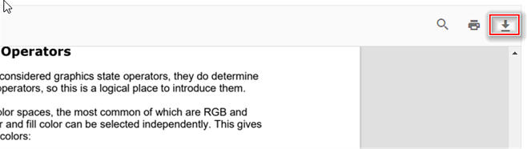

# Download in JavaScript PDF Viewer control

The PDF Viewer supports downloading the currently loaded PDF document. Use the `enableDownload` option to enable or disable download functionality. The examples below demonstrate standalone and server-backed configurations.

```html

<!DOCTYPE html>
<html xmlns="http://www.w3.org/1999/xhtml">
<head>
<title>Essential JS 2</title>
<!-- Essential JS 2 fabric theme -->
<link href="{{:CDN_LINK}}ej2-pdfviewer/styles/fabric.css" rel="stylesheet" type="text/css"/>
<!-- Essential JS 2 PDF Viewer's global script -->
<script src="{{:CDN_LINK}}dist/ej2.min.js" type="text/javascript"></script>
</head>
<body>
<!--element which is going to render-->
<div id='container'>
<div id='PdfViewer' style="height:500px;width:100%;">
</div>
</div>
</body>
</html>

```




var pdfviewer = new ej.pdfviewer.PdfViewer({
        enableDownload: true,
        documentPath: "https://cdn.syncfusion.com/content/pdf/pdf-succinctly.pdf",
});

ej.pdfviewer.PdfViewer.Inject(ej.pdfviewer.Toolbar, ej.pdfviewer.Magnification, ej.pdfviewer.LinkAnnotation,ej.pdfviewer.ThumbnailView, ej.pdfviewer.BookmarkView, ej.pdfviewer.TextSelection, ej.pdfviewer.TextSearch, ej.pdfviewer.Navigation, ej.pdfviewer.Print);
pdfviewer.appendTo('#PdfViewer');




var pdfviewer = new ej.pdfviewer.PdfViewer({
        enableDownload: true,
        documentPath: "https://cdn.syncfusion.com/content/pdf/pdf-succinctly.pdf",
        serviceUrl: 'https://document.syncfusion.com/web-services/pdf-viewer/api/pdfviewer'
});

ej.pdfviewer.PdfViewer.Inject(ej.pdfviewer.Toolbar, ej.pdfviewer.Magnification, ej.pdfviewer.LinkAnnotation,ej.pdfviewer.ThumbnailView, ej.pdfviewer.BookmarkView, ej.pdfviewer.TextSelection, ej.pdfviewer.TextSearch, ej.pdfviewer.Navigation, ej.pdfviewer.Print);
pdfviewer.appendTo('#PdfViewer');






Invoke the download action programmatically with a simple button example:

```
<button id="download">Download</button>

```



var pdfviewer = new ej.pdfviewer.PdfViewer({
                    enableDownload: true,
                    documentPath: "https://cdn.syncfusion.com/content/pdf/pdf-succinctly.pdf",
                });
ej.pdfviewer.PdfViewer.Inject(ej.pdfviewer.Toolbar, ej.pdfviewer.Magnification, ej.pdfviewer.LinkAnnotation,ej.pdfviewer.ThumbnailView, ej.pdfviewer.BookmarkView, ej.pdfviewer.TextSelection, ej.pdfviewer.TextSearch, ej.pdfviewer.Navigation, ej.pdfviewer.Print);
pdfviewer.appendTo('#PdfViewer');

document.getElementById('download').addEventListener('click', function () {
    pdfviewer.download()
});




var pdfviewer = new ej.pdfviewer.PdfViewer({
                    enableDownload: true,
                    documentPath: "https://cdn.syncfusion.com/content/pdf/pdf-succinctly.pdf",
                    serviceUrl: 'https://document.syncfusion.com/web-services/pdf-viewer/api/pdfviewer'
                });
ej.pdfviewer.PdfViewer.Inject(ej.pdfviewer.Toolbar, ej.pdfviewer.Magnification, ej.pdfviewer.LinkAnnotation,ej.pdfviewer.ThumbnailView, ej.pdfviewer.BookmarkView, ej.pdfviewer.TextSelection, ej.pdfviewer.TextSearch, ej.pdfviewer.Navigation, ej.pdfviewer.Print);
pdfviewer.appendTo('#PdfViewer');

document.getElementById('download').addEventListener('click', function () {
    pdfviewer.download()
});




## How to get the base64 string while downloading the PDF document

The [downloadEnd](https://ej2.syncfusion.com/javascript/documentation/api/pdfviewer/#downloadend) event fires after a download completes and exposes the downloaded document as a base64 string.

The following code illustrates how to get the downloaded document as a base64 string.

```

<button id="download">Download</button>
<button id="load">Load</button>

```

```ts

var pdfstream;
document.getElementById('download').addEventListener('click', function () {
    //API to perform download action.
    viewer.download();
    viewer.downloadEnd = function (args) {
        pdfstream = args.downloadDocument;
        //Print the document as a base64 string in the console window.
        console.log(pdfstream);
    };
});

document.getElementById('load').addEventListener('click', function () {
    //Load the base64 string in the viewer.
    viewer.load(pdfstream, null);
});

```

[View sample in GitHub](https://github.com/SyncfusionExamples/javascript-pdf-viewer-examples/tree/master/Download/Get%20the%20base64%20string%20while%20downloading).

## See also

* [Toolbar items](./toolbar)
* [Feature Modules](./feature-module)