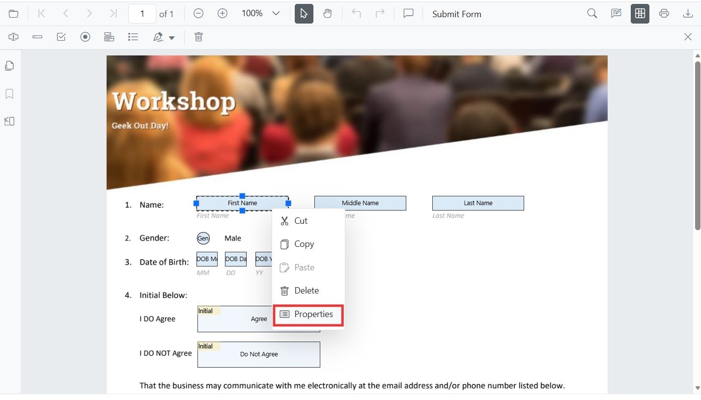

---
layout: post
title: Edit form fields in the JavaScript PDF Viewer | Syncfusion
description: Learn how to edit PDF form fields using the UI and programmatically with APIs in the Syncfusion JavaScript PDF Viewer.
platform: document-processing
control: PDF Viewer
documentation: ug
---

# Edit form fields in JavaScript PDF Viewer

The PDF Viewer component allows user to edit PDF form fields using the Form Designer UI and update them programmatically.

The PDF Viewer supports editing these field types:

- [Textbox](#textbox)
- [Password](#password)
- [CheckBox](#checkbox)
- [RadioButton](#radiobutton)
- [ListBox](#listbox)
- [DropDown](#dropdown)
- [Signature field](#signature-field)
- [Initial field](#initial-field)

## Edit with the UI

- Select a form field and Right-click to open the Properties panel from the context menu to change its settings.



- Drag to move; use resize handles to resize.
- Use the toolbar to toggle field mode and add new fields.

## Textbox

### Edit Textbox

- Right-click the textbox  Properties.
- Change value, font, size, colors, border thickness, alignment, max length, multiline.


### Edit Textbox programmatically

Use updateFormField on a button click for a simple, discoverable flow. The example below retrieves the fields, locates the textbox, and applies value, typography, colors, alignment, and border thickness updates.

```html
<button id="editTextbox">Apply Textbox Changes</button>
```

```js
// Include the required PDF Viewer modules for ES5
ej.pdfviewer.PdfViewer.Inject(
  ej.pdfviewer.Toolbar,
  ej.pdfviewer.Magnification,
  ej.pdfviewer.Navigation,
  ej.pdfviewer.Annotation,
  ej.pdfviewer.LinkAnnotation,
  ej.pdfviewer.ThumbnailView,
  ej.pdfviewer.BookmarkView,
  ej.pdfviewer.TextSelection,
  ej.pdfviewer.TextSearch,
  ej.pdfviewer.FormFields,
  ej.pdfviewer.FormDesigner
);

var pdfviewer = new ej.pdfviewer.PdfViewer();
pdfviewer.documentPath = 'https://cdn.syncfusion.com/content/pdf/form-designer.pdf';
pdfviewer.resourceUrl = 'https://cdn.syncfusion.com/ej2/31.1.23/dist/ej2-pdfviewer-lib';
pdfviewer.appendTo('#PdfViewer');

document.getElementById('editTextbox')?.addEventListener('click', function () {
  // Retrieve form fields collection
  var fields = pdfviewer.retrieveFormFields();
  // Find the textbox field by name (Here field name is First Name)
  var field = fields.find(function (f) { return f.name === 'First Name'; }) || fields[0]; // Update Name accordingly
  if (field) {
    // Update textbox field styling and value
    pdfviewer.formDesignerModule.updateFormField(field, {
      value: 'John',
      fontFamily: 'Courier',
      fontSize: 12,
      fontStyle: ej.pdfviewer.FontStyle.None,
      color: 'black',
      backgroundColor: 'white',
      borderColor: 'black',
      thickness: 2,
      alignment: 'Left',
      maxLength: 50
    });
  }
});
```

## Password

### Edit Password

- Right-click the password field  Properties.
- Change tooltip, required, max length, font, and appearance.


### Edit Password programmatically

Use updateFormField on a button click for a simple, discoverable flow. The example below retrieves the fields, locates the password field, and applies tooltip, validation flags, typography, colors, alignment, max length, and border thickness updates.

```html
<button id="editPasswordBox">Edit PasswordBox</button>
```
```js
// Include the required PDF Viewer modules for ES5
ej.pdfviewer.PdfViewer.Inject(
  ej.pdfviewer.Toolbar,
  ej.pdfviewer.Magnification,
  ej.pdfviewer.Navigation,
  ej.pdfviewer.Annotation,
  ej.pdfviewer.LinkAnnotation,
  ej.pdfviewer.ThumbnailView,
  ej.pdfviewer.BookmarkView,
  ej.pdfviewer.TextSelection,
  ej.pdfviewer.TextSearch,
  ej.pdfviewer.FormFields,
  ej.pdfviewer.FormDesigner
);

var pdfviewer = new ej.pdfviewer.PdfViewer();
pdfviewer.documentPath = 'https://cdn.syncfusion.com/content/pdf/form-designer.pdf';
pdfviewer.resourceUrl = 'https://cdn.syncfusion.com/ej2/31.1.23/dist/ej2-pdfviewer-lib';
pdfviewer.appendTo('#PdfViewer');

document.getElementById('editPasswordBox')?.addEventListener('click', function () {
  // Retrieve form fields collection
  var fields = pdfviewer.retrieveFormFields();
  // Find the password field by name (Here field name is Password)
  var field = fields.find(function (f) { return f.name === 'Password'; });
  if (field) {
    // Update password field properties
    pdfviewer.formDesignerModule.updateFormField(field, {
      tooltip: 'Enter your password',
      isReadOnly: false,
      isRequired: true,
      isPrint: true,
      fontFamily: 'Courier',
      fontSize: 10,
      color: 'black',
      borderColor: 'black',
      backgroundColor: 'white',
      alignment: 'Left',
      maxLength: 20,
      thickness: 1
    });
  }
});
```

## CheckBox

### Edit CheckBox

- Right-click the checkbox  Properties.
- Toggle checked state, change border/background colors and thickness.


### Edit CheckBox programmatically

Use updateFormField on a button click for a simple, discoverable flow. The example below retrieves the fields, locates the checkbox field, and applies checked state, tooltip, colors, and border thickness updates.

```html
<button id="editCheckbox">Edit CheckBox</button>
```
```js
// Include the required PDF Viewer modules for ES5
ej.pdfviewer.PdfViewer.Inject(
  ej.pdfviewer.Toolbar,
  ej.pdfviewer.Magnification,
  ej.pdfviewer.Navigation,
  ej.pdfviewer.Annotation,
  ej.pdfviewer.LinkAnnotation,
  ej.pdfviewer.ThumbnailView,
  ej.pdfviewer.BookmarkView,
  ej.pdfviewer.TextSelection,
  ej.pdfviewer.TextSearch,
  ej.pdfviewer.FormFields,
  ej.pdfviewer.FormDesigner
);

var pdfviewer = new ej.pdfviewer.PdfViewer();
pdfviewer.documentPath = 'https://cdn.syncfusion.com/content/pdf/form-designer.pdf';
pdfviewer.resourceUrl = 'https://cdn.syncfusion.com/ej2/31.1.23/dist/ej2-pdfviewer-lib';
pdfviewer.appendTo('#PdfViewer');

document.getElementById('editCheckbox')?.addEventListener('click', function () {
  // Retrieve form fields collection
  var fields = pdfviewer.retrieveFormFields();
  // Find the checkbox field by name (Here field name is Subscribe)
  var cb = fields.find(function (f) { return f.name === 'Subscribe'; });
  if (cb) {
    // Update checkbox field properties and state
    pdfviewer.formDesignerModule.updateFormField(cb, {
      isChecked: true,
      backgroundColor: 'white',
      borderColor: 'black',
      thickness: 2,
      tooltip: 'Subscribe to newsletter'
    });
  }
});
```

## RadioButton

### Edit RadioButton

- Right-click a radio button  Properties.
- Set selected state, colors, and thickness. Buttons with the same Name form a group; only one can be selected.


### Edit RadioButton programmatically

Use updateFormField on a button click for a simple, discoverable flow. The example below retrieves the fields, locates the radio button group, and applies selection state and border appearance updates.

```html
<button id="editRadio">Edit RadioButton</button>
```
```js
// Include the required PDF Viewer modules for ES5
ej.pdfviewer.PdfViewer.Inject(
  ej.pdfviewer.Toolbar,
  ej.pdfviewer.Magnification,
  ej.pdfviewer.Navigation,
  ej.pdfviewer.Annotation,
  ej.pdfviewer.LinkAnnotation,
  ej.pdfviewer.ThumbnailView,
  ej.pdfviewer.BookmarkView,
  ej.pdfviewer.TextSelection,
  ej.pdfviewer.TextSearch,
  ej.pdfviewer.FormFields,
  ej.pdfviewer.FormDesigner
);

var pdfviewer = new ej.pdfviewer.PdfViewer();
pdfviewer.documentPath = 'https://cdn.syncfusion.com/content/pdf/form-designer.pdf';
pdfviewer.resourceUrl = 'https://cdn.syncfusion.com/ej2/31.1.23/dist/ej2-pdfviewer-lib';
pdfviewer.appendTo('#PdfViewer');

document.getElementById('editRadio')?.addEventListener('click', function () {
  // Retrieve form fields collection
  var fields = pdfviewer.retrieveFormFields();
  // Filter the radio button group by name (Here group name is Gender)
  var genderRadios = fields.filter(function (f) { return f.name === 'Gender'; });
  if (genderRadios[1]) {
    // Update radio button selection and appearance
    pdfviewer.formDesignerModule.updateFormField(genderRadios[0], { isSelected: false });
    pdfviewer.formDesignerModule.updateFormField(genderRadios[1], { isSelected: true, thickness: 2, borderColor: 'black' });
  }
});
```

## ListBox

### Edit ListBox

- Right-click the list box  Properties.
- Add/remove items, set selection, and adjust fonts and colors.


### Edit ListBox programmatically

Use updateFormField on a button click for a simple, discoverable flow. The example below retrieves the fields, locates the list box, and applies options, selection, typography, colors, and border appearance updates.

```html
<button id="editListBox">Edit ListBox</button>
```
```js
// Include the required PDF Viewer modules for ES5
ej.pdfviewer.PdfViewer.Inject(
  ej.pdfviewer.Toolbar,
  ej.pdfviewer.Magnification,
  ej.pdfviewer.Navigation,
  ej.pdfviewer.Annotation,
  ej.pdfviewer.LinkAnnotation,
  ej.pdfviewer.ThumbnailView,
  ej.pdfviewer.BookmarkView,
  ej.pdfviewer.TextSelection,
  ej.pdfviewer.TextSearch,
  ej.pdfviewer.FormFields,
  ej.pdfviewer.FormDesigner
);

var pdfviewer = new ej.pdfviewer.PdfViewer();
pdfviewer.documentPath = 'https://cdn.syncfusion.com/content/pdf/form-designer.pdf';
pdfviewer.resourceUrl = 'https://cdn.syncfusion.com/ej2/31.1.23/dist/ej2-pdfviewer-lib';
pdfviewer.appendTo('#PdfViewer');

document.getElementById('editListBox')?.addEventListener('click', function () {
  // Retrieve form fields collection
  var fields = pdfviewer.retrieveFormFields();
  // Find the listbox field by name (Here field name is States)
  var lb = fields.find(function (f) { return f.name === 'States'; });
  if (lb) {
    // Update listbox options, selection, and appearance
    pdfviewer.formDesignerModule.updateFormField(lb, {
      options: [
        { itemName: 'Alabama', itemValue: 'AL' },
        { itemName: 'Alaska', itemValue: 'AK' },
        { itemName: 'Arizona', itemValue: 'AZ' }
      ],
      value: 'AZ',
      fontFamily: 'Courier',
      fontSize: 10,
      color: 'black',
      borderColor: 'black',
      backgroundColor: 'white'
    });
  }
});
```

## DropDown

### Edit DropDown

- Right-click the dropdown  Properties.
- Add/remove items, set default value, and adjust appearance.


### Edit DropDown programmatically

Use updateFormField on a button click for a simple, discoverable flow. The example below retrieves the fields, locates the dropdown, and applies items, value, typography, colors, and border appearance updates.

```html
<button id="editDropDown">Edit DropDown</button>
```
```js
// Include the required PDF Viewer modules for ES5
ej.pdfviewer.PdfViewer.Inject(
  ej.pdfviewer.Toolbar,
  ej.pdfviewer.Magnification,
  ej.pdfviewer.Navigation,
  ej.pdfviewer.Annotation,
  ej.pdfviewer.LinkAnnotation,
  ej.pdfviewer.ThumbnailView,
  ej.pdfviewer.BookmarkView,
  ej.pdfviewer.TextSelection,
  ej.pdfviewer.TextSearch,
  ej.pdfviewer.FormFields,
  ej.pdfviewer.FormDesigner
);

var pdfviewer = new ej.pdfviewer.PdfViewer();
pdfviewer.documentPath = 'https://cdn.syncfusion.com/content/pdf/form-designer.pdf';
pdfviewer.resourceUrl = 'https://cdn.syncfusion.com/ej2/31.1.23/dist/ej2-pdfviewer-lib';
pdfviewer.appendTo('#PdfViewer');

document.getElementById('editDropDown')?.addEventListener('click', function () {
  // Retrieve form fields collection
  var fields = pdfviewer.retrieveFormFields();
  // Find the dropdown field by name (Here field name is Country)
  var dd = fields.find(function (f) { return f.name === 'Country'; });
  if (dd) {
    // Update dropdown items, value, and appearance
    pdfviewer.formDesignerModule.updateFormField(dd, {
      options: [
        { itemName: 'USA', itemValue: 'US' },
        { itemName: 'Canada', itemValue: 'CA' },
        { itemName: 'Mexico', itemValue: 'MX' }
      ],
      value: 'US',
      fontFamily: 'Courier',
      fontSize: 10,
      color: 'black',
      borderColor: 'black',
      backgroundColor: 'white'
    });
  }
});
```

## Signature field

### Edit Signature field

- Right-click the signature field  Properties.
- Change tooltip, thickness, indicator text, required/visibility states.


### Edit Signature field programmatically

Use updateFormField on a button click for a simple, discoverable flow. The example below retrieves the fields, locates the signature field, and applies tooltip, required/print flags, colors, and border thickness updates.

```html
<button id="editSignature">Edit Signature</button>
```
```js
// Include the required PDF Viewer modules for ES5
ej.pdfviewer.PdfViewer.Inject(
  ej.pdfviewer.Toolbar,
  ej.pdfviewer.Magnification,
  ej.pdfviewer.Navigation,
  ej.pdfviewer.Annotation,
  ej.pdfviewer.LinkAnnotation,
  ej.pdfviewer.ThumbnailView,
  ej.pdfviewer.BookmarkView,
  ej.pdfviewer.TextSelection,
  ej.pdfviewer.TextSearch,
  ej.pdfviewer.FormFields,
  ej.pdfviewer.FormDesigner
);

var pdfviewer = new ej.pdfviewer.PdfViewer();
pdfviewer.documentPath = 'https://cdn.syncfusion.com/content/pdf/form-designer.pdf';
pdfviewer.resourceUrl = 'https://cdn.syncfusion.com/ej2/31.1.23/dist/ej2-pdfviewer-lib';
pdfviewer.appendTo('#PdfViewer');

document.getElementById('editSignature')?.addEventListener('click', function () {
  // Retrieve form fields collection
  var fields = pdfviewer.retrieveFormFields();
  // Find the signature field by name (Here field name is Sign)
  var sig = fields.find(function (f) { return f.name === 'Sign'; });
  if (sig) {
    // Update signature field properties
    pdfviewer.formDesignerModule.updateFormField(sig, {
      tooltip: 'Please sign here',
      thickness: 3,
      isRequired: true,
      isPrint: true,
      backgroundColor: 'white',
      borderColor: 'black'
    });
  }
});
```

## Initial field

### Edit Initial field

- Right-click the initial field  Properties.
- Change tooltip, indicator text, thickness, and required/visibility states.


### Edit Initial field programmatically

Use updateFormField on a button click for a simple, discoverable flow. The example below retrieves the fields, locates the initial field, and applies tooltip, required/print flags, colors, and border thickness updates.

```html
<button id="editInitial">Edit Initial</button>
```
```js
// Include the required PDF Viewer modules for ES5
ej.pdfviewer.PdfViewer.Inject(
  ej.pdfviewer.Toolbar,
  ej.pdfviewer.Magnification,
  ej.pdfviewer.Navigation,
  ej.pdfviewer.Annotation,
  ej.pdfviewer.LinkAnnotation,
  ej.pdfviewer.ThumbnailView,
  ej.pdfviewer.BookmarkView,
  ej.pdfviewer.TextSelection,
  ej.pdfviewer.TextSearch,
  ej.pdfviewer.FormFields,
  ej.pdfviewer.FormDesigner
);

var pdfviewer = new ej.pdfviewer.PdfViewer();
pdfviewer.documentPath = 'https://cdn.syncfusion.com/content/pdf/form-designer.pdf';
pdfviewer.resourceUrl = 'https://cdn.syncfusion.com/ej2/31.1.23/dist/ej2-pdfviewer-lib';
pdfviewer.appendTo('#PdfViewer');

document.getElementById('editInitial')?.addEventListener('click', function () {
  // Retrieve form fields collection
  var fields = pdfviewer.retrieveFormFields();
  // Find the initial field by name (Here field name is Initial)
  var init = fields.find(function (f) { return f.name === 'Initial'; });
  if (init) {
    // Update initial field properties
    pdfviewer.formDesignerModule.updateFormField(init, {
      tooltip: 'Add your initials',
      thickness: 2,
      isRequired: true,
      isPrint: true,
      backgroundColor: 'white',
      borderColor: 'black'
    });
  }
});
```

[View Sample on GitHub](https://github.com/SyncfusionExamples/javascript-pdf-viewer-examples)

## See also

- [Form Designer overview](../overview)
- [Form Designer Toolbar](../../toolbar-customization/form-designer-toolbar)
- [Create form fields](./create-formfields)
- [Remove form Fields](./remove-formfields)
- [Style form fields](./style-formfields)
- [Group form fields](../group-formfields)
- [Form validation](../form-validation)
- [Form fields API](../formfields-api)
