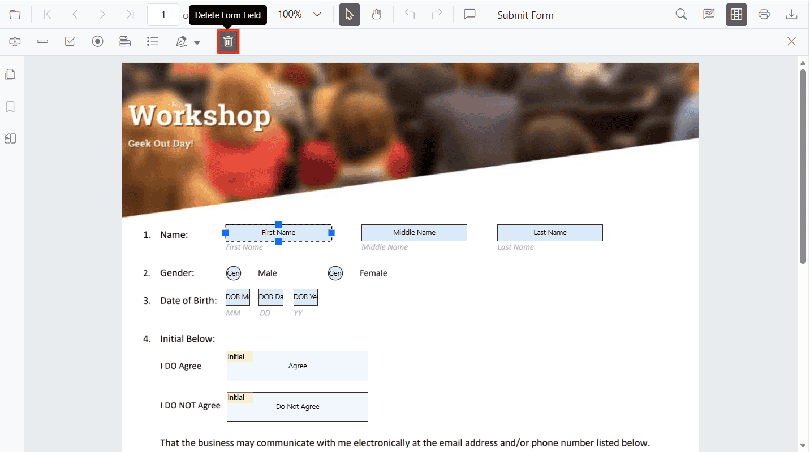

# Remove form fields in JavaScript PDF Viewer

The PDF Viewer component allows users to remove PDF form fields using the Form Designer UI and programmatically.

## Remove form fields using the UI

You can remove designed form fields directly from the Form Designer toolbar.

Steps:

- Select the target form field on the page.
- Click the Delete Form Field icon on the Form Designer toolbar.
- Alternatively, press the `Delete key` after selecting one or more fields.



## Remove form fields programmatically

Use the `deleteFormField` method to remove form fields programmatically. Retrieve the target field from the `retrieveFormFields()` API (by object or ID) and pass it to `deleteFormField`.

The following example adds three fields on document load (Textbox, Password, and Signature) and shows two ways to remove them using buttons.

```html
<button id="deleteAllFields">Delete Form Fields</button>
<button id="deleteById">Delete First Field By ID</button>
<div id="PdfViewer" style="height:500px;width:100%"></div>
```
```js
// Inject required modules
ej.pdfviewer.PdfViewer.Inject(
  ej.pdfviewer.Toolbar,
  ej.pdfviewer.Magnification,
  ej.pdfviewer.Navigation,
  ej.pdfviewer.LinkAnnotation,
  ej.pdfviewer.ThumbnailView,
  ej.pdfviewer.BookmarkView,
  ej.pdfviewer.TextSelection,
  ej.pdfviewer.Annotation,
  ej.pdfviewer.FormDesigner,
  ej.pdfviewer.FormFields
);

var pdfviewer = new ej.pdfviewer.PdfViewer({
  documentPath: 'https://cdn.syncfusion.com/content/pdf/form-designer.pdf',
  resourceUrl: 'https://cdn.syncfusion.com/ej2/31.2.2/dist/ej2-pdfviewer-lib'
});

// Optional server-backed
// pdfviewer.serviceUrl = 'https://document.syncfusion.com/web-services/pdf-viewer/api/pdfviewer/';

pdfviewer.appendTo('#PdfViewer');

// Add form fields on document load
pdfviewer.documentLoad = function () {
  pdfviewer.formDesignerModule.addFormField('Textbox', {
    name: 'First Name',
    bounds: { X: 146, Y: 229, Width: 150, Height: 24 }
  });

  pdfviewer.formDesignerModule.addFormField('Password', {
    name: 'Password',
    bounds: { X: 338, Y: 229, Width: 150, Height: 24 }
  });

  pdfviewer.formDesignerModule.addFormField('SignatureField', {
    name: 'Sign Here',
    bounds: { X: 146, Y: 280, Width: 200, Height: 43 }
  });
};

// Delete all added form fields on button click (passing field objects)
document.getElementById('deleteAllFields') && document.getElementById('deleteAllFields').addEventListener('click', function () {
  // Clone to avoid mutation while deleting
  var fields = pdfviewer.retrieveFormFields().slice();
  fields.forEach(function (field) {
    pdfviewer.formDesignerModule.deleteFormField(field);
  });
});

// Delete by ID on button click (example uses the first field's ID)
document.getElementById('deleteById') && document.getElementById('deleteById').addEventListener('click', function () {
  var list = pdfviewer.retrieveFormFields();
  if (list.length > 0 && list[0].id) {
    pdfviewer.formDesignerModule.deleteFormField(list[0].id);
  }
});
```

N> To configure the server-backed PDF Viewer, add the following `serviceUrl` in your script:
`pdfviewer.serviceUrl = 'https://document.syncfusion.com/web-services/pdf-viewer/api/pdfviewer/';`

[View Sample on GitHub](https://github.com/SyncfusionExamples/javascript-pdf-viewer-examples)

## See also

- [Form Designer overview](../overview)
- [Form Designer Toolbar](../../toolbar-customization/form-designer-toolbar)
- [Create form fields](./create-formfields)
- [Edit form fields](./edit-formfields)
- [Style form fields](./style-formfields)
- [Group form fields](../group-formfields)
- [Form validation](../form-validation)
- [Form fields API](../formfields-api)
