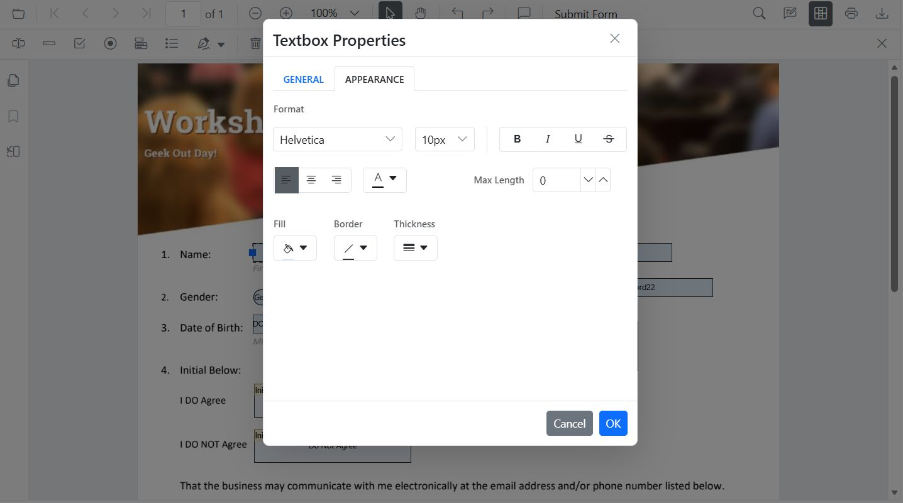
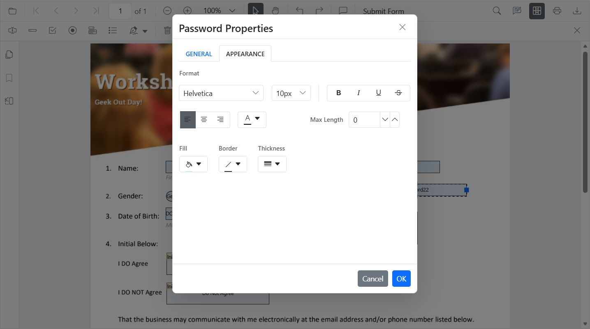
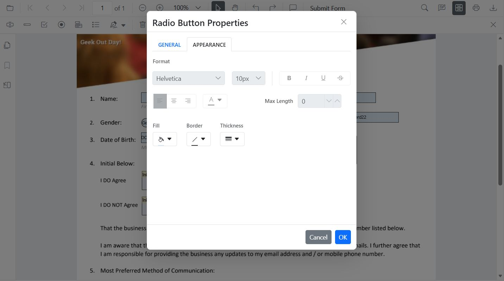
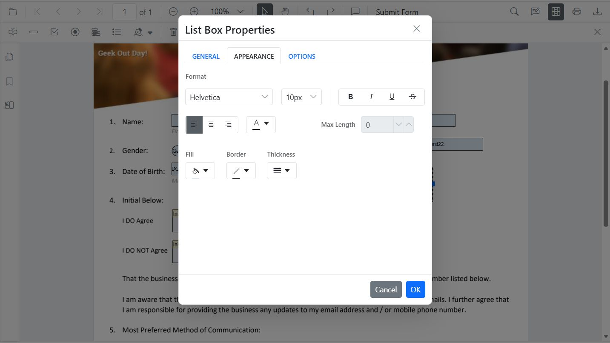
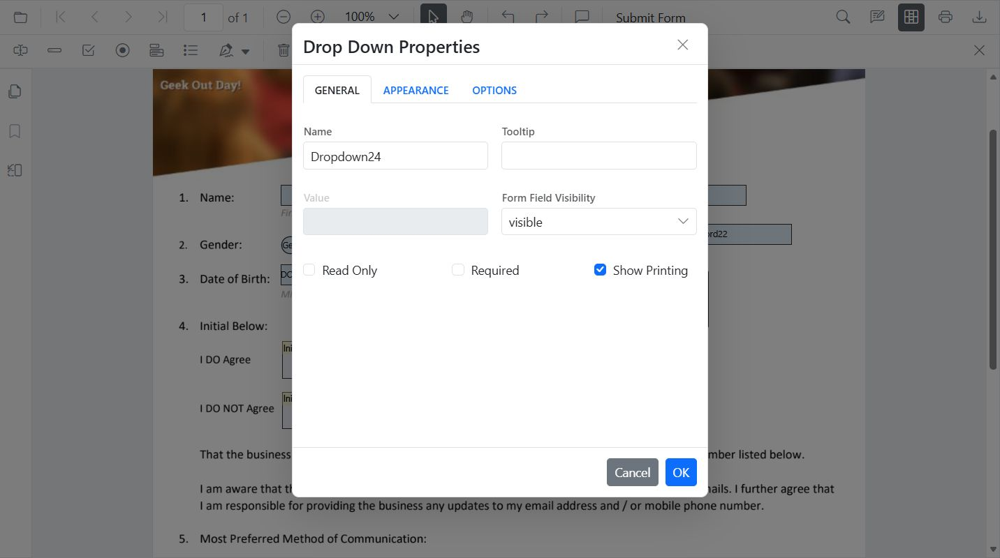
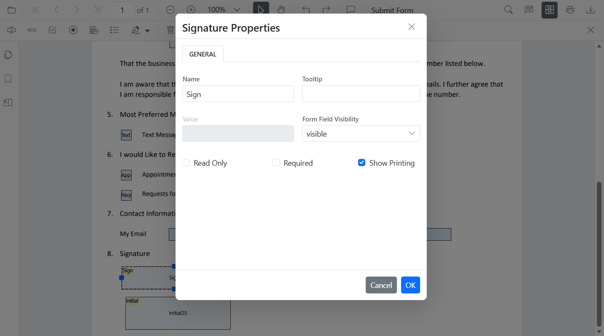
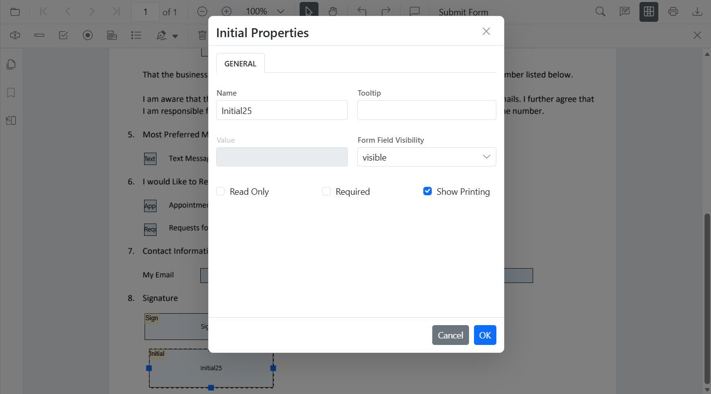

# Style form fields in JavaScript PDF Viewer

The PDF Viewer component allows users to style and customize the appearance of PDF form fields using the Form Designer UI and programmatically. User can also set the default settings applied when fields are added from the Form Designer toolbar.

Supported field types:

- Textbox
- Password
- CheckBox
- RadioButton
- ListBox
- DropDown
- Signature field
- Initial field

## Textbox

### Style Textbox

Use the Properties panel to adjust the value, font family/size/style, text color, border and background colors, border thickness, text alignment, and maximum length.



### Style Textbox programmatically

Use updateFormField to modify a textbox’s appearance and behavior on a button click. The example below finds the field by name (or falls back to the first field) and updates value, typography, colors, alignment, and border thickness.

```html
<button id="updateTextboxStyle">Update Textbox Style</button>
```

```js
var pdfviewer = new ej.pdfviewer.PdfViewer();
pdfviewer.documentPath = 'https://cdn.syncfusion.com/content/pdf/form-designer.pdf';
pdfviewer.resourceUrl = 'https://cdn.syncfusion.com/ej2/31.1.23/dist/ej2-pdfviewer-lib';
ej.pdfviewer.PdfViewer.Inject(
  ej.pdfviewer.Toolbar,
  ej.pdfviewer.Magnification,
  ej.pdfviewer.Navigation,
  ej.pdfviewer.Annotation,
  ej.pdfviewer.LinkAnnotation,
  ej.pdfviewer.ThumbnailView,
  ej.pdfviewer.BookmarkView,
  ej.pdfviewer.TextSelection,
  ej.pdfviewer.TextSearch,
  ej.pdfviewer.FormFields,
  ej.pdfviewer.FormDesigner
);
pdfviewer.appendTo('#PdfViewer');

// Update textbox styling on button click
document.getElementById('updateTextboxStyle') && document.getElementById('updateTextboxStyle').addEventListener('click', function () {
  // Retrieve form fields collection
  var fields = pdfviewer.formFieldCollections || [];
  // Find the textbox field by name
  var tb = (fields || []).filter(function (f) { return f.name === 'First Name'; })[0] || fields[0];
  if (tb) {
    // Update textbox field styling
    pdfviewer.formDesignerModule.updateFormField(tb, {
      value: 'John',
      fontFamily: 'Courier',
      fontSize: 12,
      fontStyle: 'None',
      color: 'black',
      borderColor: 'black',
      backgroundColor: 'white',
      alignment: 'Left',
      thickness: 2
    });
  }
});
```

### Default Textbox settings

The PDF Viewer exposes a default settings APIs for form fields. Use the TextFieldSettings to preconfigure TextBox properties applied when adding fields from the Form Designer toolbar.

```js
// Apply as defaults for Textbox added from toolbar
pdfviewer.textFieldSettings = {
  name: 'Textbox',
  isReadOnly: false,
  visibility: 'visible',
  isRequired: false,
  isPrint: true,
  tooltip: 'Textbox',
  thickness: 4,
  value: 'Textbox',
  fontFamily: 'Courier',
  fontSize: 10,
  fontStyle: 'None',
  color: 'black',
  borderColor: 'black',
  backgroundColor: 'White',
  alignment: 'Left',
  maxLength: 0,
  isMultiline: false
};
```

## Password

### Style Password

Use the Properties panel to configure the tooltip, font family and size, masked text color, border and background colors, text alignment, maximum length, and border thickness.



### Style Password programmatically

```js
var pdfviewer = new ej.pdfviewer.PdfViewer();
pdfviewer.documentPath = 'https://cdn.syncfusion.com/content/pdf/form-designer.pdf';
pdfviewer.resourceUrl = 'https://cdn.syncfusion.com/ej2/31.1.23/dist/ej2-pdfviewer-lib';
ej.pdfviewer.PdfViewer.Inject(
  ej.pdfviewer.Toolbar,
  ej.pdfviewer.Magnification,
  ej.pdfviewer.Navigation,
  ej.pdfviewer.Annotation,
  ej.pdfviewer.LinkAnnotation,
  ej.pdfviewer.ThumbnailView,
  ej.pdfviewer.BookmarkView,
  ej.pdfviewer.TextSelection,
  ej.pdfviewer.TextSearch,
  ej.pdfviewer.FormFields,
  ej.pdfviewer.FormDesigner
);
pdfviewer.appendTo('#PdfViewer');

// Retrieve form fields collection and find the password field by name
var pw = (pdfviewer.formFieldCollections || []).filter(function (f) { return f.name === 'Password'; })[0];
if (pw) {
  // Update password field styling
  pdfviewer.formDesignerModule.updateFormField(pw, {
    tooltip: 'Enter password',
    fontFamily: 'Courier',
    fontSize: 10,
    color: 'black',
    borderColor: 'black',
    backgroundColor: 'white',
    alignment: 'Left',
    maxLength: 20,
    thickness: 1
  });
}
```

### Default Password settings

The PDF Viewer exposes default settings APIs for form fields. Use the PasswordFieldSettings to preconfigure Password properties applied when adding fields from the Form Designer toolbar.

```js
pdfviewer.passwordFieldSettings = {
  name: 'Password',
  isReadOnly: false,
  visibility: 'visible',
  isRequired: false,
  isPrint: true,
  tooltip: 'Password',
  thickness: 4,
  value: 'Password',
  fontFamily: 'Courier',
  fontSize: 10,
  fontStyle: 'None',
  color: 'black',
  borderColor: 'black',
  backgroundColor: 'white',
  alignment: 'Left',
  maxLength: 0
};
```

## CheckBox

### Style CheckBox

Use the Properties panel to toggle the checked state and customize border and background colors, and border thickness.


### Style CheckBox programmatically

```js
var pdfviewer = new ej.pdfviewer.PdfViewer();
pdfviewer.documentPath = 'https://cdn.syncfusion.com/content/pdf/form-designer.pdf';
pdfviewer.resourceUrl = 'https://cdn.syncfusion.com/ej2/31.1.23/dist/ej2-pdfviewer-lib';
ej.pdfviewer.PdfViewer.Inject(
  ej.pdfviewer.Toolbar,
  ej.pdfviewer.Magnification,
  ej.pdfviewer.Navigation,
  ej.pdfviewer.Annotation,
  ej.pdfviewer.LinkAnnotation,
  ej.pdfviewer.ThumbnailView,
  ej.pdfviewer.BookmarkView,
  ej.pdfviewer.TextSelection,
  ej.pdfviewer.TextSearch,
  ej.pdfviewer.FormFields,
  ej.pdfviewer.FormDesigner
);
pdfviewer.appendTo('#PdfViewer');

// Retrieve form fields collection and find the checkbox field by name
var cb = (pdfviewer.formFieldCollections || []).filter(function (f) { return f.name === 'Subscribe'; })[0];
if (cb) {
  // Update checkbox field styling
  pdfviewer.formDesignerModule.updateFormField(cb, {
    isChecked: true,
    backgroundColor: 'white',
    borderColor: 'black',
    thickness: 2,
    tooltip: 'Subscribe'
  });
}
```

### Default CheckBox settings

The PDF Viewer exposes default settings APIs for form fields. Use the CheckBoxFieldSettings to preconfigure CheckBox properties applied when adding fields from the Form Designer toolbar.

```js
pdfviewer.checkBoxFieldSettings = {
  name: 'CheckBox',
  isReadOnly: false,
  visibility: 'visible',
  isRequired: false,
  isPrint: true,
  tooltip: 'CheckBox',
  thickness: 4,
  isChecked: true,
  backgroundColor: 'white',
  borderColor: 'black'
};
```

## RadioButton

### Style RadioButton

Use the Properties panel to set the selected state, border and background colors, and border thickness. Radio buttons with the same name are grouped automatically.



### Style RadioButton programmatically

```js
var pdfviewer = new ej.pdfviewer.PdfViewer();
pdfviewer.documentPath = 'https://cdn.syncfusion.com/content/pdf/form-designer.pdf';
pdfviewer.resourceUrl = 'https://cdn.syncfusion.com/ej2/31.1.23/dist/ej2-pdfviewer-lib';
ej.pdfviewer.PdfViewer.Inject(
  ej.pdfviewer.Toolbar,
  ej.pdfviewer.Magnification,
  ej.pdfviewer.Navigation,
  ej.pdfviewer.Annotation,
  ej.pdfviewer.LinkAnnotation,
  ej.pdfviewer.ThumbnailView,
  ej.pdfviewer.BookmarkView,
  ej.pdfviewer.TextSelection,
  ej.pdfviewer.TextSearch,
  ej.pdfviewer.FormFields,
  ej.pdfviewer.FormDesigner
);
pdfviewer.appendTo('#PdfViewer');

// Retrieve all radio buttons by group name
var radios = (pdfviewer.formFieldCollections || []).filter(function (f) { return f.name === 'Gender'; });
if (radios.length > 1) {
  // Deselect first option
  pdfviewer.formDesignerModule.updateFormField(radios[0], { isSelected: false });
  // Select second option and style
  pdfviewer.formDesignerModule.updateFormField(radios[1], { isSelected: true, thickness: 2, borderColor: 'black' });
}
```

### Default RadioButton settings

The PDF Viewer exposes default settings APIs for form fields. Use the RadioButtonFieldSettings to preconfigure RadioButton properties applied when adding fields from the Form Designer toolbar.

```js
pdfviewer.radioButtonFieldSettings = {
  name: 'RadioButton',
  isReadOnly: false,
  visibility: 'visible',
  isRequired: false,
  isPrint: true,
  tooltip: 'RadioButton',
  thickness: 4,
  isSelected: true,
  backgroundColor: 'white',
  borderColor: 'black',
  value: 'RadioButton'
};
```

## ListBox

### Style ListBox

Use the Properties panel to add or remove items, set the selected value, and adjust typography and colors.



### Style ListBox programmatically

```js
var pdfviewer = new ej.pdfviewer.PdfViewer();
pdfviewer.documentPath = 'https://cdn.syncfusion.com/content/pdf/form-designer.pdf';
pdfviewer.resourceUrl = 'https://cdn.syncfusion.com/ej2/31.1.23/dist/ej2-pdfviewer-lib';
ej.pdfviewer.PdfViewer.Inject(
  ej.pdfviewer.Toolbar,
  ej.pdfviewer.Magnification,
  ej.pdfviewer.Navigation,
  ej.pdfviewer.Annotation,
  ej.pdfviewer.LinkAnnotation,
  ej.pdfviewer.ThumbnailView,
  ej.pdfviewer.BookmarkView,
  ej.pdfviewer.TextSelection,
  ej.pdfviewer.TextSearch,
  ej.pdfviewer.FormFields,
  ej.pdfviewer.FormDesigner
);
pdfviewer.appendTo('#PdfViewer');

// Retrieve form fields collection and find the list box field by name
var lb = (pdfviewer.formFieldCollections || []).filter(function (f) { return f.name === 'States'; })[0];
if (lb) {
  // Update list box items, value, and styling
  pdfviewer.formDesignerModule.updateFormField(lb, {
    options: [
      { itemName: 'Item 1', itemValue: 'item1' },
      { itemName: 'Item 2', itemValue: 'item2' },
      { itemName: 'Item 3', itemValue: 'item3' }
    ],
    value: 'item2',
    fontFamily: 'Courier',
    fontSize: 10,
    color: 'black',
    borderColor: 'black',
    backgroundColor: 'white'
  });
}
```

### Default ListBox settings

The PDF Viewer exposes default settings APIs for form fields. Use the listBoxFieldSettings to preconfigure ListBox properties applied when adding fields from the Form Designer toolbar.

```js
var customOptions = [
  { itemName: 'item1', itemValue: 'item1' },
  { itemName: 'item2', itemValue: 'item2' },
  { itemName: 'item3', itemValue: 'item3' }
];

pdfviewer.listBoxFieldSettings = {
  name: 'ListBox',
  isReadOnly: false,
  visibility: 'visible',
  isRequired: false,
  isPrint: true,
  tooltip: 'ListBox',
  thickness: 4,
  value: 'ListBox',
  fontFamily: 'Courier',
  fontSize: 10,
  fontStyle: 'None',
  color: 'black',
  borderColor: 'black',
  backgroundColor: 'White',
  alignment: 'Left',
  options: customOptions
};
```

## DropDown

### Style DropDown

Use the Properties panel to add or remove items, set the default value, and adjust typography and colors.



### Style DropDown programmatically

```js
var pdfviewer = new ej.pdfviewer.PdfViewer();
pdfviewer.documentPath = 'https://cdn.syncfusion.com/content/pdf/form-designer.pdf';
pdfviewer.resourceUrl = 'https://cdn.syncfusion.com/ej2/31.1.23/dist/ej2-pdfviewer-lib';
ej.pdfviewer.PdfViewer.Inject(
  ej.pdfviewer.Toolbar,
  ej.pdfviewer.Magnification,
  ej.pdfviewer.Navigation,
  ej.pdfviewer.Annotation,
  ej.pdfviewer.LinkAnnotation,
  ej.pdfviewer.ThumbnailView,
  ej.pdfviewer.BookmarkView,
  ej.pdfviewer.TextSelection,
  ej.pdfviewer.TextSearch,
  ej.pdfviewer.FormFields,
  ej.pdfviewer.FormDesigner
);
pdfviewer.appendTo('#PdfViewer');

// Retrieve form fields collection and find the dropdown field by name
var dd = (pdfviewer.formFieldCollections || []).filter(function (f) { return f.name === 'Country'; })[0];
if (dd) {
  // Update dropdown items, value, and styling
  pdfviewer.formDesignerModule.updateFormField(dd, {
    options: [
      { itemName: 'USA', itemValue: 'US' },
      { itemName: 'Canada', itemValue: 'CA' },
      { itemName: 'Mexico', itemValue: 'MX' }
    ],
    value: 'US',
    fontFamily: 'Courier',
    fontSize: 10,
    color: 'black',
    borderColor: 'black',
    backgroundColor: 'white'
  });
}
```

### Default DropDown settings

The PDF Viewer exposes default settings APIs for form fields. DropDown uses DropDownFieldSettings to preconfigure properties applied when adding fields from the Form Designer toolbar.

```js
var ddOptions = [
  { itemName: 'item1', itemValue: 'item1' },
  { itemName: 'item2', itemValue: 'item2' },
  { itemName: 'item3', itemValue: 'item3' }
];

// DropDown uses listBoxFieldSettings for defaults
pdfviewer.DropdownFieldSettings = {
  name: 'DropDown',
  isReadOnly: false,
  visibility: 'visible',
  isRequired: false,
  isPrint: true,
  tooltip: 'DropDown',
  thickness: 4,
  value: 'DropDown',
  fontFamily: 'Courier',
  fontSize: 10,
  fontStyle: 'None',
  color: 'black',
  borderColor: 'black',
  backgroundColor: 'White',
  alignment: 'Left',
  options: ddOptions
};
```

## Signature field

### Style Signature field

Use the Properties panel to configure the tooltip, indicator text, dialog display modes, border thickness, required setting, and colors.



### Style Signature field programmatically

```js
var pdfviewer = new ej.pdfviewer.PdfViewer();
pdfviewer.documentPath = 'https://cdn.syncfusion.com/content/pdf/form-designer.pdf';
pdfviewer.resourceUrl = 'https://cdn.syncfusion.com/ej2/31.1.23/dist/ej2-pdfviewer-lib';
ej.pdfviewer.PdfViewer.Inject(
  ej.pdfviewer.Toolbar,
  ej.pdfviewer.Magnification,
  ej.pdfviewer.Navigation,
  ej.pdfviewer.Annotation,
  ej.pdfviewer.LinkAnnotation,
  ej.pdfviewer.ThumbnailView,
  ej.pdfviewer.BookmarkView,
  ej.pdfviewer.TextSelection,
  ej.pdfviewer.TextSearch,
  ej.pdfviewer.FormFields,
  ej.pdfviewer.FormDesigner
);
pdfviewer.appendTo('#PdfViewer');

// Retrieve form fields collection and find the signature field by name
var sig = (pdfviewer.formFieldCollections || []).filter(function (f) { return f.name === 'Sign'; })[0];
if (sig) {
  // Update signature field settings
  pdfviewer.formDesignerModule.updateFormField(sig, {
    tooltip: 'Please sign here',
    thickness: 3,
    isRequired: true,
    isPrint: true,
    backgroundColor: 'white',
    borderColor: 'black'
  });
}
```

### Default Signature field settings

The PDF Viewer exposes default settings APIs for form fields. Use the SignatureFieldSettings to preconfigure Signature properties applied when adding fields from the Form Designer toolbar.

```js
pdfviewer.signatureFieldSettings = {
  name: 'Signature',
  isReadOnly: false,
  visibility: 'visible',
  isRequired: false,
  isPrint: true,
  tooltip: 'Signature',
  thickness: 4,
  signatureDialogSettings: {
    displayMode: ej.pdfviewer.DisplayMode.Draw | ej.pdfviewer.DisplayMode.Upload | ej.pdfviewer.DisplayMode.Text,
    hideSaveSignature: false
  },
  signatureIndicatorSettings: {
    opacity: 1,
    backgroundColor: '#237ba2',
    height: 50,
    fontSize: 15,
    text: 'Signature Field',
    color: 'white'
  }
};
```

## Initial field

### Style Initial field

Use the Properties panel to configure the tooltip, indicator text, dialog display modes, border thickness, and colors.



### Style Initial field programmatically

```js
var pdfviewer = new ej.pdfviewer.PdfViewer();
pdfviewer.documentPath = 'https://cdn.syncfusion.com/content/pdf/form-designer.pdf';
pdfviewer.resourceUrl = 'https://cdn.syncfusion.com/ej2/31.1.23/dist/ej2-pdfviewer-lib';
ej.pdfviewer.PdfViewer.Inject(
  ej.pdfviewer.Toolbar,
  ej.pdfviewer.Magnification,
  ej.pdfviewer.Navigation,
  ej.pdfviewer.Annotation,
  ej.pdfviewer.LinkAnnotation,
  ej.pdfviewer.ThumbnailView,
  ej.pdfviewer.BookmarkView,
  ej.pdfviewer.TextSelection,
  ej.pdfviewer.TextSearch,
  ej.pdfviewer.FormFields,
  ej.pdfviewer.FormDesigner
);
pdfviewer.appendTo('#PdfViewer');

// Retrieve form fields collection and find the initial field by name
var init = (pdfviewer.formFieldCollections || []).filter(function (f) { return f.name === 'Initial'; })[0];
if (init) {
  // Update initial field settings
  pdfviewer.formDesignerModule.updateFormField(init, {
    tooltip: 'Add your initials',
    thickness: 2,
    isRequired: true,
    isPrint: true,
    backgroundColor: 'white',
    borderColor: 'black'
  });
}
```

### Default Initial field settings

The PDF Viewer exposes default settings APIs for form fields. Use the InitialFieldSettings to preconfigure Initial properties applied when adding fields from the Form Designer toolbar.

```js
pdfviewer.initialFieldSettings = {
  name: 'Initial',
  isReadOnly: false,
  visibility: 'visible',
  isRequired: false,
  isPrint: true,
  tooltip: 'Initial',
  thickness: 4,
  initialIndicatorSettings: {
    opacity: 1,
    backgroundColor: '#237ba2',
    height: 50,
    fontSize: 15,
    text: 'Initial Field',
    color: 'white'
  },
  initialDialogSettings: {
    displayMode: ej.pdfviewer.DisplayMode.Draw | ej.pdfviewer.DisplayMode.Upload | ej.pdfviewer.DisplayMode.Text,
    hideSaveSignature: false
  }
};
```

[View Sample on GitHub](https://github.com/SyncfusionExamples/typescript-pdf-viewer-examples)

## See also

- [Form Designer overview](../overview)
- [Form Designer Toolbar](../../toolbar-customization/form-designer-toolbar)
- [Create form fields](./create-formfields)
- [Edit form fields](./edit-formfields)
- [Remove form fields](./remove-formfields)
- [Group form fields](../group-formfields)
- [Form validation](../form-validation)
- [Add custom data to form fields](../custom-data)
- [Form fields API](../formfields-api)
