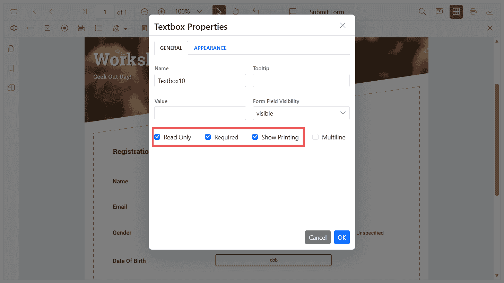

# Form constraints in JavaScript PDF Viewer

The PDF Viewer components provides support to control user interaction and output behavior of form fields using the following constraints:

- [isReadOnly](#make-form-fields-readonly): Prevents users from editing a field.
- [isRequired](#mark-fields-as-required): Marks a field as mandatory and participates in validation.
- [isPrint](#control-field-print-behavior): Includes the field appearance when printing or exporting with print.

You can set these properties when you create fields, update them later programmatically, or configure default settings so fields created from the Form Designer toolbar inherit the values.



## Make Form Fields Read‑Only

Use `isReadOnly` to make a field non-editable in the UI while keeping it modifiable via code. Use the following code-snippets to make form fields read-only.

```js
// HTML element
// <div id="PdfViewer"></div>

// Inject required modules
ej.pdfviewer.PdfViewer.Inject(
  ej.pdfviewer.Toolbar, ej.pdfviewer.Magnification, ej.pdfviewer.Navigation,
  ej.pdfviewer.LinkAnnotation, ej.pdfviewer.ThumbnailView, ej.pdfviewer.BookmarkView,
  ej.pdfviewer.TextSelection, ej.pdfviewer.Annotation, ej.pdfviewer.FormDesigner, ej.pdfviewer.FormFields
);

var pdfviewer = new ej.pdfviewer.PdfViewer({
  documentPath: 'https://cdn.syncfusion.com/content/pdf/form-designer.pdf',
  resourceUrl: 'https://cdn.syncfusion.com/ej2/31.1.23/dist/ej2-pdfviewer-lib'
});
pdfviewer.appendTo('#PdfViewer');

// Use this setting to make Read-only as default for new Textbox fields
// pdfviewer.textFieldSettings = { isReadOnly: true };

pdfviewer.documentLoad = function () {
  // Read-only Textbox
  pdfviewer.formDesignerModule.addFormField('Textbox', {
    name: 'EmployeeId',
    bounds: { X: 146, Y: 229, Width: 150, Height: 24 },
    isReadOnly: true,
    value: 'EMP-0001'
  });

  // Read-only Signature field
  pdfviewer.formDesignerModule.addFormField('SignatureField', {
    name: 'ApplicantSign',
    bounds: { X: 57, Y: 923, Width: 200, Height: 43 },
    isReadOnly: true,
    tooltip: 'Sign to accept the terms'
  });
};
```

## Mark Fields as Required

Use `isRequired` to mark fields as mandatory so they participate in validation during print/download. Turn on validation with enableFormFieldsValidation and handle validateFormFields to block actions if required fields are empty.

```js
// HTML element
// <div id="pdfViewer"></div>

ej.pdfviewer.PdfViewer.Inject(
  ej.pdfviewer.Toolbar, ej.pdfviewer.Magnification, ej.pdfviewer.Navigation,
  ej.pdfviewer.LinkAnnotation, ej.pdfviewer.BookmarkView, ej.pdfviewer.ThumbnailView,
  ej.pdfviewer.TextSelection, ej.pdfviewer.TextSearch, ej.pdfviewer.Print,
  ej.pdfviewer.Annotation, ej.pdfviewer.FormDesigner, ej.pdfviewer.FormFields
);

var pdfviewer = new ej.pdfviewer.PdfViewer({
  documentPath: 'https://cdn.syncfusion.com/content/pdf/form-designer.pdf',
  resourceUrl: 'https://cdn.syncfusion.com/ej2/31.1.23/dist/ej2-pdfviewer-lib'
});

// 1) Default for new Textbox fields
pdfviewer.textFieldSettings = { isRequired: true };

// 2) Validation wiring
pdfviewer.enableFormFieldsValidation = true;
pdfviewer.validateFormFields = function (args) {
  // Triggers when required fields are empty on submit/validate
  if (args && args.formField && args.formField.length > 0) {
    alert('Please fill all required fields. Missing: ' + args.formField[0].name);
  }
};

// 3) Creation (add a Textbox form field once the document is loaded)
pdfviewer.documentLoad = function () {
  pdfviewer.formDesignerModule.addFormField('Textbox', {
    name: 'Email',
    bounds: { X: 146, Y: 260, Width: 220, Height: 24 },
    isRequired: true,
    tooltip: 'Email is required'
  });
};

// Mount the viewer
pdfviewer.appendTo('#pdfViewer'); // Ensure an element with id="pdfViewer" exists in your HTML
```

## Control Field Print Behavior

Use `isPrint` to control whether a field’s appearance is included when printing the PDF from the viewer.

```js
// HTML element
// <div id="pdfViewer"></div>

ej.pdfviewer.PdfViewer.Inject(
  ej.pdfviewer.Toolbar, ej.pdfviewer.Magnification, ej.pdfviewer.Navigation,
  ej.pdfviewer.LinkAnnotation, ej.pdfviewer.BookmarkView, ej.pdfviewer.ThumbnailView,
  ej.pdfviewer.TextSelection, ej.pdfviewer.TextSearch, ej.pdfviewer.Print,
  ej.pdfviewer.Annotation, ej.pdfviewer.FormDesigner, ej.pdfviewer.FormFields
);

var pdfviewer = new ej.pdfviewer.PdfViewer({
  documentPath: 'https://cdn.syncfusion.com/content/pdf/form-designer.pdf',
  resourceUrl: 'https://cdn.syncfusion.com/ej2/31.1.23/dist/ej2-pdfviewer-lib'
});

// 1) Default for new signature fields
pdfviewer.signatureFieldSettings = { isPrint: false };

function getFieldByName(name) {
  var fields = pdfviewer.formFieldCollections;
  for (var i = 0; i < fields.length; i++) {
    if (fields[i].name === name) { return fields[i]; }
  }
  return null;
}

// 2) Creation (do not print a signature field)
pdfviewer.documentLoad = function () {
  pdfviewer.formDesignerModule.addFormField('SignatureField', {
    name: 'ApplicantSign',
    bounds: { X: 57, Y: 923, Width: 200, Height: 43 },
    isPrint: false
  });

  // 3) Update existing field (toggle to print)
  var sign = getFieldByName('ApplicantSign');
  if (sign) {
    pdfviewer.formDesignerModule.updateFormField(sign, { isPrint: true });
  }
};

pdfviewer.appendTo('#pdfViewer'); // Ensure <div id="pdfViewer"></div> exists

// Note: To invoke printing programmatically (fields with isPrint: false are hidden in print output)
// pdfviewer.print.print();
```

N> Printing can be invoked programmatically using pdfviewer.print.print(); fields with isPrint: false will not appear in the print output.

## Set constraints when creating a field

Use `addFormField` to create fields and pass the constraint properties in the settings object. The example below adds a Textbox and a Signature field with different constraint combinations.

```js
// HTML element
// <div id="PdfViewer"></div>

ej.pdfviewer.PdfViewer.Inject(
  ej.pdfviewer.Toolbar, ej.pdfviewer.Magnification, ej.pdfviewer.Navigation,
  ej.pdfviewer.LinkAnnotation, ej.pdfviewer.ThumbnailView, ej.pdfviewer.BookmarkView,
  ej.pdfviewer.TextSelection, ej.pdfviewer.Annotation, ej.pdfviewer.FormDesigner, ej.pdfviewer.FormFields
);

var pdfviewer = new ej.pdfviewer.PdfViewer({
  documentPath: 'https://cdn.syncfusion.com/content/pdf/form-designer.pdf',
  resourceUrl: 'https://cdn.syncfusion.com/ej2/31.1.23/dist/ej2-pdfviewer-lib'
});
pdfviewer.appendTo('#PdfViewer');

pdfviewer.documentLoad = function () {
  // Read-only Textbox that is printed but not required
  pdfviewer.formDesignerModule.addFormField('Textbox', {
    name: 'EmployeeId',
    bounds: { X: 146, Y: 229, Width: 150, Height: 24 },
    isReadOnly: true,
    isRequired: false,
    isPrint: true,
    value: 'EMP-0001'
  });

  // Required Signature field that is not included in print
  pdfviewer.formDesignerModule.addFormField('SignatureField', {
    name: 'ApplicantSign',
    bounds: { X: 57, Y: 923, Width: 200, Height: 43 },
    isReadOnly: false,
    isRequired: true,
    isPrint: false,
    tooltip: 'Sign to accept the terms'
  });
};
```

N> To configure the server-backed PDF Viewer, add the following serviceUrl in index.js:
`pdfviewer.serviceUrl = 'https://document.syncfusion.com/web-services/pdf-viewer/api/pdfviewer/';`

## Update constraints programmatically

Use `updateFormField` to change constraint flags of an existing field. The snippet below toggles isReadOnly, sets a field as required, and controls whether the field should appear when printing.

```js
// HTML element
// <div id="PdfViewer"></div>

ej.pdfviewer.PdfViewer.Inject(
  ej.pdfviewer.Toolbar, ej.pdfviewer.Magnification, ej.pdfviewer.Navigation,
  ej.pdfviewer.LinkAnnotation, ej.pdfviewer.ThumbnailView, ej.pdfviewer.BookmarkView,
  ej.pdfviewer.TextSelection, ej.pdfviewer.Annotation, ej.pdfviewer.FormDesigner, ej.pdfviewer.FormFields
);

var pdfviewer = new ej.pdfviewer.PdfViewer({
  documentPath: 'https://cdn.syncfusion.com/content/pdf/form-designer.pdf',
  resourceUrl: 'https://cdn.syncfusion.com/ej2/31.1.23/dist/ej2-pdfviewer-lib'
});
pdfviewer.appendTo('#PdfViewer');

function getFieldByName(name) {
  var fields = pdfviewer.formFieldCollections;
  for (var i = 0; i < fields.length; i++) {
    if (fields[i].name === name) { return fields[i]; }
  }
  return null;
}

pdfviewer.documentLoad = function () {
  // Add a sample textbox
  pdfviewer.formDesignerModule.addFormField('Textbox', {
    name: 'Email',
    bounds: { X: 146, Y: 260, Width: 220, Height: 24 }
  });

  // Retrieve it and update constraint flags
  var field = getFieldByName('Email');
  if (field) {
    pdfviewer.formDesignerModule.updateFormField(field, {
      isReadOnly: false,
      isRequired: true,
      isPrint: true,
      tooltip: 'Enter a valid email'
    });
  }
};
```

## Configure default constraints for newly added fields

Set default settings so all fields created from the Form Designer toolbar inherit the constraint flags.

The example below configures defaults for Textbox and Signature fields.

```js
// HTML element
// <div id="PdfViewer"></div>

ej.pdfviewer.PdfViewer.Inject(
  ej.pdfviewer.Toolbar, ej.pdfviewer.Magnification, ej.pdfviewer.Navigation, ej.pdfviewer.Annotation,
  ej.pdfviewer.LinkAnnotation, ej.pdfviewer.ThumbnailView, ej.pdfviewer.BookmarkView,
  ej.pdfviewer.TextSelection, ej.pdfviewer.FormDesigner, ej.pdfviewer.FormFields
);

var pdfviewer = new ej.pdfviewer.PdfViewer({
  documentPath: 'https://cdn.syncfusion.com/content/pdf/form-designer.pdf',
  resourceUrl: 'https://cdn.syncfusion.com/ej2/31.1.23/dist/ej2-pdfviewer-lib'
});
pdfviewer.appendTo('#PdfViewer');

// Textbox fields will be editable, required, and included in print by default
pdfviewer.textFieldSettings = {
  isReadOnly: false,
  isRequired: true,
  isPrint: true,
  tooltip: 'Required field'
};

// Signature fields will be optional and hidden when printing
pdfviewer.signatureFieldSettings = {
  isReadOnly: false,
  isRequired: false,
  isPrint: false,
  tooltip: 'Sign if applicable'
};
```

## Behavior notes

- Use `isReadOnly` API to only blocks user edits in the UI. You can still update the field programmatically.
- Use `isRequired` API to participates in the built-in validation flow. Enable validation to enforce before print/download. See Validate form fields for details.
- Use `isPrint` API controls field appearance in the print output. It does not affect download/export unless printing is triggered.

[View Sample on GitHub](https://github.com/SyncfusionExamples/typescript-pdf-viewer-examples)

## See also

- [Form Designer overview](./overview)
- [Form Designer Toolbar](../toolbar-customization/form-designer-toolbar)
- [Create form fields](./Create-edit-Style-del-formFields/create-formfields)
- [Edit form fields](./Create-edit-Style-del-formFields/edit-formfields)
- [Group form fields](./group-formfields)
- [Add custom data to form fields](./custom-data)
- [Form validation](./form-validation)
- [Form fields API](./formfields-api)
