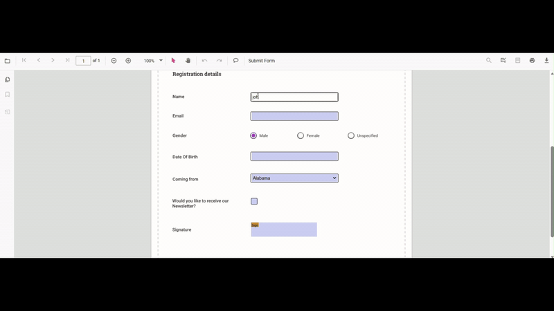
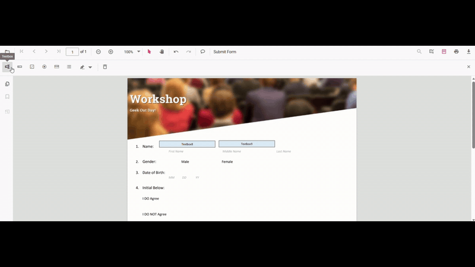

# Overview of Forms in JavaScript PDF Viewer

Syncfusion TypeScript PDF Viewer provides a complete forms experience. Design new forms or enhance existing PDFs, fill and validate fields, import or export data, and capture signatures — all via an intuitive UI and rich APIs.

The viewer supports both runtime form filling and an interactive Form Designer to create or modify fields.

## Form Fields

Work with the runtime form fields present in a PDF Form.
- Render existing fields
- [Fill fields](./form-filling).
- [Import/Export](./import-export-formfields/export-formfields) form data as JSON, XFDF, FDF, or as a plain object
- Inject [FormFields](./form-designer) to enable form-filling features.

Use the following code-snippet to enable form-filling by injecting `FormFields` Module.

```js
var pdfviewer = new ej.pdfviewer.PdfViewer({
  documentPath: 'https://cdn.syncfusion.com/content/pdf/form-filling-document.pdf',
  resourceUrl: "https://cdn.syncfusion.com/ej2/31.2.2/dist/ej2-pdfviewer-lib"
});
ej.pdfviewer.PdfViewer.Inject(ej.pdfviewer.TextSelection, ej.pdfviewer.TextSearch, ej.pdfviewer.Print, ej.pdfviewer.Navigation, ej.pdfviewer.Toolbar,
  ej.pdfviewer.Magnification, ej.pdfviewer.Annotation, ej.pdfviewer.FormFields, ej.pdfviewer.PageOrganizer);
  pdfviewer.appendTo('#PdfViewer');
```



## Form Designer

Create and customize interactive fields directly on the PDF page.
- [Add fields](../form-designer/Create-edit-Style-del-formFields/create-formfields): textbox, checkbox, radio button, dropdown, list box, signature, and initials
- [Edit quickly](../form-designer/Create-edit-Style-del-formFields/edit-formfields): move, resize, align, distribute, copy/paste, undo/redo
- [Configure properties](../form-designer/Create-edit-Style-del-formFields/style-formfields): name, value, font, color, border, alignment, required/read-only/visibility, tab order
- [Control interaction](../form-designer/form-constrain): toggle read-only, show/hide, and manage printing behavior
- [Manage fields](../form-designer/group-formfields): select, group/ungroup, reorder, or delete
- [Save and print](../download): persist designed fields in the PDF and print with appearances
- [Tailor the UI](./form-designer#how-to-customize-the-form-designer-toolbar): show/hide or customize the Form Designer toolbar; handle events for add/edit/select/move/resize

Use the following Code-snippet to enable Form Designer by injecting `FormDesigner` Module.

```js
var pdfviewer = new ej.pdfviewer.PdfViewer({
  documentPath: 'https://cdn.syncfusion.com/content/pdf/form-filling-document.pdf',
  resourceUrl: "https://cdn.syncfusion.com/ej2/31.2.2/dist/ej2-pdfviewer-lib"
});
ej.pdfviewer.PdfViewer.Inject(ej.pdfviewer.TextSelection, ej.pdfviewer.TextSearch, ej.pdfviewer.Print, ej.pdfviewer.Navigation, ej.pdfviewer.Toolbar,
  ej.pdfviewer.Magnification, ej.pdfviewer.Annotation, ej.pdfviewer.FormFields, ej.pdfviewer.FormDesigner, ej.pdfviewer.PageOrganizer);
  pdfviewer.appendTo('#PdfViewer');
```



## Supported form field types

- [Textbox](../form-designer/Create-edit-Style-del-formFields/create-formfields#add-textbox)
- [Password](../form-designer/Create-edit-Style-del-formFields/create-formfields#add-password)
- [CheckBox](../form-designer/Create-edit-Style-del-formFields/create-formfields#add-checkbox)
- [RadioButton](../form-designer/Create-edit-Style-del-formFields/create-formfields#add-radiobutton)
- [ListBox](../form-designer/Create-edit-Style-del-formFields/create-formfields#add-listbox)
- [DropDown](../form-designer/Create-edit-Style-del-formFields/create-formfields#add-dropdown)
- [Signature field](../form-designer/Create-edit-Style-del-formFields/create-formfields#add-signature-field)
- [Initial field](../form-designer/Create-edit-Style-del-formFields/create-formfields#add-initial-field)

## Typical workflows

- **Design** → Save → Fill: [create or modify fields](./Create-edit-Style-del-formFields/create-formfields), save them into the PDF, then fill and validate
- **Fill** → [Export/Import](./import-export-formfields/export-formfields): complete forms and export data to JSON/XFDF/FDF, or import data to fill
- **Customize** → Integrate: wire up events and business rules; tailor the designer [toolbar](./form-designer#how-to-customize-the-form-designer-toolbar) for your app

## See also

- [Form filling](./form-filling)
- [Form Designer Toolbar](../toolbar-customization/form-designer-toolbar)
- [Create form fields](./Create-edit-Style-del-formFields/create-formfields)
- [Edit form fields](./Create-edit-Style-del-formFields/edit-formfields)
- [Style form fields](./Create-edit-Style-del-formFields/style-formfields)
- [Group form fields](./group-formfields)
- [Form constraints](./form-constrain)
- [Form validation](./form-validation)
- [Form Fields API](./formfields-api)
- [Custom data on form fields](./custom-data)
- [Import form data](./import-export-formfields/import-formfields)
- [Export form data](./import-export-formfields/export-formfields)
- [Import/Export events](./import-export-formfields/import-export-events)
