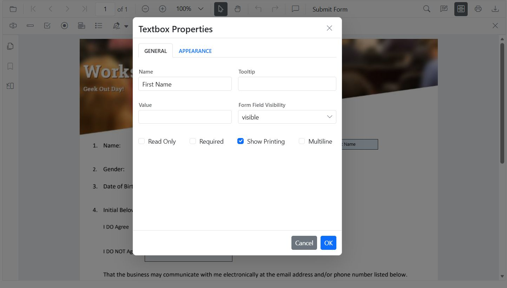
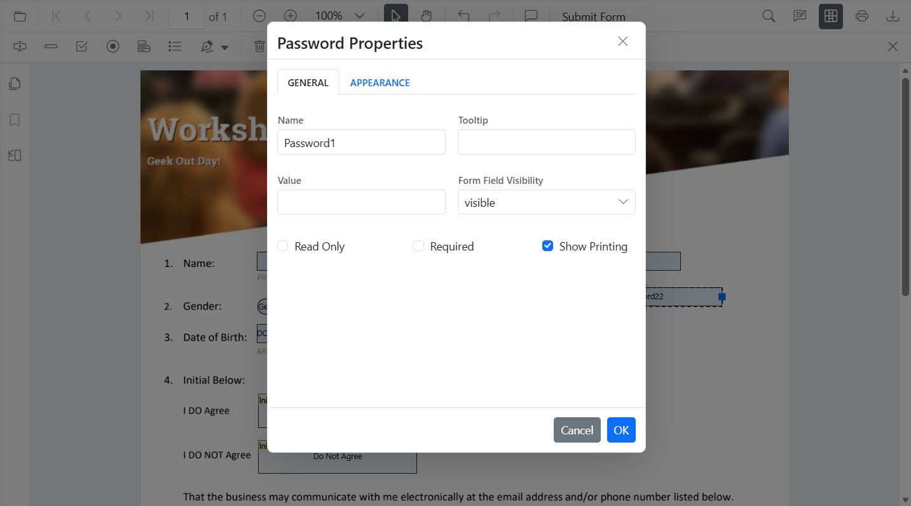
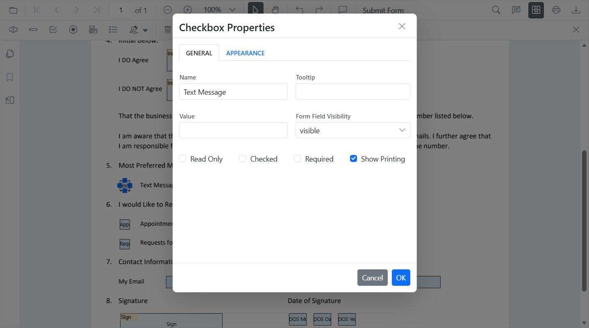
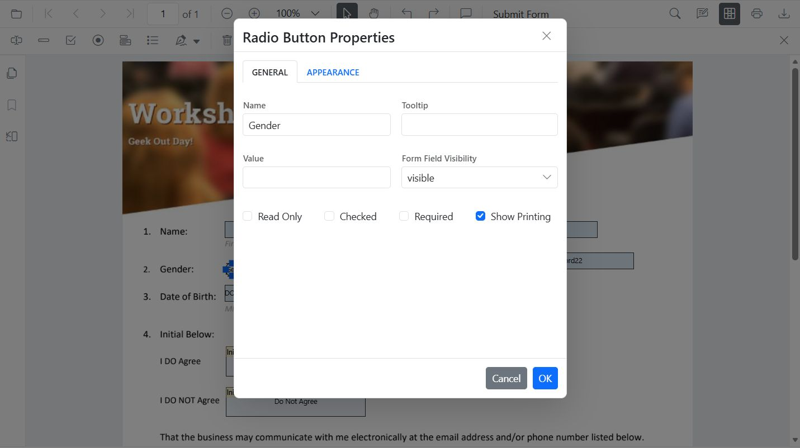
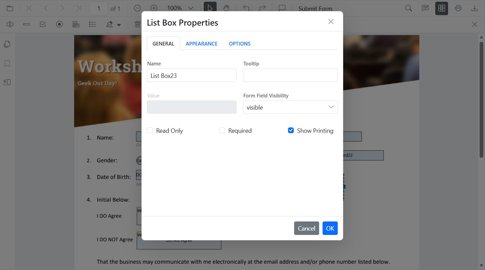
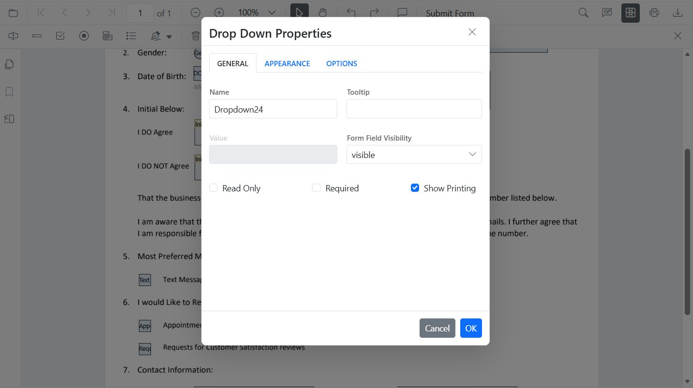
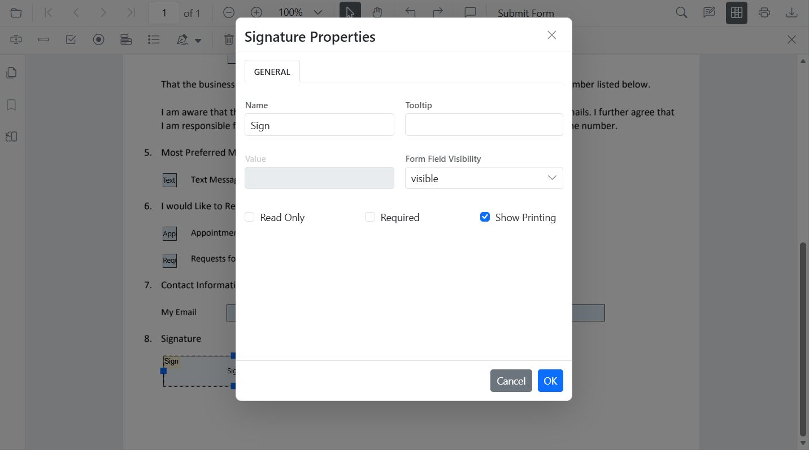
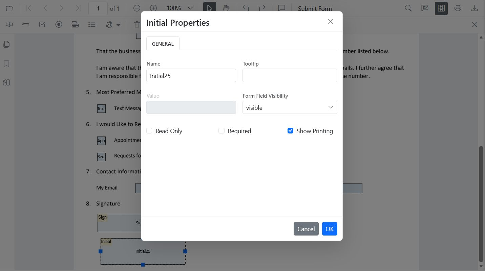

# Modify PDF form field properties in JavaScript
Form fields can be modified using the UI or API.

## Modify PDF form field properties using the UI
- Right-click a field → **Properties** to update settings.

- Drag to move; use handles to resize.
- Use the toolbar to toggle field mode or add new fields.

## Modify PDF form field properties programmatically
Use [`updateFormField()`](https://ej2.syncfusion.com/javascript/documentation/api/pdfviewer/index-default#updateformfields) to change behavior or data (including position and size):

```html
<button id="modifyTextbox">Apply Textbox Changes</button>
```
```js
document.getElementById('modifyTextbox').addEventListener('click', function () {
  // Retrieve form fields collection
  var fields = pdfviewer.retrieveFormFields();
  // Find the textbox field by name (Here field name is First Name)
  var field = (fields || []).find(function (f) { return f && f.name === 'First Name'; }) || (fields || [])[0]; // Update Name accordingly
  if (field) {
    // Update textbox field styling and value
    pdfviewer.formDesignerModule.updateFormField(field, {
      value: 'John',
      fontFamily: 'Courier',
      fontSize: 12,
      fontStyle: null,
      color: 'black',
      backgroundColor: 'white',
      borderColor: 'black',
      thickness: 2,
      alignment: 'Left',
      maxLength: 50
    });
  }
});
```

## Modify PDF form field properties by field type

### Textbox
- UI: Update value, font, size, colors, border thickness, alignment, max length, multiline.

- API: [`updateFormField()`](https://ej2.syncfusion.com/documentation/api/pdfviewer/index-default#updateformfields) for value, typography, alignment, colors, borders.

```html
<button id="modifyTextbox">Apply Textbox Changes</button>
```
```js
document.getElementById('modifyTextbox').addEventListener('click', function () {
  // Retrieve form fields collection
  var fields = pdfviewer.retrieveFormFields();
  // Find the textbox field by name (Here field name is First Name)
  var field = (fields || []).find(function (f) { return f && f.name === 'First Name'; }) || (fields || [])[0]; //Update Name accordingly
  if (field) {
    // Update textbox field styling and value
    pdfviewer.formDesignerModule.updateFormField(field, {
      value: 'John',
      fontFamily: 'Courier',
      fontSize: 12,
      fontStyle: null,
      color: 'black',
      backgroundColor: 'white',
      borderColor: 'black',
      thickness: 2,
      alignment: 'Left',
      maxLength: 50
    });
  }
});
```

### Password

- UI: Tooltip, required, max length, font, appearance.

- API: [`updateFormField()`](https://ej2.syncfusion.com/documentation/api/pdfviewer/index-default#updateformfields) for tooltip, validation flags, typography, colors, alignment, borders.
```html
 <button id="modifyPasswordBox">Edit PasswordBox</button>
```
```js
document.getElementById('modifyPasswordBox').addEventListener('click', function () {
  // Retrieve form fields collection
  var fields = pdfviewer.retrieveFormFields();
  // Find the password field by name (Here field name is Password)
  var field = (fields || []).find(function (f) { return f && f.name === 'Password'; });
  if (field) {
    // Update password field properties
    pdfviewer.formDesignerModule.updateFormField(field, {
      tooltip: 'Enter your password',
      isReadOnly: false,
      isRequired: true,
      isPrint: true,
      fontFamily: 'Courier',
      fontSize: 10,
      color: 'black',
      borderColor: 'black',
      backgroundColor: 'white',
      alignment: 'Left',
      maxLength: 20,
      thickness: 1
    });
  }
});
```

### CheckBox
- UI: Toggle checked state.

- API: [`updateFormField()`](https://ej2.syncfusion.com/documentation/api/pdfviewer/index-default#updateformfields) for isChecked, tooltip, colors, borders.
```html
<button id="modifyCheckbox">Modify CheckBox</button>
```
```js
document.getElementById('modifyCheckbox').addEventListener('click', function () {
  // Retrieve form fields collection
  var fields = pdfviewer.retrieveFormFields();
  // Find the checkbox field by name (Here field name is Subscribe)
  var cb = (fields || []).find(function (f) { return f && f.name === 'Subscribe'; });
  if (cb) {
    // Update checkbox field properties and state
    pdfviewer.formDesignerModule.updateFormField(cb, {
      isChecked: true,
      backgroundColor: 'white',
      borderColor: 'black',
      thickness: 2,
      tooltip: 'Subscribe to newsletter'
    });
  }
});
```

### RadioButton
- UI: Set selected item in a group (same Name).

- API: [`updateFormField()`](https://ej2.syncfusion.com/documentation/api/pdfviewer/index-default#updateformfields) to set selected value and border appearance.
```html
<button id="editRadio">Modify RadioButton</button>
```
```js
document.getElementById('editRadio').addEventListener('click', function () {
  // Retrieve form fields collection
  var fields = pdfviewer.retrieveFormFields();
  // Filter the radio button group by name (Here group name is Gender)
  var genderRadios = (fields || []).filter(function (f) { return f && f.name === 'Gender'; });
  if (genderRadios[1]) {
    // Update radio button selection and appearance
    pdfviewer.formDesignerModule.updateFormField(genderRadios[0], { isSelected: false });
    pdfviewer.formDesignerModule.updateFormField(genderRadios[1], { isSelected: true, thickness: 2, borderColor: 'black' });
  }
});
```

### ListBox
- UI: Add/remove items, set selection, adjust fonts/colors.

- API: [`updateFormField()`](https://ej2.syncfusion.com/documentation/api/pdfviewer/index-default#updateformfields) for items, selection, borders.
```html
<button id="editListBox">Edit ListBox</button>
```
```js
document.getElementById('editListBox').addEventListener('click', function () {
  // Retrieve form fields collection
  var fields = pdfviewer.retrieveFormFields();
  // Find the listbox field by name (Here field name is States)
  var lb = (fields || []).find(function (f) { return f && f.name === 'States'; });
  if (lb) {
    // Update listbox options, selection, and appearance
    var option = [
      { itemName: 'Alabama', itemValue: 'AL' },
      { itemName: 'Alaska', itemValue: 'AK' },
      { itemName: 'Arizona', itemValue: 'AZ' }
    ];
    pdfviewer.formDesignerModule.updateFormField(lb, {
      fontFamily: 'Courier',
      fontSize: 5,
      color: 'black',
      backgroundColor: 'white',
      tooltip: 'listbox',
      options: option
    });
  }
});

```

### DropDown
- UI: Add/remove items, default value, appearance.

- API: [`updateFormField()`](https://ej2.syncfusion.com/documentation/api/pdfviewer/index-default#updateformfields) for items, value, borders.
```html
<button id="editDropDown">Edit DropDown</button>
```
```js
document.getElementById('editDropDown').addEventListener('click', function () {
  // Retrieve form fields collection
  var fields = pdfviewer.retrieveFormFields();
  // Find the dropdown field by name (Here field name is Country)
  var dd = (fields || []).find(function (f) { return f && f.name === 'Country'; });
  if (dd) {
    // Update dropdown items, value, and appearance
    pdfviewer.formDesignerModule.updateFormField(dd, {
      options: [
        { itemName: 'USA', itemValue: 'US' },
        { itemName: 'Canada', itemValue: 'CA' },
        { itemName: 'Mexico', itemValue: 'MX' }
      ],
      value: 'US',
      fontFamily: 'Courier',
      fontSize: 10,
      color: 'black',
      borderColor: 'black',
      backgroundColor: 'white'
    });
  }
});
```

### Signature Field
- UI: Tooltip, thickness, indicator text, required/visibility.

- API: [`updateFormField()`](https://ej2.syncfusion.com/documentation/api/pdfviewer/index-default#updateformfields) for tooltip, required, colors, borders.
```html
<button id="editSignature">Edit Signature</button>
```
```js
document.getElementById('editSignature').addEventListener('click', function () {
  // Retrieve form fields collection
  var fields = pdfviewer.retrieveFormFields();
  // Find the signature field by name (Here field name is Sign)
  var sig = (fields || []).find(function (f) { return f && f.name === 'Sign'; });
  if (sig) {
    // Update signature field properties
    pdfviewer.formDesignerModule.updateFormField(sig, {
      tooltip: 'Please sign here',
      thickness: 3,
      isRequired: true,
      isPrint: true,
      backgroundColor: 'white',
      borderColor: 'black'
    });
  }
});
```

### Initial Field
- UI: Tooltip, indicator text, thickness, required/visibility.

- API: [`updateFormField()`](https://ej2.syncfusion.com/documentation/api/pdfviewer/index-default#updateformfields) for tooltip, required, colors, borders.
```html
<button id="editInitial">Edit Initial</button>
```
```js
document.getElementById('editInitial').addEventListener('click', function () {
  // Retrieve form fields collection
  var fields = pdfviewer.retrieveFormFields();
  // Find the initial field by name (Here field name is Initial)
  var init = (fields || []).find(function (f) { return f && f.name === 'Initial'; });
  if (init) {
    // Update initial field properties
    pdfviewer.formDesignerModule.updateFormField(init, {
      tooltip: 'Add your initials',
      thickness: 2,
      isRequired: true,
      isPrint: true,
      backgroundColor: 'white',
      borderColor: 'black'
    });
  }
});
```

[View Sample on GitHub](https://github.com/SyncfusionExamples/javascript-pdf-viewer-examples)

## See also

- [Form Designer overview](../overview)
- [Form Designer Toolbar](../../toolbar-customization/form-designer-toolbar)
- [Create form fields](./create-form-fields)
- [Remove form fields](./remove-form-fields)
- [Style form fields](./customize-form-fields)
- [Group form fields](../group-form-fields)
- [Form validation](../form-validation)
- [Form fields API](../form-fields-api)