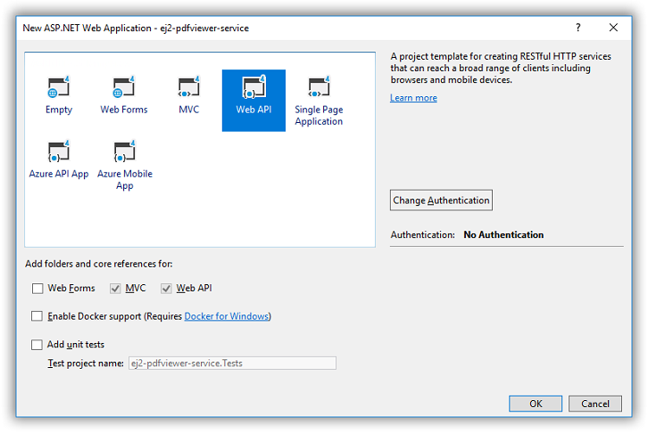
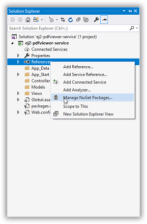
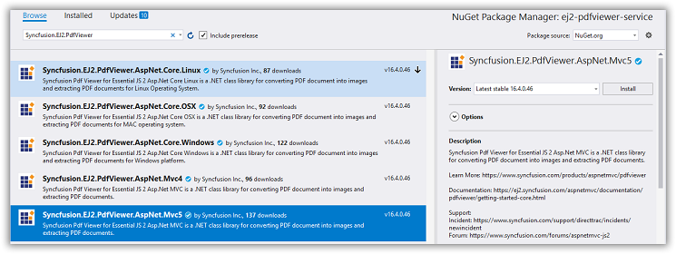
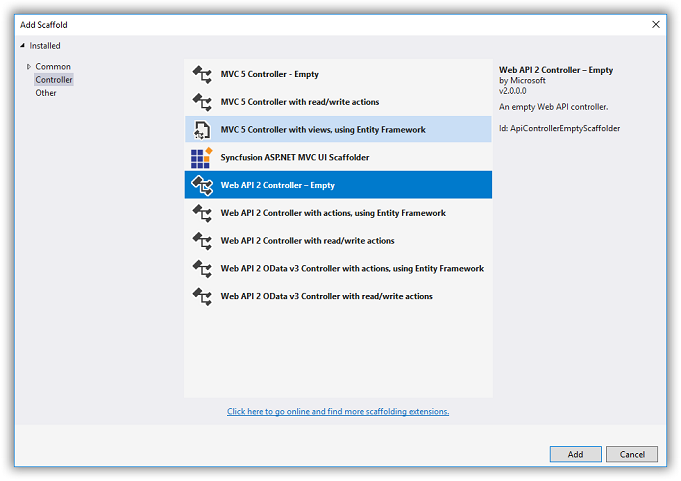

# Create a PDF Viewer service using ASP.NET MVC

The JavaScript PDF Viewer requires a server-side service to process PDF documents for rendering. This document explains how to create an ASP.NET MVC Web API service that performs server-side preprocessing and operations used by the client.

This guide covers rendering, text extraction, thumbnail generation, annotation import/export, and other server-side capabilities required by the viewer.

## Prerequisites

To get started with an ASP.NET MVC Web API service, ensure the following software and tooling are available:

- Visual Studio 2019 or later (recommended)
- .NET Framework 4.5 or later (use the version supported by the target project)
- ASP.NET MVC 4 or 5 and Web API 2
- `Syncfusion.EJ2.PdfViewer.AspNet.MVC5` — use the latest stable release compatible with the target framework

## Set up an ASP.NET MVC application with Web API for the PDF Viewer service

Follow these steps to create the PDF Viewer service

**Step 1:** Create a new ASP.NET web application using the default template in Visual Studio.



**Step 2:** After creating the project, add the `Syncfusion.EJ2.PdfViewer.AspNet.MVC5` dependency using the NuGet Package Manager.

Open the NuGet Package Manager and install the `Syncfusion.EJ2.PdfViewer.AspNet.MVC5` package.





**Step 3:** Add a Web API 2 controller to the project and name it `PdfViewerController`.



**Step 4:** Add the following code to `PdfViewerController.cs`.

```ts
using Newtonsoft.Json;
using Syncfusion.EJ2.PdfViewer;
using System;
using System.Collections.Generic;
using System.IO;
using System.Linq;
using System.Net;
using System.Net.Http;
using System.Web;
using System.Web.Http;

namespace MvcWebService.webapi
{
    public class PdfViewerController : ApiController
    {
        [System.Web.Mvc.HttpPost]
        public object Load(Dictionary<string, string> jsonObject)
        {
            PdfRenderer pdfviewer = new PdfRenderer();
            MemoryStream stream = new MemoryStream();
            object jsonResult = new object();
   if (jsonObject != null && jsonObject.ContainsKey("document"))
            {
                if (bool.Parse(jsonObject["isFileName"]))
                {
                    string documentPath = GetDocumentPath(jsonObject["document"]);
                    if (!string.IsNullOrEmpty(documentPath))
                    {
                        byte[] bytes = System.IO.File.ReadAllBytes(documentPath);
                        stream = new MemoryStream(bytes);
                    }
                    else
                    {
                        string fileName = jsonObject["document"].Split(new string[] { "://" }, StringSplitOptions.None)[0];

                        if (fileName == "http" || fileName == "https")
                        {
                            WebClient WebClient = new WebClient();
                            byte[] pdfDoc = WebClient.DownloadData(jsonObject["document"]);
                            stream = new MemoryStream(pdfDoc);
                        }

                        else
                        {
                            return (jsonObject["document"] + " is not found");
                        }
                    }
                }
                else
                {
                    byte[] bytes = Convert.FromBase64String(jsonObject["document"]);
                    stream = new MemoryStream(bytes);
                }
            }
            jsonResult = pdfviewer.Load(stream, jsonObject);
            return (JsonConvert.SerializeObject(jsonResult));
        }
        [System.Web.Mvc.HttpPost]
        public object Bookmarks(Dictionary<string, string> jsonObject)
        {
            PdfRenderer pdfviewer = new PdfRenderer();
            var jsonResult = pdfviewer.GetBookmarks(jsonObject);
            return (jsonResult);
        }
        [System.Web.Mvc.HttpPost]
        public object RenderPdfPages(Dictionary<string, string> jsonObject)
        {
            PdfRenderer pdfviewer = new PdfRenderer();
            object jsonResult = pdfviewer.GetPage(jsonObject);
            return (JsonConvert.SerializeObject(jsonResult));
        }
        [System.Web.Mvc.HttpPost]
        public object RenderThumbnailImages(Dictionary<string, string> jsonObject)
        {
            PdfRenderer pdfviewer = new PdfRenderer();
            object result = pdfviewer.GetThumbnailImages(jsonObject);
            return (JsonConvert.SerializeObject(result));
        }
        [System.Web.Mvc.HttpPost]
        public object RenderPdfTexts(Dictionary<string, string> jsonObject)
        {
            PdfRenderer pdfviewer = new PdfRenderer();
            object result = pdfviewer.GetDocumentText(jsonObject);
            return (JsonConvert.SerializeObject(result));
        }


        [System.Web.Mvc.HttpPost]
        public object RenderAnnotationComments(Dictionary<string, string> jsonObject)
        {
            PdfRenderer pdfviewer = new PdfRenderer();
            object jsonResult = pdfviewer.GetAnnotationComments(jsonObject);
            return (JsonConvert.SerializeObject(jsonResult));
        }
        [System.Web.Mvc.HttpPost]
        public object Unload(Dictionary<string, string> jsonObject)
        {
            PdfRenderer pdfviewer = new PdfRenderer();
            pdfviewer.ClearCache(jsonObject);
            return ("Document cache is cleared");
        }
        [System.Web.Mvc.HttpPost]
        public HttpResponseMessage Download(Dictionary<string, string> jsonObject)
        {

            PdfRenderer pdfviewer = new PdfRenderer();
            string documentBase = pdfviewer.GetDocumentAsBase64(jsonObject);
            return (GetPlainText(documentBase));
        }

        [System.Web.Mvc.HttpPost]
        public object PrintImages(Dictionary<string, string> jsonObject)
        {
            PdfRenderer pdfviewer = new PdfRenderer();
            object pageImage = pdfviewer.GetPrintImage(jsonObject);
            return (pageImage);
        }
        private HttpResponseMessage GetPlainText(string pageImage)
        {
            var responseText = new HttpResponseMessage(HttpStatusCode.OK);
            responseText.Content = new StringContent(pageImage, System.Text.Encoding.UTF8, "text/plain");
            return responseText;
        }
        private string GetDocumentPath(string document)
        {
            string documentPath = string.Empty;
            if (!System.IO.File.Exists(document))
            {
                var path = HttpContext.Current.Request.PhysicalApplicationPath;
                if (System.IO.File.Exists(path + "/Data/" + document))
                    documentPath = path + "/Data/" + document;
            }
            else
            {
                documentPath = document;
            }
            return documentPath;
        }

        // GET api/values
        [System.Web.Mvc.HttpPost]
        public IEnumerable<string> Get()
        {
            return new string[] { "value1", "value2" };
        }

        [System.Web.Mvc.HttpPost]
        //Post action to export annotations
        [System.Web.Mvc.Route("{id}/ExportAnnotations")]

        public HttpResponseMessage ExportAnnotations(Dictionary<string, string> jsonObject)
        {
            PdfRenderer pdfviewer = new PdfRenderer();
            string jsonResult = pdfviewer.ExportAnnotation(jsonObject);
            return (GetPlainText(jsonResult));
        }

        [System.Web.Mvc.HttpPost]
        //Post action to import annotations
        public object ImportAnnotations(Dictionary<string, string> jsonObject)
        {
            PdfRenderer pdfviewer = new PdfRenderer();
            string jsonResult = string.Empty;
            object JsonResult;
            if (jsonObject != null && jsonObject.ContainsKey("fileName"))
            {
                string documentPath = GetDocumentPath(jsonObject["fileName"]);
                if (!string.IsNullOrEmpty(documentPath))
                {
                    jsonResult = System.IO.File.ReadAllText(documentPath);
                }
                else
                {
                    return (jsonObject["document"] + " is not found");
                }
            }
            else
            {
                string extension = Path.GetExtension(jsonObject["importedData"]);
                if (extension != ".xfdf")
                {
                    JsonResult = pdfviewer.ImportAnnotation(jsonObject);
                    return (GetPlainText((JsonConvert.SerializeObject(JsonResult))));
                }
                else
                {
                    string documentPath = GetDocumentPath(jsonObject["importedData"]);
                    if (!string.IsNullOrEmpty(documentPath))
                    {
                        byte[] bytes = System.IO.File.ReadAllBytes(documentPath);
                        jsonObject["importedData"] = Convert.ToBase64String(bytes);
                        JsonResult = pdfviewer.ImportAnnotation(jsonObject);
                        return (GetPlainText((JsonConvert.SerializeObject(JsonResult))));
                    }
                    else
                    {
                        return (jsonObject["document"] + " is not found");
                    }
                }
            }
            return (GetPlainText((jsonResult)));
        }

    }
}

```

**Step 5:** Configure the CORS policy in `web.config` to allow cross-origin requests from the client application. Example custom headers are shown below; adjust origins and headers to follow security best practices for production.

```xml
 <system.webServer>
    <httpProtocol>
      <customHeaders>
        <add name="Access-Control-Allow-Headers" value="accept, maxdataserviceversion, origin, x-requested-with, dataserviceversion,content-type" />
        <add name="Access-Control-Allow-Origin" value="*" />
        <add name="Access-Control-Max-Age" value="1728000" />
      </customHeaders>
    </httpProtocol>
  </system.webServer>
```

**Step 6:** Configure global Web API routing in `Global.asax`:

```
    System.Web.Http.GlobalConfiguration.Configuration.Routes.MapHttpRoute(
    name: "DefaultApi",
    routeTemplate: "api/{controller}/{action}/{id}",
    defaults: new { id = RouteParameter.Optional });
    AppDomain.CurrentDomain.SetData("SQLServerCompactEditionUnderWebHosting", true);
```

Download the sample: [PDF Viewer web service sample (MVC)](https://www.syncfusion.com/downloads/support/directtrac/general/ze/MvcWebService587924662.zip)