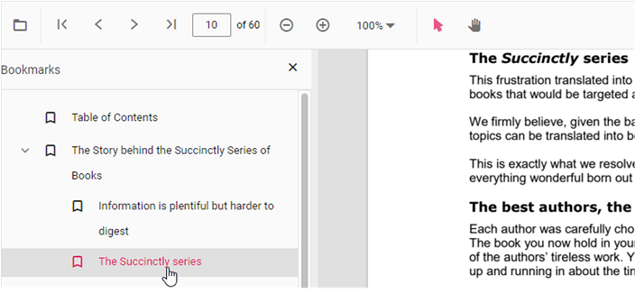

# Bookmark navigation in JavaScript PDF Viewer control

The Bookmarks saved in PDF files are loaded and made ready for easy navigation.
You can enable/disable bookmark navigation by using the following code snippet.,




ej.pdfviewer.PdfViewer.Inject(
  ej.pdfviewer.Toolbar, ej.pdfviewer.Magnification, ej.pdfviewer.Navigation, ej.pdfviewer.Annotation,
  ej.pdfviewer.LinkAnnotation, ej.pdfviewer.ThumbnailView, ej.pdfviewer.BookmarkView, ej.pdfviewer.TextSelection
);

var pdfviewer = new ej.pdfviewer.PdfViewer({
  enableBookmark: true,
  documentPath: 'https://cdn.syncfusion.com/content/pdf/pdf-succinctly.pdf'
});
pdfviewer.appendTo('#PdfViewer');




ej.pdfviewer.PdfViewer.Inject(
  ej.pdfviewer.Toolbar, ej.pdfviewer.Magnification, ej.pdfviewer.Navigation, ej.pdfviewer.Annotation,
  ej.pdfviewer.LinkAnnotation, ej.pdfviewer.ThumbnailView, ej.pdfviewer.BookmarkView, ej.pdfviewer.TextSelection
);

var pdfviewer = new ej.pdfviewer.PdfViewer({
  enableBookmark: true,
  documentPath: 'https://cdn.syncfusion.com/content/pdf/pdf-succinctly.pdf'
});
pdfviewer.serviceUrl = 'https://document.syncfusion.com/web-services/pdf-viewer/api/pdfviewer/';
pdfviewer.appendTo('#PdfViewer');






To perform bookmark navigation, you can use the **goToBookmark** method. It's important to note that the **goToBookmark** method will throw an error if the specified bookmark does not exist in the PDF document.

Here is an example of how to use the **goToBookmark** method:

```
  <button id="gotobookmark">Specfic Page</button>
```

```js
document.getElementById('gotobookmark').addEventListener('click', () => {
  viewer.bookmark.goToBookmark(x, y);
});
```

x - Specifies the pageIndex for Navigate.

y - Specifies the Y coordinates value of the Page.

Also, you can use the **getBookmarks** method to retrieve a list of all the bookmarks in a PDF document. This method returns a List of Bookmark objects, which contain information about each bookmark.

Here is an example of how to use the getBookmarks method:

```
  <button id="getBookmarks">retrieve bookmark</button>
```

```js
document.getElementById('getBookmarks').addEventListener('click', () => {
  var getBookmarks = viewer.bookmark.getBookmarks();
  console.log(getBookmarks)
});
```

## See also

* [Toolbar items](https://help.syncfusion.com/document-processing/pdf/pdf-viewer/javascript-es5/toolbar/)
* [Feature modules](https://help.syncfusion.com/document-processing/pdf/pdf-viewer/javascript-es5/feature-module/)