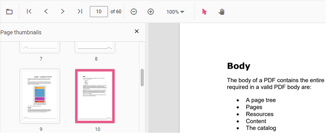

# Page Thumbnail Navigation in JavaScript (ES5) PDF Viewer

Thumbnails are miniature representations of pages in a PDF file. The viewer displays page thumbnails to provide quick visual navigation.
Use the following code snippet to enable or disable the thumbnail pane.




ej.pdfviewer.PdfViewer.Inject(ej.pdfviewer.Toolbar, ej.pdfviewer.Magnification,
ej.pdfviewer.Navigation, ej.pdfviewer.Annotation, ej.pdfviewer.LinkAnnotation,
ej.pdfviewer.ThumbnailView, ej.pdfviewer.BookmarkView, ej.pdfviewer.TextSelection);

var pdfviewer = new ej.pdfviewer.PdfViewer({
    enableThumbnail: true,
    documentPath: 'https://cdn.syncfusion.com/content/pdf/pdf-succinctly.pdf'
});
pdfviewer.appendTo('#PdfViewer');




ej.pdfviewer.PdfViewer.Inject(ej.pdfviewer.Toolbar, ej.pdfviewer.Magnification,
ej.pdfviewer.Navigation, ej.pdfviewer.Annotation, ej.pdfviewer.LinkAnnotation,
ej.pdfviewer.ThumbnailView, ej.pdfviewer.BookmarkView, ej.pdfviewer.TextSelection);

var pdfviewer = new ej.pdfviewer.PdfViewer({
    enableThumbnail: true,
    documentPath: 'https://cdn.syncfusion.com/content/pdf/pdf-succinctly.pdf'
});
pdfviewer.serviceUrl = 'https://document.syncfusion.com/web-services/pdf-viewer/api/pdfviewer/';
pdfviewer.appendTo('#PdfViewer');




## See also

* [Toolbar items](https://help.syncfusion.com/document-processing/pdf/pdf-viewer/javascript-es5/toolbar)
* [Feature modules](https://help.syncfusion.com/document-processing/pdf/pdf-viewer/javascript-es5/feature-module)