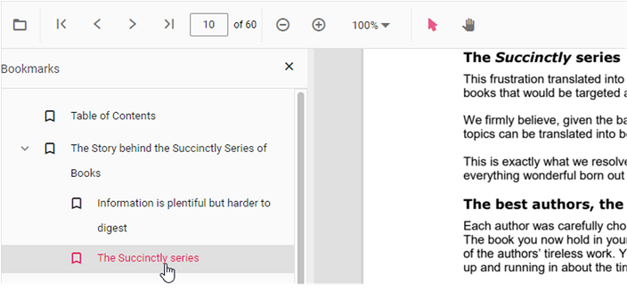
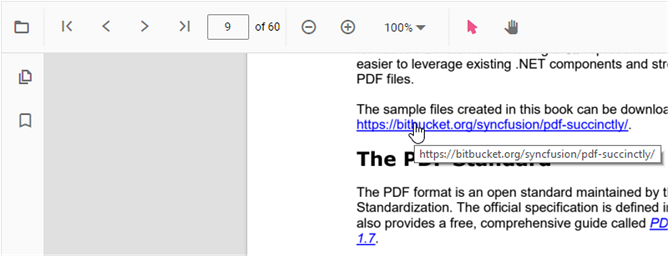
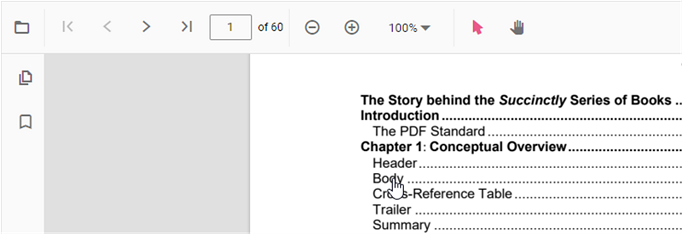

# Navigation in JavaScript PDF Viewer

The JavaScript PDF Viewer supports multiple navigation options, including toolbar controls, programmatic commands, bookmarks, thumbnails, hyperlinks, and table of contents.

## Enable or disable navigation features

The following properties allow you to toggle navigation:

**enableNavigation** (boolean)  
  Enables or disables the Navigation module of PDF Viewer. Defaults to true. [API reference](https://ej2.syncfusion.com/javascript/documentation/api/pdfviewer/index-default#enablenavigation)  
  ```js
  // Enable or disable navigation
  viewer.enableNavigation = false;
  ```

**enableNavigationToolbar** (boolean)  
  Enables or disables the Navigation toolbar of PDF Viewer. Defaults to true. [API reference](https://ej2.syncfusion.com/javascript/documentation/api/pdfviewer/index-default#enablenavigationtoolbar)  
  ```js
  // Enable or disable navigation toolbar
  viewer.enableNavigationToolbar = true;
  ```  

## Toolbar page navigation option

The default toolbar includes the following navigation options:

* [**Go to page**](https://ej2.syncfusion.com/documentation/api/pdfviewer/navigation#gotopage):- Navigates to the specific page of a PDF document.
* [**Show next page**](https://ej2.syncfusion.com/documentation/api/pdfviewer/navigation#gotonextpage):- Navigates to the next page of PDF a document.
* [**Show previous page**](https://ej2.syncfusion.com/documentation/api/pdfviewer/navigation#gotopreviouspage):- Navigates to the previous page of a PDF document.
* [**Show first page**](https://ej2.syncfusion.com/documentation/api/pdfviewer/navigation#gotofirstpage):-  Navigates to the first page of a PDF document.
* [**Show last page**](https://ej2.syncfusion.com/documentation/api/pdfviewer/navigation#gotolastpage):- Navigates to the last page of a PDF document.

```html

<!DOCTYPE html>
<html xmlns="http://www.w3.org/1999/xhtml">
<head>
<title>Essential JS 2</title>
<!-- Essential JS 2 fabric theme -->
<link href="{{:CDN_LINK}}ej2-pdfviewer/styles/fabric.css" rel="stylesheet" type="text/css"/>
<!-- Essential JS 2 PDF Viewer's global script -->
<script src="{{:CDN_LINK}}dist/ej2.min.js" type="text/javascript"></script>
</head>
<body>
<!--element which is going to render-->
<div id='container'>
<div id='PdfViewer' style="height:500px;width:100%;"></div>
</div>
</body>
</html>

```

Enable or disable page navigation using the following configuration:




var pdfviewer = new ej.pdfviewer.PdfViewer({
                    enableNavigation: true,
                    documentPath: "https://cdn.syncfusion.com/content/pdf/pdf-succinctly.pdf",
                });
ej.pdfviewer.PdfViewer.Inject(ej.pdfviewer.Toolbar, ej.pdfviewer.Magnification, ej.pdfviewer.LinkAnnotation,ej.pdfviewer.ThumbnailView, ej.pdfviewer.BookmarkView, ej.pdfviewer.TextSelection, ej.pdfviewer.TextSearch, ej.pdfviewer.Navigation, ej.pdfviewer.Print);
pdfviewer.appendTo('#PdfViewer');




var pdfviewer = new ej.pdfviewer.PdfViewer({
                    enableNavigation: true,
                    documentPath: "https://cdn.syncfusion.com/content/pdf/pdf-succinctly.pdf",
                    serviceUrl: 'https://document.syncfusion.com/web-services/pdf-viewer/api/pdfviewer'
                });
ej.pdfviewer.PdfViewer.Inject(ej.pdfviewer.Toolbar, ej.pdfviewer.Magnification, ej.pdfviewer.LinkAnnotation,ej.pdfviewer.ThumbnailView, ej.pdfviewer.BookmarkView, ej.pdfviewer.TextSelection, ej.pdfviewer.TextSearch, ej.pdfviewer.Navigation, ej.pdfviewer.Print);
pdfviewer.appendTo('#PdfViewer');





You can also perform page navigation programmatically:

```html

<!DOCTYPE html>
<html xmlns="http://www.w3.org/1999/xhtml">
<head>
<title>Essential JS 2</title>
<!-- Essential JS 2 fabric theme -->
<link href="{{:CDN_LINK}}ej2-pdfviewer/styles/fabric.css" rel="stylesheet" type="text/css"/>
<!-- Essential JS 2 PDF Viewer's global script -->
<script src="{{:CDN_LINK}}dist/ej2.min.js" type="text/javascript"></script>
</head>
<body>
<!--element which is going to render-->
<div id='container'>
    <button id="goToFirstPage">Go To First Page</button>
    <button id="goToLastPage">Go To last Page</button>
    <button id="goToNextPage">Go To Next Page</button>
    <button id="goToPage">Go To Page</button>
    <button id="goToPreviousPage">Go To Previous Page</button>
<div id='PdfViewer' style="height:500px;width:100%;"></div>
</div>
</body>
</html>

```




var viewer = new ej.pdfviewer.PdfViewer({
  documentPath: 'https://cdn.syncfusion.com/content/pdf/pdf-succinctly.pdf',
});
ej.pdfviewer.PdfViewer.Inject(
  ej.pdfviewer.Toolbar,
  ej.pdfviewer.Magnification,
  ej.pdfviewer.BookmarkView,
  ej.pdfviewer.ThumbnailView,
  ej.pdfviewer.TextSelection,
  ej.pdfviewer.TextSearch,
  ej.pdfviewer.Print,
  ej.pdfviewer.Navigation,
  ej.pdfviewer.LinkAnnotation,
  ej.pdfviewer.Annotation,
  ej.pdfviewer.FormFields
);
viewer.appendTo('#pdfViewer');
// Go To First Page
document.getElementById('goToFirstPage').addEventListener('click', () => {
  viewer.navigation.goToFirstPage();
});
// Go To Last Page
document.getElementById('goToLastPage').addEventListener('click', () => {
  viewer.navigation.goToLastPage();
});
// Go To Next Page
document.getElementById('goToNextPage').addEventListener('click', () => {
  viewer.navigation.goToNextPage();
});
// Go To Page
document.getElementById('goToPage').addEventListener('click', () => {
  viewer.navigation.goToPage(4);
});
// Go To Previous Page
document.getElementById('goToPreviousPage').addEventListener('click', () => {
  viewer.navigation.goToPreviousPage();
});




var viewer = new ej.pdfviewer.PdfViewer({
  documentPath: 'https://cdn.syncfusion.com/content/pdf/pdf-succinctly.pdf',
  serviceUrl:'https://document.syncfusion.com/web-services/pdf-viewer/api/pdfviewer'
});
ej.pdfviewer.PdfViewer.Inject(
  ej.pdfviewer.Toolbar,
  ej.pdfviewer.Magnification,
  ej.pdfviewer.BookmarkView,
  ej.pdfviewer.ThumbnailView,
  ej.pdfviewer.TextSelection,
  ej.pdfviewer.TextSearch,
  ej.pdfviewer.Print,
  ej.pdfviewer.Navigation,
  ej.pdfviewer.LinkAnnotation,
  ej.pdfviewer.Annotation,
  ej.pdfviewer.FormFields
);
viewer.appendTo('#pdfViewer');
// Go To First Page
document.getElementById('goToFirstPage').addEventListener('click', () => {
  viewer.navigation.goToFirstPage();
});
// Go To Last Page
document.getElementById('goToLastPage').addEventListener('click', () => {
  viewer.navigation.goToLastPage();
});
// Go To Next Page
document.getElementById('goToNextPage').addEventListener('click', () => {
  viewer.navigation.goToNextPage();
});
// Go To Page
document.getElementById('goToPage').addEventListener('click', () => {
  viewer.navigation.goToPage(4);
});
// Go To Previous Page
document.getElementById('goToPreviousPage').addEventListener('click', () => {
  viewer.navigation.goToPreviousPage();
});




View the [programmatic navigation sample](https://stackblitz.com/edit/39kfnj?file=index.js) for a working example.

## Bookmark navigation

Bookmarks saved in PDF files provide quick navigation. Enable or disable bookmark navigation using the following configuration:




var pdfviewer = new ej.pdfviewer.PdfViewer({
                    enableBookmark: true,
                    documentPath: "https://cdn.syncfusion.com/content/pdf/pdf-succinctly.pdf",
                });
ej.pdfviewer.PdfViewer.Inject(ej.pdfviewer.Toolbar, ej.pdfviewer.Magnification, ej.pdfviewer.LinkAnnotation,ej.pdfviewer.ThumbnailView, ej.pdfviewer.BookmarkView, ej.pdfviewer.TextSelection, ej.pdfviewer.TextSearch, ej.pdfviewer.Navigation, ej.pdfviewer.Print);
pdfviewer.appendTo('#PdfViewer');




var pdfviewer = new ej.pdfviewer.PdfViewer({
                    enableBookmark: true,
                    documentPath: "https://cdn.syncfusion.com/content/pdf/pdf-succinctly.pdf",
                    serviceUrl: 'https://document.syncfusion.com/web-services/pdf-viewer/api/pdfviewer'
                });
ej.pdfviewer.PdfViewer.Inject(ej.pdfviewer.Toolbar, ej.pdfviewer.Magnification, ej.pdfviewer.LinkAnnotation,ej.pdfviewer.ThumbnailView, ej.pdfviewer.BookmarkView, ej.pdfviewer.TextSelection, ej.pdfviewer.TextSearch, ej.pdfviewer.Navigation, ej.pdfviewer.Print);
pdfviewer.appendTo('#PdfViewer');






Use the **goToBookmark** method to navigate to a specific bookmark. The method throws an error if the bookmark does not exist in the document.

Example:

```
  <button id="gotobookmark">Specfic Page</button>
```

```javascript
document.getElementById('gotobookmark').addEventListener('click', () => {
    viewer.bookmark.goToBookmark(x, y);
});
```

x - Specifies the pageIndex for Navigate.

y - Specifies the Y coordinates value of the Page.

Use the **getBookmarks** method to retrieve all bookmarks. The method returns a list of bookmark objects that include metadata for each entry.

Example:

```
 <button id="getBookmarks">retrieve bookmark</button>
```

```javascript
document.getElementById('getBookmarks').addEventListener('click', () => {
  var getBookmarks = viewer.bookmark.getBookmarks();
  console.log(getBookmarks)
});
```

## Thumbnail navigation

Thumbnails provide miniature representations of PDF pages for quick navigation. Enable or disable thumbnail navigation using the following configuration:




var pdfviewer = new ej.pdfviewer.PdfViewer({
                    enableThumbnail: true,
                    documentPath: "https://cdn.syncfusion.com/content/pdf/pdf-succinctly.pdf",
                });
ej.pdfviewer.PdfViewer.Inject(ej.pdfviewer.Toolbar, ej.pdfviewer.Magnification, ej.pdfviewer.LinkAnnotation,ej.pdfviewer.ThumbnailView, ej.pdfviewer.BookmarkView, ej.pdfviewer.TextSelection, ej.pdfviewer.TextSearch, ej.pdfviewer.Navigation, ej.pdfviewer.Print);
pdfviewer.appendTo('#PdfViewer');




var pdfviewer = new ej.pdfviewer.PdfViewer({
                    enableThumbnail: true,
                    documentPath: "https://cdn.syncfusion.com/content/pdf/pdf-succinctly.pdf",
                    serviceUrl: 'https://document.syncfusion.com/web-services/pdf-viewer/api/pdfviewer'
                });
ej.pdfviewer.PdfViewer.Inject(ej.pdfviewer.Toolbar, ej.pdfviewer.Magnification, ej.pdfviewer.LinkAnnotation,ej.pdfviewer.ThumbnailView, ej.pdfviewer.BookmarkView, ej.pdfviewer.TextSelection, ej.pdfviewer.TextSearch, ej.pdfviewer.Navigation, ej.pdfviewer.Print);
pdfviewer.appendTo('#PdfViewer');





## Hyperlink navigation

Hyperlink navigation enables users to open URLs embedded in the PDF.



## Table of content navigation

Table of contents navigation allows users to jump to sections defined in the document outline.

Enable or disable table of contents navigation using the following configuration:




var pdfviewer = new ej.pdfviewer.PdfViewer({
                    enableHyperlink: true,
                    documentPath: "https://cdn.syncfusion.com/content/pdf/pdf-succinctly.pdf",
                });
ej.pdfviewer.PdfViewer.Inject(ej.pdfviewer.Toolbar, ej.pdfviewer.Magnification, ej.pdfviewer.LinkAnnotation,ej.pdfviewer.ThumbnailView, ej.pdfviewer.BookmarkView, ej.pdfviewer.TextSelection, ej.pdfviewer.TextSearch, ej.pdfviewer.Navigation, ej.pdfviewer.Print);
pdfviewer.appendTo('#PdfViewer');




var pdfviewer = new ej.pdfviewer.PdfViewer({
                    enableHyperlink: true,
                    documentPath: "https://cdn.syncfusion.com/content/pdf/pdf-succinctly.pdf",
                    serviceUrl: 'https://document.syncfusion.com/web-services/pdf-viewer/api/pdfviewer'
                });
ej.pdfviewer.PdfViewer.Inject(ej.pdfviewer.Toolbar, ej.pdfviewer.Magnification, ej.pdfviewer.LinkAnnotation,ej.pdfviewer.ThumbnailView, ej.pdfviewer.BookmarkView, ej.pdfviewer.TextSelection, ej.pdfviewer.TextSearch, ej.pdfviewer.Navigation, ej.pdfviewer.Print);
pdfviewer.appendTo('#PdfViewer');




Change the hyperlink open state using the following configuration:




var pdfviewer = new ej.pdfviewer.PdfViewer({
                    enableHyperlink: true,
                    documentPath: "https://cdn.syncfusion.com/content/pdf/pdf-succinctly.pdf",
                    hyperlinkOpenState:'NewTab',
                });
ej.pdfviewer.PdfViewer.Inject(ej.pdfviewer.Toolbar, ej.pdfviewer.Magnification, ej.pdfviewer.LinkAnnotation,ej.pdfviewer.ThumbnailView, ej.pdfviewer.BookmarkView, ej.pdfviewer.TextSelection, ej.pdfviewer.TextSearch, ej.pdfviewer.Navigation, ej.pdfviewer.Print);
pdfviewer.appendTo('#PdfViewer');




var pdfviewer = new ej.pdfviewer.PdfViewer({
                    enableHyperlink: true,
                    documentPath: "https://cdn.syncfusion.com/content/pdf/pdf-succinctly.pdf",
                    hyperlinkOpenState:'NewTab',
                    serviceUrl: 'https://document.syncfusion.com/web-services/pdf-viewer/api/pdfviewer'
                });
ej.pdfviewer.PdfViewer.Inject(ej.pdfviewer.Toolbar, ej.pdfviewer.Magnification, ej.pdfviewer.LinkAnnotation,ej.pdfviewer.ThumbnailView, ej.pdfviewer.BookmarkView, ej.pdfviewer.TextSelection, ej.pdfviewer.TextSearch, ej.pdfviewer.Navigation, ej.pdfviewer.Print);
pdfviewer.appendTo('#PdfViewer');






## See also

* [Toolbar items](https://help.syncfusion.com/document-processing/pdf/pdf-viewer/javascript-es5/toolbar)
* [Feature modules](https://help.syncfusion.com/document-processing/pdf/pdf-viewer/javascript-es5/feature-module)
