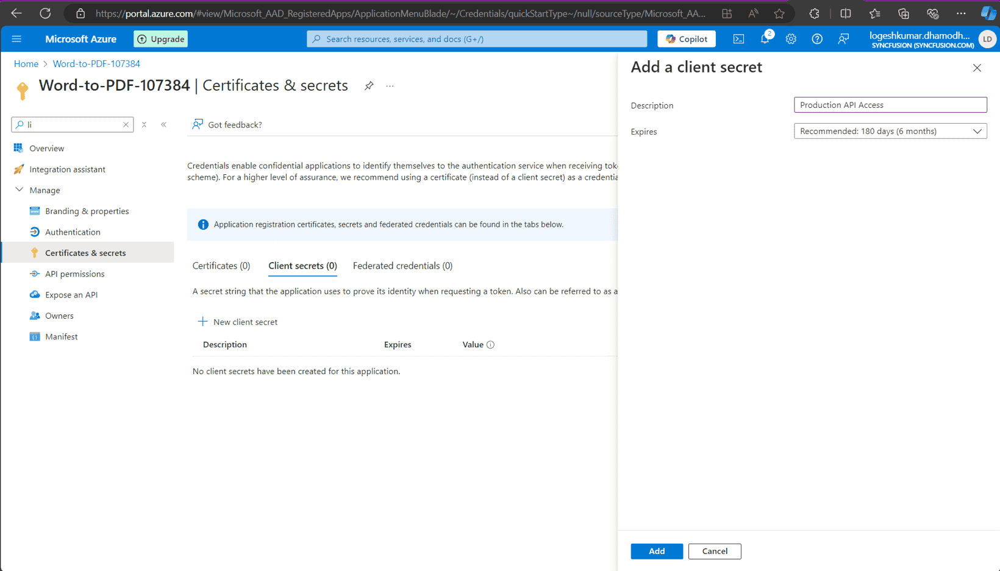
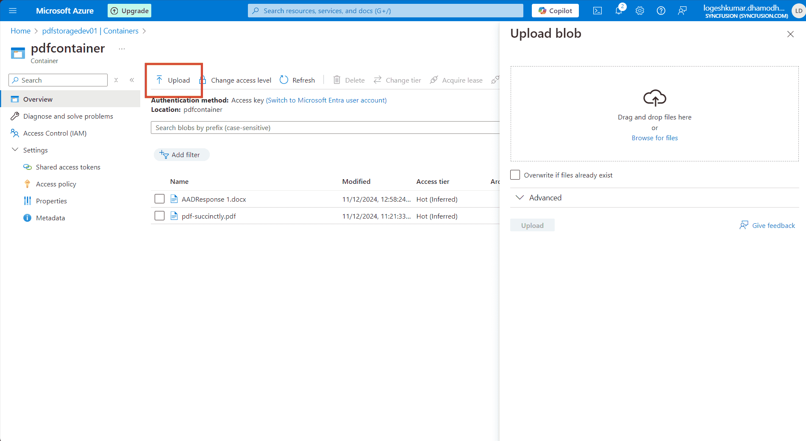

# Open PDF from Azure Active Directory

### Overview

The JavaScript PDF Viewer component supports loading and saving PDF files with Azure Active Directory (AAD). The following steps explain how to securely load and store PDFs using AAD.

### Steps to open a PDF from Azure Active Directory

---

### Step 1: Register an application in Azure Active Directory (AAD)

1. **Go to the Azure Portal**:
   - Navigate to [Azure Portal](https://portal.azure.com).

2. **Register your Application**:
   - In the Azure portal, go to **Azure Active Directory** > **App registrations** > **New registration**.
   - Register your application and note down the **Application (client) ID** and **Directory (tenant) ID**.

   

3. **Create a Client Secret**:
    - In the registered application, go to **Certificates & secrets**.
    - Click **New client secret**.
    - Provide a description and set an expiration period.
    - Click **Add**.
    - Copy the client secret value immediately, as it will be hidden later. Store it securely.

    

N> Avoid embedding client secrets directly in source control or client-side code. For production deployments prefer managed identities or use `DefaultAzureCredential` on the server to obtain tokens securely. Rotate and protect secrets via a secure secrets store.

---

### Step 2: Create the Azure Storage account

1. **Create a Storage Account**:
   - In the Azure portal, use the search bar to search for **Storage accounts**.
   - Create a new storage account by filling in the required details (e.g., name, location, resource group, etc.).

    

---

### Step 3: Assign a role to the application

1. **Go to your Storage Account**:
   - Navigate to **Access control (IAM)** > **Add role assignment** in your Azure Storage Account.

2. **Assign Role**:
   - Assign the **Storage Blob Data Contributor** role to your registered application.
   - In the **Assign access to** dropdown, select **User, group, or service principal**.
   - Click on **Select members** and search for your registered application by name or client ID.
   - Select your application and click **Select**.
   - Click **Review + assign** to finalize the role assignment.

    
---

### Step 4: Upload the PDF to Azure Storage

1. **Navigate to Data Storage**:
   - In the Azure portal, go to **Data storage** > **Containers**.

2. **Upload the PDF File**:
   - Create a new container and upload the PDF document you want to access in the PDF Viewer.

    
---

### Step 5: Server-side configuration

1. **Configure Server-Side Code**:
     - Open the server-side application (e.g., ASP.NET Core) and configure the following details in the `PdfViewerController` file:
         - `tenantId` (your Azure AD tenant ID),
         - `clientId` (your registered application client ID),
         - `clientSecret` (your registered application client secret),
         - `blobServiceEndpoint` (your storage account blob service URL),
         - `containerName` (your container name in Azure Blob Storage).

N> Prefer `DefaultAzureCredential` or a managed identity for server authentication instead of storing client secrets. Store any required secrets in a secure configuration store (Key Vault, environment variables) and avoid committing them to source control.

2. **Run the Web Service**:
   - After configuring the necessary details, run the web service to make it accessible.

---

### Step 6: Client-side configuration

1. **Run the JS Sample**:
   - Start the JS sample that includes the Syncfusion PDF Viewer.

2. **Load PDF from AAD**:
    - When the user clicks the **Load from AAD** button, the JS client makes an HTTP request to the server-side API to fetch the PDF from Azure Blob Storage.
    - The server retrieves the PDF from Azure, converts it to a Base64 string, and returns it to the client.

N> For security, the client should not access Azure Blob Storage directly with application-level credentials. Use the server as a proxy or provide limited-time pre-signed URLs for direct client access.

3. **Display PDF in the PDF Viewer**:
   - Once the base64 string is received, the PDF Viewer will load the PDF using the `viewer.load()` method.

---

### Step 7: Save the PDF to Azure

1. **Save PDF to AAD**:
   - The user can click the **Save to AAD** button to upload any modifications to the PDF back to Azure Blob Storage.
   - This action sends the modified PDF to the server, where it is converted into a byte array and saved to the specified Azure Blob container.

---

### Server-side code
```cs
string tenantId = "Provide the tenant id here";
string clientId = "Provide the clientid here";
string clientSecret = "Provide the client secret here";
string blobServiceEndpoint = "https://your-storage-account.blob.core.windows.net";
string containerName = "Provide the container name here";


[HttpPost("LoadFromAAD")]
[Route("[controller]/LoadFromAAD")]
public async Task<IActionResult> LoadFromAAD(string fileName)
{
    var clientSecretCredential = new ClientSecretCredential(tenantId, clientId, clientSecret);
    var blobServiceClient = new BlobServiceClient(new Uri(blobServiceEndpoint), clientSecretCredential);
    var containerClient = blobServiceClient.GetBlobContainerClient(containerName);
    var blobClient = containerClient.GetBlobClient(fileName);

    // Download the PDF file to a local stream
    using MemoryStream pdfStream = new MemoryStream();
    await blobClient.DownloadToAsync(pdfStream);
    var base64 = Convert.ToBase64String(pdfStream.ToArray());
    return Content("data:application/pdf;base64," + base64);
}

[AcceptVerbs("SaveToAAD")]
[HttpPost("SaveToAAD")]
[Route("[controller]/SaveToAAD")]
public async Task<IActionResult> SaveToAAD([FromBody] Dictionary<string, string> jsonObject)
{
    PdfRenderer pdfviewer = new PdfRenderer(_cache);
    var fileName = jsonObject.ContainsKey("documentId") ? jsonObject["documentId"] : "Test.pdf";
    string documentBase = pdfviewer.GetDocumentAsBase64(jsonObject);
    string convertedBase = documentBase.Substring(documentBase.LastIndexOf(',') + 1);
    // Decode the Base64 string to a byte array
    byte[] byteArray = Convert.FromBase64String(convertedBase);
    // Create a MemoryStream from the byte array
    MemoryStream stream = new MemoryStream(byteArray);
    // Create a new BlobServiceClient using the DefaultAzureCredential
    var clientSecretCredential = new ClientSecretCredential(tenantId, clientId, clientSecret);
    var blobServiceClient = new BlobServiceClient(new Uri(blobServiceEndpoint), clientSecretCredential);
    // Get a reference to the container
    var containerClient = blobServiceClient.GetBlobContainerClient(containerName);
    // Get a reference to the blob
    var blobClient = containerClient.GetBlobClient(fileName);
    //FileStream uploadFileStream = new FileStream();
    await blobClient.UploadAsync(stream, true);
    stream.Close();
    return Content(string.Empty);
}

```

### Client-side code

```html
<div id="PdfViewer"></div>
<button id="btnLoad">Load from AAD</button>
<button id="btnSave">Save to AAD</button>
```
```js
// Inject required modules
ej.pdfviewer.PdfViewer.Inject(
    ej.pdfviewer.TextSelection,
    ej.pdfviewer.TextSearch,
    ej.pdfviewer.Print,
    ej.pdfviewer.Navigation,
    ej.pdfviewer.Toolbar,
    ej.pdfviewer.Magnification,
    ej.pdfviewer.Annotation,
    ej.pdfviewer.FormDesigner,
    ej.pdfviewer.FormFields,
    ej.pdfviewer.PageOrganizer
);

var pdfviewer = new ej.pdfviewer.PdfViewer({
    documentPath: 'https://cdn.syncfusion.com/content/pdf/pdf-succinctly.pdf',
    resourceUrl: 'https://cdn.syncfusion.com/ej2/31.1.23/dist/ej2-pdfviewer-lib'
});
pdfviewer.appendTo('#PdfViewer');

document.getElementById('btnLoad').onclick = function () {
    var xhr = new XMLHttpRequest();
    xhr.open('POST', 'https://localhost:44308/pdfviewer/LoadFromAAD?fileName=pdf-succinctly.pdf', true);
    xhr.onreadystatechange = function () {
        if (xhr.readyState === 4) {
            if (xhr.status === 200) {
                var data = xhr.responseText;
                pdfviewer.load(data, '');
            } else {
                console.error('LoadFromAAD failed', xhr.status, xhr.responseText);
            }
        }
    };
    xhr.send();
};

document.getElementById('btnSave').onclick = function () {
    pdfviewer.serverActionSettings.download = 'SaveToAAD';
    pdfviewer.download();
};
```

[View sample in GitHub](https://github.com/SyncfusionExamples/open-save-pdf-documents-in-aad).