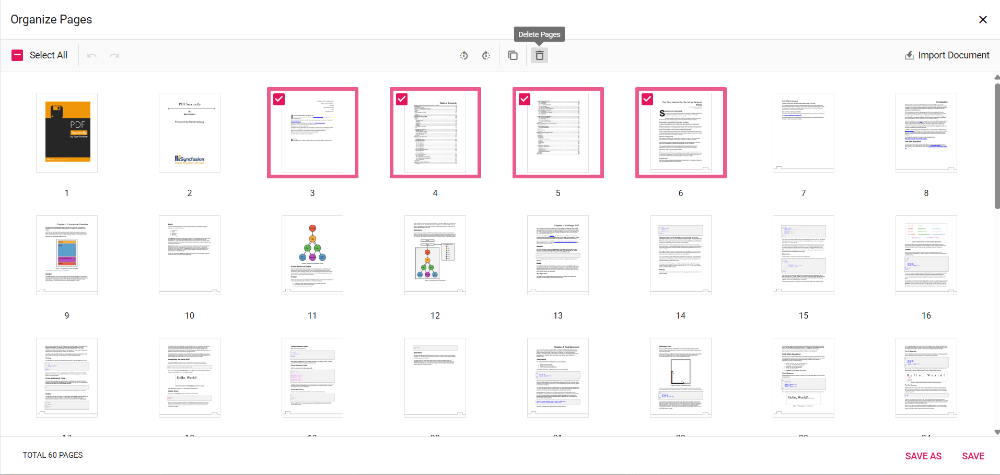

# UI Interactions for Organizing Pages in JavaScript PDF Viewer

The PDF Viewer provides an interface for managing and organizing pages within a PDF document. This section describes the UI interactions available in the `Organize Pages` dialog.

## Rotating PDF pages

Pages can be rotated to correct or change their orientation. The rotate icon in the Organize Pages dialog provides the following options:

- **Rotate clockwise**: Rotate the selected pages 90 degrees clockwise.
- **Rotate counter-clockwise**: Rotate the selected pages 90 degrees counter-clockwise.

## Rearranging PDF pages

Change the sequence of pages using drag-and-drop:

- **Drag and drop**: Click and drag a page thumbnail to the desired position within the document, then release it to reorder the pages.

## Inserting new pages

Blank pages can be inserted adjacent to existing pages using the following options:

- **Insert blank page left**: Insert a blank page to the left of the selected page.
- **Insert blank page right**: Insert a blank page to the right of the selected page.

## Deleting PDF pages

Remove unwanted pages from the document with these steps:

1. **Select pages to delete**: Click the thumbnails of the pages to remove; multiple pages can be selected.
2. **Delete selected pages**: Use the delete option in the Organize Pages pane to remove the selected pages from the document.

## Copying PDF pages

Duplicate pages within the PDF document:

- **Select pages to copy**: Click the page thumbnails to duplicate.
- **Copy selected pages**: Use the copy option to create duplicates; copied pages are added to the right of the selected pages.

## Importing a PDF document

Import another PDF document into the current document:

- **Import PDF document**: Click the **Import Document** button to select and import a PDF. The imported document is inserted as a thumbnail. If a page is selected, the thumbnail is added to its right; if no pages are selected, the imported PDF is added at the start of the document. The imported PDF is merged with the current document when the changes are saved.

If the import operation fails, an error message is displayed and the document remains unchanged.

## Selecting all pages

Select all pages simultaneously to perform bulk operations, such as rotating or deleting multiple pages.

## Zooming page thumbnails

Adjust the size of page thumbnails for visibility and precision:

* Use the zoom slider to increase or decrease the thumbnail size.
* Zoom in to see more detail on each page.
* Zoom out to view more pages at once.

## Real-time updates and saving

Changes are reflected instantly in the Organize Pages dialog. Click the **Save** button to apply modifications to the document. Use **Save As** to download a new version of the PDF that includes the changes.

## Keyboard shortcuts

The following keyboard shortcuts are available in the Organize Pages dialog:

* **Ctrl + Z**: Undo the last action.
* **Ctrl + Y**: Redo the last undone action.
* **Ctrl + mouse wheel**: Zoom in and out on page thumbnails for better visibility (on macOS use the Command key).

