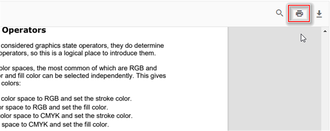

# Print in JavaScript PDF Viewer

The PDF Viewer supports printing the loaded PDF file.

## Enable or disable print option.

The `enablePrint` property enables or disables the print option of the PDF Viewer. The default value is `true`. For more details, see the [enablePrint](https://ej2.syncfusion.com/javascript/documentation/api/pdfviewer/index-default#enableprint) API documentation.

```js
   // Enable or disable print.
    viewer.enablePrint = false;
```

You can enable/disable the print using the following code snippet.

```html

<!DOCTYPE html>
<html xmlns="http://www.w3.org/1999/xhtml">
<head>
<title>Essential JS 2</title>
<!-- Essential JS 2 fabric theme -->
<link href="{{:CDN_LINK}}ej2-pdfviewer/styles/fabric.css" rel="stylesheet" type="text/css"/>
<!-- Essential JS 2 PDF Viewer's global script -->
<script src="{{:CDN_LINK}}dist/ej2.min.js" type="text/javascript"></script>
</head>
<body>
<!--element which is going to render-->
<div id='container'>
<div id='PdfViewer' style="height:500px;width:100%;">
</div>
</div>
</body>
</html>

```




var pdfviewer = new ej.pdfviewer.PdfViewer({
                    enablePrint: true,
                    documentPath: "https://cdn.syncfusion.com/content/pdf/pdf-succinctly.pdf",
                });
ej.pdfviewer.PdfViewer.Inject(ej.pdfviewer.Toolbar, ej.pdfviewer.Magnification, ej.pdfviewer.LinkAnnotation,ej.pdfviewer.ThumbnailView, ej.pdfviewer.BookmarkView, ej.pdfviewer.TextSelection, ej.pdfviewer.TextSearch, ej.pdfviewer.Navigation, ej.pdfviewer.Print);
pdfviewer.appendTo('#PdfViewer');




var pdfviewer = new ej.pdfviewer.PdfViewer({
                    enablePrint: true,
                    documentPath: "https://cdn.syncfusion.com/content/pdf/pdf-succinctly.pdf",
                    serviceUrl: 'https://document.syncfusion.com/web-services/pdf-viewer/api/pdfviewer'
                });
ej.pdfviewer.PdfViewer.Inject(ej.pdfviewer.Toolbar, ej.pdfviewer.Magnification, ej.pdfviewer.LinkAnnotation,ej.pdfviewer.ThumbnailView, ej.pdfviewer.BookmarkView, ej.pdfviewer.TextSelection, ej.pdfviewer.TextSearch, ej.pdfviewer.Navigation, ej.pdfviewer.Print);
pdfviewer.appendTo('#PdfViewer');




Select **Print** in the built-in toolbar to open the browser print dialog.



To start printing from code, call the `print.print()` method after loading a document. This approach is useful when you need to wire up custom UI or initiate printing automatically.

```
<button id="print">Print</button>

```




var pdfviewer = new ej.pdfviewer.PdfViewer({
                    enablePrint: true,
                    documentPath: "https://cdn.syncfusion.com/content/pdf/pdf-succinctly.pdf",
                });
ej.pdfviewer.PdfViewer.Inject(ej.pdfviewer.Toolbar, ej.pdfviewer.Magnification, ej.pdfviewer.LinkAnnotation,ej.pdfviewer.ThumbnailView, ej.pdfviewer.BookmarkView, ej.pdfviewer.TextSelection, ej.pdfviewer.TextSearch, ej.pdfviewer.Navigation, ej.pdfviewer.Print);
pdfviewer.appendTo('#PdfViewer');

document.getElementById('print').addEventListener('click', function () {
   pdfviewer.print.print();
});





var pdfviewer = new ej.pdfviewer.PdfViewer({
                    enablePrint: true,
                    documentPath: "https://cdn.syncfusion.com/content/pdf/pdf-succinctly.pdf",
                    serviceUrl: 'https://document.syncfusion.com/web-services/pdf-viewer/api/pdfviewer'
                });
ej.pdfviewer.PdfViewer.Inject(ej.pdfviewer.Toolbar, ej.pdfviewer.Magnification, ej.pdfviewer.LinkAnnotation,ej.pdfviewer.ThumbnailView, ej.pdfviewer.BookmarkView, ej.pdfviewer.TextSelection, ej.pdfviewer.TextSearch, ej.pdfviewer.Navigation, ej.pdfviewer.Print);
pdfviewer.appendTo('#PdfViewer');

document.getElementById('print').addEventListener('click', function () {
   pdfviewer.print.print();
});




## Customize print quality using the printScaleFactor API

The PDF Viewer allows you to adjust the print rendering quality by setting the [printScaleFactor](https://ej2.syncfusion.com/javascript/documentation/api/pdfviewer#printScaleFactor) property. Valid values range from 0.5 to 5. Higher values produce sharper output but also increase rendering time.

By default, `printScaleFactor` is set to 1.

N> Values outside the 0.5–5 range revert to the standard print quality (value 1).

The following example demonstrates how to update the scale factor before printing.



var pdfviewer = new ej.pdfviewer.PdfViewer({
                    enablePrint: true,
                    documentPath: "https://cdn.syncfusion.com/content/pdf/pdf-succinctly.pdf",
                    printScaleFactor: 0.5,
                });
ej.pdfviewer.PdfViewer.Inject(ej.pdfviewer.Toolbar, ej.pdfviewer.Magnification, ej.pdfviewer.LinkAnnotation,ej.pdfviewer.ThumbnailView, ej.pdfviewer.BookmarkView, ej.pdfviewer.TextSelection, ej.pdfviewer.TextSearch, ej.pdfviewer.Navigation, ej.pdfviewer.Print);
//pdf with low quality. By changing values you can change the quality of the pdf.
pdfviewer.appendTo('#PdfViewer');




var pdfviewer = new ej.pdfviewer.PdfViewer({
                    enablePrint: true,
                    documentPath: "https://cdn.syncfusion.com/content/pdf/pdf-succinctly.pdf",
                    serviceUrl: 'https://document.syncfusion.com/web-services/pdf-viewer/api/pdfviewer',
                    printScaleFactor: 0.5,
                });
ej.pdfviewer.PdfViewer.Inject(ej.pdfviewer.Toolbar, ej.pdfviewer.Magnification, ej.pdfviewer.LinkAnnotation,ej.pdfviewer.ThumbnailView, ej.pdfviewer.BookmarkView, ej.pdfviewer.TextSelection, ej.pdfviewer.TextSearch, ej.pdfviewer.Navigation, ej.pdfviewer.Print);
//pdf with low quality. By changing values you can change the quality of the pdf.
pdfviewer.appendTo('#PdfViewer');




## Enable print rotation in the PDF Viewer

The `EnablePrintRotation` property controls whether landscape pages are auto-rotated to best fit when printing. The default value is `true`. Set to `false` to preserve the original page orientation and suppress automatic rotation during print. You can refer to [EnablePrintRotation API Documentation](https://ej2.syncfusion.com/javascript/documentation/api/pdfviewer/index-default#enableprintrotation) for more information.

You can enable/disable the print rotation using the following code snippet.




var viewer = new ej.pdfviewer.PdfViewer({
  documentPath: 'https://cdn.syncfusion.com/content/pdf/pdf-succinctly.pdf',
  enablePrintRotation: true
});

ej.pdfviewer.PdfViewer.Inject(ej.pdfviewer.Toolbar, ej.pdfviewer.Magnification, ej.pdfviewer.BookmarkView,
  ej.pdfviewer.ThumbnailView, ej.pdfviewer.TextSelection, ej.pdfviewer.Print, ej.pdfviewer.Navigation,
  ej.pdfviewer.LinkAnnotation, ej.pdfviewer.Annotation
);

viewer.appendTo('#PdfViewer');




var viewer = new ej.pdfviewer.PdfViewer({
  documentPath: 'https://cdn.syncfusion.com/content/pdf/pdf-succinctly.pdf',
  serviceUrl: 'https://document.syncfusion.com/web-services/pdf-viewer/api/pdfviewer/',
  enablePrintRotation: true
});

ej.pdfviewer.PdfViewer.Inject(ej.pdfviewer.Toolbar, ej.pdfviewer.Magnification, ej.pdfviewer.BookmarkView,
  ej.pdfviewer.ThumbnailView, ej.pdfviewer.TextSelection, ej.pdfviewer.Print, ej.pdfviewer.Navigation,
  ej.pdfviewer.LinkAnnotation, ej.pdfviewer.Annotation
);

viewer.appendTo('#PdfViewer');




## Print modes in the PDF Viewer

Use the `printMode` property to choose how the document is printed.

The supported values are:
*   `Default`: Prints the document from the same window.
*   `NewWindow`: Prints the document from a new window or tab, which can help with browser pop-up policies.

N> Browser pop-up blockers must allow new windows or tabs when you use `PrintMode.NewWindow`.

The following example shows how to set the print mode.



var viewer = new ej.pdfviewer.PdfViewer({
  documentPath: 'https://cdn.syncfusion.com/content/pdf/pdf-succinctly.pdf',
  printMode: 'NewWindow'
});

ej.pdfviewer.PdfViewer.Inject(ej.pdfviewer.Toolbar, ej.pdfviewer.Magnification, ej.pdfviewer.BookmarkView,
  ej.pdfviewer.ThumbnailView, ej.pdfviewer.TextSelection, ej.pdfviewer.Print, ej.pdfviewer.Navigation,
  ej.pdfviewer.LinkAnnotation, ej.pdfviewer.Annotation
);

viewer.appendTo('#PdfViewer');




var viewer = new ej.pdfviewer.PdfViewer({
  documentPath: 'https://cdn.syncfusion.com/content/pdf/pdf-succinctly.pdf',
  serviceUrl: 'https://document.syncfusion.com/web-services/pdf-viewer/api/pdfviewer/',
  printMode: 'NewWindow'
});

ej.pdfviewer.PdfViewer.Inject(ej.pdfviewer.Toolbar, ej.pdfviewer.Magnification, ej.pdfviewer.BookmarkView,
  ej.pdfviewer.ThumbnailView, ej.pdfviewer.TextSelection, ej.pdfviewer.Print, ej.pdfviewer.Navigation,
  ej.pdfviewer.LinkAnnotation, ej.pdfviewer.Annotation
);

viewer.appendTo('#PdfViewer');




[View sample in GitHub](https://github.com/SyncfusionExamples/javascript-pdf-viewer-examples/tree/master/How%20to/Customize%20Print%20Quality)

## Print events

Subscribe to print life cycle events to track usage and implement custom workflows.

| Name         | Description |
|--------------|-------------|
| `printStart` | Raised when a print action begins. Use the event to log activity or cancel printing. |
| `printEnd`   | Raised after a print action completes. Use the event to notify users or clean up resources. |

### printStart event
The [`printStart`](https://ej2.syncfusion.com/javascript/documentation/api/pdfviewer#printstart) event runs when printing starts from the toolbar or from code. Use it to validate prerequisites or cancel the action.

#### Event arguments
Review [`PrintStartEventArgs`](https://ej2.syncfusion.com/javascript/documentation/api/pdfviewer/printStartEventArgs) for details such as `fileName` and the `cancel` option.

The following example logs the file that is being printed and shows how to cancel the operation.




var viewer = new ej.pdfviewer.PdfViewer({
  documentPath: 'https://cdn.syncfusion.com/content/pdf/pdf-succinctly.pdf',
  printStart: function(args) {
    console.log('Print action has started for file ' + args.fileName);
  }
});

ej.pdfviewer.PdfViewer.Inject(ej.pdfviewer.Toolbar, ej.pdfviewer.Magnification, ej.pdfviewer.BookmarkView,
  ej.pdfviewer.ThumbnailView, ej.pdfviewer.TextSelection, ej.pdfviewer.Print, ej.pdfviewer.Navigation,
  ej.pdfviewer.LinkAnnotation, ej.pdfviewer.Annotation
);

viewer.appendTo('#PdfViewer');




var viewer = new ej.pdfviewer.PdfViewer({
  documentPath: 'https://cdn.syncfusion.com/content/pdf/pdf-succinctly.pdf',
  serviceUrl: 'https://document.syncfusion.com/web-services/pdf-viewer/api/pdfviewer/',
  printStart: function(args) {
    console.log('Print action has started for file ' + args.fileName);
  }
});

ej.pdfviewer.PdfViewer.Inject(ej.pdfviewer.Toolbar, ej.pdfviewer.Magnification, ej.pdfviewer.BookmarkView,
  ej.pdfviewer.ThumbnailView, ej.pdfviewer.TextSelection, ej.pdfviewer.Print, ej.pdfviewer.Navigation,
  ej.pdfviewer.LinkAnnotation, ej.pdfviewer.Annotation
);

viewer.appendTo('#PdfViewer');




### printEnd event
The [`printEnd`](https://ej2.syncfusion.com/javascript/documentation/api/pdfviewer#printend) event triggers after printing completes. Use it to finalize analytics or inform users that printing finished.

#### Event arguments
See [`PrintEndEventArgs`](https://ej2.syncfusion.com/javascript/documentation/api/pdfviewer/printEndEventArgs) for available values such as `fileName`.

The following example logs the printed file name.




var viewer = new ej.pdfviewer.PdfViewer({
  documentPath: 'https://cdn.syncfusion.com/content/pdf/pdf-succinctly.pdf',
  printEnd: function(args) {
    console.log('Printed File Name: ' + args.fileName);
  }
});

ej.pdfviewer.PdfViewer.Inject(ej.pdfviewer.Toolbar, ej.pdfviewer.Magnification, ej.pdfviewer.BookmarkView,
  ej.pdfviewer.ThumbnailView, ej.pdfviewer.TextSelection, ej.pdfviewer.Print, ej.pdfviewer.Navigation,
  ej.pdfviewer.LinkAnnotation, ej.pdfviewer.Annotation
);

viewer.appendTo('#PdfViewer');




var viewer = new ej.pdfviewer.PdfViewer({
  documentPath: 'https://cdn.syncfusion.com/content/pdf/pdf-succinctly.pdf',
  serviceUrl: 'https://document.syncfusion.com/web-services/pdf-viewer/api/pdfviewer/',
  printEnd: function(args) {
    console.log('Printed File Name: ' + args.fileName);
  }
});

ej.pdfviewer.PdfViewer.Inject(ej.pdfviewer.Toolbar, ej.pdfviewer.Magnification, ej.pdfviewer.BookmarkView,
  ej.pdfviewer.ThumbnailView, ej.pdfviewer.TextSelection, ej.pdfviewer.Print, ej.pdfviewer.Navigation,
  ej.pdfviewer.LinkAnnotation, ej.pdfviewer.Annotation
);

viewer.appendTo('#PdfViewer');




## See also

* [Toolbar items](./toolbar)
* [Feature modules](./feature-module)
