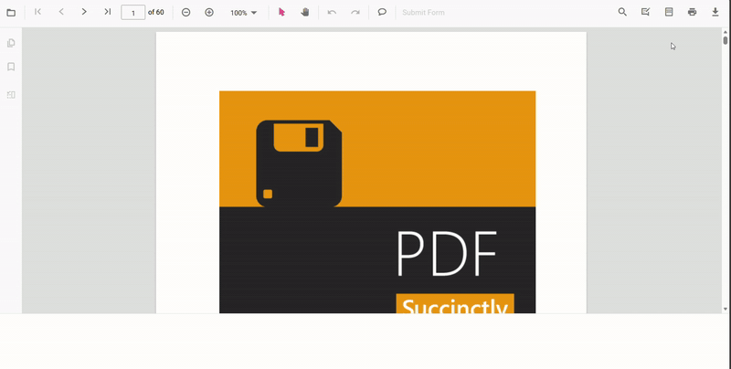

# Print Overview in JavaScript PDF Viewer Control

The JavaScript PDF Viewer includes built‑in printing via the toolbar and APIs so you can control how documents are printed and monitor the process.

Select **Print** in the built-in toolbar to open the browser print dialog.



## Enable or Disable Print in JavaScript PDF Viewer

The Syncfusion JavaScript PDF Viewer component lets users print a loaded PDF document through the built-in toolbar or programmatic calls. Control whether printing is available by setting the `enablePrint` property.

The following JavaScript examples render the PDF Viewer with printing enabled in standalone and server-backed applications.




ej.pdfviewer.PdfViewer.Inject(
    ej.pdfviewer.Toolbar,
    ej.pdfviewer.Magnification,
    ej.pdfviewer.Navigation,
    ej.pdfviewer.Annotation,
    ej.pdfviewer.LinkAnnotation,
    ej.pdfviewer.ThumbnailView,
    ej.pdfviewer.BookmarkView,
    ej.pdfviewer.TextSelection
);

var pdfviewer = new ej.pdfviewer.PdfViewer({
    enablePrint: true,
    documentPath: 'https://cdn.syncfusion.com/content/pdf/pdf-succinctly.pdf',
    resourceUrl: 'https://cdn.syncfusion.com/ej2/31.2.2/dist/ej2-pdfviewer-lib'
});
pdfviewer.appendTo('#PdfViewer');




ej.pdfviewer.PdfViewer.Inject(
    ej.pdfviewer.Toolbar,
    ej.pdfviewer.Magnification,
    ej.pdfviewer.Navigation,
    ej.pdfviewer.Annotation,
    ej.pdfviewer.LinkAnnotation,
    ej.pdfviewer.ThumbnailView,
    ej.pdfviewer.BookmarkView,
    ej.pdfviewer.TextSelection
);

var pdfviewer = new ej.pdfviewer.PdfViewer({
    enablePrint: true,
    documentPath: 'https://cdn.syncfusion.com/content/pdf/pdf-succinctly.pdf',
    serviceUrl: 'https://document.syncfusion.com/web-services/pdf-viewer/api/pdfviewer/'
});
pdfviewer.appendTo('#PdfViewer');




## Print programmatically in JavaScript PDF Viewer

To start printing from code, call the `print.print()` method after loading a document. This approach is useful when you need to wire up custom UI or initiate printing automatically.

```html
<button id="print">Print PDF</button>
```




ej.pdfviewer.PdfViewer.Inject(
    ej.pdfviewer.TextSelection,
    ej.pdfviewer.TextSearch,
    ej.pdfviewer.Print,
    ej.pdfviewer.Navigation,
    ej.pdfviewer.Toolbar,
    ej.pdfviewer.Magnification,
    ej.pdfviewer.Annotation,
    ej.pdfviewer.FormDesigner,
    ej.pdfviewer.FormFields
);

var pdfviewer = new ej.pdfviewer.PdfViewer({
    documentPath: 'https://cdn.syncfusion.com/content/pdf/pdf-succinctly.pdf',
    resourceUrl: 'https://cdn.syncfusion.com/ej2/31.1.23/dist/ej2-pdfviewer-lib'
});
pdfviewer.appendTo('#PdfViewer');
//print on button click
var printButton = document.getElementById('print');
if (printButton) {
    printButton.onclick = function () {
        pdfviewer.print.print();
    };
}




ej.pdfviewer.PdfViewer.Inject(
    ej.pdfviewer.TextSelection,
    ej.pdfviewer.TextSearch,
    ej.pdfviewer.Print,
    ej.pdfviewer.Navigation,
    ej.pdfviewer.Toolbar,
    ej.pdfviewer.Magnification,
    ej.pdfviewer.Annotation,
    ej.pdfviewer.FormDesigner,
    ej.pdfviewer.FormFields
);

var pdfviewer = new ej.pdfviewer.PdfViewer({
    documentPath: 'https://cdn.syncfusion.com/content/pdf/pdf-succinctly.pdf',
    serviceUrl: 'https://document.syncfusion.com/web-services/pdf-viewer/api/pdfviewer/'
});
pdfviewer.appendTo('#PdfViewer');
//print on button click
var printButton = document.getElementById('print');
if (printButton) {
    printButton.onclick = function () {
        pdfviewer.print.print();
    };
}




## Key capabilities

- Enable or disable printing with the enablePrint property
- Start printing from UI (toolbar Print) or programmatically using print.print()
- Control output quality with the printScaleFactor property (0.5–5)
- Auto‑rotate pages during print using enablePrintRotation
- Choose where printing happens with printMode (Default or NewWindow)
- Track the life cycle with printStart and printEnd events

[View Sample in GitHub](https://github.com/SyncfusionExamples/javascript-pdf-viewer-examples)

## See Also

- [Print quality](./print-quality)
- [Enable print rotation](./enable-print-rotation)
- [Print modes](./print-modes)
- [Print events](./events)
