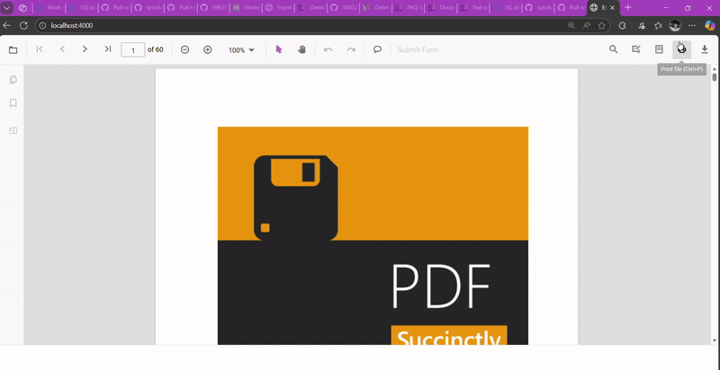

# Print Modes in the JavaScript PDF Viewer

The `printMode` property specifies how the PDF Viewer prints documents.

The `printMode` property accepts the following string values:
-   `Default`: Prints the document from the same browser window. Use this when printing should remain in the current browsing context.
-   `NewWindow`: Prints the document from a new window or tab. Use this to avoid interference with the current page; note that some browsers may block pop-ups.

N> Browser pop-up blockers must allow new windows or tabs when using `pdfviewer.printMode = "NewWindow"`.

The following examples show how to set the `printMode` property. It can be specified in the viewer options during initialization or assigned to the `pdfviewer.printMode` property after instantiation.



// Inject required modules
ej.pdfviewer.PdfViewer.Inject(
    ej.pdfviewer.TextSelection,
    ej.pdfviewer.TextSearch,
    ej.pdfviewer.Print,
    ej.pdfviewer.Navigation,
    ej.pdfviewer.Toolbar,
    ej.pdfviewer.Magnification,
    ej.pdfviewer.Annotation,
    ej.pdfviewer.FormDesigner,
    ej.pdfviewer.FormFields,
    ej.pdfviewer.PageOrganizer
);

var pdfviewer = new ej.pdfviewer.PdfViewer({
    documentPath: 'https://cdn.syncfusion.com/content/pdf/pdf-succinctly.pdf',
    resourceUrl: 'https://cdn.syncfusion.com/ej2/31.1.23/dist/ej2-pdfviewer-lib'
});
pdfviewer.printMode = "NewWindow";
pdfviewer.appendTo('#PdfViewer');




// Inject required modules
ej.pdfviewer.PdfViewer.Inject(
    ej.pdfviewer.TextSelection,
    ej.pdfviewer.TextSearch,
    ej.pdfviewer.Print,
    ej.pdfviewer.Navigation,
    ej.pdfviewer.Toolbar,
    ej.pdfviewer.Magnification,
    ej.pdfviewer.Annotation,
    ej.pdfviewer.FormDesigner,
    ej.pdfviewer.FormFields,
    ej.pdfviewer.PageOrganizer
);

var pdfviewer = new ej.pdfviewer.PdfViewer({
    documentPath: 'https://cdn.syncfusion.com/content/pdf/pdf-succinctly.pdf',
    serviceUrl: 'https://document.syncfusion.com/web-services/pdf-viewer/api/pdfviewer/'
});
pdfviewer.printMode = "NewWindow";
pdfviewer.appendTo('#PdfViewer');




[View Sample in GitHub](https://github.com/SyncfusionExamples/javascript-pdf-viewer-examples)

## See Also

- [Overview](./overview)
- [Print quality](./print-quality)
- [Enable print rotation](./enable-print-rotation)
- [Print events](./events)