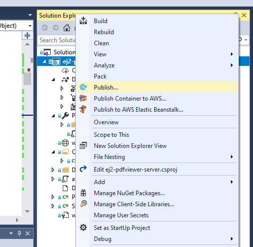

# Deploy PDF Viewer server app to Azure App Service from Visual Studio

## Prerequisites

- Visual Studio 2017 or 2019
- [Azure subscription](https://azure.microsoft.com/)
- A [PDF Viewer Web API application](https://www.syncfusion.com/kb/10346/how-to-create-pdf-viewer-web-service-application-in-asp-net-core)
- Build the project (Build > Build Solution) before publishing

## Publish to Azure App Service

**Step 1:** In Solution Explorer, right-click the project and choose Publish (or use Build > Publish).

**Step 2:** If a profile exists, select Create new profile.

**Step 3:** In Pick a publish target, choose App Service.

**Step 4:** Select Publish. In Create App Service, sign in if prompted and review the default settings.

**Step 5:** Select Create. After deployment, the app is available at `https://<app_name>.azurewebsites.net` (for example, `https://ej2-pdfviewer-server20200513053326.azurewebsites.net`).

**Step 6:** Verify the API at `https://<app_name>.azurewebsites.net/api/pdfviewer`. A default GET response indicates the server is running.

Use the service endpoint (for example, http://ej2-pdfviewer-server20200513053326.azurewebsites.net/api/pdfviewer) as the PDF Viewer client’s serviceUrl. Refer to the [getting started guide](https://help.syncfusion.com/document-processing/pdf/pdf-viewer/javascript-es5/getting-started/)

For Azure App Service deployment guidance, see: https://docs.microsoft.com/visualstudio/deployment/