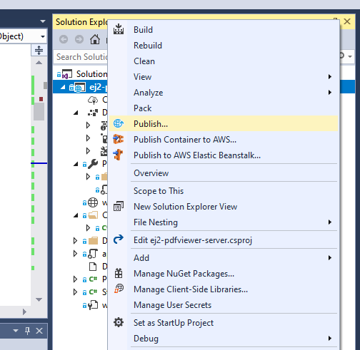
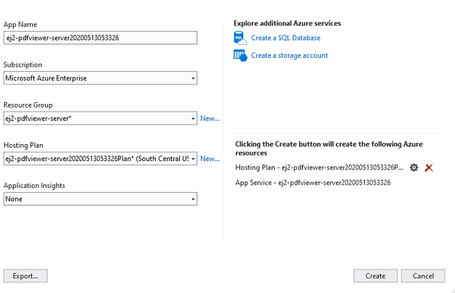

# How to Deploy the PDF Viewer Server App to Azure App Service in

## Prerequisites

- Visual Studio 2017 or 2019
- [Azure subscription](https://azure.microsoft.com/)
- A [PDF Viewer Web API application](https://www.syncfusion.com/kb/10346/how-to-create-pdf-viewer-web-service-application-in-asp-net-core)
- Build the project (Build > Build Solution) before publishing

## Publish to Azure App Service

**Step 1:** In Solution Explorer, right-click the project and choose Publish (or use Build > Publish).

**Step 2:** If a profile exists, select Create new profile.

**Step 3:** In Pick a publish target, choose App Service.

**Step 4:** Select Publish. In Create App Service, sign in if prompted and review the default settings.

**Step 5:** Select Create. After deployment, the app is available at the Azure-provided default domain, for example, `https://ej2-pdfviewer-server20200513053326.azurewebsites.net`.

**Step 6:** Verify the API at the corresponding `/api/pdfviewer` path on the same domain. A default GET response indicates the server is running.

Use the service endpoint (for example, https://ej2-pdfviewer-server20200513053326.azurewebsites.net/api/pdfviewer) as the PDF Viewer client's serviceUrl. Refer to the [getting started guide](https://help.syncfusion.com/document-processing/pdf/pdf-viewer/javascript-es5/getting-started)

For Azure App Service deployment guidance, see: https://learn.microsoft.com/en-us/visualstudio/deployment/?view=visualstudio