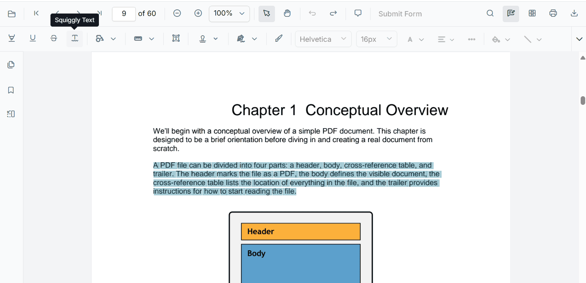
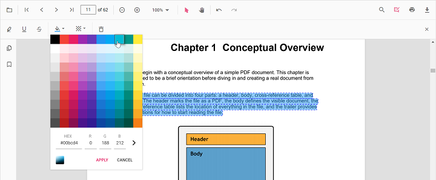

# Squiggly annotation in TypeScript PDF Viewer

The PDF Viewer provides options to add, edit, and delete Squiggly text markup annotations on text. You can add squiggles via the UI (context menu or annotation toolbar) and programmatically. You can also customize color, opacity, author/subject, and default settings, and use undo/redo, save, print, or disable them as needed.



## Add Squiggly Annotation

### Add squiggly annotation in UI

You can add squiggly annotations in two ways:

1. Using the context menu
* Select text in the PDF document and right-click it.
* Choose **Squiggly** in the context menu.


2. Using the annotation toolbar
- Click the **Edit Annotation** button in the PDF Viewer toolbar to open the annotation toolbar.
- Select **Squiggly** to enable squiggly mode.
- Select text to add a squiggly annotation.
- Alternatively, select text first and then click **Squiggly**.


N> When in pan mode, selecting a text markup annotation switches the PDF Viewer to text select mode.

### Enable squiggly mode

Enable or exit squiggly mode using the following code:

```html
<button id="squigglyMode">Squiggly</button>
<button id="setNone">Normal Mode</button>
```


import { PdfViewer, Toolbar, Magnification, Navigation, Annotation, LinkAnnotation, ThumbnailView, BookmarkView, TextSelection, TextSearch, FormFields, FormDesigner, PageOrganizer } from '@syncfusion/ej2-pdfviewer';

PdfViewer.Inject(Toolbar, Magnification, Navigation, Annotation, LinkAnnotation, ThumbnailView, BookmarkView, TextSelection, TextSearch, FormFields, FormDesigner, PageOrganizer);

let pdfviewer: PdfViewer = new PdfViewer();
pdfviewer.documentPath = "https://cdn.syncfusion.com/content/pdf/pdf-succinctly.pdf";
pdfviewer.resourceUrl = "https://cdn.syncfusion.com/ej2/31.1.23/dist/ej2-pdfviewer-lib";
pdfviewer.appendTo('#PdfViewer');

document.getElementById('squigglyMode')?.addEventListener('click', () => {
    pdfviewer.annotation.setAnnotationMode('Squiggly');
});

document.getElementById('setNone')?.addEventListener('click', () => {
    pdfviewer.annotation.setAnnotationMode('None');
});


import { PdfViewer, Toolbar, Magnification, Navigation, Annotation, LinkAnnotation, ThumbnailView, BookmarkView, TextSelection, TextSearch, FormFields, FormDesigner, PageOrganizer } from '@syncfusion/ej2-pdfviewer';

PdfViewer.Inject(Toolbar, Magnification, Navigation, Annotation, LinkAnnotation, ThumbnailView, BookmarkView, TextSelection, TextSearch, FormFields, FormDesigner, PageOrganizer);

let pdfviewer: PdfViewer = new PdfViewer();
pdfviewer.serviceUrl = 'https://document.syncfusion.com/web-services/pdf-viewer/api/pdfviewer/';
pdfviewer.documentPath = "https://cdn.syncfusion.com/content/pdf/pdf-succinctly.pdf";
pdfviewer.appendTo('#PdfViewer');

document.getElementById('squigglyMode')?.addEventListener('click', () => {
    pdfviewer.annotation.setAnnotationMode('Squiggly');
});

document.getElementById('setNone')?.addEventListener('click', () => {
    pdfviewer.annotation.setAnnotationMode('None');
});



### Add squiggly annotations programmatically

Add squiggly annotations programmatically using the [addAnnotation](https://ej2.syncfusion.com/documentation/api/pdfviewer/annotation#addannotation) method.

```html
<button id="addSquiggly">Add Squiggly annotation programmatically</button>
```


import { PdfViewer, Toolbar, Magnification, Navigation, Annotation, LinkAnnotation, ThumbnailView, BookmarkView, TextSelection, TextSearch, FormFields, FormDesigner, PageOrganizer, SquigglySettings } from '@syncfusion/ej2-pdfviewer';

PdfViewer.Inject(Toolbar, Magnification, Navigation, Annotation, LinkAnnotation, ThumbnailView, BookmarkView, TextSelection, TextSearch, FormFields, FormDesigner, PageOrganizer);

let pdfviewer: PdfViewer = new PdfViewer();
pdfviewer.documentPath = "https://cdn.syncfusion.com/content/pdf/pdf-succinctly.pdf";
pdfviewer.resourceUrl = "https://cdn.syncfusion.com/ej2/31.1.23/dist/ej2-pdfviewer-lib";
pdfviewer.appendTo('#PdfViewer');

document.getElementById('addSquiggly')?.addEventListener('click', () => {
    pdfviewer.annotation.addAnnotation('Squiggly', {
        bounds: [{ x: 97, y: 110, width: 350, height: 14 }],
        pageNumber: 1
    } as SquigglySettings);
});


import { PdfViewer, Toolbar, Magnification, Navigation, Annotation, LinkAnnotation, ThumbnailView, BookmarkView, TextSelection, TextSearch, FormFields, FormDesigner, PageOrganizer, SquigglySettings } from '@syncfusion/ej2-pdfviewer';

PdfViewer.Inject(Toolbar, Magnification, Navigation, Annotation, LinkAnnotation, ThumbnailView, BookmarkView, TextSelection, TextSearch, FormFields, FormDesigner, PageOrganizer);

let pdfviewer: PdfViewer = new PdfViewer();
pdfviewer.serviceUrl = 'https://document.syncfusion.com/web-services/pdf-viewer/api/pdfviewer/';
pdfviewer.documentPath = "https://cdn.syncfusion.com/content/pdf/pdf-succinctly.pdf";
pdfviewer.appendTo('#PdfViewer');

document.getElementById('addSquiggly')?.addEventListener('click', () => {
    pdfviewer.annotation.addAnnotation('Squiggly', {
        bounds: [{ x: 97, y: 110, width: 350, height: 14 }],
        pageNumber: 1
    } as SquigglySettings);
});



## Edit Squiggly Annotations

### Edit Squiggly annotations in UI

Use the viewer to select and delete squiggly annotations. Use the context menu or toolbar options as needed.

#### Edit color
Use the color palette in the Edit Color tool to change the annotation color.



#### Edit opacity
Use the range slider in the Edit Opacity tool to change annotation opacity.


#### Delete Squiggly annotation

- Select the annotation and press Delete, or
- Click **Delete Annotation** in the annotation toolbar.


### Edit a squiggly annotation programmatically

To modify an existing squiggly annotation programmatically, use the editAnnotation() method.

```html
<button id="editSquiggly">Edit Squiggly annotation programmatically</button>
```



import { PdfViewer, Toolbar, Magnification, Navigation, Annotation, LinkAnnotation, ThumbnailView, BookmarkView, TextSelection, TextSearch, FormFields, FormDesigner, PageOrganizer } from '@syncfusion/ej2-pdfviewer';

PdfViewer.Inject(Toolbar, Magnification, Navigation, Annotation, LinkAnnotation, ThumbnailView, BookmarkView, TextSelection, TextSearch, FormFields, FormDesigner, PageOrganizer);

let pdfviewer: PdfViewer = new PdfViewer();
pdfviewer.documentPath = "https://cdn.syncfusion.com/content/pdf/pdf-succinctly.pdf";
pdfviewer.resourceUrl = "https://cdn.syncfusion.com/ej2/31.1.23/dist/ej2-pdfviewer-lib";
pdfviewer.appendTo('#PdfViewer');

document.getElementById('editSquiggly')?.addEventListener('click', () => {
    for (let i = 0; i < pdfviewer.annotationCollection.length; i++) {
        const ann = pdfviewer.annotationCollection[i];
        if (ann.author === 'Guest User' || ann.subject === 'Corrections') {
            ann.color = '#ff0000';
            ann.opacity = 0.8;
            pdfviewer.annotation.editAnnotation(ann);
        }
    }
});


import { PdfViewer, Toolbar, Magnification, Navigation, Annotation, LinkAnnotation, ThumbnailView, BookmarkView, TextSelection, TextSearch, FormFields, FormDesigner, PageOrganizer } from '@syncfusion/ej2-pdfviewer';

PdfViewer.Inject(Toolbar, Magnification, Navigation, Annotation, LinkAnnotation, ThumbnailView, BookmarkView, TextSelection, TextSearch, FormFields, FormDesigner, PageOrganizer);

let pdfviewer: PdfViewer = new PdfViewer();
pdfviewer.serviceUrl = 'https://document.syncfusion.com/web-services/pdf-viewer/api/pdfviewer/';
pdfviewer.documentPath = "https://cdn.syncfusion.com/content/pdf/pdf-succinctly.pdf";
pdfviewer.appendTo('#PdfViewer');

document.getElementById('editSquiggly')?.addEventListener('click', () => {
    for (let i = 0; i < pdfviewer.annotationCollection.length; i++) {
        const ann = pdfviewer.annotationCollection[i];
        if (ann.author === 'Guest User' || ann.subject === 'Corrections') {
            ann.color = '#ff0000';
            ann.opacity = 0.8;
            pdfviewer.annotation.editAnnotation(ann);
        }
    }
});



## Set default properties during control initialization

Set default properties before creating the control using `squigglySettings`.

> After editing default color and opacity using the Edit Color and Edit Opacity tools, the values update to the selected settings.



import { PdfViewer, Toolbar, Magnification, Navigation, LinkAnnotation, ThumbnailView, BookmarkView, TextSelection, Annotation } from '@syncfusion/ej2-pdfviewer';

PdfViewer.Inject(Toolbar, Magnification, Navigation, LinkAnnotation, ThumbnailView, BookmarkView, TextSelection, Annotation);

let pdfviewer: PdfViewer = new PdfViewer({
  documentPath: 'https://cdn.syncfusion.com/content/pdf/pdf-succinctly.pdf',
  squigglySettings: { author: 'Guest User', subject: 'Corrections', color: '#00ff00', opacity: 0.9}
});
pdfviewer.appendTo('#PdfViewer');


import { PdfViewer, Toolbar, Magnification, Navigation, LinkAnnotation, ThumbnailView, BookmarkView, TextSelection, Annotation } from '@syncfusion/ej2-pdfviewer';

PdfViewer.Inject(Toolbar, Magnification, Navigation, LinkAnnotation, ThumbnailView, BookmarkView, TextSelection, Annotation);

let pdfviewer: PdfViewer = new PdfViewer({
  documentPath: 'https://cdn.syncfusion.com/content/pdf/pdf-succinctly.pdf',
  squigglySettings: { author: 'Guest User', subject: 'Corrections', color: '#00ff00', opacity: 0.9}
});
pdfviewer.serviceUrl = 'https://document.syncfusion.com/web-services/pdf-viewer/api/pdfviewer/';
pdfviewer.appendTo('#PdfViewer');



## Set properties while adding Individual Annotation

Set properties for individual annotation before creating the control using `SquigglySettings`.

> After editing default color and opacity using the Edit Color and Edit Opacity tools, the values update to the selected settings.

Refer to the following code snippet to set the default highlight settings.

```html
<button id="squiggly">Add Squiggly</button>
```


import { PdfViewer, Toolbar, Magnification, Navigation, Annotation, LinkAnnotation, ThumbnailView, BookmarkView, TextSelection, TextSearch, FormFields, FormDesigner, SquigglySettings} from '@syncfusion/ej2-pdfviewer';

PdfViewer.Inject(Toolbar, Magnification, Navigation, Annotation, LinkAnnotation, ThumbnailView, BookmarkView, TextSelection, TextSearch, FormFields, FormDesigner);

const pdfviewer: PdfViewer = new PdfViewer();
pdfviewer.documentPath = 'https://cdn.syncfusion.com/content/pdf/form-designer.pdf';
pdfviewer.resourceUrl = 'https://cdn.syncfusion.com/ej2/31.1.23/dist/ej2-pdfviewer-lib';
pdfviewer.appendTo('#PdfViewer');

//Apply Squiggly Settings while adding individual Annotation
document.getElementById('squiggly')?.addEventListener('click', function () {
    pdfviewer.annotation.addAnnotation('Squiggly', {
        bounds: [{ x: 97, y: 110, width: 350, height: 14 }],
        pageNumber: 1,
        author: 'User 1',
        color: '#ffff00',
        opacity: 0.9
    } as SquigglySettings);

    pdfviewer.annotation.addAnnotation('Squiggly', {
        bounds: [{ x: 107, y: 220, width: 350, height: 14 }],
        pageNumber: 1,
        author: 'User 2',
        color: '#ff1010ff',
        opacity: 0.9
    } as SquigglySettings);
});


import { PdfViewer, Toolbar, Magnification, Navigation, Annotation, LinkAnnotation, ThumbnailView, BookmarkView, TextSelection, TextSearch, FormFields, FormDesigner, SquigglySettings} from '@syncfusion/ej2-pdfviewer';

PdfViewer.Inject(Toolbar, Magnification, Navigation, Annotation, LinkAnnotation, ThumbnailView, BookmarkView, TextSelection, TextSearch, FormFields, FormDesigner);

const pdfviewer: PdfViewer = new PdfViewer();
pdfviewer.documentPath = 'https://cdn.syncfusion.com/content/pdf/form-designer.pdf';
pdfviewer.serviceUrl = 'https://document.syncfusion.com/web-services/pdf-viewer/api/pdfviewer/';
pdfviewer.appendTo('#PdfViewer');

//Apply Squiggly Settings while adding individual Annotation
document.getElementById('squiggly')?.addEventListener('click', function () {
    pdfviewer.annotation.addAnnotation('Squiggly', {
        bounds: [{ x: 97, y: 110, width: 350, height: 14 }],
        pageNumber: 1,
        author: 'User 1',
        color: '#ffff00',
        opacity: 0.9
    } as SquigglySettings);

    pdfviewer.annotation.addAnnotation('Squiggly', {
        bounds: [{ x: 107, y: 220, width: 350, height: 14 }],
        pageNumber: 1,
        author: 'User 2',
        color: '#ff1010ff',
        opacity: 0.9
    } as SquigglySettings);
});



## Disable squiggly annotation

Disable text markup annotations (including squiggly) using the `enableTextMarkupAnnotation` property.



import { PdfViewer, Toolbar, Magnification, Navigation, LinkAnnotation, ThumbnailView, BookmarkView, TextSelection, Annotation } from '@syncfusion/ej2-pdfviewer';

PdfViewer.Inject(Toolbar, Magnification, Navigation, LinkAnnotation, ThumbnailView, BookmarkView, TextSelection, Annotation);

let pdfviewer: PdfViewer = new PdfViewer();
pdfviewer.documentPath= 'https://cdn.syncfusion.com/content/pdf/pdf-succinctly.pdf';
pdfviewer.resourceUrl = "https://cdn.syncfusion.com/ej2/31.1.23/dist/ej2-pdfviewer-lib";
pdfviewer.enableTextMarkupAnnotation= false;
pdfviewer.appendTo('#PdfViewer');


import { PdfViewer, Toolbar, Magnification, Navigation, LinkAnnotation, ThumbnailView, BookmarkView, TextSelection, Annotation } from '@syncfusion/ej2-pdfviewer';

PdfViewer.Inject(Toolbar, Magnification, Navigation, LinkAnnotation, ThumbnailView, BookmarkView, TextSelection, Annotation);

let pdfviewer: PdfViewer = new PdfViewer();
pdfviewer.documentPath='https://cdn.syncfusion.com/content/pdf/pdf-succinctly.pdf';
pdfviewer.serviceUrl = 'https://document.syncfusion.com/web-services/pdf-viewer/api/pdfviewer/';
pdfviewer.enableTextMarkupAnnotation= false;
pdfviewer.appendTo('#PdfViewer');



[View Sample on GitHub](https://github.com/SyncfusionExamples/typescript-pdf-viewer-examples/tree/master)

## See also

- [Annotation Overview](../overview)
- [Annotation Toolbar](../../toolbar-customization/annotation-toolbar)
- [Create and Modify Annotation](../../annotations/create-modify-annotation)
- [Customize Annotation](../../annotations/customize-annotation)
- [Remove Annotation](../../annotations/delete-annotation)
- [Handwritten Signature](../../annotations/signature-annotation)
- [Export and Import Annotation](../../annotations/export-import/export-annotation)
- [Annotation in Mobile View](../../annotations/annotations-in-mobile-view)
- [Annotation Events](../../annotations/annotation-event)
- [Annotation API](../../annotations/annotations-api)
