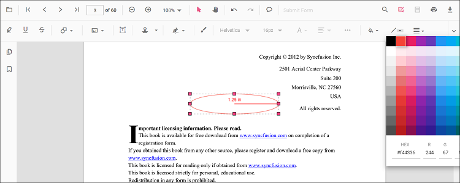
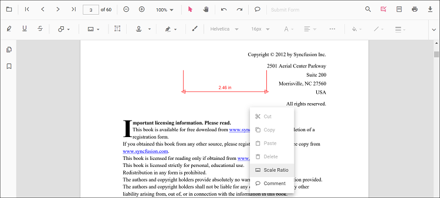

# Distance annotation in TypeScript PDF Viewer

Distance is a measurement annotation used to measure the length between two points in the PDF.


## Add Distance Annotation

### Add distance annotation via UI

Use the annotation toolbar:
- Click the **Edit Annotation** button in the PDF Viewer toolbar.
- Open the **Measurement Annotation** dropdown.
- Choose **Distance**, then draw on the page.

N> When in pan mode, selecting a measurement annotation switches the viewer to text select mode.


### Add a distance annotation programmatically

#### Enable distance mode

The PDF Viewer component allows drawing Distance annotations programmatically after enabling Distance mode in button clicks.

```html
<button id="distanceMode">Distance</button>
```



import { PdfViewer, Toolbar, Magnification, Navigation, Annotation, LinkAnnotation, ThumbnailView, BookmarkView, TextSelection, TextSearch, FormFields, FormDesigner, PageOrganizer } from '@syncfusion/ej2-pdfviewer';

PdfViewer.Inject(Toolbar, Magnification, Navigation, Annotation, LinkAnnotation, ThumbnailView, BookmarkView, TextSelection, TextSearch, FormFields, FormDesigner, PageOrganizer);

let pdfviewer: PdfViewer = new PdfViewer();
pdfviewer.documentPath = "https://cdn.syncfusion.com/content/pdf/pdf-succinctly.pdf";
pdfviewer.resourceUrl = "https://cdn.syncfusion.com/ej2/31.1.23/dist/ej2-pdfviewer-lib";
pdfviewer.appendTo('#PdfViewer');

document.getElementById('distanceMode')?.addEventListener('click', () => {
    pdfviewer.annotationModule.setAnnotationMode('Distance');
});


import { PdfViewer, Toolbar, Magnification, Navigation, Annotation, LinkAnnotation, ThumbnailView, BookmarkView, TextSelection, TextSearch, FormFields, FormDesigner, PageOrganizer } from '@syncfusion/ej2-pdfviewer';

PdfViewer.Inject(Toolbar, Magnification, Navigation, Annotation, LinkAnnotation, ThumbnailView, BookmarkView, TextSelection, TextSearch, FormFields, FormDesigner, PageOrganizer);

let pdfviewer: PdfViewer = new PdfViewer();
pdfviewer.serviceUrl = 'https://document.syncfusion.com/web-services/pdf-viewer/api/pdfviewer/';
pdfviewer.documentPath = "https://cdn.syncfusion.com/content/pdf/pdf-succinctly.pdf";
pdfviewer.appendTo('#PdfViewer');

document.getElementById('distanceMode')?.addEventListener('click', () => {
    pdfviewer.annotationModule.setAnnotationMode('Distance');
});



#### Exit distance mode

```html
<button id="setNone">Normal Mode</button>
```



document.getElementById('setNone')?.addEventListener('click', () => {
    pdfviewer.annotationModule.setAnnotationMode('None');
});



#### Add distance annotation

Add measurement annotations programmatically using the [addAnnotation()](https://ej2.syncfusion.com/documentation/api/pdfviewer/annotation#annotation) method.

```html
<button id="addDistanceAnnotation">Add Distance annotation programmatically</button>
```



import { PdfViewer, Toolbar, Magnification, Navigation, Annotation, LinkAnnotation, ThumbnailView, BookmarkView, TextSelection, TextSearch, FormFields, FormDesigner, PageOrganizer, DistanceSettings } from '@syncfusion/ej2-pdfviewer';

PdfViewer.Inject(Toolbar, Magnification, Navigation, Annotation, LinkAnnotation, ThumbnailView, BookmarkView, TextSelection, TextSearch, FormFields, FormDesigner, PageOrganizer);

let pdfviewer: PdfViewer = new PdfViewer();
pdfviewer.documentPath = "https://cdn.syncfusion.com/content/pdf/pdf-succinctly.pdf";
pdfviewer.resourceUrl = "https://cdn.syncfusion.com/ej2/31.1.23/dist/ej2-pdfviewer-lib";
pdfviewer.appendTo('#PdfViewer');

document.getElementById('addDistanceAnnotation')?.addEventListener('click', () => {
    pdfviewer.annotation.addAnnotation('Distance', {
        offset: { x: 200, y: 230 },
        pageNumber: 1,
        vertexPoints: [{ x: 200, y: 230 }, { x: 350, y: 230 }]
    } as DistanceSettings);
});


import { PdfViewer, Toolbar, Magnification, Navigation, Annotation, LinkAnnotation, ThumbnailView, BookmarkView, TextSelection, TextSearch, FormFields, FormDesigner, PageOrganizer, DistanceSettings } from '@syncfusion/ej2-pdfviewer';

PdfViewer.Inject(Toolbar, Magnification, Navigation, Annotation, LinkAnnotation, ThumbnailView, BookmarkView, TextSelection, TextSearch, FormFields, FormDesigner, PageOrganizer);

let pdfviewer: PdfViewer = new PdfViewer();
pdfviewer.serviceUrl = 'https://document.syncfusion.com/web-services/pdf-viewer/api/pdfviewer/';
pdfviewer.documentPath = "https://cdn.syncfusion.com/content/pdf/pdf-succinctly.pdf";
pdfviewer.appendTo('#PdfViewer');

document.getElementById('addDistanceAnnotation')?.addEventListener('click', () => {
    pdfviewer.annotation.addAnnotation('Distance', {
        offset: { x: 200, y: 230 },
        pageNumber: 1,
        vertexPoints: [{ x: 200, y: 230 }, { x: 350, y: 230 }]
    } as DistanceSettings);
});



## Edit Distance Annotation

### Edit distance annotation in UI

You can select, move, and resize Distance annotations directly in the viewer:
- Select a Distance measurement to show its handles.
- Move: drag the line to reposition it on the page.
- Resize: drag the end handles to adjust its length.
- Delete or access more options from the context menu.

### Edit the properties of area annotations

The fill color, stroke color, thickness, and opacity can be edited using the Edit Color, Edit Stroke Color, Edit Thickness, and Edit Opacity tools in the annotation toolbar.

#### Edit fill color

The fill color of the annotation can be edited using the color palette provided in the Edit Color tool.


#### Edit stroke color

The stroke color of the annotation can be edited using the color palette provided in the Edit Stroke Color tool.



#### Edit thickness

Edit border thickness using the range slider provided in the Edit Thickness tool.


#### Edit opacity

The opacity of the annotation can be edited using the range slider provided in the Edit Opacity tool.


### Edit an existing distance annotation programmatically

Use editAnnotation on items from annotationCollection.

```html
<button id="editDistanceAnnotation">Edit Distance annotation programmatically</button>
```



import { PdfViewer, Toolbar, Magnification, Navigation, Annotation, LinkAnnotation, ThumbnailView, BookmarkView, TextSelection, TextSearch, FormFields, FormDesigner, PageOrganizer } from '@syncfusion/ej2-pdfviewer';

PdfViewer.Inject(Toolbar, Magnification, Navigation, Annotation, LinkAnnotation, ThumbnailView, BookmarkView, TextSelection, TextSearch, FormFields, FormDesigner, PageOrganizer);

let pdfviewer: PdfViewer = new PdfViewer();
pdfviewer.documentPath = "https://cdn.syncfusion.com/content/pdf/pdf-succinctly.pdf";
pdfviewer.resourceUrl = "https://cdn.syncfusion.com/ej2/31.1.23/dist/ej2-pdfviewer-lib";
pdfviewer.appendTo('#PdfViewer');

document.getElementById('editDistanceAnnotation')?.addEventListener('click', () => {
    for (let i = 0; i < pdfviewer.annotationCollection.length; i++) {
        if (pdfviewer.annotationCollection[i].subject === 'Distance calculation') {
            pdfviewer.annotationCollection[i].strokeColor = '#0000FF';
            pdfviewer.annotationCollection[i].thickness = 2;
            pdfviewer.annotationCollection[i].opacity = 0.8;
            pdfviewer.annotation.editAnnotation(pdfviewer.annotationCollection[i]);
        }
    }
});


import { PdfViewer, Toolbar, Magnification, Navigation, Annotation, LinkAnnotation, ThumbnailView, BookmarkView, TextSelection, TextSearch, FormFields, FormDesigner, PageOrganizer } from '@syncfusion/ej2-pdfviewer';

PdfViewer.Inject(Toolbar, Magnification, Navigation, Annotation, LinkAnnotation, ThumbnailView, BookmarkView, TextSelection, TextSearch, FormFields, FormDesigner, PageOrganizer);

let pdfviewer: PdfViewer = new PdfViewer();
pdfviewer.serviceUrl = 'https://document.syncfusion.com/web-services/pdf-viewer/api/pdfviewer/';
pdfviewer.documentPath = "https://cdn.syncfusion.com/content/pdf/pdf-succinctly.pdf";
pdfviewer.appendTo('#PdfViewer');

document.getElementById('editDistanceAnnotation')?.addEventListener('click', () => {
    for (let i = 0; i < pdfviewer.annotationCollection.length; i++) {
        if (pdfviewer.annotationCollection[i].subject === 'Distance calculation') {
            pdfviewer.annotationCollection[i].strokeColor = '#0000FF';
            pdfviewer.annotationCollection[i].thickness = 2;
            pdfviewer.annotationCollection[i].opacity = 0.8;
            pdfviewer.annotation.editAnnotation(pdfviewer.annotationCollection[i]);
        }
    }
});



## Default distance settings during initialization

Set default [distanceSettings](https://ej2.syncfusion.com/documentation/api/pdfviewer/index-default#distancesettings) before creating the control.



import { PdfViewer, Toolbar, Magnification, Navigation, Annotation, LinkAnnotation, ThumbnailView, BookmarkView, TextSelection, TextSearch, FormFields, FormDesigner, PageOrganizer } from '@syncfusion/ej2-pdfviewer';

PdfViewer.Inject(Toolbar, Magnification, Navigation, Annotation, LinkAnnotation, ThumbnailView, BookmarkView, TextSelection, TextSearch, FormFields, FormDesigner, PageOrganizer);

let pdfviewer: PdfViewer = new PdfViewer();
pdfviewer.documentPath = "https://cdn.syncfusion.com/content/pdf/pdf-succinctly.pdf";
pdfviewer.resourceUrl = "https://cdn.syncfusion.com/ej2/31.1.23/dist/ej2-pdfviewer-lib";
pdfviewer.distanceSettings = { fillColor: 'blue', opacity: 0.6, strokeColor: 'green' };
pdfviewer.appendTo('#PdfViewer');


import { PdfViewer, Toolbar, Magnification, Navigation, Annotation, LinkAnnotation, ThumbnailView, BookmarkView, TextSelection, TextSearch, FormFields, FormDesigner, PageOrganizer } from '@syncfusion/ej2-pdfviewer';

PdfViewer.Inject(Toolbar, Magnification, Navigation, Annotation, LinkAnnotation, ThumbnailView, BookmarkView, TextSelection, TextSearch, FormFields, FormDesigner, PageOrganizer);

let pdfviewer: PdfViewer = new PdfViewer();
pdfviewer.serviceUrl = 'https://document.syncfusion.com/web-services/pdf-viewer/api/pdfviewer/';
pdfviewer.documentPath = "https://cdn.syncfusion.com/content/pdf/pdf-succinctly.pdf";
pdfviewer.distanceSettings = { fillColor: 'blue', opacity: 0.6, strokeColor: 'green' };
pdfviewer.appendTo('#PdfViewer');



## Scale ratio and units

You can modify scale ratio and units using the Scale Ratio option in the context menu.



Supported units:
- Inch, Millimeter, Centimeter, Point, Pica, Feet


Set defaults via measurementSettings:



import { PdfViewer, Toolbar, Magnification, Navigation, Annotation, LinkAnnotation, ThumbnailView, BookmarkView, TextSelection, TextSearch, FormFields, FormDesigner, PageOrganizer } from '@syncfusion/ej2-pdfviewer';

PdfViewer.Inject(Toolbar, Magnification, Navigation, Annotation, LinkAnnotation, ThumbnailView, BookmarkView, TextSelection, TextSearch, FormFields, FormDesigner, PageOrganizer);

let pdfviewer: PdfViewer = new PdfViewer();
pdfviewer.documentPath = "https://cdn.syncfusion.com/content/pdf/pdf-succinctly.pdf";
pdfviewer.resourceUrl = "https://cdn.syncfusion.com/ej2/31.1.23/dist/ej2-pdfviewer-lib";
pdfviewer.measurementSettings = { scaleRatio: 2, conversionUnit: 'cm', displayUnit: 'cm' };
pdfviewer.appendTo('#PdfViewer');


import { PdfViewer, Toolbar, Magnification, Navigation, Annotation, LinkAnnotation, ThumbnailView, BookmarkView, TextSelection, TextSearch, FormFields, FormDesigner, PageOrganizer } from '@syncfusion/ej2-pdfviewer';

PdfViewer.Inject(Toolbar, Magnification, Navigation, Annotation, LinkAnnotation, ThumbnailView, BookmarkView, TextSelection, TextSearch, FormFields, FormDesigner, PageOrganizer);

let pdfviewer: PdfViewer = new PdfViewer();
pdfviewer.serviceUrl = 'https://document.syncfusion.com/web-services/pdf-viewer/api/pdfviewer/';
pdfviewer.documentPath = "https://cdn.syncfusion.com/content/pdf/pdf-succinctly.pdf";
pdfviewer.measurementSettings = { scaleRatio: 2, conversionUnit: 'cm', displayUnit: 'cm' };
pdfviewer.appendTo('#PdfViewer');



[View Sample on GitHub](https://github.com/SyncfusionExamples/typescript-pdf-viewer-examples/tree/master)