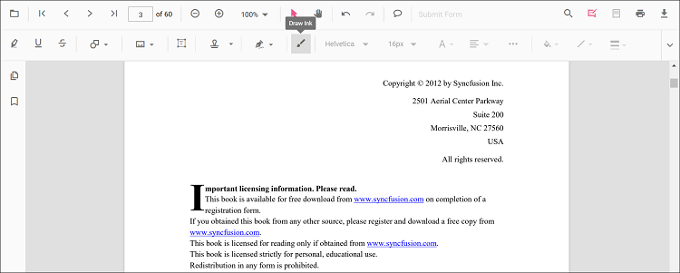
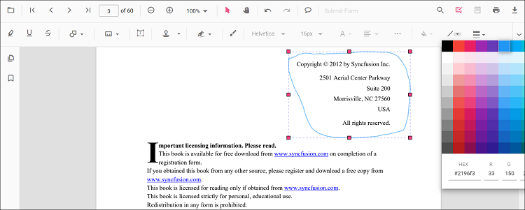

# Ink (freehand) annotation in TypeScript PDF Viewer

Ink is a freehand drawing annotation used to sketch, sign, or mark up content.


## Add Ink Annotation

### Add ink annotation via UI

Use the annotation toolbar:
- Click the Edit Annotation button in the PDF Viewer toolbar.
- Click the Draw Ink button to enable ink mode.
- Draw on any page of the PDF document.



#### Enable ink mode

The PDF Viewer component allows add ink annotations programmatically after enabling ink mode in button clicks.

```html
<button id="addInkAnnotation">Ink Annotation</button>
```



import { PdfViewer, Toolbar, Magnification, Navigation, Annotation, LinkAnnotation, ThumbnailView, BookmarkView, TextSelection, TextSearch, FormFields, FormDesigner, PageOrganizer, InkAnnotationSettings } from '@syncfusion/ej2-pdfviewer';

PdfViewer.Inject(Toolbar, Magnification, Navigation, Annotation, LinkAnnotation, ThumbnailView, BookmarkView, TextSelection, TextSearch, FormFields, FormDesigner, PageOrganizer);

const pdfviewer: PdfViewer = new PdfViewer({
  documentPath: 'https://cdn.syncfusion.com/content/pdf/pdf-succinctly.pdf',
  pdfviewer.resourceUrl = "https://cdn.syncfusion.com/ej2/31.1.23/dist/ej2-pdfviewer-lib";
});

pdfviewer.appendTo('#PdfViewer');

document.getElementById('addInkAnnotation')?.addEventListener('click', () => {
  pdfviewer.annotationModule.setAnnotationMode('Ink');
});



#### Exit ink mode

```html
<button id="setNone">Normal Mode</button>
```



document.getElementById('setNone')?.addEventListener('click', () => {
    pdfviewer.annotationModule.setAnnotationMode('None');
});



### Add ink annotation programmatically

Use addAnnotation to programmatically create an Ink annotation.

```html
<button id="addInkAnnotationProgram"> Add Ink Annotation Programmatically</button>
```



import { PdfViewer, Toolbar, Magnification, Navigation, Annotation, LinkAnnotation, ThumbnailView, BookmarkView, TextSelection, TextSearch, FormFields, FormDesigner, PageOrganizer, InkAnnotationSettings } from '@syncfusion/ej2-pdfviewer';

PdfViewer.Inject(Toolbar, Magnification, Navigation, Annotation, LinkAnnotation, ThumbnailView, BookmarkView, TextSelection, TextSearch, FormFields, FormDesigner, PageOrganizer);

let pdfviewer: PdfViewer = new PdfViewer();
pdfviewer.documentPath = "https://cdn.syncfusion.com/content/pdf/pdf-succinctly.pdf";
pdfviewer.resourceUrl = "https://cdn.syncfusion.com/ej2/31.1.23/dist/ej2-pdfviewer-lib";

pdfviewer.appendTo('#PdfViewer');

document.getElementById('addInkAnnotationProgram')?.addEventListener('click', function () {
    pdfviewer.annotation.addAnnotation('Ink', {
        offset: { x: 150, y: 100 },
        pageNumber: 1,
        width: 200,
        height: 60,
        path: '[{"command":"M","x":244.83,"y":982.00},{"command":"L","x":250.83,"y":953.33}]'
    } as InkAnnotationSettings);
});


import { PdfViewer, Toolbar, Magnification, Navigation, Annotation, LinkAnnotation, ThumbnailView, BookmarkView, TextSelection, TextSearch, FormFields, FormDesigner, PageOrganizer, InkAnnotationSettings } from '@syncfusion/ej2-pdfviewer';

PdfViewer.Inject(Toolbar, Magnification, Navigation, Annotation, LinkAnnotation, ThumbnailView, BookmarkView, TextSelection, TextSearch, FormFields, FormDesigner, PageOrganizer);

let pdfviewer: PdfViewer = new PdfViewer();
pdfviewer.serviceUrl = 'https://document.syncfusion.com/web-services/pdf-viewer/api/pdfviewer/';
pdfviewer.documentPath = "https://cdn.syncfusion.com/content/pdf/pdf-succinctly.pdf";

pdfviewer.appendTo('#PdfViewer');

document.getElementById('addInkAnnotationProgram')?.addEventListener('click', function () {
    pdfviewer.annotation.addAnnotation('Ink', {
        offset: { x: 150, y: 100 },
        pageNumber: 1,
        width: 200,
        height: 60,
        path: '[{"command":"M","x":244.83,"y":982.00},{"command":"L","x":250.83,"y":953.33}]'
    } as InkAnnotationSettings);
});



## Edit Ink Annotation

### Edit ink annotation in UI

You can select, move, and resize Ink annotations directly in the viewer:
- Select an Ink annotation to show its handles.
- Move: drag inside the stroke to reposition it on the page.
- Resize: drag the selector handles to adjust its bounds.
- Delete or access more options from the context menu.

### Edit the properties of ink annotations

Stroke color, thickness, and opacity can be edited using the Edit Stroke Color, Edit Thickness, and Edit Opacity tools in the annotation toolbar.

#### Edit stroke color

Edit the stroke color using the color palette in the Edit Stroke Color tool.



#### Edit thickness

Edit thickness using the range slider in the Edit Thickness tool.


#### Edit opacity

Edit opacity using the range slider in the Edit Opacity tool.


### Edit an existing ink annotation programmatically

Use editAnnotation to modify properties and bounds of an existing ink annotation.

```html
<button id="editInkAnnotation"> Edit Ink Annotation Programmatically</button>
```



import { PdfViewer, Toolbar, Magnification, Navigation, Annotation, LinkAnnotation, ThumbnailView, BookmarkView, TextSelection, TextSearch, FormFields, FormDesigner, PageOrganizer } from '@syncfusion/ej2-pdfviewer';

PdfViewer.Inject(Toolbar, Magnification, Navigation, Annotation, LinkAnnotation, ThumbnailView, BookmarkView, TextSelection, TextSearch, FormFields, FormDesigner, PageOrganizer);

let pdfviewer: PdfViewer = new PdfViewer();
pdfviewer.documentPath = "https://cdn.syncfusion.com/content/pdf/pdf-succinctly.pdf";
pdfviewer.resourceUrl = "https://cdn.syncfusion.com/ej2/31.1.23/dist/ej2-pdfviewer-lib";

pdfviewer.appendTo('#PdfViewer');

document.getElementById('editInkAnnotation')?.addEventListener('click', function () {
    for (let i = 0; i < pdfviewer.annotationCollection.length; i++) {
        if (pdfviewer.annotationCollection[i].shapeAnnotationType === 'Ink') {
            const width = pdfviewer.annotationCollection[i].bounds.width;
            const height = pdfviewer.annotationCollection[i].bounds.height;
            pdfviewer.annotationCollection[i].bounds = { x: 100, y: 100, width, height };
            pdfviewer.annotationCollection[i].strokeColor = '#0000FF';
            pdfviewer.annotationCollection[i].thickness = 2;
            pdfviewer.annotationCollection[i].annotationSelectorSettings.resizerShape = 'Circle';
            pdfviewer.annotation.editAnnotation(pdfviewer.annotationCollection[i]);
        }
    }
});


import { PdfViewer, Toolbar, Magnification, Navigation, Annotation, LinkAnnotation, ThumbnailView, BookmarkView, TextSelection, TextSearch, FormFields, FormDesigner, PageOrganizer } from '@syncfusion/ej2-pdfviewer';

PdfViewer.Inject(Toolbar, Magnification, Navigation, Annotation, LinkAnnotation, ThumbnailView, BookmarkView, TextSelection, TextSearch, FormFields, FormDesigner, PageOrganizer);

let pdfviewer: PdfViewer = new PdfViewer();
pdfviewer.serviceUrl = 'https://document.syncfusion.com/web-services/pdf-viewer/api/pdfviewer/';
pdfviewer.documentPath = "https://cdn.syncfusion.com/content/pdf/pdf-succinctly.pdf";

pdfviewer.appendTo('#PdfViewer');

document.getElementById('editInkAnnotation')?.addEventListener('click', function () {
    for (let i = 0; i < pdfviewer.annotationCollection.length; i++) {
        if (pdfviewer.annotationCollection[i].shapeAnnotationType === 'Ink') {
            const width = pdfviewer.annotationCollection[i].bounds.width;
            const height = pdfviewer.annotationCollection[i].bounds.height;
            pdfviewer.annotationCollection[i].bounds = { x: 100, y: 100, width, height };
            pdfviewer.annotationCollection[i].strokeColor = '#0000FF';
            pdfviewer.annotationCollection[i].thickness = 2;
            pdfviewer.annotationCollection[i].annotationSelectorSettings.resizerShape = 'Circle';
            pdfviewer.annotation.editAnnotation(pdfviewer.annotationCollection[i]);
        }
    }
});




## Default ink settings during initialization

Set defaults using inkAnnotationSettings.



import { PdfViewer, Toolbar, Magnification, Navigation, Annotation, LinkAnnotation, ThumbnailView, BookmarkView, TextSelection, TextSearch, FormFields, FormDesigner, PageOrganizer } from '@syncfusion/ej2-pdfviewer';

PdfViewer.Inject(Toolbar, Magnification, Navigation, Annotation, LinkAnnotation, ThumbnailView, BookmarkView, TextSelection, TextSearch, FormFields, FormDesigner, PageOrganizer);

let pdfviewer: PdfViewer = new PdfViewer({
  documentPath: 'https://cdn.syncfusion.com/content/pdf/pdf-succinctly.pdf',
  resourceUrl: 'https://cdn.syncfusion.com/ej2/31.1.23/dist/ej2-pdfviewer-lib',
  inkAnnotationSettings: { author: 'Syncfusion', strokeColor: 'green', thickness: 3, opacity: 0.6 }
});

pdfviewer.appendTo('#PdfViewer');


import { PdfViewer, Toolbar, Magnification, Navigation, Annotation, LinkAnnotation, ThumbnailView, BookmarkView, TextSelection, TextSearch, FormFields, FormDesigner, PageOrganizer } from '@syncfusion/ej2-pdfviewer';

PdfViewer.Inject(Toolbar, Magnification, Navigation, Annotation, LinkAnnotation, ThumbnailView, BookmarkView, TextSelection, TextSearch, FormFields, FormDesigner, PageOrganizer);

let pdfviewer: PdfViewer = new PdfViewer({
  documentPath: 'https://cdn.syncfusion.com/content/pdf/pdf-succinctly.pdf',
  serviceUrl: 'https://document.syncfusion.com/web-services/pdf-viewer/api/pdfviewer/',
  inkAnnotationSettings: { author: 'Syncfusion', strokeColor: 'green', thickness: 3, opacity: 0.6 }
});

pdfviewer.appendTo('#PdfViewer');
pdfviewer.appendTo('#PdfViewer');



[View Sample on GitHub](https://github.com/SyncfusionExamples/typescript-pdf-viewer-examples/tree/master)

## See also

- [Annotation Overview](../overview)
- [Annotation Toolbar](../../toolbar-customization/annotation-toolbar)
- [Create and Modify Annotation](../../annotations/create-modify-annotation)
- [Customize Annotation](../../annotations/customize-annotation)
- [Remove Annotation](../../annotations/delete-annotation)
- [Handwritten Signature](../../annotations/signature-annotation)
- [Export and Import Annotation](../../annotations/export-import/export-annotation)
- [Annotation in Mobile View](../../annotations/annotations-in-mobile-view)
- [Annotation Events](../../annotations/annotation-event)
- [Annotation API](../../annotations/annotations-api)