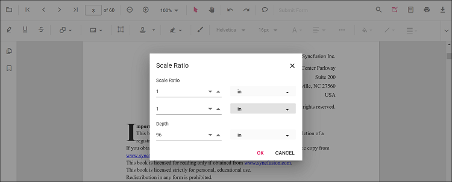

# Perimeter annotation in TypeScript PDF Viewer

Perimeter is a measurement annotation used to measure the length around a closed polyline in the PDF.


## Add Perimeter Annotation

### Add perimeter annotation via UI

Use the annotation toolbar:
- Click the Edit Annotation button in the PDF Viewer toolbar.
- Click the Measurement Annotation dropdown.
- Choose Perimeter, then draw the polyline on the page.

N> When in pan mode, selecting a measurement annotation switches the viewer to text select mode.


### Enable perimeter mode

The PDF Viewer library allows drawing measurement annotations programmatically after enabling perimeter mode in button clicks.

```html
<button id="perimeterMode">Perimeter</button>
```


import { PdfViewer, Toolbar, Magnification, Navigation, Annotation, LinkAnnotation, ThumbnailView, BookmarkView, TextSelection, TextSearch, FormFields, FormDesigner, PageOrganizer } from '@syncfusion/ej2-pdfviewer';

PdfViewer.Inject(Toolbar, Magnification, Navigation, Annotation, LinkAnnotation, ThumbnailView, BookmarkView, TextSelection, TextSearch, FormFields, FormDesigner, PageOrganizer);

let pdfviewer: PdfViewer = new PdfViewer();
pdfviewer.documentPath = "https://cdn.syncfusion.com/content/pdf/pdf-succinctly.pdf";
pdfviewer.resourceUrl = "https://cdn.syncfusion.com/ej2/31.1.23/dist/ej2-pdfviewer-lib";
pdfviewer.appendTo('#PdfViewer');

document.getElementById('perimeterMode')?.addEventListener('click', function () {
    pdfviewer.annotationModule.setAnnotationMode('Perimeter');
});


import { PdfViewer, Toolbar, Magnification, Navigation, Annotation, LinkAnnotation, ThumbnailView, BookmarkView, TextSelection, TextSearch, FormFields, FormDesigner, PageOrganizer } from '@syncfusion/ej2-pdfviewer';

PdfViewer.Inject(Toolbar, Magnification, Navigation, Annotation, LinkAnnotation, ThumbnailView, BookmarkView, TextSelection, TextSearch, FormFields, FormDesigner, PageOrganizer);

let pdfviewer: PdfViewer = new PdfViewer();
pdfviewer.serviceUrl = 'https://document.syncfusion.com/web-services/pdf-viewer/api/pdfviewer/';
pdfviewer.documentPath = "https://cdn.syncfusion.com/content/pdf/pdf-succinctly.pdf";
pdfviewer.appendTo('#PdfViewer');

document.getElementById('perimeterMode')?.addEventListener('click', function () {
    pdfviewer.annotationModule.setAnnotationMode('Perimeter');
});



### Add a perimeter annotation programmatically

The PDF Viewer library allows adding measurement annotations programmatically using the [addAnnotation()](https://ej2.syncfusion.com/documentation/api/pdfviewer/annotation#annotation) method.

```html
<button id="addPerimeterAnnotation">Add Perimeter annotation Programmatically</button>
```


import { PdfViewer, Toolbar, Magnification, Navigation, Annotation, LinkAnnotation, ThumbnailView, BookmarkView, TextSelection, TextSearch, FormFields, FormDesigner, PageOrganizer, PerimeterSettings } from '@syncfusion/ej2-pdfviewer';

PdfViewer.Inject(Toolbar, Magnification, Navigation, Annotation, LinkAnnotation, ThumbnailView, BookmarkView, TextSelection, TextSearch, FormFields, FormDesigner, PageOrganizer);

let pdfviewer: PdfViewer = new PdfViewer();
pdfviewer.documentPath = "https://cdn.syncfusion.com/content/pdf/pdf-succinctly.pdf";
pdfviewer.resourceUrl = "https://cdn.syncfusion.com/ej2/31.1.23/dist/ej2-pdfviewer-lib";

pdfviewer.appendTo('#PdfViewer');

document.getElementById('addPerimeterAnnotation')?.addEventListener('click', function () {
    pdfviewer.annotation.addAnnotation('Perimeter', {
        offset: { x: 200, y: 350 },
        pageNumber: 1,
        vertexPoints: [{ x: 200, y: 350 }, { x: 285, y: 350 }, { x: 286, y: 412 }]
    } as PerimeterSettings);
});


import { PdfViewer, Toolbar, Magnification, Navigation, Annotation, LinkAnnotation, ThumbnailView, BookmarkView, TextSelection, TextSearch, FormFields, FormDesigner, PageOrganizer, PerimeterSettings } from '@syncfusion/ej2-pdfviewer';

PdfViewer.Inject(Toolbar, Magnification, Navigation, Annotation, LinkAnnotation, ThumbnailView, BookmarkView, TextSelection, TextSearch, FormFields, FormDesigner, PageOrganizer);

let pdfviewer: PdfViewer = new PdfViewer();
pdfviewer.documentPath = "https://cdn.syncfusion.com/content/pdf/pdf-succinctly.pdf";
pdfviewer.serviceUrl = 'https://document.syncfusion.com/web-services/pdf-viewer/api/pdfviewer/';

pdfviewer.appendTo('#PdfViewer');

document.getElementById('addPerimeterAnnotation')?.addEventListener('click', function () {
    pdfviewer.annotation.addAnnotation('Perimeter', {
        offset: { x: 200, y: 350 },
        pageNumber: 1,
        vertexPoints: [{ x: 200, y: 350 }, { x: 285, y: 350 }, { x: 286, y: 412 }]
    } as PerimeterSettings);
});



## Edit Perimeter Annotation

### Edit perimeter annotation in UI

You can select, move, and resize Perimeter annotations directly in the viewer:
- Select a Perimeter to show its vertex handles.
- Move: drag inside the shape to reposition it on the page.
- Resize/reshape: drag any vertex handle to adjust the polyline points and size.
- Delete or access more options from the context menu.

### Edit the properties of Perimeter annotations

The fill color, stroke color, thickness, and opacity can be edited using the Edit Color, Edit Stroke Color, Edit Thickness, and Edit Opacity tools in the annotation toolbar.

#### Edit fill color

The fill color of the annotation can be edited using the color palette provided in the Edit Color tool.


#### Edit stroke color

The stroke color of the annotation can be edited using the color palette provided in the Edit Stroke Color tool.


#### Edit thickness

Edit border thickness using the range slider provided in the Edit Thickness tool.


#### Edit opacity

The opacity of the annotation can be edited using the range slider provided in the Edit Opacity tool.


### Edit an existing perimeter annotation programmatically

To modify an existing perimeter annotation programmatically, use the editAnnotation() method.

Here is an example of using editAnnotation():

```html
<button id="editPerimeterAnnotation">Edit Perimeter annotation Programmatically</button>
```




import { PdfViewer, Toolbar, Magnification, Navigation, Annotation, LinkAnnotation, ThumbnailView, BookmarkView, TextSelection, TextSearch, FormFields, FormDesigner, PageOrganizer} from '@syncfusion/ej2-pdfviewer';

PdfViewer.Inject(Toolbar, Magnification, Navigation, Annotation, LinkAnnotation, ThumbnailView, BookmarkView, TextSelection, TextSearch, FormFields, FormDesigner, PageOrganizer);

let pdfviewer: PdfViewer = new PdfViewer();
pdfviewer.documentPath = "https://cdn.syncfusion.com/content/pdf/pdf-succinctly.pdf";
pdfviewer.resourceUrl = "https://cdn.syncfusion.com/ej2/31.1.23/dist/ej2-pdfviewer-lib";
pdfviewer.appendTo('#PdfViewer');

let editPerimeterAnnotation = document.getElementById('editPerimeterAnnotation');
if (editPerimeterAnnotation) {
    editPerimeterAnnotation.addEventListener('click', function () {
        if (pdfviewer) {
            for (let i = 0; i < pdfviewer.annotationCollection.length; i++) {
                if (pdfviewer.annotationCollection[i].subject === "Perimeter calculation") {
                    pdfviewer.annotationCollection[i].annotationSelectorSettings.resizerShape = "Circle";
                    pdfviewer.annotationCollection[i].strokeColor = "#0000FF";
                    pdfviewer.annotationCollection[i].thickness = 2;
                    pdfviewer.annotationCollection[i].fillColor = "#FFFF00";
                    pdfviewer.annotation.editAnnotation(pdfviewer.annotationCollection[i]);
                }
            }
        }
    });
}




import { PdfViewer, Toolbar, Magnification, Navigation, Annotation, LinkAnnotation, ThumbnailView, BookmarkView, TextSelection, TextSearch, FormFields, FormDesigner, PageOrganizer} from '@syncfusion/ej2-pdfviewer';

PdfViewer.Inject(Toolbar, Magnification, Navigation, Annotation, LinkAnnotation, ThumbnailView, BookmarkView, TextSelection, TextSearch, FormFields, FormDesigner, PageOrganizer);

let pdfviewer: PdfViewer = new PdfViewer();
pdfviewer.serviceUrl = 'https://document.syncfusion.com/web-services/pdf-viewer/api/pdfviewer/';
pdfviewer.documentPath = "https://cdn.syncfusion.com/content/pdf/pdf-succinctly.pdf";
pdfviewer.appendTo('#PdfViewer');

let editPerimeterAnnotation = document.getElementById('editPerimeterAnnotation');
if (editPerimeterAnnotation) {
    editPerimeterAnnotation.addEventListener('click', function () {
        if (pdfviewer) {
            for (let i = 0; i < pdfviewer.annotationCollection.length; i++) {
                if (pdfviewer.annotationCollection[i].subject === "Perimeter calculation") {
                    pdfviewer.annotationCollection[i].annotationSelectorSettings.resizerShape = "Circle";
                    pdfviewer.annotationCollection[i].strokeColor = "#0000FF";
                    pdfviewer.annotationCollection[i].thickness = 2;
                    pdfviewer.annotationCollection[i].fillColor = "#FFFF00";
                    pdfviewer.annotation.editAnnotation(pdfviewer.annotationCollection[i]);
                }
            }
        }
    });
}




## Default perimeter settings during initialization

Set default perimeterSettings before creating the control.



import { PdfViewer, Toolbar, Magnification, Navigation, Annotation, LinkAnnotation, ThumbnailView, BookmarkView, TextSelection, TextSearch, FormFields, FormDesigner, PageOrganizer } from '@syncfusion/ej2-pdfviewer';

PdfViewer.Inject(Toolbar, Magnification, Navigation, Annotation, LinkAnnotation, ThumbnailView, BookmarkView, TextSelection, TextSearch, FormFields, FormDesigner, PageOrganizer);

let pdfviewer: PdfViewer = new PdfViewer();
pdfviewer.documentPath = "https://cdn.syncfusion.com/content/pdf/pdf-succinctly.pdf";
pdfviewer.resourceUrl = "https://cdn.syncfusion.com/ej2/31.1.23/dist/ej2-pdfviewer-lib";

pdfviewer.perimeterSettings = { fillColor: 'green', opacity: 0.6, strokeColor: 'blue' };
pdfviewer.appendTo('#PdfViewer');


import { PdfViewer, Toolbar, Magnification, Navigation, Annotation, LinkAnnotation, ThumbnailView, BookmarkView, TextSelection, TextSearch, FormFields, FormDesigner, PageOrganizer } from '@syncfusion/ej2-pdfviewer';

PdfViewer.Inject(Toolbar, Magnification, Navigation, Annotation, LinkAnnotation, ThumbnailView, BookmarkView, TextSelection, TextSearch, FormFields, FormDesigner, PageOrganizer);

let pdfviewer: PdfViewer = new PdfViewer();
pdfviewer.serviceUrl = 'https://document.syncfusion.com/web-services/pdf-viewer/api/pdfviewer/';
pdfviewer.documentPath = "https://cdn.syncfusion.com/content/pdf/pdf-succinctly.pdf";

pdfviewer.perimeterSettings = { fillColor: 'green', opacity: 0.6, strokeColor: 'blue' };
pdfviewer.appendTo('#PdfViewer');



## Editing scale ratio and unit of the perimeter measurement annotation

The scale ratio and unit of measurement can be modified using the scale ratio option provided in the context menu of the PDF Viewer control.


The Units of measurements support for the measurement annotations in the PDF Viewer are

- Inch
- Millimeter
- Centimeter
- Point
- Pica
- Feet



## Setting default scale ratio settings during control initialization

The properties of scale ratio for measurement annotation can be set before creating the control using measurementSettings as shown in the following code snippet,




import { PdfViewer, Toolbar, Magnification, Navigation, Annotation, LinkAnnotation, ThumbnailView, BookmarkView, TextSelection, TextSearch, FormFields, FormDesigner, PageOrganizer} from '@syncfusion/ej2-pdfviewer';

PdfViewer.Inject(Toolbar, Magnification, Navigation, Annotation, LinkAnnotation, ThumbnailView, BookmarkView, TextSelection, TextSearch, FormFields, FormDesigner, PageOrganizer);

let pdfviewer: PdfViewer = new PdfViewer();
pdfviewer.documentPath = "https://cdn.syncfusion.com/content/pdf/pdf-succinctly.pdf";
pdfviewer.resourceUrl = "https://cdn.syncfusion.com/ej2/31.1.23/dist/ej2-pdfviewer-lib";
pdfviewer.measurementSettings={scaleRatio: 2, conversionUnit: 'cm', displayUnit: 'cm'};
pdfviewer.appendTo('#PdfViewer');




import { PdfViewer, Toolbar, Magnification, Navigation, Annotation, LinkAnnotation, ThumbnailView, BookmarkView, TextSelection, TextSearch, FormFields, FormDesigner, PageOrganizer} from '@syncfusion/ej2-pdfviewer';

PdfViewer.Inject(Toolbar, Magnification, Navigation, Annotation, LinkAnnotation, ThumbnailView, BookmarkView, TextSelection, TextSearch, FormFields, FormDesigner, PageOrganizer);

let pdfviewer: PdfViewer = new PdfViewer();
pdfviewer.serviceUrl = 'https://document.syncfusion.com/web-services/pdf-viewer/api/pdfviewer/';
pdfviewer.documentPath = "https://cdn.syncfusion.com/content/pdf/pdf-succinctly.pdf";
pdfviewer.measurementSettings={scaleRatio: 2, conversionUnit: 'cm', displayUnit: 'cm'};
pdfviewer.appendTo('#PdfViewer');




[View Sample on GitHub](https://github.com/SyncfusionExamples/typescript-pdf-viewer-examples/tree/master)
