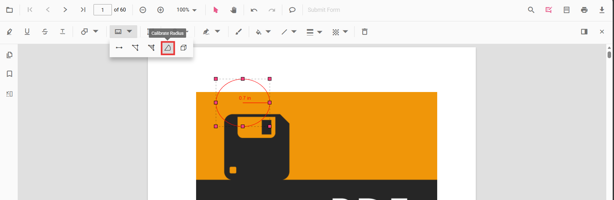

# Radius annotation in TypeScript PDF Viewer

Radius is a measurement annotation used to measure the radius of a circle in the PDF.



## Add Radius Annotation

### Add radius annotation via UI

Use the annotation toolbar:
- Click the Edit Annotation button in the PDF Viewer toolbar.
- Open the Measurement Annotation dropdown.
- Choose Radius, then draw on the page.

N> When in pan mode, selecting a measurement annotation switches the viewer to text select mode.


### Enable radius mode

The PDF Viewer component allows drawing Radius annotations programmatically after enabling Radius mode in button clicks.

```html
<button id="radiusMode">Radius</button>
```



import { PdfViewer, Toolbar, Magnification, Navigation, Annotation, LinkAnnotation, ThumbnailView, BookmarkView, TextSelection, TextSearch, FormFields, FormDesigner, PageOrganizer } from '@syncfusion/ej2-pdfviewer';

PdfViewer.Inject(Toolbar, Magnification, Navigation, Annotation, LinkAnnotation, ThumbnailView, BookmarkView, TextSelection, TextSearch, FormFields, FormDesigner, PageOrganizer);

let pdfviewer: PdfViewer = new PdfViewer();
pdfviewer.documentPath = "https://cdn.syncfusion.com/content/pdf/pdf-succinctly.pdf";
pdfviewer.resourceUrl = "https://cdn.syncfusion.com/ej2/31.1.23/dist/ej2-pdfviewer-lib";
pdfviewer.appendTo('#PdfViewer');

document.getElementById('radiusMode')?.addEventListener('click', () => {
    pdfviewer.annotationModule.setAnnotationMode('Radius');
});


import { PdfViewer, Toolbar, Magnification, Navigation, Annotation, LinkAnnotation, ThumbnailView, BookmarkView, TextSelection, TextSearch, FormFields, FormDesigner, PageOrganizer } from '@syncfusion/ej2-pdfviewer';

PdfViewer.Inject(Toolbar, Magnification, Navigation, Annotation, LinkAnnotation, ThumbnailView, BookmarkView, TextSelection, TextSearch, FormFields, FormDesigner, PageOrganizer);

let pdfviewer: PdfViewer = new PdfViewer();
pdfviewer.serviceUrl = 'https://document.syncfusion.com/web-services/pdf-viewer/api/pdfviewer/';
pdfviewer.documentPath = "https://cdn.syncfusion.com/content/pdf/pdf-succinctly.pdf";
pdfviewer.appendTo('#PdfViewer');

document.getElementById('radiusMode')?.addEventListener('click', () => {
    pdfviewer.annotationModule.setAnnotationMode('Radius');
});



#### Exit radius mode

```html
<button id="setNone">Normal Mode</button>
```



document.getElementById('setNone')?.addEventListener('click', () => {
    pdfviewer.annotationModule.setAnnotationMode('None');
});



### Add a radius annotation programmatically

Add measurement annotations programmatically using the [addAnnotation()](https://ej2.syncfusion.com/documentation/api/pdfviewer/annotation#annotation) method.

```html
<button id="addRadiusAnnotation">Add Radius annotation programmatically</button>
```



import { PdfViewer, Toolbar, Magnification, Navigation, Annotation, LinkAnnotation, ThumbnailView, BookmarkView, TextSelection, TextSearch, FormFields, FormDesigner, PageOrganizer, RadiusSettings } from '@syncfusion/ej2-pdfviewer';

PdfViewer.Inject(Toolbar, Magnification, Navigation, Annotation, LinkAnnotation, ThumbnailView, BookmarkView, TextSelection, TextSearch, FormFields, FormDesigner, PageOrganizer);

let pdfviewer: PdfViewer = new PdfViewer();
pdfviewer.documentPath = "https://cdn.syncfusion.com/content/pdf/pdf-succinctly.pdf";
pdfviewer.resourceUrl = "https://cdn.syncfusion.com/ej2/31.1.23/dist/ej2-pdfviewer-lib";
pdfviewer.appendTo('#PdfViewer');

document.getElementById('addRadiusAnnotation')?.addEventListener('click', () => {
    pdfviewer.annotation.addAnnotation('Radius', {
        offset: { x: 200, y: 630 },
        pageNumber: 1,
        width: 90,
        height: 90
    } as RadiusSettings);
});


import { PdfViewer, Toolbar, Magnification, Navigation, Annotation, LinkAnnotation, ThumbnailView, BookmarkView, TextSelection, TextSearch, FormFields, FormDesigner, PageOrganizer, RadiusSettings } from '@syncfusion/ej2-pdfviewer';

PdfViewer.Inject(Toolbar, Magnification, Navigation, Annotation, LinkAnnotation, ThumbnailView, BookmarkView, TextSelection, TextSearch, FormFields, FormDesigner, PageOrganizer);

let pdfviewer: PdfViewer = new PdfViewer();
pdfviewer.serviceUrl = 'https://document.syncfusion.com/web-services/pdf-viewer/api/pdfviewer/';
pdfviewer.documentPath = "https://cdn.syncfusion.com/content/pdf/pdf-succinctly.pdf";
pdfviewer.appendTo('#PdfViewer');

document.getElementById('addRadiusAnnotation')?.addEventListener('click', () => {
    pdfviewer.annotation.addAnnotation('Radius', {
        offset: { x: 200, y: 630 },
        pageNumber: 1,
        width: 90,
        height: 90
    } as RadiusSettings);
});



## Edit Radius Annotation

### Edit radius annotation in UI

You can select, move, and resize Radius annotations directly in the viewer:
- Select a Radius measurement to show its handles.
- Move: drag the shape to reposition it on the page.
- Resize: drag the handles to adjust its size.
- Delete or access more options from the context menu.

#### Edit the properties of radius annotations

The fill color, stroke color, thickness, and opacity can be edited using the Edit Color, Edit Stroke Color, Edit Thickness, and Edit Opacity tools in the annotation toolbar.

#### Edit fill color

The fill color of the annotation can be edited using the color palette provided in the Edit Color tool.


#### Edit stroke color

The stroke color of the annotation can be edited using the color palette provided in the Edit Stroke Color tool.


#### Edit thickness

Edit border thickness using the range slider provided in the Edit Thickness tool.


#### Edit opacity

The opacity of the annotation can be edited using the range slider provided in the Edit Opacity tool.


### Edit an existing radius annotation programmatically

Use editAnnotation on items from annotationCollection.

```html
<button id="editRadiusAnnotation">Edit Radius annotation programmatically</button>
```



import { PdfViewer, Toolbar, Magnification, Navigation, Annotation, LinkAnnotation, ThumbnailView, BookmarkView, TextSelection, TextSearch, FormFields, FormDesigner, PageOrganizer } from '@syncfusion/ej2-pdfviewer';

PdfViewer.Inject(Toolbar, Magnification, Navigation, Annotation, LinkAnnotation, ThumbnailView, BookmarkView, TextSelection, TextSearch, FormFields, FormDesigner, PageOrganizer);

let pdfviewer: PdfViewer = new PdfViewer();
pdfviewer.documentPath = "https://cdn.syncfusion.com/content/pdf/pdf-succinctly.pdf";
pdfviewer.resourceUrl = "https://cdn.syncfusion.com/ej2/31.1.23/dist/ej2-pdfviewer-lib";
pdfviewer.appendTo('#PdfViewer');

document.getElementById('editRadiusAnnotation')?.addEventListener('click', () => {
    for (let i = 0; i < pdfviewer.annotationCollection.length; i++) {
        if (pdfviewer.annotationCollection[i].subject === 'Radius calculation') {
            pdfviewer.annotationCollection[i].strokeColor = '#0000FF';
            pdfviewer.annotationCollection[i].thickness = 2;
            pdfviewer.annotationCollection[i].opacity = 0.8;
            pdfviewer.annotation.editAnnotation(pdfviewer.annotationCollection[i]);
        }
    }
});


import { PdfViewer, Toolbar, Magnification, Navigation, Annotation, LinkAnnotation, ThumbnailView, BookmarkView, TextSelection, TextSearch, FormFields, FormDesigner, PageOrganizer } from '@syncfusion/ej2-pdfviewer';

PdfViewer.Inject(Toolbar, Magnification, Navigation, Annotation, LinkAnnotation, ThumbnailView, BookmarkView, TextSelection, TextSearch, FormFields, FormDesigner, PageOrganizer);

let pdfviewer: PdfViewer = new PdfViewer();
pdfviewer.serviceUrl = 'https://document.syncfusion.com/web-services/pdf-viewer/api/pdfviewer/';
pdfviewer.documentPath = "https://cdn.syncfusion.com/content/pdf/pdf-succinctly.pdf";
pdfviewer.appendTo('#PdfViewer');

document.getElementById('editRadiusAnnotation')?.addEventListener('click', () => {
    for (let i = 0; i < pdfviewer.annotationCollection.length; i++) {
        if (pdfviewer.annotationCollection[i].subject === 'Radius calculation') {
            pdfviewer.annotationCollection[i].strokeColor = '#0000FF';
            pdfviewer.annotationCollection[i].thickness = 2;
            pdfviewer.annotationCollection[i].opacity = 0.8;
            pdfviewer.annotation.editAnnotation(pdfviewer.annotationCollection[i]);
        }
    }
});



## Default radius settings during initialization

Set default [radiusSettings](https://ej2.syncfusion.com/documentation/api/pdfviewer/index-default#radiussettings) before creating the control.



import { PdfViewer, Toolbar, Magnification, Navigation, Annotation, LinkAnnotation, ThumbnailView, BookmarkView, TextSelection, TextSearch, FormFields, FormDesigner, PageOrganizer } from '@syncfusion/ej2-pdfviewer';

PdfViewer.Inject(Toolbar, Magnification, Navigation, Annotation, LinkAnnotation, ThumbnailView, BookmarkView, TextSelection, TextSearch, FormFields, FormDesigner, PageOrganizer);

let pdfviewer: PdfViewer = new PdfViewer();
pdfviewer.documentPath = "https://cdn.syncfusion.com/content/pdf/pdf-succinctly.pdf";
pdfviewer.resourceUrl = "https://cdn.syncfusion.com/ej2/31.1.23/dist/ej2-pdfviewer-lib";
pdfviewer.radiusSettings = { fillColor: 'orange', opacity: 0.6, strokeColor: 'pink' };
pdfviewer.appendTo('#PdfViewer');


import { PdfViewer, Toolbar, Magnification, Navigation, Annotation, LinkAnnotation, ThumbnailView, BookmarkView, TextSelection, TextSearch, FormFields, FormDesigner, PageOrganizer } from '@syncfusion/ej2-pdfviewer';

PdfViewer.Inject(Toolbar, Magnification, Navigation, Annotation, LinkAnnotation, ThumbnailView, BookmarkView, TextSelection, TextSearch, FormFields, FormDesigner, PageOrganizer);

let pdfviewer: PdfViewer = new PdfViewer();
pdfviewer.serviceUrl = 'https://document.syncfusion.com/web-services/pdf-viewer/api/pdfviewer/';
pdfviewer.documentPath = "https://cdn.syncfusion.com/content/pdf/pdf-succinctly.pdf";
pdfviewer.radiusSettings = { fillColor: 'orange', opacity: 0.6, strokeColor: 'pink' };
pdfviewer.appendTo('#PdfViewer');



## Set properties while adding Individual Annotation

Set properties for individual annotation before creating the control using `RadiusSettings`.

> After editing default color and opacity using the Edit Color and Edit Opacity tools, the values update to the selected settings.

Refer to the following code snippet to set the default Radius settings.

```html
<button id="Radius">Add Radius</button>
```


import { PdfViewer, Toolbar, Magnification, Navigation, Annotation, LinkAnnotation, ThumbnailView, BookmarkView, TextSelection, TextSearch, FormFields, FormDesigner, RadiusSettings} from '@syncfusion/ej2-pdfviewer';

PdfViewer.Inject(Toolbar, Magnification, Navigation, Annotation, LinkAnnotation, ThumbnailView, BookmarkView, TextSelection, TextSearch, FormFields, FormDesigner);

const pdfviewer: PdfViewer = new PdfViewer();
pdfviewer.documentPath = 'https://cdn.syncfusion.com/content/pdf/form-designer.pdf';
pdfviewer.resourceUrl = 'https://cdn.syncfusion.com/ej2/31.1.23/dist/ej2-pdfviewer-lib';
pdfviewer.appendTo('#PdfViewer');
//Apply Radius Settings while adding individual Annotation
document.getElementById('Radius')?.addEventListener('click', function () {
    pdfviewer.annotation.addAnnotation('Radius', {
        offset: { x: 200, y: 630 },
        pageNumber: 1,
        width: 90,
        height: 90,
        fillColor: 'orange', opacity: 0.6, strokeColor: 'pink'
    } as RadiusSettings);
});


import { PdfViewer, Toolbar, Magnification, Navigation, Annotation, LinkAnnotation, ThumbnailView, BookmarkView, TextSelection, TextSearch, FormFields, FormDesigner, RadiusSettings} from '@syncfusion/ej2-pdfviewer';

PdfViewer.Inject(Toolbar, Magnification, Navigation, Annotation, LinkAnnotation, ThumbnailView, BookmarkView, TextSelection, TextSearch, FormFields, FormDesigner);

const pdfviewer: PdfViewer = new PdfViewer();
pdfviewer.documentPath = 'https://cdn.syncfusion.com/content/pdf/form-designer.pdf';
pdfviewer.serviceUrl = 'https://document.syncfusion.com/web-services/pdf-viewer/api/pdfviewer/';
pdfviewer.appendTo('#PdfViewer');
//Apply Radius Settings while adding individual Annotation
document.getElementById('Radius')?.addEventListener('click', function () {
    pdfviewer.annotation.addAnnotation('Radius', {
        offset: { x: 200, y: 630 },
        pageNumber: 1,
        width: 90,
        height: 90,
        fillColor: 'orange', opacity: 0.6, strokeColor: 'pink'
    } as RadiusSettings);
});



## Scale ratio and units

You can modify scale ratio and units using the Scale Ratio option in the context menu.


Supported units:
- Inch, Millimeter, Centimeter, Point, Pica, Feet


Set defaults via measurementSettings:



import { PdfViewer, Toolbar, Magnification, Navigation, Annotation, LinkAnnotation, ThumbnailView, BookmarkView, TextSelection, TextSearch, FormFields, FormDesigner, PageOrganizer } from '@syncfusion/ej2-pdfviewer';

PdfViewer.Inject(Toolbar, Magnification, Navigation, Annotation, LinkAnnotation, ThumbnailView, BookmarkView, TextSelection, TextSearch, FormFields, FormDesigner, PageOrganizer);

let pdfviewer: PdfViewer = new PdfViewer();
pdfviewer.documentPath = "https://cdn.syncfusion.com/content/pdf/pdf-succinctly.pdf";
pdfviewer.resourceUrl = "https://cdn.syncfusion.com/ej2/31.1.23/dist/ej2-pdfviewer-lib";
pdfviewer.measurementSettings = { scaleRatio: 2, conversionUnit: 'cm', displayUnit: 'cm' };
pdfviewer.appendTo('#PdfViewer');


import { PdfViewer, Toolbar, Magnification, Navigation, Annotation, LinkAnnotation, ThumbnailView, BookmarkView, TextSelection, TextSearch, FormFields, FormDesigner, PageOrganizer } from '@syncfusion/ej2-pdfviewer';

PdfViewer.Inject(Toolbar, Magnification, Navigation, Annotation, LinkAnnotation, ThumbnailView, BookmarkView, TextSelection, TextSearch, FormFields, FormDesigner, PageOrganizer);

let pdfviewer: PdfViewer = new PdfViewer();
pdfviewer.serviceUrl = 'https://document.syncfusion.com/web-services/pdf-viewer/api/pdfviewer/';
pdfviewer.documentPath = "https://cdn.syncfusion.com/content/pdf/pdf-succinctly.pdf";
pdfviewer.measurementSettings = { scaleRatio: 2, conversionUnit: 'cm', displayUnit: 'cm' };
pdfviewer.appendTo('#PdfViewer');



[View Sample on GitHub](https://github.com/SyncfusionExamples/typescript-pdf-viewer-examples/tree/master)

## See also

- [Annotation Overview](../overview)
- [Annotation Toolbar](../../toolbar-customization/annotation-toolbar)
- [Create and Modify Annotation](../../annotations/create-modify-annotation)
- [Customize Annotation](../../annotations/customize-annotation)
- [Remove Annotation](../../annotations/delete-annotation)
- [Handwritten Signature](../../annotations/signature-annotation)
- [Export and Import Annotation](../../annotations/export-import/export-annotation)
- [Annotation in Mobile View](../../annotations/annotations-in-mobile-view)
- [Annotation Events](../../annotations/annotation-event)
- [Annotation API](../../annotations/annotations-api)
