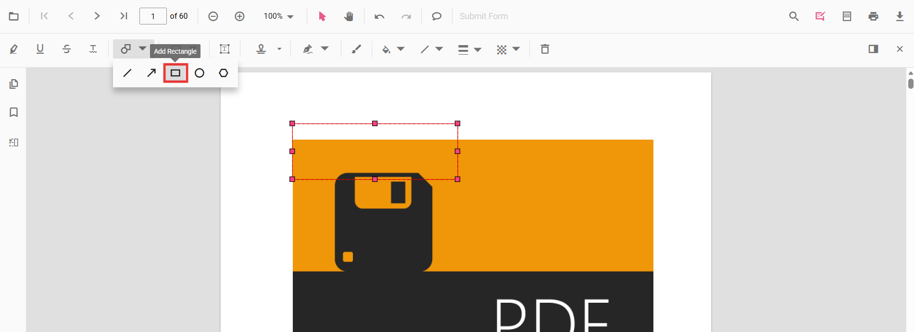

# Rectangle annotation in TypeScript PDF Viewer

Rectangle is a shape annotation used to highlight regions, group content, or draw callout boxes.



## Add Rectangle Annotation

### Add rectangle annotation via UI

Use the annotation toolbar to:
- Click the **Edit Annotation** button in the PDF Viewer toolbar.
- Open the **Shape Annotation** dropdown.
- Choose **Rectangle**, then draw on the page

N> When pan mode is active and a shape tool is selected, the viewer switches to text select mode automatically.


### Enable rectangle mode

The PDF Viewer library allows drawing rectangle annotations programmatically after enabling rectangle mode via button clicks.

```html
<button id="rectangleMode">Rectangle</button>
```



import { PdfViewer, Toolbar, Magnification, Navigation, Annotation, LinkAnnotation, ThumbnailView, BookmarkView, TextSelection, TextSearch, FormFields, FormDesigner, PageOrganizer } from '@syncfusion/ej2-pdfviewer';

PdfViewer.Inject(Toolbar, Magnification, Navigation, Annotation, LinkAnnotation, ThumbnailView, BookmarkView, TextSelection, TextSearch, FormFields, FormDesigner, PageOrganizer);

let pdfviewer: PdfViewer = new PdfViewer();
pdfviewer.documentPath = "https://cdn.syncfusion.com/content/pdf/pdf-succinctly.pdf";
pdfviewer.resourceUrl = "https://cdn.syncfusion.com/ej2/31.1.23/dist/ej2-pdfviewer-lib";
pdfviewer.appendTo('#PdfViewer');

document.getElementById('rectangleMode')?.addEventListener('click', () => {
    pdfviewer.annotationModule.setAnnotationMode('Rectangle');
});


import { PdfViewer, Toolbar, Magnification, Navigation, Annotation, LinkAnnotation, ThumbnailView, BookmarkView, TextSelection, TextSearch, FormFields, FormDesigner, PageOrganizer } from '@syncfusion/ej2-pdfviewer';

PdfViewer.Inject(Toolbar, Magnification, Navigation, Annotation, LinkAnnotation, ThumbnailView, BookmarkView, TextSelection, TextSearch, FormFields, FormDesigner, PageOrganizer);

let pdfviewer: PdfViewer = new PdfViewer();
pdfviewer.serviceUrl = 'https://document.syncfusion.com/web-services/pdf-viewer/api/pdfviewer/';
pdfviewer.documentPath = "https://cdn.syncfusion.com/content/pdf/pdf-succinctly.pdf";
pdfviewer.appendTo('#PdfViewer');

document.getElementById('rectangleMode')?.addEventListener('click', () => {
    pdfviewer.annotationModule.setAnnotationMode('Rectangle');
});



#### Exit rectangle mode

```html
<button id="setNone">Normal Mode</button>
```



document.getElementById('setNone')?.addEventListener('click', () => {
    pdfviewer.annotationModule.setAnnotationMode('None');
});



### Add a rectangle annotation programmatically

Use the `addAnnotation` method to add rectangle annotations programmatically.

```html
<button id="addRectangleAnnotation">Add Rectangle annotation programmatically</button>
```



import { PdfViewer, Toolbar, Magnification, Navigation, Annotation, LinkAnnotation, ThumbnailView, BookmarkView, TextSelection, TextSearch, FormFields, FormDesigner, PageOrganizer, RectangleSettings } from '@syncfusion/ej2-pdfviewer';

PdfViewer.Inject(Toolbar, Magnification, Navigation, Annotation, LinkAnnotation, ThumbnailView, BookmarkView, TextSelection, TextSearch, FormFields, FormDesigner, PageOrganizer);

let pdfviewer: PdfViewer = new PdfViewer();
pdfviewer.documentPath = "https://cdn.syncfusion.com/content/pdf/pdf-succinctly.pdf";
pdfviewer.resourceUrl = "https://cdn.syncfusion.com/ej2/31.1.23/dist/ej2-pdfviewer-lib";
pdfviewer.appendTo('#PdfViewer');

document.getElementById('addRectangleAnnotation')?.addEventListener('click', () => {
    pdfviewer.annotation.addAnnotation('Rectangle', {
        offset: { x: 200, y: 480 },
        pageNumber: 1,
        width: 150,
        height: 75
    } as RectangleSettings);
});


import { PdfViewer, Toolbar, Magnification, Navigation, Annotation, LinkAnnotation, ThumbnailView, BookmarkView, TextSelection, TextSearch, FormFields, FormDesigner, PageOrganizer, RectangleSettings } from '@syncfusion/ej2-pdfviewer';

PdfViewer.Inject(Toolbar, Magnification, Navigation, Annotation, LinkAnnotation, ThumbnailView, BookmarkView, TextSelection, TextSearch, FormFields, FormDesigner, PageOrganizer);

let pdfviewer: PdfViewer = new PdfViewer();
pdfviewer.serviceUrl = 'https://document.syncfusion.com/web-services/pdf-viewer/api/pdfviewer/';
pdfviewer.documentPath = "https://cdn.syncfusion.com/content/pdf/pdf-succinctly.pdf";
pdfviewer.appendTo('#PdfViewer');

document.getElementById('addRectangleAnnotation')?.addEventListener('click', () => {
    pdfviewer.annotation.addAnnotation('Rectangle', {
        offset: { x: 200, y: 480 },
        pageNumber: 1,
        width: 150,
        height: 75
    } as RectangleSettings);
});



## Edit Rectangle Annotation

### Edit Rectangle Annotation in UI

Use the viewer to select, move, and resize Rectangle annotations:
- Select a Rectangle to show its resize handles.
- Move: drag inside the shape to reposition it on the page.
- Resize: drag any corner or side handle to adjust size.
- Delete or access more options from the context menu.

Use the toolbar to change appearance:
- Use the  Edit Color, Edit Stroke Color, Edit Thickness, and Edit Opacity tools.

#### Edit the properties of rectangle annotations

The fill color, stroke color, thickness, and opacity can be edited using the Edit Color, Edit Stroke Color, Edit Thickness, and Edit Opacity tools in the annotation toolbar.

#### Edit fill color

The fill color of the annotation can be edited using the color palette provided in the Edit Color tool.


#### Edit stroke color

The stroke color of the annotation can be edited using the color palette provided in the Edit Stroke Color tool.


#### Edit thickness

Edit border thickness using the range slider provided in the Edit Thickness tool.


#### Edit opacity

The opacity of the annotation can be edited using the range slider provided in the Edit Opacity tool.


### Edit an existing rectangle annotation programmatically

Use editAnnotation on items from annotationCollection.

```html
<button id="editRectangleAnnotation">Edit Rectangle annotation programmatically</button>
```



import { PdfViewer, Toolbar, Magnification, Navigation, Annotation, LinkAnnotation, ThumbnailView, BookmarkView, TextSelection, TextSearch, FormFields, FormDesigner, PageOrganizer } from '@syncfusion/ej2-pdfviewer';

PdfViewer.Inject(Toolbar, Magnification, Navigation, Annotation, LinkAnnotation, ThumbnailView, BookmarkView, TextSelection, TextSearch, FormFields, FormDesigner, PageOrganizer);

let pdfviewer: PdfViewer = new PdfViewer();
pdfviewer.documentPath = "https://cdn.syncfusion.com/content/pdf/pdf-succinctly.pdf";
pdfviewer.resourceUrl = "https://cdn.syncfusion.com/ej2/31.1.23/dist/ej2-pdfviewer-lib";
pdfviewer.appendTo('#PdfViewer');

document.getElementById('editRectangleAnnotation')?.addEventListener('click', () => {
    for (let i = 0; i < pdfviewer.annotationCollection.length; i++) {
        if (pdfviewer.annotationCollection[i].subject === 'Rectangle') {
            pdfviewer.annotationCollection[i].strokeColor = '#0000FF';
            pdfviewer.annotationCollection[i].thickness = 2;
            pdfviewer.annotationCollection[i].fillColor = '#FFFF00';
            pdfviewer.annotationCollection[i].annotationSelectorSettings.resizerShape = 'Circle';
            pdfviewer.annotation.editAnnotation(pdfviewer.annotationCollection[i]);
        }
    }
});


import { PdfViewer, Toolbar, Magnification, Navigation, Annotation, LinkAnnotation, ThumbnailView, BookmarkView, TextSelection, TextSearch, FormFields, FormDesigner, PageOrganizer } from '@syncfusion/ej2-pdfviewer';

PdfViewer.Inject(Toolbar, Magnification, Navigation, Annotation, LinkAnnotation, ThumbnailView, BookmarkView, TextSelection, TextSearch, FormFields, FormDesigner, PageOrganizer);

let pdfviewer: PdfViewer = new PdfViewer();
pdfviewer.serviceUrl = 'https://document.syncfusion.com/web-services/pdf-viewer/api/pdfviewer/';
pdfviewer.documentPath = "https://cdn.syncfusion.com/content/pdf/pdf-succinctly.pdf";
pdfviewer.appendTo('#PdfViewer');

document.getElementById('editRectangleAnnotation')?.addEventListener('click', () => {
    for (let i = 0; i < pdfviewer.annotationCollection.length; i++) {
        if (pdfviewer.annotationCollection[i].subject === 'Rectangle') {
            pdfviewer.annotationCollection[i].strokeColor = '#0000FF';
            pdfviewer.annotationCollection[i].thickness = 2;
            pdfviewer.annotationCollection[i].fillColor = '#FFFF00';
            pdfviewer.annotationCollection[i].annotationSelectorSettings.resizerShape = 'Circle';
            pdfviewer.annotation.editAnnotation(pdfviewer.annotationCollection[i]);
        }
    }
});



## Default rectangle settings during initialization

Set default properties before creating the control using rectangleSettings.



import { PdfViewer, Toolbar, Magnification, Navigation, Annotation, LinkAnnotation, ThumbnailView, BookmarkView, TextSelection, TextSearch, FormFields, FormDesigner, PageOrganizer } from '@syncfusion/ej2-pdfviewer';

PdfViewer.Inject(Toolbar, Magnification, Navigation, Annotation, LinkAnnotation, ThumbnailView, BookmarkView, TextSelection, TextSearch, FormFields, FormDesigner, PageOrganizer);

let pdfviewer: PdfViewer = new PdfViewer();
pdfviewer.documentPath = "https://cdn.syncfusion.com/content/pdf/pdf-succinctly.pdf";
pdfviewer.resourceUrl = "https://cdn.syncfusion.com/ej2/31.1.23/dist/ej2-pdfviewer-lib";
pdfviewer.rectangleSettings = { fillColor: 'yellow', opacity: 0.6, strokeColor: 'orange' };
pdfviewer.appendTo('#PdfViewer');


import { PdfViewer, Toolbar, Magnification, Navigation, Annotation, LinkAnnotation, ThumbnailView, BookmarkView, TextSelection, TextSearch, FormFields, FormDesigner, PageOrganizer } from '@syncfusion/ej2-pdfviewer';

PdfViewer.Inject(Toolbar, Magnification, Navigation, Annotation, LinkAnnotation, ThumbnailView, BookmarkView, TextSelection, TextSearch, FormFields, FormDesigner, PageOrganizer);

let pdfviewer: PdfViewer = new PdfViewer();
pdfviewer.serviceUrl = 'https://document.syncfusion.com/web-services/pdf-viewer/api/pdfviewer/';
pdfviewer.documentPath = "https://cdn.syncfusion.com/content/pdf/pdf-succinctly.pdf";
pdfviewer.rectangleSettings = { fillColor: 'yellow', opacity: 0.6, strokeColor: 'orange' };
pdfviewer.appendTo('#PdfViewer');



## Set properties while adding Individual Annotation

Set properties for individual annotations before creating the control using `RectangleSettings`.

N> After editing default color and opacity using the Edit Color and Edit Opacity tools, the values update to the selected settings.

Refer to the following code snippet to set the default rectangle settings.

```html
<button id="Rectangle">Add Rectangle</button>
```


import { PdfViewer, Toolbar, Magnification, Navigation, Annotation, LinkAnnotation, ThumbnailView, BookmarkView, TextSelection, TextSearch, FormFields, FormDesigner, RectangleSettings} from '@syncfusion/ej2-pdfviewer';

PdfViewer.Inject(Toolbar, Magnification, Navigation, Annotation, LinkAnnotation, ThumbnailView, BookmarkView, TextSelection, TextSearch, FormFields, FormDesigner);

const pdfviewer: PdfViewer = new PdfViewer();
pdfviewer.documentPath = 'https://cdn.syncfusion.com/content/pdf/form-designer.pdf';
pdfviewer.resourceUrl = 'https://cdn.syncfusion.com/ej2/31.1.23/dist/ej2-pdfviewer-lib';
pdfviewer.appendTo('#PdfViewer');
//Apply Rectangle Settings while adding individual Annotation
document.getElementById('Rectangle')?.addEventListener('click', function () {
    pdfviewer.annotation.addAnnotation('Rectangle', {
        offset: { x: 200, y: 480 },
        pageNumber: 1,
        width: 150,
        height: 75,
        opacity: 0.5,
        strokeColor: '#FF0000',
        fillColor: '#000fff#',
        author: 'User1'
    } as RectangleSettings);
});


import { PdfViewer, Toolbar, Magnification, Navigation, Annotation, LinkAnnotation, ThumbnailView, BookmarkView, TextSelection, TextSearch, FormFields, FormDesigner, RectangleSettings} from '@syncfusion/ej2-pdfviewer';

PdfViewer.Inject(Toolbar, Magnification, Navigation, Annotation, LinkAnnotation, ThumbnailView, BookmarkView, TextSelection, TextSearch, FormFields, FormDesigner);

const pdfviewer: PdfViewer = new PdfViewer();
pdfviewer.documentPath = 'https://cdn.syncfusion.com/content/pdf/form-designer.pdf';
pdfviewer.serviceUrl = 'https://document.syncfusion.com/web-services/pdf-viewer/api/pdfviewer/';
pdfviewer.appendTo('#PdfViewer');
//Apply Rectangle Settings while adding individual Annotation
document.getElementById('Rectangle')?.addEventListener('click', function () {
    pdfviewer.annotation.addAnnotation('Rectangle', {
        offset: { x: 200, y: 480 },
        pageNumber: 1,
        width: 150,
        height: 75,
        opacity: 0.5,
        strokeColor: '#FF0000',
        fillColor: '#000fff#',
        author: 'User1'
    } as RectangleSettings);
});



[View Sample on GitHub](https://github.com/SyncfusionExamples/typescript-pdf-viewer-examples/tree/master)

## See also

- [Annotation Overview](../overview)
- [Annotation Toolbar](../../toolbar-customization/annotation-toolbar)
- [Create and Modify Annotation](../../annotations/create-modify-annotation)
- [Customize Annotation](../../annotations/customize-annotation)
- [Remove Annotation](../../annotations/delete-annotation)
- [Handwritten Signature](../../annotations/signature-annotation)
- [Export and Import Annotation](../../annotations/export-import/export-annotation)
- [Annotation in Mobile View](../../annotations/annotations-in-mobile-view)
- [Annotation Events](../../annotations/annotation-event)
- [Annotation API](../../annotations/annotations-api)